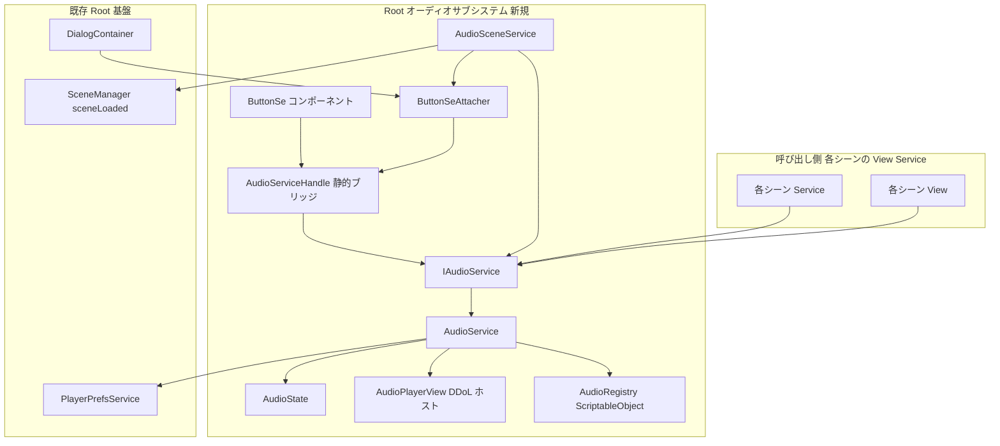
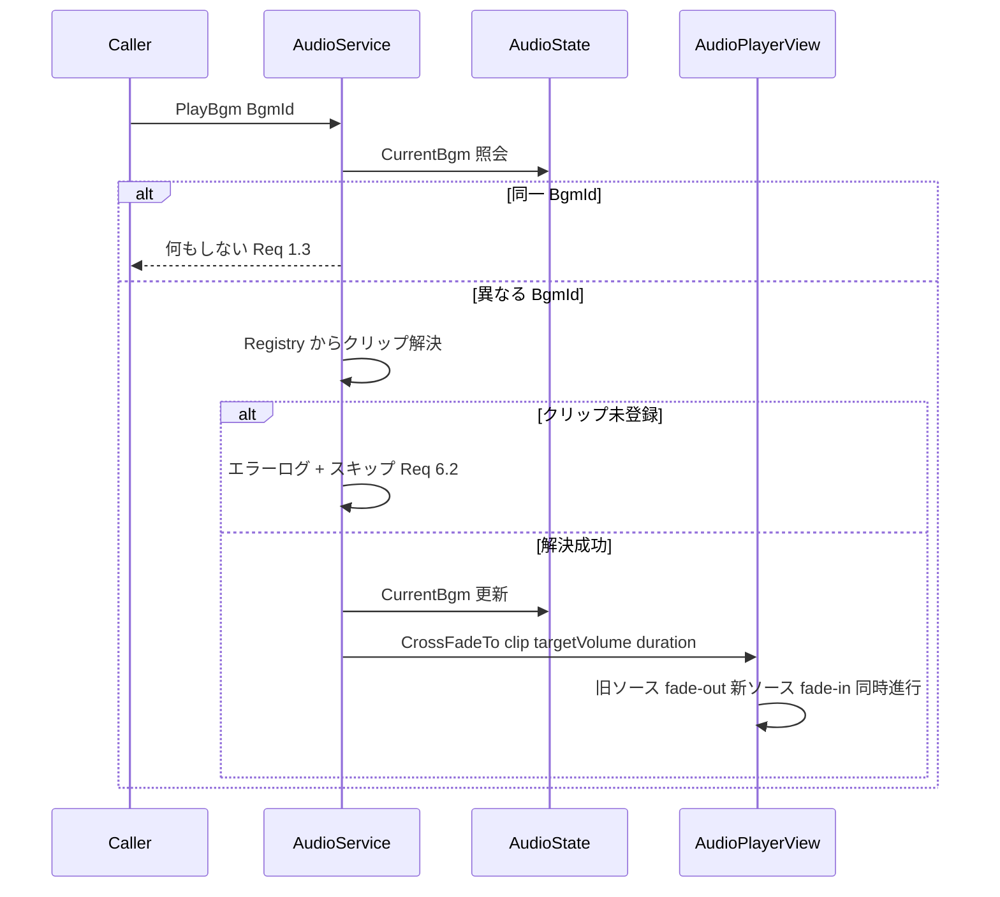
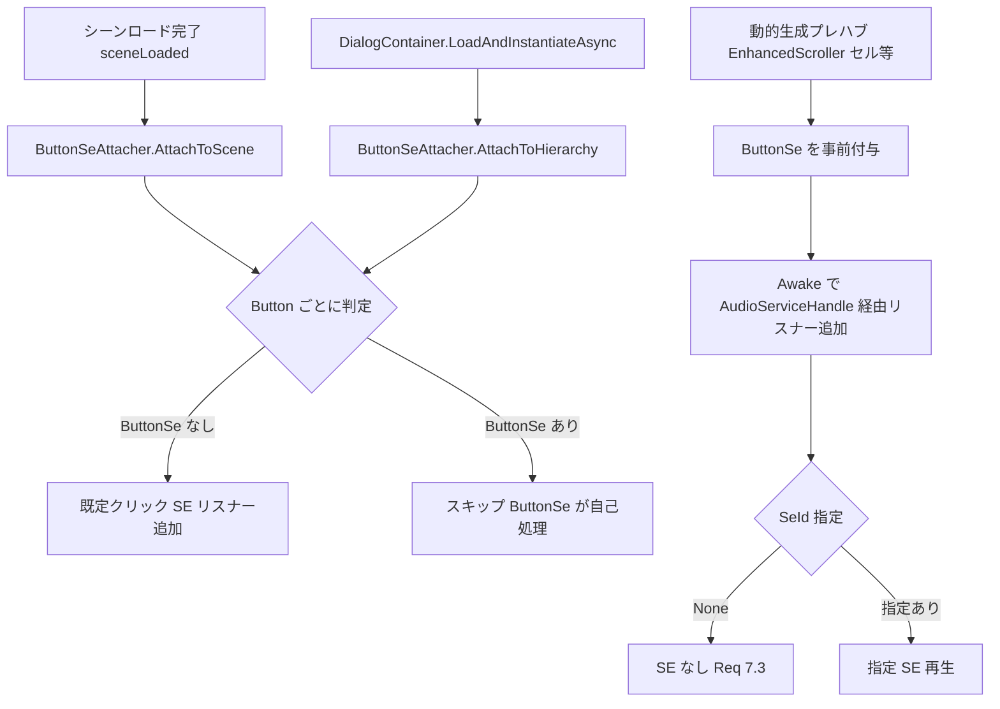

# Technical Design: audio-manager

## Overview

**Purpose**: 本機能はゲーム全体の SE/BGM 再生を一元管理するオーディオサブシステムを提供する。各シーン・UI 機能は識別子 (enum) を指定するだけで音を再生でき、UI ボタンのクリック SE は自動適用により個別実装なしで全ボタンに行き渡る。

**Users**: 開発者は `IAudioService` 経由で SE/BGM を再生し、ユーザーは BGM/SE 個別の音量調整と再起動後の設定維持を得る。

**Impact**: 既存アーキテクチャへの構造変更はない。`Root/` 配下に Service/State/View を新設し、`RootScope` への登録追加・`PlayerPrefsKey` へのキー追加・`DialogContainer` への 1 フック追加・RootLifetimeScope プレハブへの子 GameObject 追加のみで統合する。

### Goals
- 全シーンから利用可能な BGM 再生 (ループ・クロスフェード切替・停止) と SE 再生 (多重・上限付き)
- BGM/SE 独立の音量制御と PlayerPrefs 永続化 (欠落時は既定値でフォールバック)
- シーン遷移をまたぐ BGM 継続と、シーン名→BGM マッピングによる自動再生
- UI ボタンへの既定クリック SE 自動適用 (シーン走査 + ダイアログフック + 動的生成プレハブへの事前付与の 3 経路)

### Non-Goals
- AudioMixer によるダッキング・エフェクト・スナップショット (research.md: Item 6 で見送り)
- ボイス・環境音などの第 3 カテゴリ (BGM/SE の 2 カテゴリで設計、拡張余地は enum 追加)
- アプリのバックグラウンド移行時の一時停止制御 (要件外。必要になったら要件追加)
- オーディオアセット (クリップ) の制作・調達

## Architecture

### Existing Architecture Analysis
- **層構造**: `View → Service → State` の依存方向を厳守。オーディオも同構造 (`AudioPlayerView` は Service から操作される受動 View)
- **DI**: RootScope Singleton 登録 (`.As<IAudioService>().AsSelf()`)。RootLifetimeScope プレハブは VContainer により DontDestroyOnLoad 化されるため、AudioSource ホストの寄生先として利用
- **永続化**: `PlayerPrefsService` + `PlayerPrefsKey` enum + JSON DTO パターンを踏襲
- **Config-as-Asset**: `RewardedAdConfig` と同型の「ScriptableObject を Resources.Load、欠落時 fail-fast」を `AudioRegistry` に適用
- **既存フック**: `DialogContainer.LoadAndInstantiateAsync` が全ダイアログ生成の単一ファンネル (2026-08 の DOTween 化改修後も `InjectGameObject` は健在)。ここにボタン SE 適用を挿入
- **メニューダイアログとの統合 (2026-08 実装分)**: `MenuDialog` が `MenuSettingData.soundEnabled` を `PlayerPrefsKey.MenuSetting` に永続化済み (消費者なし)。サウンド有効/無効は本サブシステムへ移管する — `MenuDialog` のサウンドトグルは `IAudioService.SetSoundEnabled` へ委譲し、`MenuSettingData` は `notificationEnabled` のみ保持する。既存 `MenuSetting` の `soundEnabled` 値は開発段階のため移行処理は行わない (AudioSetting の既定値 = 有効で上書き)
- **DebugPanel (2026-08 実装分)**: `DebugUiFactory.CreateButton` による実行時生成ボタンと DDoL デバッグキャンバスは Editor / 開発ビルド限定のため **SE 自動適用の対象外**とする

### Architecture Pattern & Boundary Map



**Architecture Integration**:
- **Selected pattern**: Root 常駐サービス + 専用 View ホスト (research.md: Pattern Evaluation Option B)。シーン分散案と静的シングルトン案は棄却
- **Domain boundaries**: 再生指示 (Service) / 音量・再生状態 (State) / AudioSource 実操作 (View) / ボタン自動適用 (Attacher + ButtonSe) を分離
- **Steering compliance**: 依存方向・命名・`[Inject]`・UniTask CancellationToken 規約を全て踏襲。逸脱は `AudioServiceHandle` (静的ブリッジ) の 1 点のみ — DI 経路外で Instantiate される EnhancedScroller セル内ボタンへの唯一の橋として意図的に許容 (research.md: Decision 3)

### Technology Stack

| Layer | Choice / Version | Role in Feature | Notes |
|-------|------------------|-----------------|-------|
| Engine Audio | Unity 6 AudioSource | BGM 2 本 + SE プール N 本の再生実体 | AudioMixer 不使用 |
| Tweening | DOTween (導入済み) | BGM クロスフェードの音量補間 | `DOTween.To` + kill→再計算 |
| DI | VContainer 1.17.0 | RootScope Singleton 登録、`RegisterComponent` | 新規依存なし |
| Persistence | PlayerPrefsService (既存) | 音量設定の JSON 保存 | `PlayerPrefsKey.AudioSetting` 追加 |
| Asset Config | ScriptableObject + Resources.Load | `AudioRegistry.asset` (識別子→クリップ、シーン→BGM) | fail-fast (RewardedAdConfig と同型) |
| Test | NUnit EditMode (既存パターン) | 純粋ロジックの検証 | `Root/AudioLogic/` 独立アセンブリ |

新規外部依存は**なし**。全て導入済み技術で構成する。

## System Flows

### BGM 切替 (クロスフェード)



### ボタン SE 自動適用 (3 経路)



- 走査は `GetComponentsInChildren<Button>(includeInactive: true)` 相当で非アクティブ UI (閉じた ClosetUiView 等) も捕捉する
- 二重付与防止: 走査側はリスナー追加済みマーカー (走査時に付与する内部コンポーネント) を確認してスキップする
- シーン名→BGM の自動再生も同じ sceneLoaded フックで行う。マッピングのないシーン (Fade 等) は BGM を変更しない (Req 5.2)

## Requirements Traceability

| Requirement | Summary | Components | Interfaces | Flows |
|-------------|---------|------------|------------|-------|
| 1.1–1.5 | BGM ループ・フェード切替・停止・冪等 | AudioService, AudioPlayerView, AudioState | `IAudioService.PlayBgm/StopBgm` | BGM 切替フロー |
| 2.1–2.4 | SE ワンショット・多重・上限 | AudioService, AudioPlayerView, SeSourcePicker | `IAudioService.PlaySe` | — |
| 3.1–3.5 | カテゴリ別音量・即時反映・クランプ | AudioService, AudioState, AudioVolumeLogic | `IAudioService.SetBgmVolume/SetSeVolume` | — |
| 3.6–3.7 | サウンド有効/無効・設定 UI 提供 | AudioService, AudioState, MenuDialog(改修) | `IAudioService.SetSoundEnabled` | — |
| 4.1–4.4 | オーディオ設定永続化・既定値フォールバック | AudioService, AudioSettingData, PlayerPrefsService(既存) | `IAudioService` 内部 | — |
| 5.1–5.3 | シーン跨ぎ継続・自動 BGM | AudioSceneService, AudioRegistry, AudioPlayerView(DDoL) | `AudioRegistry.ResolveSceneBgm` | ボタン SE 自動適用フロー(同一フック) |
| 6.1–6.3 | 識別子指定・欠落 fail-safe・追加容易性 | SeId/BgmId, AudioRegistry, AudioService | `AudioRegistry.Resolve` | BGM 切替フロー(エラー分岐) |
| 7.1–7.5 | ボタン SE 自動適用・上書き・動的生成・明示再生 | ButtonSeAttacher, ButtonSe, AudioServiceHandle, DialogContainer(改修) | `ButtonSeAttacher.AttachToScene/AttachToHierarchy` | ボタン SE 自動適用フロー |

## Components and Interfaces

| Component | Domain/Layer | Intent | Req Coverage | Key Dependencies | Contracts |
|-----------|--------------|--------|--------------|------------------|-----------|
| IAudioService / AudioService | Root/Service | SE/BGM 再生・音量・永続化の統括 | 1–4, 6, 7.5 | AudioState (P0), AudioPlayerView (P0), AudioRegistry (P0), PlayerPrefsService (P0) | Service, State |
| AudioState | Root/State | 音量・現在 BGM の状態保持 | 1.3, 3.1 | なし | State |
| AudioPlayerView | Root/View | AudioSource 実体の操作 (DDoL ホスト) | 1, 2, 5.1 | DOTween (P1) | Service |
| AudioRegistry | Root/Service (asset) | 識別子→クリップ、シーン→BGM の対応表 | 5.3, 6 | なし | State |
| AudioSceneService | Root/Service | sceneLoaded フックで BGM 自動再生 + ボタン走査起動 | 5.2, 5.3, 7.1 | IAudioService (P0), ButtonSeAttacher (P0) | Event |
| ButtonSeAttacher | Root/Service | Button 走査と既定 SE リスナー付与 | 7.1, 7.2 | AudioServiceHandle (P0) | Service |
| ButtonSe | Root/View | SE 上書き・動的生成ボタン用の自己配線コンポーネント | 7.3, 7.4 | AudioServiceHandle (P0) | — |
| AudioServiceHandle | Root/Service | DI 経路外から IAudioService へ到達する静的ブリッジ | 7.4 | RootScope (P0) | — |
| AudioLogic (アセンブリ) | Root/AudioLogic | 音量クランプ・SE ソース選定の純粋ロジック | 2.4, 3.4, 3.5 | なし (noEngineReferences) | — |
| MenuDialog (既存・改修) | Menu/View | サウンドトグルを IAudioService へ委譲 | 3.7 | IAudioService (P0) | — |

### Root/Service

#### AudioService (IAudioService)

| Field | Detail |
|-------|--------|
| Intent | SE/BGM 再生指示・音量制御・サウンド有効状態・永続化を統括する唯一の公開契約 |
| Requirements | 1.1–1.5, 2.1–2.3, 3.1–3.6, 4.1–4.4, 6.1–6.2, 7.5 |

**Responsibilities & Constraints**
- 識別子→クリップ解決 (AudioRegistry)、再生指示 (AudioPlayerView)、状態更新 (AudioState)、永続化 (PlayerPrefsService) のオーケストレーション
- 音量は常に `AudioVolumeLogic.Clamp` を通してから適用 (Req 3.4/3.5)
- コンストラクタで永続化済み設定をロード。キー欠落・パース失敗 (null) は既定値 1.0 で継続 + エラーログ (Req 4.3/4.4)

**Dependencies**
- Inbound: 各シーン View/Service — SE/BGM 再生要求 (P0) / ButtonSeAttacher・ButtonSe — クリック SE 再生 (P0)
- Outbound: AudioPlayerView — AudioSource 操作 (P0) / AudioState — 状態 (P0) / AudioRegistry — クリップ解決 (P0) / PlayerPrefsService — 永続化 (P0)

**Contracts**: Service [x] / State [x]

##### Service Interface
```csharp
public interface IAudioService
{
    /// SE をワンショット再生する。未登録識別子はログのみで無視
    void PlaySe(SeId id);
    /// BGM をループ再生する。同一 BGM は何もしない。切替はクロスフェード
    void PlayBgm(BgmId id);
    /// BGM をフェードアウトして停止する。未再生時は何もしない
    void StopBgm();
    /// 0-1 に丸めて適用し、再生中 BGM へ即時反映 + 永続化
    void SetBgmVolume(float volume);
    /// 0-1 に丸めて適用し、以降の SE へ適用 + 永続化
    void SetSeVolume(float volume);
    /// サウンド全体の有効/無効。無効時は BGM を無音化し SE を再生しない + 永続化
    void SetSoundEnabled(bool enabled);
    /// 現在のオーディオ設定のイミュータブルスナップショット
    AudioSettingSnapshot GetSettingSnapshot();
}
```
- Preconditions: RootScope 構築済み (AudioRegistry ロード成功が前提。欠落時は RootScope が fail-fast)
- Postconditions: `SetXxxVolume` 呼出後は永続化が完了している (Req 4.1)
- Invariants: `AudioState` の音量は常に [0,1]

**Implementation Notes**
- Integration: RootScope で `.As<IAudioService>().AsSelf()` 登録。ビルド時コールバックで `AudioServiceHandle` に実体を設定。`MenuDialog` のサウンドトグルは `SetSoundEnabled` へ委譲する (MenuDialog は `MenuSettingData.soundEnabled` の保持をやめる)
- Validation: 音量クランプ・null クリップガード・実効音量 (SoundEnabled=false → 0) は AudioLogic の純粋関数に委譲しテストで担保
- Risks: フェード中の音量変更 → AudioPlayerView 側でトゥイーン kill + 目標再計算 (research.md: Item 4)。SoundEnabled は BGM 停止ではなく無音化 (再生継続) で実現し、再有効化時の即復帰を保証する

#### AudioSceneService

| Field | Detail |
|-------|--------|
| Intent | sceneLoaded を購読し、シーン BGM 自動再生とボタン走査を起動する |
| Requirements | 5.2, 5.3, 7.1 |

**Responsibilities & Constraints**
- `IInitializable` で `SceneManager.sceneLoaded` を購読、`IDisposable` で解除
- ロードされたシーン名を `AudioRegistry.ResolveSceneBgm` で解決。マッピングありなら `PlayBgm` (同一 BGM は 1.3 により継続)、なしなら何もしない
- 続けて `ButtonSeAttacher.AttachToScene(scene)` を呼ぶ

**Dependencies**
- Inbound: VContainer EntryPoint (P0)
- Outbound: IAudioService (P0) / ButtonSeAttacher (P0) / AudioRegistry (P0)
- External: `SceneManager.sceneLoaded` (P0)

**Contracts**: Event [x]

##### Event Contract
- Subscribed: `SceneManager.sceneLoaded` — Additive (Fade) を含む全ロードで発火。マッピング判定により Fade は無変更
- Ordering: sceneLoaded はシーン内 Awake/OnEnable 後・Start 前。ボタン走査はこの時点で静的ボタンを全捕捉できる

#### ButtonSeAttacher

| Field | Detail |
|-------|--------|
| Intent | Button 群を走査し、既定クリック SE リスナーを一括付与する |
| Requirements | 7.1, 7.2 |

**Responsibilities & Constraints**
- `AttachToScene(Scene)`: シーン内ルートから全 Button (非アクティブ含む) を走査
- `AttachToHierarchy(GameObject)`: ダイアログ生成物など任意階層を走査 (DialogContainer から呼ばれる)
- スキップ条件: `ButtonSe` が付いている / 既に付与済みマーカーがある
- 付与内容: `onClick` に既定 SE (`SeId.Click`) 再生リスナーを追加

**Dependencies**
- Inbound: AudioSceneService (P0) / DialogContainer — 生成フック (P0)
- Outbound: AudioServiceHandle → IAudioService (P0)

**Contracts**: Service [x]

##### Service Interface
```csharp
public sealed class ButtonSeAttacher
{
    /// シーン内の全 Button に既定クリック SE を付与する
    public void AttachToScene(Scene scene);
    /// 指定階層以下の全 Button に既定クリック SE を付与する
    public void AttachToHierarchy(GameObject root);
}
```

**Implementation Notes**
- Integration: `DialogContainer.LoadAndInstantiateAsync` の `InjectGameObject` 直後に `AttachToHierarchy(instance)` を 1 行追加
- Risks: 実行時 `AddComponent<Button>` されるボタンは捕捉不能。現状の該当は DebugPanel (`DebugUiFactory.CreateButton`) のみで、これは Editor / 開発ビルド限定のため**意図的に対象外**とする (デバッグダイアログへの `AttachToHierarchy` が拾った場合も既定 SE が鳴るだけで実害なし)。プロダクション UI で実行時生成ボタンが発生した場合は `ButtonSe` 事前付与で対応するルールとする

#### AudioServiceHandle

| Field | Detail |
|-------|--------|
| Intent | DI 経路外で生成される MonoBehaviour (ButtonSe) から IAudioService へ到達する静的ブリッジ |
| Requirements | 7.4 |

**Responsibilities & Constraints**
- `static IAudioService? Current` を保持。RootScope のビルド時コールバックで設定、null 中のアクセスは警告ログ + 無音 (起動直後の 1 フレーム対策)
- **プロジェクトで唯一の静的サービスアクセス**。他用途への流用は禁止 (design 上の明示的制約)

**Contracts**: — (静的ホルダのみ)

### Root/State

#### AudioState

| Field | Detail |
|-------|--------|
| Intent | 音量設定と現在の BGM 識別子の状態保持 |
| Requirements | 1.3, 3.1 |

**Contracts**: State [x]

##### State Management
- State model: `BgmVolume: float [0,1]`, `SeVolume: float [0,1]`, `SoundEnabled: bool`, `CurrentBgm: BgmId?` (未再生は null)。`SoundEnabled = false` 中も `CurrentBgm` と再生位置は維持する (再有効化で即復帰)
- Persistence: AudioService 経由で PlayerPrefs へ (State 自身は永続化しない — 既存パターン準拠)
- Concurrency: メインスレッドのみ。同時アクセスなし

### Root/View

#### AudioPlayerView

| Field | Detail |
|-------|--------|
| Intent | AudioSource 実体 (BGM 2 本 + SE プール N 本) を保持し再生・フェードを実行する受動 View |
| Requirements | 1.1, 1.2, 1.4, 2.1–2.4, 5.1 |

**Responsibilities & Constraints**
- RootLifetimeScope プレハブの子 GameObject に配置 (DDoL は VContainer が保証)。`RootScope` の SerializeField → `RegisterComponent`
- BGM: 2 本の AudioSource を A/B スワップ。`CrossFadeTo(clip, targetVolume, duration)` / `FadeOutAndStop(duration)`。フェードは DOTween、音量変更時は kill → 目標再計算
- SE: `[SerializeField] int _sePoolSize = 8` 本のプール。`PlaySe(clip, volume)` は `SeSourcePicker` (純粋ロジック) が選定したソースで再生。全ソース使用中は最古を奪う (Req 2.4)
- 判断ロジックを持たない (音量計算・ソース選定は AudioLogic 側)

**Dependencies**
- Inbound: AudioService (P0)
- External: DOTween (P1)

**Contracts**: Service [x]

##### Service Interface
```csharp
public sealed class AudioPlayerView : MonoBehaviour
{
    public void CrossFadeTo(AudioClip clip, float targetVolume, float duration);
    public void FadeOutAndStop(float duration);
    public void SetBgmVolumeImmediate(float volume);
    public void PlaySe(AudioClip clip, float volume);
}
```

#### ButtonSe

| Field | Detail |
|-------|--------|
| Intent | ボタン単位の SE 上書き指定 + 動的生成ボタンの自己配線 |
| Requirements | 7.3, 7.4 |

**Responsibilities & Constraints**
- `[SerializeField] SeId _seId` (`SeId.None` = SE なし)。`RequireComponent(typeof(Button))`
- `Awake` で自身の Button.onClick に `AudioServiceHandle` 経由の再生リスナーを追加 (SeId.None は追加しない)
- 走査系 (ButtonSeAttacher) はこのコンポーネント付きボタンをスキップ — 上書きと動的生成対応を単一コンポーネントで兼ねる

**Contracts**: — (受動コンポーネント)

### Root/AudioLogic (テスト用純粋ロジックアセンブリ)

| Field | Detail |
|-------|--------|
| Intent | UnityEngine 非依存の決定論的ロジック (音量クランプ・実効音量計算・SE ソース選定) |
| Requirements | 2.4, 3.4, 3.5 |

**Responsibilities & Constraints**
- `Assets/Scripts/Root/AudioLogic/` に `noEngineReferences: true` の asmdef。`Tests/` サブフォルダに EditMode テスト (既存 `Shop/RewardAdLogic` パターン)
- `AudioVolumeLogic.Clamp(float) : float` — [0,1] へ丸め
- `SeSourcePicker.Pick(bool[] isPlaying, int[] startOrder) : int` — 空きソース優先、全使用中は最古 (oldest-steal) を返す決定論関数

**Contracts**: — (静的純関数)

## Data Models

### Domain Model
- **SeId / BgmId (enum)**: 再生対象の一意識別子。`SeId.None = 0` は「SE なし」を表す番兵値。値はアルファベット順ではなく追加順で末尾追記 (既存 enum の PlayerPrefsKey と同運用)
- **AudioSettingData (DTO)**: `{ float BgmVolume; float SeVolume; bool SoundEnabled; }` — JsonUtility 対応の可変クラス。永続化専用。既定値は `1.0 / 1.0 / true` (旧 `MenuSetting.soundEnabled` からの移行は行わない)
- **AudioSettingSnapshot**: 音量設定のイミュータブルスナップショット (既存 `UserPointSnapshot` パターン準拠)
- **AudioRegistry (ScriptableObject)**:
  - `SeEntry { SeId Id; AudioClip Clip; }` のリスト
  - `BgmEntry { BgmId Id; AudioClip Clip; float BaseVolume = 1f; }` のリスト (曲ごとの基準音量補正)
  - `SceneBgmEntry { string SceneName; BgmId Id; }` のリスト (シーン名は `Const.SceneName` の値を使用)
  - `Resolve(SeId) : AudioClip?` / `Resolve(BgmId) : (AudioClip, float)?` / `ResolveSceneBgm(string) : BgmId?` — 未登録は null (呼び出し側でログ + スキップ)
  - `OnValidate` で enum 全値の割当漏れ・シーン名 typo を警告

### Physical Data Model (PlayerPrefs)

| キー | 形式 | 内容 | 既定値 |
|------|------|------|--------|
| `PlayerPrefsKey.AudioSetting` | JSON (`AudioSettingData`) | BGM/SE 音量 | 両方 1.0 (キー欠落・パース失敗時) |

**実効音量の計算規則** (AudioLogic に配置):
- BGM: `SoundEnabled ? clipBaseVolume × BgmVolume : 0`
- SE: `SoundEnabled ? SeVolume : 0` — 実効 0 の SE は再生自体をスキップする (`AudioSource.PlayOneShot` の volumeScale として適用)

## Error Handling

### Error Strategy
進行不能を絶対に起こさない。オーディオはゲーム進行の従属機能であり、全エラーは「ログ + スキップ (無音)」で処理する。唯一の例外は起動時の `AudioRegistry.asset` 欠落で、これは構成ミスとして RootScope で fail-fast (RewardedAdConfig と同一方針)。

### Error Categories and Responses
- **AudioRegistry.asset 欠落 (起動時)**: `InvalidOperationException` を送出し起動失敗 — 構成ミスの早期検出 (Config-as-Asset 先例準拠)
- **識別子未登録 / クリップ未割当 (実行時)**: `Debug.LogError($"[AudioService] ...")` + 再生スキップ (Req 6.2)。ゲーム進行は継続
- **永続化データ欠落・パース失敗 (起動時)**: 既定値 (1.0/1.0) 適用 + エラーログ (Req 4.3/4.4)
- **AudioServiceHandle 未初期化アクセス**: 警告ログ + 無音 (起動直後の競合対策)
- **BGM 未再生中の StopBgm**: 何もしない (Req 1.5)

### Monitoring
既存規約のクラスコンテキスト付きログ (`[ClassName]` プレフィックス) を全エラーパスに適用。追加の監視基盤は導入しない。

## Testing Strategy

### Unit Tests (EditMode / Root.AudioLogic.Tests)
各テストに日本語の `[Description]` を付与する (プロジェクト規約)。
1. `AudioVolumeLogic.Clamp` — 範囲内・負値・1 超・NaN の丸め (Req 3.4/3.5)
2. `SeSourcePicker.Pick` — 空きあり選定 / 全使用中の oldest-steal / 単一ソース境界 (Req 2.4)
3. 実効音量計算 — clipBaseVolume × カテゴリ音量の積、ゼロ音量時の完全無音、`SoundEnabled = false` で常に 0 (Req 3.6)
4. `AudioSettingData` 既定値 — null からのフォールバック値が 1.0/1.0/true であること (Req 4.3)

### Integration Tests (Unity Editor 手動)
1. シーン遷移 (Title → Home → Shop) で BGM が途切れず継続 / マッピング差異でクロスフェード (Req 5.1–5.3)
2. ダイアログ内ボタン・EnhancedScroller セルボタンでクリック SE が鳴る (Req 7.1/7.4)
3. 音量変更 → 即時反映 → アプリ再起動で維持、メニューのサウンドトグルで消音/復帰 (Req 3.2, 3.6/3.7, 4.1/4.2)
4. AudioRegistry からクリップ割当を外した状態で該当 SE 再生 → エラーログのみで進行継続 (Req 6.2)

### E2E/UI
専用の自動 E2E は導入しない (プロジェクトに Play Mode テスト基盤がないため)。上記手動チェックリストを実装タスクの完了条件に含める。
