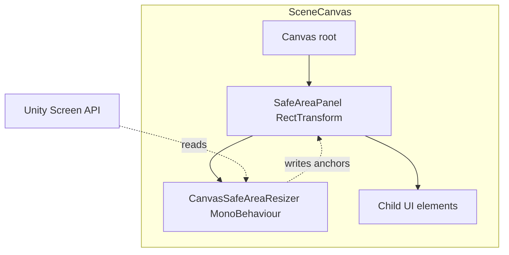
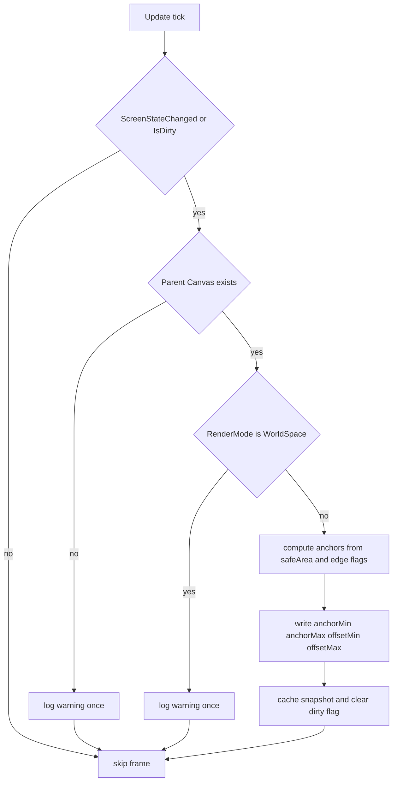
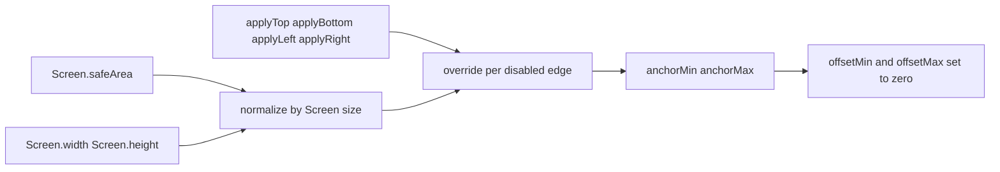

# Technical Design: canvas-safe-area-resizer

## Overview

**Purpose**: 本機能は、Unity 6 プロジェクトの全シーンで再利用可能なセーフエリア対応 UI コンポーネント `CanvasSafeAreaResizer` を提供する。Canvas 配下の RectTransform にアタッチするだけで、対象 RectTransform のアンカーが自動的に `Screen.safeArea` に一致するよう調整され、ノッチ・ホームインジケータ・ステータスバー等の非表示領域に UI が被らないことを保証する。

**Users**: UI 開発者 (本プロジェクトの全メンバー) が、Home / Title / Shop / Timer / History / Logo / Fade などの各シーンの Canvas 階層に本コンポーネントを配置する形で利用する。

**Impact**: 本機能は新規追加であり、既存コードベースは変更しない。各シーンの Canvas プレファブ/階層への適用 (`SafeAreaPanel` ノードの追加) は本機能のスコープ外で、利用側シーンが個別に行う。

### Goals

- Canvas 配下の RectTransform を `Screen.safeArea` に完全フィットさせる単一責務 MonoBehaviour を提供する
- 画面回転・解像度変更・SafeArea 値変化に自動追従する
- 上下左右の辺ごとに適用 ON/OFF を切り替えられる柔軟性を持つ
- Editor 編集中も `[ExecuteAlways]` でリアルタイムプレビュー可能にする
- 既存プロジェクト規約 (`#nullable enable`, `[RequireComponent]`, `void Reset()`, `[ClassName]` ログプレフィックス) に完全準拠する

### Non-Goals

- World Space Canvas への対応 (警告ログを出して処理スキップするのみ。本プロジェクトに該当 Canvas 不在のため要件外)
- 親 RectTransform が「Canvas 全体を埋めない」場合の自動逆算 (利用前提として全画面親を要求)
- 子 RectTransform への伝播ロジック (Unity の親子レイアウト機構が自動伝播)
- VContainer DI 登録 (Pure MonoBehaviour で完結)
- 動的 Canvas プレファブ生成・SafeAreaPanel ノード自動挿入 (利用側シーンの責務)
- 既存ダイアログ (`BaseDialogView` 系) への自動 SafeArea 適用
- Device Simulator 不在時の Editor シミュレーション (Unity 標準機能に委譲)

## Architecture

### Existing Architecture Analysis

本プロジェクトは Scene-based + VContainer DI のアーキテクチャ。再利用 UI コンポーネントは `Assets/Scripts/Root/View/` (namespace `Root.View`) に集約される慣習。`DialogCanvasView` / `BackdropView` / `BaseDialogView` 等が本コンポーネントの直近の隣人となる。

- **遵守する既存パターン**:
  - 名前空間: `Root.View`
  - ファイル先頭: `#nullable enable`
  - 必須依存: `[RequireComponent(typeof(RectTransform))]`
  - SerializeField 自動取得: `void Reset()` で `GetComponent<>()` を呼ぶ
  - ログプレフィックス: `Debug.LogWarning($"[CanvasSafeAreaResizer] ...")` (`tech.md` 準拠)
  - 依存方向: View → Service → State (本機能は View 単独で完結し、下層を呼ばない)
- **既存統合点なし**: SafeArea 関連の前例は皆無 (gap-analysis.md 参照)。本機能は独立した新規コンポーネントとして追加される

### Architecture Pattern & Boundary Map



**Architecture Integration**:

- **Selected pattern**: Single-responsibility MonoBehaviour with self-contained polling loop (Pure View Component)
- **Domain/feature boundaries**: 自身の `RectTransform` のアンカー書き換えのみを行い、子要素や他コンポーネントへ干渉しない
- **Existing patterns preserved**: `Root/View` 配置、`[RequireComponent]`、`void Reset()`、`[ClassName]` ログプレフィックス、`#nullable enable`
- **New components rationale**: 既存 SafeArea 実装が皆無のため新規追加が必要。再利用 UI のため `Root/View` が唯一妥当な配置先
- **Steering compliance**: 依存方向 View → Service → State (View 単独で完結し下層を呼ばない)、ログプレフィックス、`UnityEngine` 標準 API のみ使用

### Technology Stack

| Layer | Choice / Version | Role in Feature | Notes |
|-------|------------------|-----------------|-------|
| Frontend (Unity UI) | Unity 6 (6000.x) UGUI / RectTransform | アンカー書き換え対象 | 既存スタック、追加ライブラリ不要 |
| Runtime API | UnityEngine.Screen API | `safeArea`, `width`, `height`, `orientation` の取得 | Unity 標準、外部依存ゼロ |
| Editor 拡張 | `[ExecuteAlways]` 属性 | Edit Mode でのプレビュー実行 | プロジェクト初導入。詳細は `research.md` R3 |

> 既存スタック (VContainer / UniTask / DOTween / Addressables) は本機能では一切利用しない。Pure UnityEngine API のみで完結することで依存とライフサイクル管理を最小化する。

## System Flows

### Update Loop (差分検知 → 適用)



**Key decisions**:

- 差分ガード (`ScreenStateChanged or IsDirty`) で `RectTransform` 書き換えをスキップ (Req 6.1)
- 警告ログは「初回検知時のみ」出す (毎フレーム警告でログ汚染を避ける、Req 6.3 と整合)
- World Space は計算自体を行わずスキップ (Req 4.2)

### Apply 処理 (Compute → ApplyAnchors)



**正規化式**:
- `anchorMin.x = applyLeft   ? safeArea.x / Screen.width                          : 0`
- `anchorMin.y = applyBottom ? safeArea.y / Screen.height                         : 0`
- `anchorMax.x = applyRight  ? (safeArea.x + safeArea.width)  / Screen.width      : 1`
- `anchorMax.y = applyTop    ? (safeArea.y + safeArea.height) / Screen.height     : 1`

> Unity の `Screen.safeArea` は左下原点・ピクセル座標。`y` 成分は「下端からの距離」であるため `applyBottom` が `anchorMin.y` を、`applyTop` が `anchorMax.y` を制御する。

## Requirements Traceability

| Requirement | Summary | Components | Interfaces | Flows |
|-------------|---------|------------|------------|-------|
| 1.1 | 有効化時にアンカーをセーフエリアに設定 | CanvasSafeAreaResizer | `Apply()`, `OnEnable` | Update Loop → Compute → ApplyAnchors |
| 1.2 | offsetMin/Max を 0 に設定し矩形が完全一致 | CanvasSafeAreaResizer | `Apply()` | Apply 処理 |
| 1.3 | RectTransform を `[RequireComponent]` で必須化 | CanvasSafeAreaResizer | クラス属性 | — |
| 1.4 | 親 Canvas 不在時に警告ログ・書き込み停止 | CanvasSafeAreaResizer | `ResolveCanvas()` 相当の内部処理 | Update Loop (CheckCanvas) |
| 2.1 | `Screen.safeArea` 変化時に再計算 | CanvasSafeAreaResizer | `ScreenStateChanged()` 内部判定 | Update Loop (CheckDirty) |
| 2.2 | `Screen.width/height` 変化時に再計算 | CanvasSafeAreaResizer | `ScreenStateChanged()` | Update Loop (CheckDirty) |
| 2.3 | `Screen.orientation` 変化時に再計算 | CanvasSafeAreaResizer | `ScreenStateChanged()` | Update Loop (CheckDirty) |
| 2.4 | 変化なしフレームでは書き込みなし | CanvasSafeAreaResizer | `Update()` の早期 return | Update Loop (skip frame) |
| 3.1 | 上下左右各辺の適用 ON/OFF を SerializeField で公開 | CanvasSafeAreaResizer | `_applyTop/Bottom/Left/Right` SerializeField | — |
| 3.2 | 無効辺は Canvas 端 (0 or 1) を採用 | CanvasSafeAreaResizer | Apply 処理の per-edge override | Apply 処理 (EdgeOverride) |
| 3.3 | フラグ変更を次フレーム以降に反映 | CanvasSafeAreaResizer | `OnValidate()` で `_isDirty = true` | Update Loop (CheckDirty) |
| 4.1 | Overlay/Camera で正しく適用 | CanvasSafeAreaResizer | Apply 処理 (RenderMode 共通ロジック) | Apply 処理 |
| 4.2 | World Space では処理スキップ + 警告 | CanvasSafeAreaResizer | `Update()` 内 RenderMode 判定 | Update Loop (CheckRenderMode) |
| 4.3 | RenderMode 動的変更を次フレーム反映 | CanvasSafeAreaResizer | `Update()` で毎フレーム再判定 | Update Loop (CheckRenderMode) |
| 5.1 | `[ExecuteAlways]` で Edit Mode でも実行 | CanvasSafeAreaResizer | クラス属性 | — |
| 5.2 | 手動アンカー編集を次フレーム上書き | CanvasSafeAreaResizer | `Update()` の差分判定 (キャッシュは適用後値のみ) | Update Loop (CheckDirty) |
| 5.3 | コンポーネント除去後はアンカー書き換え停止 | CanvasSafeAreaResizer | Unity 標準のライフサイクル (`OnDisable`/破棄) | — |
| 6.1 | 変化なしならアンカー書き込みなし | CanvasSafeAreaResizer | `ScreenStateChanged()` の差分ガード | Update Loop (skip frame) |
| 6.2 | ログには `[CanvasSafeAreaResizer]` プレフィックス | CanvasSafeAreaResizer | ログ出力ヘルパ | — |
| 6.3 | 通常動作時は `Debug.Log` 出力なし | CanvasSafeAreaResizer | (ログヘルパで `Debug.Log` を呼ばない方針) | — |

## Components and Interfaces

| Component | Domain/Layer | Intent | Req Coverage | Key Dependencies (P0/P1) | Contracts |
|-----------|--------------|--------|--------------|--------------------------|-----------|
| CanvasSafeAreaResizer | Root.View | Canvas 配下 RectTransform をセーフエリアに合わせる単一責務コンポーネント | 1.1–1.4, 2.1–2.4, 3.1–3.3, 4.1–4.3, 5.1–5.3, 6.1–6.3 | UnityEngine.Screen API (P0), 親 Canvas (P0), 親 RectTransform 全画面前提 (P1) | Service |

### Root.View

#### CanvasSafeAreaResizer

| Field | Detail |
|-------|--------|
| Intent | 自身の `RectTransform` のアンカー/オフセットを `Screen.safeArea` に合わせ、画面状態変化に追従する単一責務 MonoBehaviour |
| Requirements | 1.1, 1.2, 1.3, 1.4, 2.1, 2.2, 2.3, 2.4, 3.1, 3.2, 3.3, 4.1, 4.2, 4.3, 5.1, 5.2, 5.3, 6.1, 6.2, 6.3 |
| Owner / Reviewers | Root チーム (UI 共通基盤) |

**Responsibilities & Constraints**

- 単一責務: 自身の `RectTransform` のアンカー/オフセット書き換えのみ
- 子 RectTransform への伝播はしない (Unity の親子レイアウトに委譲)
- 親 RectTransform は Canvas 全体を埋める前提 (XML コメントで明示)
- VContainer DI を受けない Pure MonoBehaviour
- データ所有: 直前適用値 (Rect / Vector2Int / ScreenOrientation) のキャッシュとダーティフラグのみ。永続化なし
- 不変条件: `applyTop / Bottom / Left / Right` のいずれかが false でも、Canvas 全体を超えるアンカー値 (>1 / <0) は書き込まない

**Dependencies**

- Inbound: 利用側シーンの Canvas プレファブ — SafeAreaPanel 配置先 (Criticality: P0)
- Outbound: なし
- External: `UnityEngine.Screen` (`safeArea`, `width`, `height`, `orientation`) — セーフエリア値取得 (P0)
- External: `UnityEngine.Canvas` (`renderMode`) — RenderMode 分岐判定 (P0)
- External: `UnityEngine.RectTransform` (`anchorMin`, `anchorMax`, `offsetMin`, `offsetMax`) — アンカー書き換え対象 (P0)

外部依存はすべて Unity 標準。詳細な API 仕様 (戻り値の座標系、Edit Mode での挙動) は `research.md` R1〜R4 を参照。

**Contracts**: Service [x] / API [ ] / Event [ ] / Batch [ ] / State [ ]

##### Service Interface

```csharp
namespace Root.View
{
    /// Canvas 配下の RectTransform を Screen.safeArea にぴったり合わせるリサイズコンポーネント
    /// 親 RectTransform は Canvas 全体を埋める RectTransform であることを前提とする
    [ExecuteAlways]
    [RequireComponent(typeof(RectTransform))]
    [DisallowMultipleComponent]
    public sealed class CanvasSafeAreaResizer : MonoBehaviour
    {
        /// 上辺 (画面上端) のセーフエリア適用フラグ。false の場合は Canvas 上端 (anchorMax.y = 1) を採用する
        [SerializeField] bool _applyTop = true;

        /// 下辺 (画面下端) のセーフエリア適用フラグ。false の場合は Canvas 下端 (anchorMin.y = 0) を採用する
        [SerializeField] bool _applyBottom = true;

        /// 左辺 (画面左端) のセーフエリア適用フラグ。false の場合は Canvas 左端 (anchorMin.x = 0) を採用する
        [SerializeField] bool _applyLeft = true;

        /// 右辺 (画面右端) のセーフエリア適用フラグ。false の場合は Canvas 右端 (anchorMax.x = 1) を採用する
        [SerializeField] bool _applyRight = true;

        /// 強制的に再計算とアンカー書き換えを行う。テストおよび外部からの明示的トリガ用
        public void Apply();
    }
}
```

- **Preconditions**:
  - GameObject に `RectTransform` が存在する (`[RequireComponent]` で保証)
  - GameObject の親階層に `Canvas` が存在する。不在時は警告ログを出して処理スキップ (1.4)
  - 親 `RectTransform` が Canvas 全体を埋める (利用側責務、ランタイム強制チェックなし)
- **Postconditions**:
  - `RectTransform.anchorMin` / `anchorMax` がセーフエリア (および適用辺フラグ) に応じた正規化値に設定される
  - `RectTransform.offsetMin` / `offsetMax` が `Vector2.zero` に設定される
  - 内部スナップショット (直前適用値) が更新される
- **Invariants**:
  - 親 Canvas が Screen Space - Overlay / Camera のいずれかである場合のみアンカー書き換えを実施する (4.1, 4.2)
  - 直前適用値からの変化がないフレームでは `RectTransform` を一切触らない (6.1)
  - `Debug.Log` (情報ログ) は出力しない。警告/エラーのみ (6.3)

**Internal Responsibilities** (実装単位ではなく論理的責務として明記。実装は単一クラス内で完結する)

| 責務 | 役割 |
|------|------|
| `ResolveCanvas` | `GetComponentInParent<Canvas>()` で親 Canvas を取得しキャッシュ。RenderMode 判定にも利用 |
| `ScreenStateChanged` | 直前適用時の `Screen.safeArea` / `Screen.width` / `Screen.height` / `Screen.orientation` と現在値を比較 |
| `ComputeAnchors` | `Screen.safeArea` と適用辺フラグから `anchorMin` / `anchorMax` を算出 (System Flows の正規化式参照) |
| `ApplyToRectTransform` | 算出値を `RectTransform` に書き込み、`offsetMin` / `offsetMax` を 0 にリセット |
| `LogOnce` | 警告ログの初回検知時のみ出力する重複抑止ヘルパ (Canvas 不在 / World Space 検知用) |

**Implementation Notes**

- **Integration**: 利用側シーンは Canvas 直下に空 GameObject (`SafeAreaPanel` など) を配置し、本コンポーネントをアタッチ。実 UI 要素は `SafeAreaPanel` の子として配置する
- **Validation**: `OnValidate()` で `_isDirty = true` を立て、次の `Update()` で再適用 (3.3, 5.2)。`OnValidate` 内では `RectTransform` を直接書き換えない (Unity 推奨に準拠、`research.md` R4)
- **Risks**:
  - 親 RectTransform が全画面でない場合の意図しないアンカー値 → XML コメントで前提明示で対応
  - Editor で Device Simulator 不在時はセーフエリアがフル画面となるため「効いていない」と誤認の可能性 → コメントで案内
  - `[ExecuteAlways]` での Undo 履歴汚染 → 差分ガードで毎フレーム書き込みを抑止 (`research.md` R3)

## Error Handling

### Error Strategy

本機能は外部 I/O・ユーザ入力・サービス連携を持たないため、エラーは「Unity 環境側の構成不正」のみが対象。エラー時は **graceful degradation** (処理スキップ + 警告ログ) に統一し、例外スローは行わない。

### Error Categories and Responses

| カテゴリ | 検知条件 | 応答 |
|---------|----------|------|
| 構成不正 (Canvas 不在) | `GetComponentInParent<Canvas>() == null` | 警告ログ `[CanvasSafeAreaResizer] No Canvas found in parents. Resizer disabled.` を初回のみ出力。アンカー書き換えなし (Req 1.4, 6.2) |
| 構成不正 (RenderMode 非対応) | `Canvas.renderMode == WorldSpace` | 警告ログ `[CanvasSafeAreaResizer] World Space Canvas is not supported. Resizer disabled.` を初回のみ出力。アンカー書き換えなし (Req 4.2, 6.2) |
| 構成不正 (RectTransform 不在) | 発生しない (`[RequireComponent(typeof(RectTransform))]` で Unity 側がアタッチを拒否) | — (Req 1.3) |

> ユーザエラー (4xx) / システムエラー (5xx) / ビジネスロジックエラー (422) のような外部 I/O 起因のエラー区分は本機能に存在しない。

### Monitoring

- 警告ログは Unity Console に出力。プロジェクト共通の `[ClassName]` プレフィックス規約 (`tech.md` 準拠) で grep 容易性を確保
- 通常動作時は `Debug.Log` を出さない (Req 6.3)
- 実機ビルド向けの専用テレメトリ送信は不要 (View 単独・副作用なし)

## Testing Strategy

### Unit Tests (Edit Mode)

`Tests/EditMode/Root/View/CanvasSafeAreaResizerTests.cs` 相当に配置。`Screen.safeArea` を差し替える純粋関数があれば理想だが、Unity の `Screen` API は static のため、テスト容易性確保のために **計算ロジックを内部 static メソッド** (`ComputeAnchors(Rect safeArea, Vector2 screenSize, edgeFlags)`) として切り出してテスト可能にする。

1. **Anchors_FullSafeArea_AllSidesEnabled**: `safeArea == screen` のとき `anchorMin == (0,0)`, `anchorMax == (1,1)` (1.1, 1.2)
2. **Anchors_NotchedTop_AllSidesEnabled**: `safeArea.height < screen.height` のとき `anchorMax.y < 1` (1.1, 4.1)
3. **Anchors_TopDisabled**: `_applyTop = false` のとき `anchorMax.y == 1` (3.1, 3.2)
4. **Anchors_BottomDisabled**: `_applyBottom = false` のとき `anchorMin.y == 0` (3.1, 3.2)
5. **Anchors_LeftRightDisabled**: 左右 false のとき `anchorMin.x == 0` かつ `anchorMax.x == 1` (3.1, 3.2)

### Integration Tests (Play Mode)

`Tests/PlayMode/Root/View/CanvasSafeAreaResizerPlayModeTests.cs` 相当。実 RectTransform に対する書き込み挙動を検証。

1. **OnEnable_AppliesAnchorsImmediately**: コンポーネント有効化直後に `RectTransform` のアンカーが期待値になる (1.1, 1.2)
2. **NoCanvasInParents_LogsWarningAndSkips**: 親 Canvas 不在の RectTransform に付与すると警告ログが出てアンカー変更されない (1.4)
3. **WorldSpaceCanvas_LogsWarningAndSkips**: World Space Canvas 配下では警告ログが出てアンカー変更されない (4.2)
4. **NoChange_DoesNotWriteRectTransform**: 直前適用と同条件のフレームでは `RectTransform.hasChanged` が立たない、もしくは値が一切変わらない (2.4, 6.1)
5. **EdgeFlagToggle_ReappliesNextFrame**: ランタイムで `_applyTop` を切り替えると次フレームで反映される (3.3)

### Editor Tests

`Tests/Editor/Root/View/CanvasSafeAreaResizerEditorTests.cs` 相当。`[ExecuteAlways]` 関連検証。

1. **EditMode_AppliesAnchorsWithoutPlayMode**: Edit Mode で `Update()` が呼ばれてアンカーが反映される (5.1)
2. **OnValidate_SetsDirtyAndAppliesNextUpdate**: Inspector でフラグを変更すると `_isDirty` 経由で次 `Update()` で反映 (3.3, 5.2)

> Performance/Load テストはスコープ外 (毎フレーム比較のみで負荷無視できる)。

## Performance & Scalability

- **目標値**: 1 フレームあたりの処理コストを「変化なし時 < 1μs (Vector / Rect 数個の比較のみ)」「変化あり時 < 10μs (RectTransform 書き込み + キャッシュ更新)」を目安とする
- **スケーリング**: 全シーン合計で本コンポーネントは数個 (Canvas ごとに 1 つの SafeAreaPanel) に留まる想定。仮に 100 個並列でも変化なし時の総コストは 100μs 以下で問題にならない
- **最適化**: 差分ガードで `RectTransform` 書き込みをスキップ (Req 6.1)。書き込み回数を最小化することでレイアウト再計算 (Canvas dirty 化) の連鎖も抑制
- **代替案**: 複数 Canvas で共通の SafeArea 管理サービスを設けて 1 箇所で計算する案もあるが、Component-Per-Canvas の単純さを優先しスコープ外とする

## Supporting References

- `research.md` (Discovery 詳細・代替案評価・Risk 詳細): `.kiro/specs/canvas-safe-area-resizer/research.md`
- `gap-analysis.md` (既存資産マップ・Effort/Risk 評価): `.kiro/specs/canvas-safe-area-resizer/gap-analysis.md`
- `requirements.md` (要件定義): `.kiro/specs/canvas-safe-area-resizer/requirements.md`
- 既存実装パターン参考: `Assets/Scripts/Root/View/DialogCanvasView.cs`, `Assets/Scripts/Root/View/BackdropView.cs`
- プロジェクト規約: `.kiro/steering/structure.md` (配置先), `.kiro/steering/tech.md` (コーディング規約)
