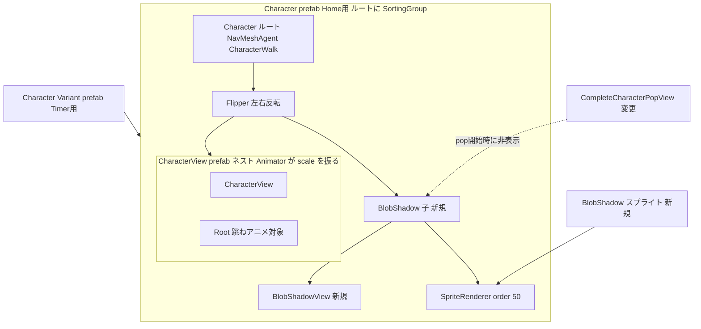

# Technical Design: character-blob-shadow

## Overview

**Purpose**: キャラクターの足元に丸影 (ブロブシャドウ) を表示し、接地感と画面の見栄えを向上させる。対象ユーザーはプレイヤー (視覚効果) と開発者 (見た目調整) である。

**Users**: プレイヤーは Home / Timer シーンでキャラクターと共に丸影を目にする。開発者はプレハブの Inspector 上で影のサイズ・不透明度・オフセットを調整する。

**Impact**: `Assets/UI/Home/Prefabs/Character.prefab` の `Flipper` 直下に影用子オブジェクトを1つ追加し (Timer 用 Variant へ自動伝播)、View コンポーネント1ファイルとスプライト1枚を新設する。加えて Timer の完了演出 (`CompleteCharacterPopView`) に影の非表示化を1点追加する。DI 構成・State・永続化には変更を加えない。

### Goals
- CharacterView を持つ全シーン (Home / Timer) に同一見た目の丸影を表示する
- 移動・跳ね・待機/休憩スケール・非表示・着せ替えのすべてに正しく応答する
- サイズ・不透明度・オフセットを Inspector で調整可能にする

### Non-Goals
- 跳ね高さに連動した影のスケール・減光 (将来要望が出た時点で `BlobShadowView` に追加)
- Home の家具 (SortingGroup) とキャラクターの前後関係の整理 (既存挙動、スコープ外)
- `Assets/Resources/Character.prefab` (シーン・コード・Addressables から参照なし) への影追加

## Architecture

### Existing Architecture Analysis
- キャラクターはネストプレハブ構成: 基底 `CharacterView.prefab` → Home 用 `Assets/UI/Home/Prefabs/Character.prefab` (SortingGroup + NavMeshAgent + CharacterWalk + Flipper) → Timer 用 `Character Variant.prefab` (Home 用 Character.prefab のバリアント、実測確認済み)
- **`Character.prefab` ルートには SortingGroup がある** (Home: order 0、Timer シーンで 5 に上書き、完了演出中は 8)。グループ配下の Renderer の sortingOrder はグループ内部での相対順にのみ使われ、外部の床・背景とはグループの order で比較される
- アニメーションの作用点は2階層に分かれる (実測):
  - Walk / Run の跳ね → `CharacterView` 直下の `Root` 子の localPosition
  - **Idle / Rest / RestLoop → 空パスカーブ = Animator が付いた `CharacterView` ノード自体の localScale / localPosition** (待機の呼吸、Timer 休憩の寝そべりで非等方スケールが入る)
- 水平移動は NavMeshAgent がプレハブルートを動かし、左右反転は `CharacterWalk` が `Flipper` の localScale.x を反転する
- `CharacterView.SetOutfit` は SerializeField 済みの16パーツ SpriteRenderer のみを書き換える。影の Renderer はその対象外
- Timer の完了演出 `CompleteCharacterPopView` はキャラクタールートを `_popScaleMultiplier` (4.2) 倍に拡大し、SortingGroup order を 8 へ変更する

### Architecture Pattern & Boundary Map

**Architecture Integration**:
- Selected pattern: 受動 View パターン (`AudioPlayerView` と同型)。判断ロジックを持たず、SerializeField 値を Transform / SpriteRenderer へ反映するのみ
- Domain/feature boundaries: 影は `Cat.Character` 名前空間の表示専任。Service / State / DI には登場しない
- Existing patterns preserved: View 層規約 (受動・ロジックなし)、プレハブ継承による単一変更点、コーディング規約 (`_camelCase`, `/// comment`)
- New components rationale: `BlobShadowView` は要件 3 (調整語彙: 幅・高さ・不透明度・オフセット) を Inspector 上でそのまま表現するために必要
- Steering compliance: 依存方向規則に抵触なし (View 単独)。DI 登録不要のため Scope 変更なし

**Key Decisions** (詳細は `research.md`):
1. **配置は `Flipper` 直下 (`CharacterView` の兄弟)**。`CharacterView` 配下に置くと Idle の呼吸・Rest の寝そべりスケールを影が継承して変形するため。`Flipper` 直下なら跳ね (Root) とノードスケール (CharacterView) の両方の影響外で、NavMesh 移動には追従する
2. **sortingOrder 50 は SortingGroup 内の相対順として機能する**。グループ内でキャラパーツ (100〜1600) より背面 = 1.3 の「キャラより背面」。床・背景との前後はグループ order (0 / 5) による既存挙動をそのまま継承し、キャラが床より前に見えている現状が影にも適用される = 1.3 の「床より前面」
3. **完了演出中は影を非表示にする**。`CompleteCharacterPopView` の拡大 (4.2倍) は接地文脈を失った「飛び出し」演出であり、巨大化した影は不正。pop 開始時に影 GameObject を非アクティブ化する

### Technology Stack

| Layer | Choice / Version | Role in Feature | Notes |
|-------|------------------|-----------------|-------|
| View | Unity SpriteRenderer (Unity 6 / URP 17.3.0) | 影の描画 | Default レイヤー / sortingOrder 50 (SortingGroup 内の相対順) |
| View | `Cat.Character.BlobShadowView` (新規 MonoBehaviour) | 調整値の反映 | DI 不要・受動 View |
| View | `Timer.View.CompleteCharacterPopView` (既存・変更) | 完了演出中の影非表示 | SerializeField 追加 + 1行 |
| Asset | ソフトエッジ円スプライト (新規 PNG 256×256) | 影の形状 | 白→透明の放射状グラデーション。色は color で制御 |

新規外部依存なし。

## Requirements Traceability

| Requirement | Summary | Components | Interfaces | Flows |
|-------------|---------|------------|------------|-------|
| 1.1 | 足元に楕円影を表示 | BlobShadow 子 + スプライト | — | — |
| 1.2 | Home / Timer 両シーン表示 | `Character.prefab` への追加 (Variant 継承で Timer へ伝播) | — | — |
| 1.3 | キャラより背面・床より前面 | SpriteRenderer (order 50、SortingGroup 内相対) + グループ order の既存挙動 | — | — |
| 1.4 | 全シーン同一見た目 | プレハブ継承による一元管理 + Flipper 直下配置 (Idle/Rest スケール非継承) | — | — |
| 2.1 | 位置変化への追従 | Transform 親子関係 (NavMesh 移動はルート) | — | — |
| 2.2 | 移動中のずれなし表示 | Flipper 直下配置 (跳ねは Root、スケールは CharacterView に閉じる) | — | — |
| 2.3 | キャラ非表示時に影も非表示 | GameObject Active 階層連動 + 完了演出時の明示非表示 | CompleteCharacterPopView | — |
| 3.1 | サイズ (横幅・縦幅) 調整 | BlobShadowView | SerializeField `_width` / `_height` | — |
| 3.2 | 不透明度調整 | BlobShadowView | SerializeField `_opacity` | — |
| 3.3 | オフセット調整 | BlobShadowView | SerializeField `_offset` | — |
| 3.4 | 調整値の表示反映 | BlobShadowView | `OnValidate` / `Awake` での適用 | — |
| 4.1 | 着せ替え時の表示維持 | SetOutfit の対象外構造 | — | — |
| 4.2 | 着せ替え後の描画順維持 | order はプレハブ固定値 (SetOutfit 非干渉) | — | — |

**2.3 の「非表示」の定義**: 本設計では「キャラクターの祖先 GameObject の非アクティブ化」および「完了演出による視覚的退場」を非表示と定義する。個別パーツ Renderer の無効化や `CharacterView.enabled = false` は非表示とみなさない (そのような運用経路が存在しないため)。

## Components and Interfaces

| Component | Domain/Layer | Intent | Req Coverage | Key Dependencies | Contracts |
|-----------|--------------|--------|--------------|------------------|-----------|
| BlobShadowView | Cat.Character / View | 影の調整値を表示へ反映 | 3.1–3.4 | SpriteRenderer (P0) | State (SerializeField のみ) |
| BlobShadow 子オブジェクト (プレハブ変更) | Prefab | 影の実体・配置・描画順 | 1.1–1.4, 2.1–2.3, 4.1–4.2 | Character.prefab (P0) | — |
| CompleteCharacterPopView (既存・変更) | Timer / View | 完了演出中の影非表示 | 2.3 | BlobShadow GameObject (P1) | — |
| BlobShadow スプライト | Asset | 影の形状素材 | 1.1 | — | — |

### Cat.Character / View

#### BlobShadowView

| Field | Detail |
|-------|--------|
| Intent | Inspector の調整値 (幅・高さ・不透明度・オフセット) を影の Transform / SpriteRenderer へ反映する受動 View |
| Requirements | 3.1, 3.2, 3.3, 3.4 |

**Responsibilities & Constraints**
- SerializeField の値を自身の Transform (localScale / localPosition) と SpriteRenderer (color の α) へ反映する。それ以外の責務を持たない
- 描画順 (sortingOrder) は管理しない (プレハブ上の SpriteRenderer 設定に委ねる)
- DI 対象外。`[Inject]` なし・Scope 登録なし

**Dependencies**
- Outbound: 同一 GameObject の SpriteRenderer — 不透明度反映 (P0)
- Inbound / External: なし

**Contracts**: State [x]

##### State Management
- State model: SerializeField のみ (`_spriteRenderer`, `_width` / `_height` (`[Min(0f)]`), `_opacity` (0〜1, `Range` 属性), `_offset` (Vector2))
- 単位の定義: `_width` / `_height` はワールド単位。影スプライトは「1 ワールド単位 = スプライト直径」となるよう PPU を設定し (256px スプライトなら PPU 256)、localScale = (`_width`, `_height`, 1) の写像が実寸となることを保証する
- 反映契約: `OnValidate` (エディタ編集時) と `Awake` (実行時初期化) の両方で「値 → localScale / localPosition (`_offset`) / color α (`_opacity`)」の写像を適用する
- Persistence & consistency: プレハブのシリアライズ値のみ。実行時の動的変更 API は提供しない
- Concurrency strategy: 該当なし (メインスレッドのライフサイクルイベントのみ)

**Implementation Notes**
- Integration: `Character.prefab` の `Flipper` 直下 `BlobShadow` 子 (下記) に付与。クラスは `Assets/Arts/Character/Scripts/BlobShadowView.cs` に置く (CharacterView と同居)
- Validation: `[RequireComponent(typeof(SpriteRenderer))]` を付与。`OnValidate` で `_spriteRenderer` 未設定なら `GetComponent` で自動取得。`Awake` で null の場合はクラス名付き `LogError` を出して以降の反映をスキップ (fail-fast だが例外は投げない)
- Risks: `Flipper` 反転により `_offset` の X 成分は左右反転する。既定運用はオフセット X=0 (左右対称)

### Timer / View (既存変更・summary-only)

**`CompleteCharacterPopView` への影非表示追加** — `[SerializeField] GameObject _blobShadow` を追加し、pop 開始処理 (SortingGroup 変更・4.2倍拡大と同じ箇所) で `SetActive(false)` する。null の場合は何もしない (Home には無関係な Timer 専用配線)。演出後にキャラは再表示されないため復帰処理は不要

### Prefab / Asset 変更 (summary-only)

**`Character.prefab` (Home 用) への `BlobShadow` 子追加** — 実装の要点:
- 配置: **`Flipper` 直下、`CharacterView` の兄弟**。Idle / Rest / RestLoop が CharacterView ノード自体をスケールするため、CharacterView 配下には置かない (Key Decision 1)
- 構成: `SpriteRenderer` (影スプライト、color = 黒系 + α、sortingLayer = Default、**sortingOrder = 50**) + `BlobShadowView`
- 伝播: `Character Variant.prefab` (Timer) は本プレハブのバリアントのため自動反映。実装時に Variant およびシーンインスタンスのオーバーライドで子が除去されていないことを確認する
- 基底 `CharacterView.prefab` 単体 (TestScene 等) には影が付かない。これは許容する (プレイヤーが目にする画面は Home / Timer のみ)

**影スプライト新規作成** — `Assets/Arts/Character/Textures/BlobShadow.png` (256×256、白→透明の放射状グラデーション、Sprite 設定・PPU 256)。白素材 + color 制御にすることで、アート正式素材への差し替えを画像置換のみで完結させる

## Error Handling

### Error Strategy
本機能は入力・外部 I/O・非同期処理を持たないため、実行時エラー経路は構成不備のみ。`BlobShadowView` は `RequireComponent` + `OnValidate` 自動取得で構成不備をエディタ時点で防ぎ、実行時に `_spriteRenderer` が null の場合は `[BlobShadowView]` 付き `LogError` を出して反映処理をスキップする (表示は欠けるがゲーム進行は阻害しない)。`CompleteCharacterPopView._blobShadow` は未設定 (null) を正常系として扱う。

## Testing Strategy

### 検証方針
`BlobShadowView` は UnityEngine 依存の受動 View であり、値→Transform の写像は自明な代入のみで純ロジックが存在しないため、EditMode ユニットテストアセンブリは追加しない (steering の Testable Logic Assemblies 基準に該当せず)。

### Manual / Play Mode 検証項目

**Home シーン**:
1. 足元に影が表示され、床・背景より前面、全キャラパーツより背面に描画される (1.1, 1.3)
2. 歩行・走行 (跳ね) 中も影が地面に残り水平追従する。左右両方向への Flipper 反転で影がずれない (2.1, 2.2)
3. 待機 (Idle の呼吸スケール) 中に影が変形しない (1.4)
4. Closet で着せ替え実行 → 影の表示・描画順が変化しない (4.1, 4.2)
5. Base 全種類・原点セル付近の家具と併置した際の見え方確認 (1.3)

**Timer シーン**:
6. Focus 中 (Run) に Home と同一見た目の影が表示される (1.2, 1.4)
7. Break 移行の減速 → Rest / RestLoop (寝そべり) 中に影が変形しない。寝そべり位置と影のずれが許容範囲であること (1.4)
8. Pause / Resume で影の表示が変化しない
9. Complete 演出 (4.2倍 pop) 開始時に影が非表示になる (2.3)

**共通**:
10. Inspector で `_width` / `_height` / `_opacity` / `_offset` を変更 → シーンビューへ即時反映される (3.1〜3.4)
11. キャラクター GameObject を非アクティブ化 → 影も消える (2.3)
12. 縦長・横長など複数アスペクト比での見え方確認
13. `Character Variant.prefab` および Timer シーンインスタンスに `BlobShadow` 子が伝播していること (1.2)
