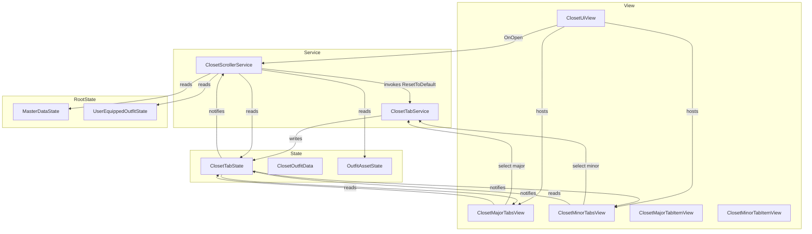
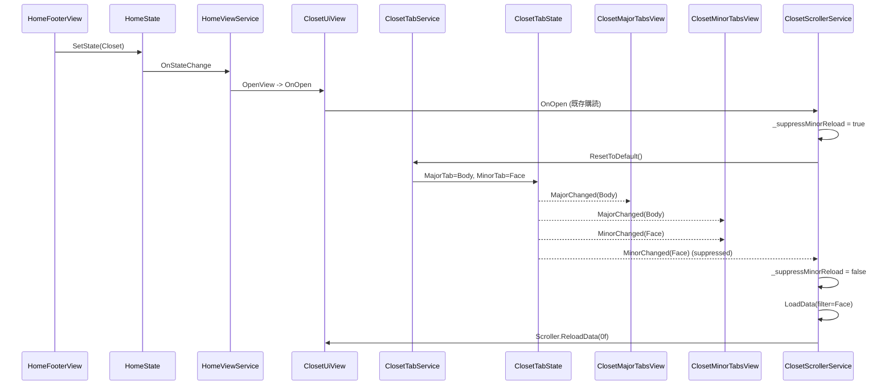
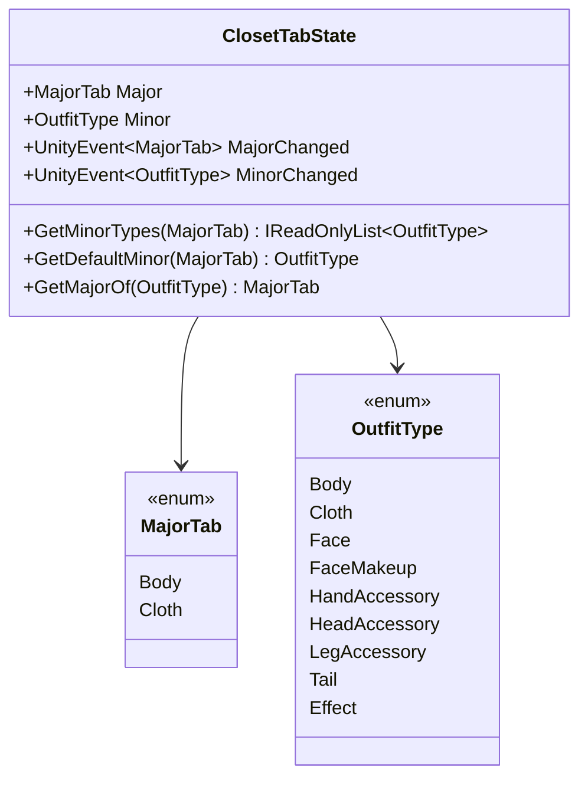

# Technical Design — closet-two-level-tabs

## Overview

**Purpose**: 本機能は Home シーンのクローゼット画面 (`ClosetUiView`) に「大タブ (体 / 服) × 小タブ (`OutfitType`)」の 2 段階タブを導入し、装備カテゴリを階層的に絞り込みながらグリッド表示する操作体験をプレイヤーに提供する。
**Users**: クローゼットを利用するすべてのプレイヤーが対象であり、装備の探索 → 即時プレビュー → 永続化という既存ワークフローを維持したまま、タブによる絞り込みステップが追加される。
**Impact**: 既存の `ClosetScrollerService` のグリッド全件表示挙動を「現在選択中の `OutfitType` のみ」に変更し、タブ状態を保持する `ClosetTabState`、状態遷移を司る `ClosetTabService`、タブ UI を担う `ClosetMajorTabsView` / `ClosetMinorTabsView` を新設する。新規アセットは追加せず、既存テクスチャと Prefab (`HeadingItem.prefab` / `TabItem.prefab`) を流用する。

### Goals
- クローゼット起動時に「体 + `Face`」を初期選択し、対応する `Outfit` のみを `EnhancedScroller` に表示する。
- 大タブ / 小タブの選択変更に追従してグリッドを再構築し、既存の選択 → 即時プレビュー → `PlayerPrefs` 永続化のフローを維持する。
- 既存の `View → Service → State` 依存方向、命名・コーディング規約、`HomeScope` の DI 構成と整合した拡張に留める。

### Non-Goals
- 所持/未所持のフィルタリングや課金状態の判別 (`UserItemInventoryService` 連携) は本機能では行わない。
- 大タブ「体」「服」以外の追加タブや、ユーザーごとのタブ並び順カスタマイズは対象外。
- `EnhancedScroller` の差分更新最適化や `CharacterView.SetOutfit` のリフレクション置換などのリファクタリングは対象外。

## Architecture

### Existing Architecture Analysis
- 4 層 (View / Service / State / Starter) + `HomeScope` 構成、依存方向は `View → Service → State` で厳密。
- `ClosetUiView.OnOpen` が `ClosetScrollerService.Initialize` を起動し、`MasterDataState.Outfits` × `OutfitAssetState` から `ClosetOutfitData` 配列を毎回再構築する。
- VContainer の `HomeScope` で `RegisterComponent`/`RegisterEntryPoint` により View・Service・Starter を登録。
- Closet 専用 Prefab (`HeadingItem.prefab` / `TabItem.prefab`) は配置済みでコード未配線、テクスチャもタブ用素材を `Assets/UI/Home/Closet/Textures/` に保有。

これらの拡張ポイントを尊重し、本機能は **既存クラスへの侵襲を最小化** しつつ、タブ専用クラスを新設して既存層に追加する。

### Architecture Pattern & Boundary Map
**Selected pattern**: 既存と同型の 4 層 (View / Service / State) 拡張。タブの状態は `ClosetTabState` に集約し、`ClosetTabService` が遷移と通知を担い、`ClosetScrollerService` はフィルタ参照のみを行う。



**Architecture Integration**:
- Selected pattern: 既存 Closet と同型の "Service-mediated State" 拡張。
- Domain/feature boundaries: タブ状態とそれを駆動するロジックは `ClosetTab*` 一族にカプセル化し、`ClosetScrollerService` は購読側に徹する。
- Existing patterns preserved: `RegisterComponent` / `RegisterEntryPoint` 登録、`UnityEvent` ベースの状態通知、`UiView.OnOpen` 起点の初期化。
- New components rationale: 状態 (`ClosetTabState`)・操作 (`ClosetTabService`)・表示 (`ClosetMajorTabsView` / `ClosetMinorTabsView` / 個別アイテム View 2 種) を責務単位で分離するため。
- Steering compliance: `View → Service → State` 依存方向、`_camelCase`、`/// comment`、`[Inject]` 付与、`#nullable enable` などの規約に準拠。

### Technology Stack & Alignment

| Layer | Choice / Version | Role in Feature | Notes |
|-------|------------------|-----------------|-------|
| Frontend (Unity UI) | Unity 6 (URP 17.3) + uGUI `Image` / `Button` | 大・小タブ UI、選択表示の更新 | 新規アセット追加なし。`HeadingItem.prefab` / `TabItem.prefab` を再利用 |
| Frontend (グリッド) | EnhancedScroller (既存導入版) | フィルタ後のグリッド再描画 | `Scroller.ReloadData(0f)` でスクロール位置リセット |
| Backend / Services | C# (.NET Standard 2.1) + VContainer 1.17 | `ClosetTabService` を `Lifetime.Scoped` で登録、`ClosetScrollerService` をフィルタ対応 | 既存 DI と同居 |
| Data / Storage | `PlayerPrefs` 経由 `UserEquippedOutfitService` (既存) | 既存の装備永続化フローに変更なし | タブ状態自体は永続化しない |
| Messaging / Events | `UnityEvent<MajorTab>` / `UnityEvent<OutfitType>` | `ClosetTabState` の変更通知 | 既存 `ClosetOutfitData.SelectedChanged` と同パターン |

> 詳細な調査ノートと採用検討は `research.md` 参照。

## System Flows

### A. Closet Open → 既定タブ表示までのシーケンス



> Critical Issue 2 を踏まえ、`ResetToDefault → LoadData` の連鎖を `ClosetScrollerService` 側の `OnOpen` ハンドラ 1 箇所に集約する。リセット中の `MinorChanged` 二重発火は `_suppressMinorReload` フラグで抑止し、`LoadData` は明示的に 1 度だけ呼ぶ。これにより `ClosetUiView.Init` と `ClosetScrollerService.Start` の VContainer 解決順に依存しない実装になる。

### B. タブ切替時の状態遷移 (大タブ / 小タブ共通)

```mermaid
stateDiagram-v2
    [*] --> Default: ResetToDefault
    Default: Major=Body, Minor=Face
    Default --> BodyMinor: SelectMinorTab(MinorOfBody)
    Default --> ClothMinor: SelectMajorTab(Cloth)
    BodyMinor: Major=Body, Minor in BodySet
    ClothMinor: Major=Cloth, Minor=Cloth
    BodyMinor --> ClothMinor: SelectMajorTab(Cloth)
    ClothMinor --> BodyMinor: SelectMajorTab(Body)
    ClothMinor --> ClothMinor: SelectMajorTab(Cloth) (no-op)
    BodyMinor --> BodyMinor: SelectMinorTab(BodySet)
    ClothMinor --> ClothMinor: SelectMinorTab(ClothSet)
```

> 同一値再選択は `ClosetTabService` の冒頭で no-op し、`ClosetTabState` への書込みおよびイベント発火を抑止する (要件 4.3 / 5.4)。

## Requirements Traceability

| Requirement | Summary | Components | Interfaces | Flows |
|-------------|---------|------------|------------|-------|
| 1.1 | Closet 表示時に大タブ・小タブを同時表示 | ClosetUiView, ClosetMajorTabsView, ClosetMinorTabsView | View hierarchy, `Bind(ClosetTabService)` | A |
| 1.2 | 大タブは「体」「服」の 2 項目のみ | ClosetMajorTabsView, ClosetTabState | `MajorTab` enum | A |
| 1.3 | 小タブは現大タブの `OutfitType` 群のみ表示 | ClosetMinorTabsView, ClosetTabState | `GetMinorTypes(MajorTab)` | A, B |
| 1.4 | 大タブ単一選択保証 | ClosetTabService, ClosetTabState | `SelectMajorTab` | B |
| 1.5 | 表示中小タブ単一選択保証 | ClosetTabService, ClosetTabState | `SelectMinorTab` | B |
| 2.1 | 体 = `Body, Face, Tail, FaceMakeup` | ClosetTabState (mapping) | `MajorTabMappings` | — |
| 2.2 | 服 = `Cloth, HandAccessory, HeadAccessory, LegAccessory, Effect` | ClosetTabState (mapping) | `MajorTabMappings` | — |
| 2.3 | マッピング外 `OutfitType` を表示しない | ClosetMinorTabsView | `Bind` 時の `GetMinorTypes` 結果のみ表示 | A |
| 2.4 | 同一 `OutfitType` の重複表示禁止 | ClosetTabState | マッピングの整合性検査 | — |
| 2.5 | `FaceMakeup` を「体」配下に固定 | ClosetTabState | `MajorTabMappings[Body]` に `FaceMakeup` を含める | — |
| 3.1 | OnOpen で大タブ「体」を選択 | ClosetTabService | `ResetToDefault` | A |
| 3.2 | OnOpen で小タブ `Face` を選択 | ClosetTabService | `ResetToDefault` | A |
| 3.3 | OnOpen 時に `Face` で `Outfit` をフィルタ | ClosetScrollerService | `LoadData` (フィルタ済み) | A |
| 3.4 | 再 Open 時もデフォルトに戻す | ClosetTabService | `ResetToDefault` を毎 OnOpen で実行 | A |
| 4.1 | 服タブ選択時に既定 `Cloth` を選択 | ClosetTabService | `SelectMajorTab(Cloth)` 内で既定値設定 | B |
| 4.2 | 体タブ選択時に既定 `Face` を選択 | ClosetTabService | `SelectMajorTab(Body)` 内で既定値設定 | B |
| 4.3 | 同一大タブ再タップ時に小タブ維持 | ClosetTabService | 等値ガード | B |
| 4.4 | 大タブ切替後にグリッド再構築 | ClosetScrollerService | `MinorChanged` 購読 → `LoadData` | A, B |
| 5.1 | 小タブに合わせて `Outfit` フィルタ | ClosetScrollerService | `LoadData(filter)` | A, B |
| 5.2 | 小タブ切替時にスクロール先頭へ | ClosetScrollerService | `Scroller.ReloadData(0f)` | A, B |
| 5.3 | 該当 `Outfit` 0 件は空表示 | ClosetScrollerService | `_data.Count == 0` 時の動作 | A |
| 5.4 | 同一小タブ連続選択で再構築抑止 | ClosetTabService | 等値ガード | B |
| 6.1 | セル選択で `CharacterView.SetOutfit` 実行 | ClosetScrollerService (既存) | `OnCellViewSelected` | — |
| 6.2 | セル選択で永続化 | ClosetScrollerService (既存) | `UserEquippedOutfitService.Equip + Save` | — |
| 6.3 | 再構築時に装備中セルを選択状態化 | ClosetScrollerService | `LoadData` 内 `Selected = ...` | — |
| 6.4 | 他 `OutfitType` の装備状態を変更しない | ClosetScrollerService | フィルタ後のループに限定 | — |
| 7.1 | 大タブ選択中の見た目 | ClosetMajorTabItemView | `ApplySelectedVisual` | — |
| 7.2 | 大タブ非選択の見た目 | ClosetMajorTabItemView | `ApplyUnselectedVisual` | — |
| 7.3 | 小タブ選択中の見た目 | ClosetMinorTabItemView | `ApplySelectedVisual` | — |
| 7.4 | 小タブ非選択の見た目 | ClosetMinorTabItemView | `ApplyUnselectedVisual` | — |
| 7.5 | 既存配置済みアセットのみ使用 | ClosetMajorTabItemView, ClosetMinorTabItemView | SerializeField 経由 (新規アセット禁止) | — |
| 8.1 | 依存方向遵守 | 全コンポーネント | View → Service → State | — |
| 8.2 | タブ状態を `Home.State` 配下で保持 | ClosetTabState | クラス配置 | — |
| 8.3 | DI 登録は `HomeScope` に統合 | HomeScope | `Register<ClosetTabState>` 等 | — |
| 8.4 | `ClosetScrollerService` への変更最小化 | ClosetScrollerService | フィルタ条件と購読のみ追加 | — |
| 8.5 | コーディング規約準拠 | 全コンポーネント | 命名・属性 | — |

## Components and Interfaces

### Component Summary

| Component | Domain/Layer | Intent | Req Coverage | Key Dependencies (P0/P1) | Contracts |
|-----------|--------------|--------|--------------|--------------------------|-----------|
| `Home.State.ClosetTabState` | Home / State | 大・小タブの選択状態とマッピングの SSOT | 1.4, 1.5, 2.1, 2.2, 2.3, 2.4, 8.2 | (none, P0) | State |
| `Home.Service.ClosetTabService` | Home / Service | タブ遷移・既定値・等値ガード・通知の集約 | 1.4, 1.5, 3.1, 3.2, 3.4, 4.1, 4.2, 4.3, 5.4, 8.3 | `ClosetTabState` (P0) | Service |
| `Home.Service.ClosetScrollerService` (改修) | Home / Service | フィルタを反映したグリッド再構築と永続化中継、`OnOpen` 起点の `ResetToDefault` 連鎖 | 3.1, 3.2, 3.3, 3.4, 4.4, 5.1, 5.2, 5.3, 6.1, 6.2, 6.3, 6.4, 8.4 | `ClosetTabState` (P0)、`ClosetTabService` (P0)、既存依存 (P0/P1) | Service, State (既存) |
| `Home.View.ClosetUiView` (改修) | Home / View | タブ View のホスト、子 View へ `ClosetTabService` / `ClosetTabState` をバインド | 1.1, 8.1, 8.5 | `ClosetTabService` (P0)、`ClosetTabState` (P0)、`ClosetMajorTabsView` (P1)、`ClosetMinorTabsView` (P1) | (host) |
| `Home.View.ClosetMajorTabsView` | Home / View | 大タブのコンテナ。`MajorTab` 列挙を子へ束ねる | 1.1, 1.2, 1.4, 7.1, 7.2 | `ClosetTabService` (P0)、`ClosetTabState` (P0) | (UI binding) |
| `Home.View.ClosetMinorTabsView` | Home / View | 小タブのコンテナ。現大タブに応じて再構築 | 1.1, 1.3, 1.5, 2.3, 7.3, 7.4 | `ClosetTabService` (P0)、`ClosetTabState` (P0) | (UI binding) |
| `Home.View.ClosetMajorTabItemView` | Home / View | 大タブ 1 個分の見た目とクリック発火 | 1.4, 7.1, 7.2, 7.5 | (parent) | (UI presenter) |
| `Home.View.ClosetMinorTabItemView` | Home / View | 小タブ 1 個分の見た目とクリック発火 | 1.5, 7.3, 7.4, 7.5 | (parent) | (UI presenter) |

> 個別アイテム View 2 種は新しい契約境界を持たない純粋な presenter のため、Implementation Note のみで扱う。

### Home / State

#### `ClosetTabState`

| Field | Detail |
|-------|--------|
| Intent | 大・小タブの選択状態と「大タブ ↔ 小タブ集合」マッピングを保持し、変更を購読者に通知する |
| Requirements | 1.4, 1.5, 2.1, 2.2, 2.3, 2.4, 8.2 |

**Responsibilities & Constraints**
- 大タブ列挙 `MajorTab { Body, Cloth }` と現値、現小タブ (`OutfitType`) を保持。
- 大タブ → 小タブ集合のマッピング (`IReadOnlyList<OutfitType>`) を提供する SSOT。
- 値変更時のみ `MajorChanged` / `MinorChanged` を発火 (差分通知)。
- マッピングの不変条件: 「全 `OutfitType` がいずれか 1 つの `MajorTab` に属する」「重複なし」を `Init` 時に検証 (失敗時 `Debug.LogError`)。

**Dependencies**
- Inbound: `ClosetTabService` — 唯一の書込み元 (P0)
- Inbound: `ClosetMajorTabsView` / `ClosetMinorTabsView` / `ClosetScrollerService` — 読み取り (P0)
- Outbound: なし

**Contracts**: Service [ ] / API [ ] / Event [ ] / Batch [ ] / State [x]

##### State Management
- State model:
  - `MajorTab Major { get; }` 既定 `MajorTab.Body`
  - `OutfitType Minor { get; }` 既定 `OutfitType.Face`
  - `IReadOnlyList<OutfitType> GetMinorTypes(MajorTab major)` — 「体」= `[Body, Face, Tail, FaceMakeup]`、「服」= `[Cloth, HandAccessory, HeadAccessory, LegAccessory, Effect]`
  - `OutfitType GetDefaultMinor(MajorTab major)` — 「体」→ `Face`、「服」→ `Cloth`
  - `MajorTab GetMajorOf(OutfitType minor)` — 逆引き
- Persistence & consistency: メモリのみ、Open 毎にデフォルトへ戻る (`Lifetime.Scoped`)。
- Concurrency strategy: シングルスレッド (Unity メインスレッド) のみ前提。

**Implementation Notes**
- Integration: `HomeScope.Configure` 内で `builder.Register<ClosetTabState>(Lifetime.Scoped)`。
- Validation: コンストラクタでマッピング全件を走査し `OutfitType` の網羅性と非重複を `Debug.Assert`。
- Risks: 将来 `OutfitType` 追加時に網羅検査でエラー検出 → 開発者へ即時警告。`research.md` のリスクと連動。

### Home / Service

#### `ClosetTabService`

| Field | Detail |
|-------|--------|
| Intent | 大・小タブの遷移ロジックを一元化し、等値ガードと既定値選択を一貫して適用する |
| Requirements | 1.4, 1.5, 3.1, 3.2, 3.4, 4.1, 4.2, 4.3, 5.4, 8.3 |

**Responsibilities & Constraints**
- `ResetToDefault()` で `Major = Body` / `Minor = Face` を設定。
- `SelectMajorTab(MajorTab)` で同値なら no-op、異値なら `Major` 更新 → `Minor = GetDefaultMinor(major)`。
- `SelectMinorTab(OutfitType)` で同値なら no-op、異値かつ現 `Major` のマッピングに含まれる場合のみ `Minor` を更新。範囲外なら `Debug.LogError` (要件 2.4 の保証)。
- 状態書込みは必ず `ClosetTabState` 経由で行い、View に直接通知しない (View は `ClosetTabState` の `UnityEvent` を購読)。

**Dependencies**
- Inbound: `ClosetUiView` (Init 経由)、`ClosetMajorTabsView`、`ClosetMinorTabsView` (P0)
- Outbound: `ClosetTabState` (書込み, P0)
- External: VContainer (`[Inject]`)

**Contracts**: Service [x] / API [ ] / Event [ ] / Batch [ ] / State [ ]

##### Public API (具象クラス、インターフェース無し)

`Home.Service.ClosetTabService` は具象クラスとして以下の `public` メソッドを公開する。既存 Closet 周辺と同じく抽象化は行わない (要件 8.4 / 8.5、現行コーディング規約への整合)。

```csharp
namespace Home.Service
{
    public sealed class ClosetTabService
    {
        /// 既定状態 (Body + Face) にリセットする
        public void ResetToDefault();
        /// 大タブを選択する。同値時は何もしない
        public void SelectMajorTab(MajorTab major);
        /// 小タブを選択する。同値時または現 Major に属さない値は何もしない
        public void SelectMinorTab(Cat.Character.OutfitType minor);
    }
}
```

- Preconditions: `ClosetTabState` が DI 解決済みであること。
- Postconditions: `ResetToDefault` 実行後、`ClosetTabState.Major == Body && Minor == Face`。`SelectMajorTab` で値が変化した場合、`ClosetTabState.Minor` も既定値に同期。
- Invariants: 任意時刻で `Minor in GetMinorTypes(Major)` が成立。

**Implementation Notes**
- Integration: `HomeScope` で `builder.Register<ClosetTabService>(Lifetime.Scoped)` のみ (インターフェース登録は行わない)。`ClosetScrollerService` のコンストラクタに注入し、`OnOpen` ハンドラ冒頭で `ResetToDefault()` を呼ぶ (View → Service → State の方向は `ClosetMajorTabsView` / `ClosetMinorTabsView` → `ClosetTabService` → `ClosetTabState` の経路で維持)。
- Validation: 入力 `OutfitType` がマッピングに無い場合、ロギングのみで状態は変えない (要件 5.4 と整合)。
- Risks: 等値ガードの判定漏れで再描画が走るリスク → unit-testable な内部メソッドに分離。

#### `ClosetScrollerService` (改修)

| Field | Detail |
|-------|--------|
| Intent | 既存のグリッド再構築と装備永続化に加え、`ClosetTabState.Minor` でフィルタしたデータのみを保持する |
| Requirements | 3.3, 4.4, 5.1, 5.2, 5.3, 6.1, 6.2, 6.3, 6.4, 8.4 |

**Responsibilities & Constraints**
- 既存責務 (グリッド構築、`CharacterView.SetOutfit`、`UserEquippedOutfitService.Equip + Save`) は維持。
- `Start()` で `_closetUiView.OnOpen` に加えて `ClosetTabState.MinorChanged` を購読する。`OnOpen` ハンドラは「`_suppressMinorReload = true` → `_closetTabService.ResetToDefault()` → `_suppressMinorReload = false` → 既存 `Initialize()` 呼出 (`OutfitAssetState.IsLoaded` 判定で `LoadData()` または `OnLoaded` 一度購読)」の順で進める。`MinorChanged` ハンドラは `_suppressMinorReload == true` または `!_closetUiView.gameObject.activeInHierarchy` の場合に no-op。
- `LoadData()` のループで `masterOutfit.Type != ClosetTabState.Minor` ならスキップ。
- `LoadData()` 終了時に `Scroller.ReloadData(0f)` を呼びスクロールを先頭にリセット。
- 該当 `Outfit` が 1 件も無い場合は `_data.Count == 0` のまま `ReloadData(0f)`。

**Dependencies**
- Inbound: `ClosetUiView.OnOpen` (既存, P0)、`ClosetTabState.MinorChanged` (新規, P0)
- Outbound: `ClosetTabService.ResetToDefault` (新規, P0)、`Scroller.ReloadData` (P0)、`CharacterView.SetOutfit` (P0)、`UserEquippedOutfitService.Equip/Save` (P0)
- External: EnhancedScroller、VContainer

**Contracts**: Service [x] / API [ ] / Event [ ] / Batch [ ] / State [ ]

##### Public API (既存具象クラスへの最小拡張)

既存 `ClosetScrollerService` のクラス構造・公開メソッド (`Initialize`, `LoadData`, `OnCellViewSelected`) のシグネチャは変更せず、内部で `ClosetTabState` を参照する形に留める (要件 8.4)。新規インターフェース (`IClosetScrollerService`) や新規 `Reload()` API は導入しない。`MinorChanged` への購読は `Start()` 内で 1 度だけ行う。

- Preconditions: `OutfitAssetState.IsLoaded == true` または `OnLoaded` 経由で同期済み。
- Postconditions: `_data` には現 `Minor` の `OutfitType` の `Outfit` のみが格納される。`Scroller.ReloadData(0f)` 完了。
- Invariants: 装備中 `Outfit` が現 `Minor` に存在する場合、その `ClosetOutfitData.Selected == true`。

**Implementation Notes**
- Integration: コンストラクタに `ClosetTabState` と `ClosetTabService` を追加注入。`Start()` で `_closetUiView.OnOpen.AddListener(OnOpen)` と `ClosetTabState.MinorChanged.AddListener(OnMinorChanged)` を登録。`OnOpen` ハンドラ内で `ResetToDefault → Initialize/LoadData` を一連の処理として実行することで `ClosetUiView.Init` と `ClosetScrollerService.Start` の VContainer 解決順に依存しない。
- Suppress flag: `private bool _suppressMinorReload` を導入し、`OnOpen` 内の `ResetToDefault` 呼出区間でのみ true。`OnMinorChanged` は冒頭で `if (_suppressMinorReload) return;` と `if (!_closetUiView.gameObject.activeInHierarchy) return;` の 2 段ガードを持つ。これにより 2 回目以降の Open での `LoadData` 二重実行を抑止し、Closet 非表示中の偶発発火にも備える。
- Validation: `LoadData` 冒頭の `MasterDataState.Outfits` null チェックは現状維持。フィルタ後の空グリッドは正常系として扱う (要件 5.3)。
- Risks: `Start` で登録した両リスナーは `ClosetScrollerService` と同寿命 (Scoped) のため明示的解除は不要。フラグ管理ミスを防ぐため `OnOpen` ハンドラは try/finally で `_suppressMinorReload` を必ず false に戻す。

### Home / View

#### `ClosetUiView` (改修)

| Field | Detail |
|-------|--------|
| Intent | 既存の Open/Close と `OnOpen` 発火に加え、タブ View のホストおよびタブ初期化トリガを担う |
| Requirements | 1.1, 3.1, 3.2, 3.4, 8.1, 8.5 |

**Responsibilities & Constraints**
- 追加 SerializeField:
  - `ClosetMajorTabsView _majorTabsView`
  - `ClosetMinorTabsView _minorTabsView`
- `Init([Inject])` のシグネチャは既存通り `HomeStateSetService` のみで保持 (新規依存を追加しない)。`ClosetTabService` の注入は `ClosetScrollerService` 側に集約する。
- 子 View (`_majorTabsView` / `_minorTabsView`) には `Init` 内で `ClosetTabService` と `ClosetTabState` を渡してバインドする。タブ初期化 (`ResetToDefault`) のトリガは `ClosetScrollerService.OnOpen` ハンドラ側に委譲し、`ClosetUiView` は順序保証責務を持たない。

**Dependencies**
- Inbound: `HomeViewService` (Open/Close, P0)
- Outbound: `ClosetMajorTabsView` (P1)、`ClosetMinorTabsView` (P1)、既存 `Scroller` (P0)

**Contracts**: Service [ ] / API [ ] / Event [ ] / Batch [ ] / State [ ]

**Implementation Notes**
- Integration: `[Inject] Init(HomeStateSetService, ClosetTabService, ClosetTabState)` で `ClosetTabService` / `ClosetTabState` を受け取り、子タブ View のバインドのみを行う (例: `_majorTabsView.Bind(closetTabService, closetTabState); _minorTabsView.Bind(closetTabService, closetTabState);`)。`OnOpen` への直接購読は不要。
- Validation: SerializeField の null は Unity Inspector で検出する。実行時のチェックは `Debug.LogError` で十分。
- Risks: タブ初期化責務を `ClosetScrollerService.OnOpen` に集約したことで、本 View はリスナー順序の不確実性から解放される。

#### `ClosetMajorTabsView` / `ClosetMinorTabsView` (新規)

| Field | Detail |
|-------|--------|
| Intent | それぞれの粒度のタブ群コンテナとして、`ClosetTabState` を購読しアイテム View を再構築する |
| Requirements | 1.1, 1.2, 1.3, 1.5, 2.3, 7.1〜7.4 |

**Responsibilities & Constraints**
- `ClosetMajorTabsView`:
  - SerializeField: `ClosetMajorTabItemView _bodyTabItem` / `_clothTabItem` (静的に 2 個のみ)
  - 各アイテムの `Button.onClick` を `ClosetTabService.SelectMajorTab(...)` に結線。
  - `ClosetTabState.MajorChanged` を購読し、各アイテムの選択状態スプライトを切替。
- `ClosetMinorTabsView`:
  - SerializeField: `Transform _itemRoot`、`ClosetMinorTabItemView _itemPrefab` (= `TabItem.prefab` ベース)、`ClosetMinorTabIconTable _iconTable` (`OutfitType` → `Sprite` の SerializedField マップ)
  - `ClosetTabState.MajorChanged` を購読し、`GetMinorTypes(Major)` を取得 → 既存子 (アイテム) を Pool / Destroy → 必要数だけ生成しアイコン・ラベルをバインド → 各アイテムのクリックで `ClosetTabService.SelectMinorTab(type)` を呼ぶ。
  - `ClosetTabState.MinorChanged` を購読し、選択状態の見た目を切替。

**Dependencies**
- Inbound: `ClosetUiView` (Init 経由, P0)
- Outbound: `ClosetTabService` (P0)、`ClosetTabState` (P0)
- External: 既存テクスチャ (`Assets/UI/Home/Closet/Textures/Icons/`)

**Contracts**: Service [ ] / API [ ] / Event [ ] / Batch [ ] / State [ ]

**Implementation Notes**
- Integration: `ClosetUiView.Init` から `Bind(ClosetTabService, ClosetTabState)` を呼ぶ。Disable 時にイベント購読解除 (`OnDestroy`)。
- Validation: `_iconTable` に未登録の `OutfitType` があれば `Debug.LogError` でログのみ出し、フォールバック (空アイコン) で表示崩れを防ぐ。
- Risks: 動的生成のオブジェクト寿命管理。`OnDestroy` でリスナーを `RemoveAllListeners` し、`ClosetTabState` の `UnityEvent` から自身を `RemoveListener` する。

#### `ClosetMajorTabItemView` / `ClosetMinorTabItemView` (新規, presenter)

- 役割: 1 個のタブ要素。`Image _backgroundImage`、`Image _iconImage`、`Sprite _selectedSprite`、`Sprite _unselectedSprite` をフィールド化し、`SetSelected(bool)` でスプライト・アイコン色を切替する。
- 親 (`ClosetMajorTabsView` / `ClosetMinorTabsView`) から `Bind(action)` でクリック時のコールバックを受け取り、`Button.onClick.AddListener(action)` する。
- 純粋な presenter で外部依存なし。`Prefab` (`HeadingItem.prefab` / `TabItem.prefab`) に同コンポーネントを追加し、Inspector で参照を結線する。
- 既存テクスチャのみを SerializeField 経由で扱う (要件 7.5)。

## Data Models

### Domain Model



- Aggregate root: `ClosetTabState` (タブ状態の単一 SSOT)。
- Invariants:
  - `Minor in GetMinorTypes(Major)` が常に成立。
  - 全 `OutfitType` が必ず 1 つの `MajorTab` のマッピングにのみ含まれる。
- Domain events: `MajorChanged(MajorTab)`, `MinorChanged(OutfitType)`。

### Logical Data Model
- `MajorTabMappings`: `MajorTab → IReadOnlyList<OutfitType>` の静的 readonly マップ。実装は `Dictionary<MajorTab, OutfitType[]>` を `IReadOnlyDictionary` で公開。`FaceMakeup` は要件 2.1 / 2.5 (確定済) に基づき「体」配下に配置する。
  - `Body → [Body, Face, Tail, FaceMakeup]`
  - `Cloth → [Cloth, HandAccessory, HeadAccessory, LegAccessory, Effect]`
- `MajorTabDefaults`: `MajorTab → OutfitType`
  - `Body → Face`
  - `Cloth → Cloth`
- 永続化: なし (Closet を閉じるとリセット、要件 3.4)。

### Data Contracts & Integration
- 本機能では新規 API / イベントスキーマの公開は無し。`ClosetTabState` の `UnityEvent` は内部購読専用。
- 既存 `UserEquippedOutfit` の永続化スキーマは変更しない。

## Error Handling

### Error Strategy
- フィルタ後に該当 `Outfit` が存在しない場合は **正常系** として空グリッドを表示する (要件 5.3)。
- マッピング外の `OutfitType` 入力は `ClosetTabService` で no-op + `Debug.LogError` 出力 (`[ClosetTabService] OutfitType '{type}' is not assigned to any major tab`)。
- `ClosetTabState` 初期化時のマッピング不整合は `Debug.LogError` で開発時に検知し、デフォルト状態 (`Body + Face`) で動作継続。

### Error Categories and Responses
- User Errors: タブ操作経路から不正入力は発生しない (列挙型のみ)。
- System Errors: `MasterDataState.Outfits == null` 時は既存通り `LogError` してリターン (現状動作維持)。
- Business Logic Errors: マッピング不整合 → `Debug.LogError` + デフォルト復帰。

### Monitoring
- ログには必ずクラスコンテキスト (`[ClosetTabService]` / `[ClosetTabState]` / `[ClosetScrollerService]`) を付ける (steering 規約)。
- 追加メトリクスは設けない。

## Testing Strategy

### Unit Tests
- `ClosetTabState`: マッピング初期化テスト (全 `OutfitType` の網羅・重複なし)、`GetMinorTypes` / `GetDefaultMinor` / `GetMajorOf` の戻り値検証。
- `ClosetTabService`: `ResetToDefault` 後の状態、`SelectMajorTab` 同値時の no-op、異値時の小タブ既定値同期、`SelectMinorTab` のマッピング外入力時の no-op。
- `ClosetScrollerService` (改修部分のみ): `LoadData` がフィルタ条件を尊重することの境界テスト (空、1 件、複数件)。

### Integration Tests
- Closet を Open → Close → Open し直した際にタブ状態が `Body + Face` にリセットされることをシーン上で検証。
- 大タブ切替で小タブ既定値が反映され、`Scroller` のスクロール位置が先頭に戻ることを検証。
- 小タブ切替時に装備中 `Outfit` がある場合の選択枠表示再現 (要件 6.3)。

### E2E/UI Tests (Editor Play Mode)
- ホーム → クローゼット遷移 → 既定で `Face` 表示 → 大タブ「服」→ `Cloth` 表示 → セル選択でキャラクター反映 + `PlayerPrefs` 永続化のゴールデンパス。
- 同一大タブ再タップ時に小タブが維持されること (要件 4.3) の確認。
- フィルタ結果が 0 件 (`Effect` / `FaceMakeup` 等) のときに UI が崩れないことの目視確認。

### Performance/Load
- 規模が小さく不要 (Outfit 数は数十件オーダー)。`Scroller.ReloadData(0f)` 1 回のコストで十分。

## Optional Sections

### Security Considerations
- 本機能は外部通信・認証情報を一切扱わない。タブ操作は内部 `enum` のみで構成され、入力サニタイズは不要。

### Performance & Scalability
- フィルタ後の最大件数は現状想定で数十件。`LoadData` の全件再構築コストも数 ms 単位に収まる前提。仮にマスター件数が 1,000 件超になった場合は `ClosetOutfitData` のキャッシュ + `Selected` 差分更新方式 (steering の TODO 5) への切替を検討。

### Migration Strategy
- 既存ユーザーへの影響は UI 上のみ (タブが追加される)。`PlayerPrefs` 形式は変更しないため移行作業は不要。
- 段階的な投入が必要な場合は `ClosetMajorTabsView` / `ClosetMinorTabsView` の `gameObject.SetActive(false)` で簡易フィーチャーフラグ化が可能 (実装初期は不要)。
