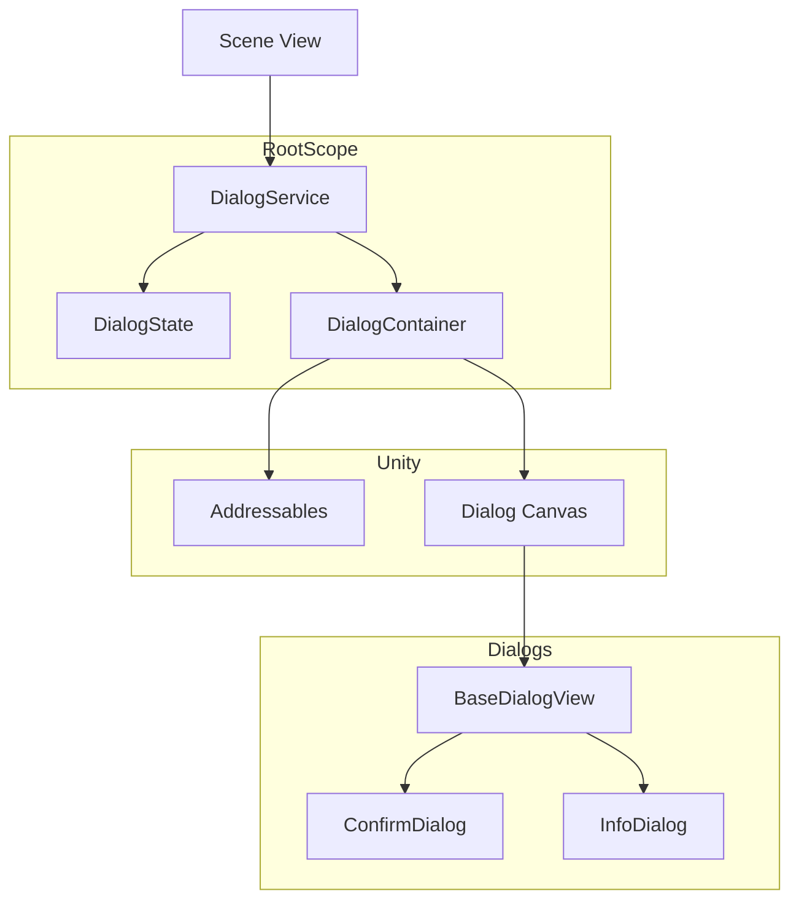
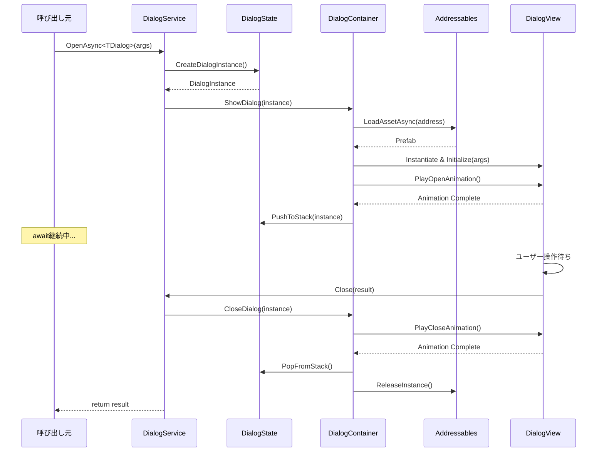
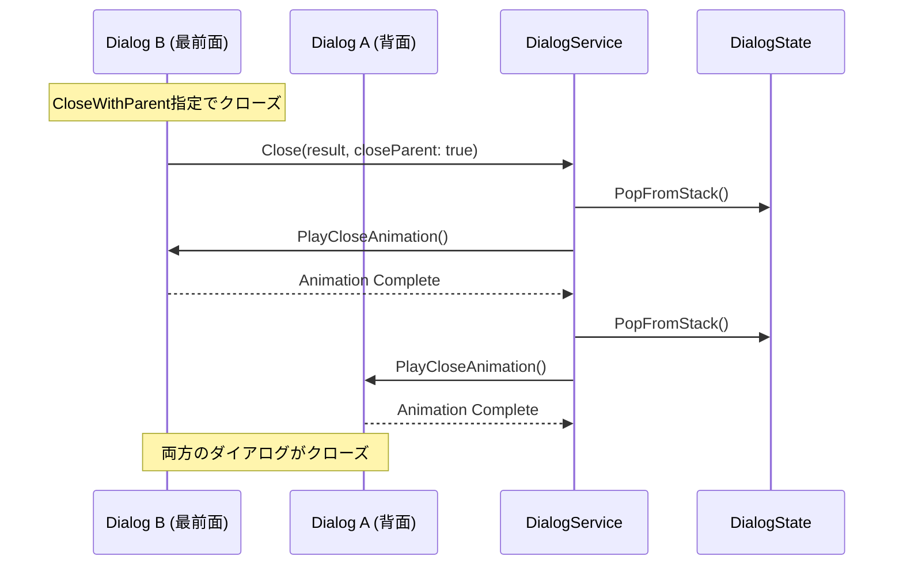
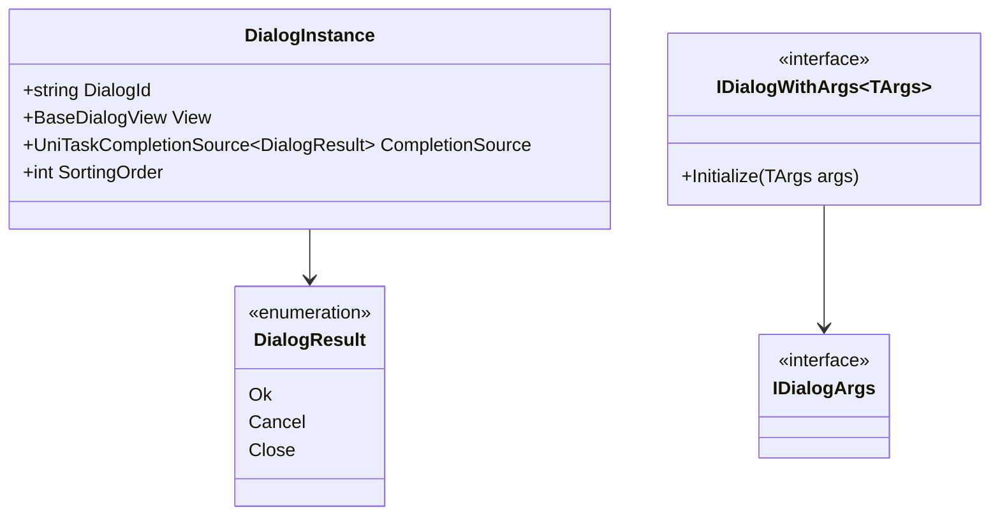

# Design Document: Dialog System

## Overview

**Purpose**: ゲーム内でモーダルダイアログ（ポップアップ）を統一的に管理するシステムを提供し、プレイヤーに情報表示や確認操作を提供する。

**Users**: プレイヤー（UI操作）、開発者（ダイアログ呼び出しAPI）

**Impact**: VContainerのRootScopeに新規サービスを追加し、全シーンからダイアログ表示機能を利用可能にする。

### Goals
- スタック構造による複数ダイアログの階層管理
- UniTaskによる非同期API（async/await）でダイアログ結果を待機可能
- Addressablesによるダイアログプレハブの動的ロード
- 開閉アニメーションと操作ブロック機能

### Non-Goals
- 会話システム（RPGスタイルのテキスト送り）
- ダイアログ内のリッチなインタラクション（ドラッグ&ドロップなど）
- 多言語対応（将来的な拡張として検討）

## Architecture

### Architecture Pattern & Boundary Map



**Architecture Integration**:
- **Selected pattern**: Service-State-View（既存のVContainerパターン準拠）
- **Domain boundaries**: Dialog層はRoot配下で独立、各シーンはDialogServiceのみに依存
- **Existing patterns preserved**: RootScope Singleton登録、View → Service → State 依存方向
- **New components rationale**: DialogService（API）、DialogState（スタック管理）、DialogContainer（UI管理）の3層分離
- **Steering compliance**: `Assets/Scripts/Root/`配下に配置、VContainer DIパターン遵守

### Technology Stack

| Layer | Choice / Version | Role in Feature | Notes |
|-------|------------------|-----------------|-------|
| Async | UniTask 2.x | 非同期API提供 | GitHub URL経由で手動インストール |
| Asset Loading | Addressables 2.7.6 | プレハブ動的ロード | 既存インストール済み |
| DI | VContainer 1.17.0 | 依存性注入 | 既存インストール済み |
| Animation | Unity Animator | 開閉アニメーション | 標準機能 |
| UI | Unity uGUI | ダイアログUI | 標準機能 |

## System Flows

### ダイアログ表示フロー



### 複数ダイアログクローズフロー



## Requirements Traceability

| Requirement | Summary | Components | Interfaces | Flows |
|-------------|---------|------------|------------|-------|
| 1.1, 1.2, 1.3, 1.4 | ダイアログ表示・backdrop | DialogContainer, BackdropView | IDialogContainer | 表示フロー |
| 2.1, 2.2, 2.3, 2.4, 2.5 | スタック管理 | DialogState | IDialogState | 複数クローズフロー |
| 3.1, 3.2, 3.3, 3.4 | 閉じる操作 | BaseDialogView, DialogContainer | IDialogView | 表示フロー |
| 4.1, 4.2, 4.3, 4.4 | アニメーション | BaseDialogView | IDialogView | 表示フロー |
| 5.1, 5.2, 5.3, 5.4, 5.5, 5.6 | プレハブ構造 | DialogContainer | IDialogContainer | 表示フロー |
| 6.1, 6.2, 6.3, 6.4, 6.5 | ダイアログ引数 | IDialogArgs, record types | IDialogView | - |
| 7.1, 7.2, 7.3, 7.4 | 結果通知 | DialogService, UniTaskCompletionSource | IDialogService | 表示フロー |
| 8.1, 8.2, 8.3, 8.4 | VContainer統合 | RootScope登録 | - | - |

## Components and Interfaces

| Component | Domain/Layer | Intent | Req Coverage | Key Dependencies | Contracts |
|-----------|--------------|--------|--------------|------------------|-----------|
| DialogService | Root/Service | ダイアログ表示APIの提供 | 1, 7 | DialogState (P0), DialogContainer (P0) | Service |
| DialogState | Root/State | ダイアログスタック管理 | 2 | - | State |
| DialogContainer | Root/View | UI管理・Addressablesロード | 1, 3, 5 | Addressables (P0), Canvas (P0) | - |
| BaseDialogView | Dialog/View | ダイアログ基底クラス | 3, 4, 6 | Animator (P1) | - |
| BackdropView | Root/View | 半透明背景表示 | 1.3, 1.4, 3.2 | CanvasGroup (P1) | - |

### Root / Service

#### DialogService

| Field | Detail |
|-------|--------|
| Intent | ダイアログの表示・終了を制御する公開API |
| Requirements | 1.1, 7.1, 7.2, 7.3, 7.4 |

**Responsibilities & Constraints**
- ダイアログ表示リクエストの受付と結果返却
- UniTaskCompletionSourceによる非同期待機管理
- 複数ダイアログの連続クローズ制御

**Dependencies**
- Inbound: 各シーンのView/Service — ダイアログ表示リクエスト (P0)
- Outbound: DialogState — スタック操作 (P0)
- Outbound: DialogContainer — UI表示制御 (P0)
- External: UniTask — 非同期API (P0)

**Contracts**: Service [x]

##### Service Interface
```csharp
public interface IDialogService
{
    UniTask<DialogResult> OpenAsync<TDialog>(CancellationToken cancellationToken = default)
        where TDialog : BaseDialogView;

    UniTask<DialogResult> OpenAsync<TDialog, TArgs>(TArgs args, CancellationToken cancellationToken = default)
        where TDialog : BaseDialogView, IDialogWithArgs<TArgs>
        where TArgs : IDialogArgs;

    void Close(DialogResult result, bool closeParent = false);

    bool HasOpenDialog { get; }
}
```
- Preconditions: ダイアログプレハブがAddressablesに登録済み
- Postconditions: ダイアログが表示され、結果が返却される
- Invariants: スタックは常に有効な状態を維持

### Root / State

#### DialogState

| Field | Detail |
|-------|--------|
| Intent | 表示中ダイアログのスタック管理 |
| Requirements | 2.1, 2.2, 2.3, 2.4, 2.5 |

**Responsibilities & Constraints**
- Stack<DialogInstance>によるLIFO管理
- 各ダイアログのUniTaskCompletionSource保持
- sortingOrder管理（加算）

**Dependencies**
- Inbound: DialogService — スタック操作 (P0)

**Contracts**: State [x]

##### State Management
```csharp
public class DialogState
{
    readonly Stack<DialogInstance> _dialogStack = new();

    public int Count => _dialogStack.Count;
    public bool HasDialog => _dialogStack.Count > 0;
    public DialogInstance Current => _dialogStack.Peek();

    public void Push(DialogInstance instance);
    public DialogInstance Pop();
    public IReadOnlyList<DialogInstance> PopUntil(DialogInstance target);
}

public class DialogInstance
{
    public string DialogId { get; }
    public BaseDialogView View { get; }
    public UniTaskCompletionSource<DialogResult> CompletionSource { get; }
    public int SortingOrder { get; }
}
```
- Persistence: メモリ内のみ（永続化なし）
- Consistency: シングルスレッド前提
- Concurrency: 同時アクセスなし（メインスレッドのみ）

### Root / View

#### DialogContainer

| Field | Detail |
|-------|--------|
| Intent | ダイアログUIの生成・管理・入力監視 |
| Requirements | 1.1, 1.2, 1.3, 3.3, 5.5, 5.6 |

**Responsibilities & Constraints**
- Addressablesによるプレハブロード・キャッシュ
- ダイアログインスタンスのCanvas配置
- Androidバックボタン監視
- Backdrop表示制御

**Dependencies**
- Inbound: DialogService — 表示/非表示指示 (P0)
- External: Addressables — プレハブロード (P0)
- External: Unity Canvas — UI表示 (P0)

**Implementation Notes**
- Integration: DontDestroyOnLoadシーンにCanvasを配置、またはRootシーンに配置
- Validation: プレハブアドレスの存在確認はロード時にエラーログ出力
- Risks: Addressablesロード失敗時のフォールバック未定義

#### BackdropView

| Field | Detail |
|-------|--------|
| Intent | 半透明の背景オーバーレイ表示 |
| Requirements | 1.3, 1.4, 2.3, 3.2 |

**Responsibilities & Constraints**
- CanvasGroupによるalpha制御
- タップ検知によるダイアログクローズ通知
- ダイアログ数に応じたalpha加算（オプション）

**Implementation Notes**
- クリックイベントはButton or EventTriggerで検知
- alpha値: 基底0.5、ダイアログ毎に+0.1（上限0.9）

### Dialog / View

#### BaseDialogView

| Field | Detail |
|-------|--------|
| Intent | ダイアログの基底クラス、共通機能提供 |
| Requirements | 3.1, 4.1, 4.2, 4.3, 4.4, 6.1 |

**Responsibilities & Constraints**
- 開閉アニメーション制御（Animator）
- 閉じるボタンのイベントハンドリング
- アニメーション中の操作ブロック（CanvasGroup.interactable）

**Dependencies**
- Inbound: DialogContainer — 初期化・アニメーション指示 (P0)
- Outbound: DialogService — クローズ通知 (P0)
- External: Animator — アニメーション再生 (P1)

**Implementation Notes**
- Animatorには"Open"と"Close"トリガーを定義
- アニメーション完了検知: AnimationEventまたはStateMachineBehaviour
- CanvasGroup.interactable = false でアニメーション中の入力ブロック

## Data Models

### Domain Model



### Logical Data Model

**DialogInstance**: ダイアログの実行時インスタンス
- DialogId: Addressablesアドレス（一意識別子）
- View: 生成されたMonoBehaviour参照
- CompletionSource: 結果待機用
- SortingOrder: Canvas描画順

**DialogResult**: ダイアログ終了結果
- Ok: 確定操作
- Cancel: キャンセル操作（backdrop、戻るボタン含む）
- Close: 閉じるボタン（特別な結果なし）

**IDialogArgs**: ダイアログ引数のマーカーインターフェース
- 各ダイアログがrecord型で独自定義
- immutable保証
- **前提条件**: Unityでrecord型を使用するため、以下の定義が必要:
  ```csharp
  namespace System.Runtime.CompilerServices
  {
      internal sealed class IsExternalInit { }
  }
  ```

## Error Handling

### Error Strategy
- ダイアログロード失敗: エラーログ出力、UniTask例外スロー
- スタック不整合: 防御的にチェック、不正操作は無視

### Error Categories and Responses
- **Asset Not Found**: Addressablesロード失敗 → エラーログ + 例外
- **Cancellation**: CancellationToken発火 → ダイアログを即座にクローズ、OperationCanceledExceptionスロー
- **Stack Empty**: クローズ時にスタックが空 → 警告ログ、操作無視
- **Animation Missing**: Animator未設定 → 警告ログ、即時表示/非表示

### Monitoring
- `Debug.LogError($"[DialogService] {e.Message}")` 形式でエラーログ
- クラスコンテキスト付きログはsteering準拠

## Testing Strategy

### Unit Tests
- DialogState: Push/Pop操作、スタック整合性
- DialogResult: enum値の正確性
- DialogArgs: recordのimmutability

### Integration Tests
- DialogService → DialogContainer連携
- Addressablesロード → Instantiate → 表示
- 複数ダイアログのスタック操作

### Manual Tests
- 開閉アニメーションの視覚確認
- backdrop/戻るボタンでのクローズ
- Androidデバイスでの戻るボタン動作

## Optional Sections

### Performance & Scalability
- プレハブキャッシュにより同一ダイアログの再ロード回避
- 同時表示ダイアログ数は10未満を想定（スタック深度制限なし）
- CanvasのsortingOrder範囲: 1000〜1100（他UIと競合しない範囲）

### Security Considerations
- ダイアログ引数にセンシティブ情報を含めない設計推奨
- ユーザー入力はダイアログ内で個別にバリデーション
