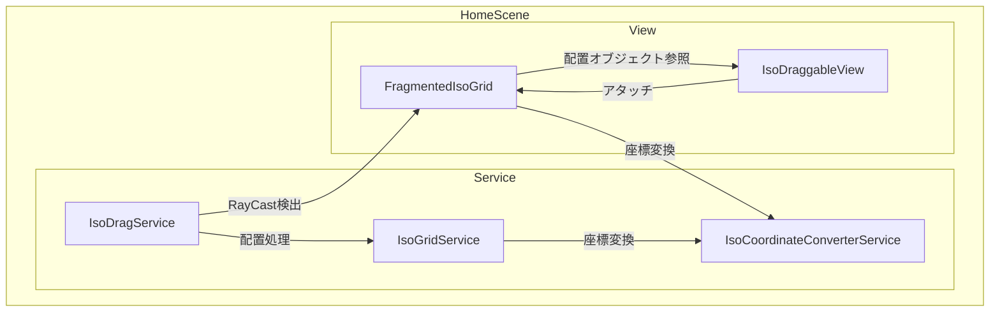
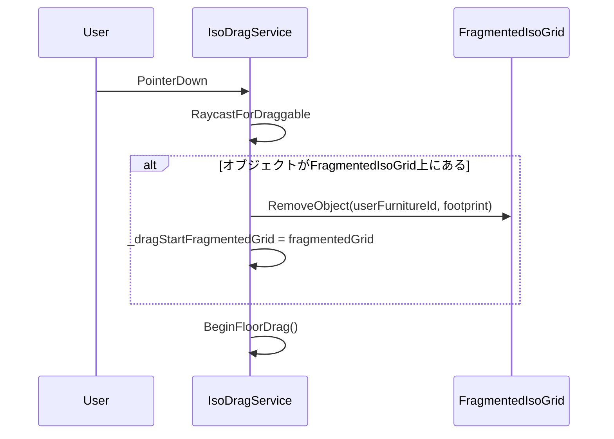
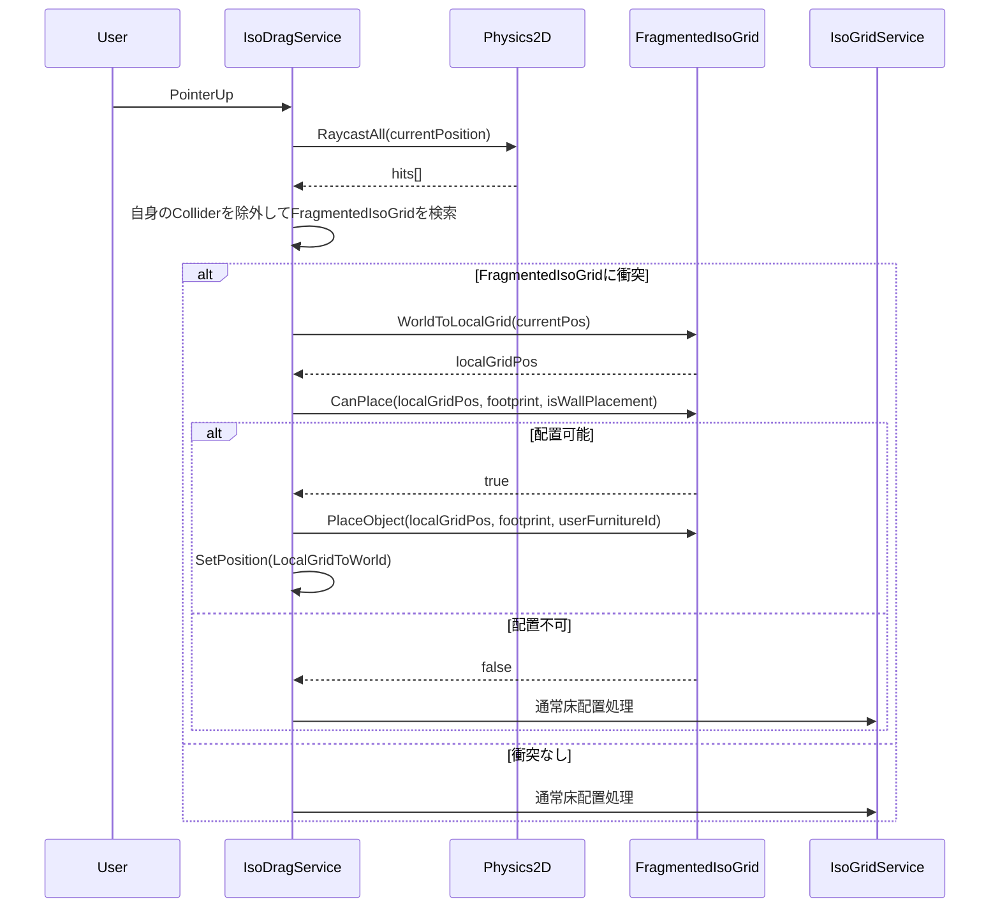
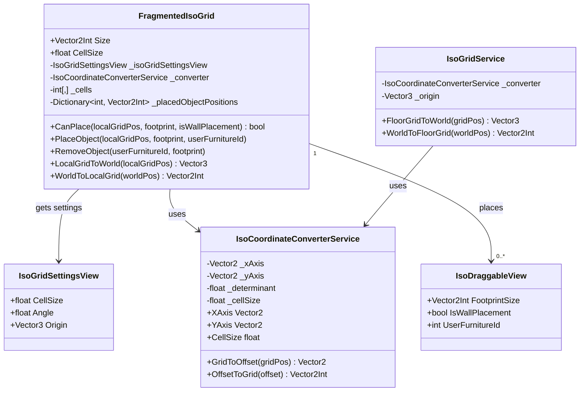

# Furniture on Furniture 技術設計

## Overview

**Purpose**: 家具の上に別の家具を配置可能にする機能を提供し、プレイヤーの部屋カスタマイズの自由度を向上させる。

**Users**: 部屋の模様替えを行うプレイヤーが、テーブルの上に小物を置くなどの配置を行う。

**Impact**: IsoDragServiceのEndFloorDrag処理を拡張し、FragmentedIsoGridコンポーネントを新規追加する。

### Core Concept

FragmentedIsoGridは、通常のIsoGridと同様のグリッド構造を家具上面に提供する。

- **グリッド構造**: 通常のIsoGridと同じく、セル単位のグリッドが家具上面に広がる
- **座標計算**: ワールド座標からローカルグリッド座標への変換が必要（どのセルに配置するかを計算）
- **複数オブジェクト配置**: 1つのFragmentedIsoGrid上に複数の家具を同時に配置可能（各オブジェクトが占有するセルが重複しない限り）

### Goals
- 家具オブジェクトの上面に別の家具を配置可能にする
- 壁配置家具（IsWallPlacement=true）の誤配置を防止する
- footprintサイズによる配置制約を実装する

### Non-Goals
- 親家具移動時の子オブジェクト追従
- FragmentedIsoGrid上に配置された家具のセーブ/ロード

## Architecture

### Existing Architecture Analysis
- **IsoDragService**: ドラッグ操作を管理し、EndFloorDrag()/EndWallDrag()で配置を確定
- **IsoGridService**: グリッド座標変換と配置状態管理を担当
- **IsoDraggableView**: 各家具にアタッチされ、footprint・配置タイプ等のプロパティを保持

### Architecture Pattern & Boundary Map



**Architecture Integration**:
- Selected pattern: 既存IsoDragService拡張パターン
- Domain boundaries: FragmentedIsoGridはViewレイヤーに配置し、配置ロジックはServiceレイヤーで実行
- Existing patterns preserved: RayCastによるオブジェクト検出、配置可否チェック、グリッドスナップ
- New components rationale: FragmentedIsoGridは家具上面の配置領域を表現する専用コンポーネント
- Steering compliance: View → Service → State の依存方向を維持

### Technology Stack

| Layer | Choice / Version | Role in Feature | Notes |
|-------|------------------|-----------------|-------|
| Runtime | Unity 6 | Physics2D RayCast、MonoBehaviour | 既存 |
| Framework | VContainer 1.17.0 | DI（既存Service利用） | 既存 |

### 共通化設計

IsoGridServiceとFragmentedIsoGridで共通するロジックを抽出し、再利用可能にする。

#### 共通化対象

| ロジック | IsoGridServiceの該当箇所 | 共通化方法 |
|---------|-------------------------|-----------|
| 座標変換（軸計算） | `_xAxis`, `_yAxis`, `_determinant`の計算 (46-49行目) | IsoCoordinateConverterService |
| グリッド→ワールド変換 | `FloorGridToWorld` (67-71行目) | IsoCoordinateConverterService |
| ワールド→グリッド変換 | `WorldToFloorGrid` (74-81行目) | IsoCoordinateConverterService |
| 有効範囲チェック | `IsValidFloorPosition` (84-88行目) | パターン共通（各クラスで実装） |
| 配置可否判定 | `CanPlaceFloorObject` (144-158行目) | パターン共通（各クラスで実装） |
| オブジェクト配置/削除 | `PlaceFloorObject`, `RemoveFloorObject` | パターン共通（各クラスで実装） |

#### IsoCoordinateConverterService（新規）

アイソメトリック座標変換のコアロジックを提供するユーティリティクラス。

```csharp
/// アイソメトリック座標変換を行うユーティリティ
public class IsoCoordinateConverterService
{
    readonly Vector2 _xAxis;
    readonly Vector2 _yAxis;
    readonly float _determinant;
    readonly float _cellSize;

    public IsoCoordinateConverterService(float cellSize, float angle)
    {
        _cellSize = cellSize;
        var angleRad = angle * Mathf.Deg2Rad;
        _xAxis = new Vector2(Mathf.Cos(angleRad), -Mathf.Sin(angleRad)) * cellSize;
        _yAxis = new Vector2(-Mathf.Cos(angleRad), -Mathf.Sin(angleRad)) * cellSize;
        _determinant = _xAxis.x * _yAxis.y - _xAxis.y * _yAxis.x;
    }

    /// グリッド座標をオフセット（origin基準）に変換
    public Vector2 GridToOffset(Vector2Int gridPos)
    {
        return gridPos.x * _xAxis + gridPos.y * _yAxis;
    }

    /// オフセットをグリッド座標に変換
    public Vector2Int OffsetToGrid(Vector2 offset)
    {
        var gridX = (offset.x * _yAxis.y - offset.y * _yAxis.x) / _determinant;
        var gridY = (_xAxis.x * offset.y - _xAxis.y * offset.x) / _determinant;
        return new Vector2Int(Mathf.RoundToInt(gridX), Mathf.RoundToInt(gridY));
    }

    public Vector2 XAxis => _xAxis;
    public Vector2 YAxis => _yAxis;
    public float CellSize => _cellSize;
}
```

#### 使用方法

**IsoGridService（リファクタリング後）**:
```csharp
public class IsoGridService
{
    readonly IsoCoordinateConverterService _converter;
    readonly Vector3 _origin;

    public Vector3 FloorGridToWorld(Vector2Int gridPos)
    {
        return _origin + (Vector3)_converter.GridToOffset(gridPos);
    }

    public Vector2Int WorldToFloorGrid(Vector3 worldPos)
    {
        var offset = (Vector2)(worldPos - _origin);
        return _converter.OffsetToGrid(offset);
    }
}
```

**FragmentedIsoGrid（新規）**:
```csharp
public class FragmentedIsoGrid : MonoBehaviour
{
    IsoCoordinateConverterService _converter;

    public Vector3 LocalGridToWorld(Vector2Int localGridPos)
    {
        var offset = _converter.GridToOffset(localGridPos);
        return transform.position + (Vector3)offset;
    }

    public Vector2Int WorldToLocalGrid(Vector3 worldPos)
    {
        var offset = (Vector2)(worldPos - transform.position);
        return _converter.OffsetToGrid(offset);
    }
}
```

#### 共通化の利点

1. **DRY原則**: 座標変換ロジックの重複を排除
2. **テスト容易性**: IsoCoordinateConverterServiceを単体テスト可能
3. **一貫性**: IsoGridServiceとFragmentedIsoGridで同一の計算ロジックを保証
4. **拡張性**: 将来的に他のグリッドタイプを追加する際にも再利用可能

## System Flows

### ドラッグ開始時のFragmentedIsoGrid解除フロー



### ドラッグ終了時の配置判定フロー



## Requirements Traceability

| Requirement | Summary | Components | Interfaces | Flows |
|-------------|---------|------------|------------|-------|
| 1.1 | FragmentedIsoGridコンポーネント | FragmentedIsoGrid | - | - |
| 1.2 | 2D Collider必須化 | FragmentedIsoGrid | RequireComponent | - |
| 1.3 | 配置可能領域定義 | FragmentedIsoGrid | Size property | - |
| 1.4 | サイズプロパティ | FragmentedIsoGrid | Size property | - |
| 2.1 | EndFloorDragでのRayCast | IsoDragService | RaycastForFragmentedGrid | ドラッグ終了フロー |
| 2.2 | FragmentedIsoGridへの配置 | FragmentedIsoGrid, IsoDragService | PlaceObject | ドラッグ終了フロー |
| 2.3 | 通常フロア配置へのフォールバック | IsoDragService | - | ドラッグ終了フロー |
| 3.1 | IsWallPlacement制約 | FragmentedIsoGrid | CanPlace | ドラッグ終了フロー |
| 3.2 | 非壁配置家具の許可 | FragmentedIsoGrid | CanPlace | ドラッグ終了フロー |
| 3.3 | footprintサイズ制約 | FragmentedIsoGrid | CanPlace | ドラッグ終了フロー |
| 3.4 | 配置拒否時のフィードバック | IsoDragService | - | ドラッグ終了フロー |

## Components and Interfaces

| Component | Domain/Layer | Intent | Req Coverage | Key Dependencies | Contracts |
|-----------|--------------|--------|--------------|------------------|-----------|
| IsoCoordinateConverterService | Service | アイソメトリック座標変換の共通ロジック | - | - | Service |
| FragmentedIsoGrid | View | 家具上面の配置可能グリッド領域を管理 | 1.1-1.4, 3.1-3.3 | IsoCoordinateConverterService (P0), IsoGridSettingsView (P0), Collider2D (P0) | State |
| IsoGridService | Service | グリッド座標変換と配置状態管理（リファクタリング） | - | IsoCoordinateConverterService (P0) | Service |
| IsoDragService | Service | ドラッグ開始/終了時にFragmentedIsoGrid配置を判定 | 2.1-2.3, 3.4 | FragmentedIsoGrid (P1), IsoGridService (P0) | Service |

### Service Layer (Shared)

#### IsoCoordinateConverterService

| Field | Detail |
|-------|--------|
| Intent | アイソメトリック座標変換のコアロジックを提供 |
| Requirements | IsoGridService・FragmentedIsoGrid共通基盤 |

**Responsibilities & Constraints**
- cellSizeとangleからアイソメトリック軸（_xAxis, _yAxis）を計算
- グリッド座標 ↔ オフセット（origin基準）の変換を提供
- 状態を持たない純粋な計算クラス

**Dependencies**
- Inbound: IsoGridService, FragmentedIsoGrid — 座標変換 (P0)

**Contracts**: Service [x]

##### Interface
```csharp
public class IsoCoordinateConverterService
{
    public IsoCoordinateConverterService(float cellSize, float angle);

    /// グリッド座標をオフセット（origin基準）に変換
    public Vector2 GridToOffset(Vector2Int gridPos);

    /// オフセットをグリッド座標に変換
    public Vector2Int OffsetToGrid(Vector2 offset);

    public Vector2 XAxis { get; }
    public Vector2 YAxis { get; }
    public float CellSize { get; }
}
```

**Implementation Notes**
- IsoGridServiceのコンストラクタ (46-49行目) から軸計算ロジックを移動
- FloorGridToWorld/WorldToFloorGridで使用されている計算式を抽出
- immutableなクラスとして設計し、スレッドセーフを保証

### View Layer

#### FragmentedIsoGrid

| Field | Detail |
|-------|--------|
| Intent | 家具上面に配置可能なグリッド領域を表現するMonoBehaviour |
| Requirements | 1.1, 1.2, 1.3, 1.4, 3.1, 3.2, 3.3 |

**Responsibilities & Constraints**
- 家具オブジェクトの子として配置され、上面の配置可能領域を定義
- 通常のIsoGridと同様のグリッド構造を持ち、セル単位で配置位置を計算
- 内部にグリッドセル配列を持ち、複数オブジェクトの配置状態を管理
- グリッド座標変換（ローカル座標系 ↔ ワールド座標）を提供
- 配置可否判定ロジックを提供（セル占有状態を考慮）
- 複数オブジェクトの同時配置をサポート（各footprintのセル領域が重複しない限り）

**Dependencies**
- Inbound: IsoDragService — 配置可否判定・配置実行 (P0)
- Outbound: IsoGridSettingsView — CellSize, Angle取得 (P0)
- External: Collider2D — RayCast検出用 (P0)

**Contracts**: State [x]

##### State Management
```csharp
[RequireComponent(typeof(Collider2D))]
public class FragmentedIsoGrid : MonoBehaviour
{
    [SerializeField] Vector2Int _size;

    /// IsoGridSettingsViewから取得した設定を使用
    IsoGridSettingsView _isoGridSettingsView;

    /// 座標変換ユーティリティ（IsoGridServiceと共通ロジック）
    IsoCoordinateConverterService _converter;

    /// グリッドセル配列（IsoGridStateと同様のパターン）
    int[,] _cells;

    /// 配置されたオブジェクトのID→位置マッピング
    Dictionary<int, Vector2Int> _placedObjectPositions;

    public Vector2Int Size => _size;
    public float CellSize => _isoGridSettingsView.CellSize;

    [Inject]
    public void Construct(IsoGridSettingsView isoGridSettingsView)
    {
        _isoGridSettingsView = isoGridSettingsView;
    }

    void Start()
    {
        _converter = new IsoCoordinateConverterService(
            _isoGridSettingsView.CellSize,
            _isoGridSettingsView.Angle
        );
        _cells = new int[_size.x, _size.y];
        _placedObjectPositions = new Dictionary<int, Vector2Int>();
    }
}
```

##### Coordinate Conversion
```csharp
/// ローカルグリッド座標をワールド座標に変換
/// IsoCoordinateConverterServiceを使用してIsoGridServiceと同一ロジックを適用
public Vector3 LocalGridToWorld(Vector2Int localGridPos)
{
    var offset = _converter.GridToOffset(localGridPos);
    return transform.position + (Vector3)offset;
}

/// ワールド座標をローカルグリッド座標に変換
public Vector2Int WorldToLocalGrid(Vector3 worldPos)
{
    var offset = (Vector2)(worldPos - transform.position);
    return _converter.OffsetToGrid(offset);
}

/// ローカルグリッド座標が有効範囲内かチェック
public bool IsValidLocalPosition(Vector2Int localGridPos)
{
    return localGridPos.x >= 0 && localGridPos.x < _size.x
        && localGridPos.y >= 0 && localGridPos.y < _size.y;
}
```

##### Service Interface
```csharp
/// 指定位置に家具が配置可能かどうかを判定
/// セル占有状態、footprintサイズ、IsWallPlacement制約をチェック
public bool CanPlace(Vector2Int localGridPos, Vector2Int footprint, bool isWallPlacement, int selfUserFurnitureId = 0)

/// 家具をこのグリッドの指定位置に配置
public void PlaceObject(Vector2Int localGridPos, Vector2Int footprint, int userFurnitureId)

/// 指定IDのオブジェクトを解除
public void RemoveObject(int userFurnitureId, Vector2Int footprint)

/// 指定IDのオブジェクトのフットプリント開始位置を取得
public Vector2Int GetObjectFootprintStart(int userFurnitureId)
```

**Implementation Notes**
- RequireComponentでCollider2Dを必須化し、RayCast検出を保証
- sizeはインスペクターで設定し、家具の上面に合わせる
- cellSizeとangleはIsoGridSettingsViewから取得（VContainer Inject）し、IsoGridServiceと同一値を保証
- IsoGridServiceと同様のセル配列パターンで複数オブジェクトを管理
- 座標変換はIsoGridServiceの計算ロジックを参考に実装
- グリッド座標計算: ドラッグ終了時のワールド座標をローカルグリッド座標に変換し、配置先セルを決定
- 複数配置: _cells配列で各セルの占有状態を追跡し、空きセルへの配置を許可

### Service Layer

#### IsoDragService（拡張）

| Field | Detail |
|-------|--------|
| Intent | EndFloorDragにFragmentedIsoGrid配置判定を追加 |
| Requirements | 2.1, 2.2, 2.3, 3.4 |

**Responsibilities & Constraints**
- ドラッグ開始時にFragmentedIsoGrid上のオブジェクトを解除
- ドラッグ終了時にRayCastでFragmentedIsoGridを検出（自身のColliderは除外）
- 配置可否を判定し、可能な場合はFragmentedIsoGridのローカルグリッドに配置
- 配置不可または検出なしの場合は既存の床配置処理を実行

**Dependencies**
- Outbound: FragmentedIsoGrid — 配置判定・実行 (P1)
- Outbound: IsoGridService — 床配置処理 (P0)

**Contracts**: Service [x]

##### State
```csharp
/// ドラッグ開始時のFragmentedIsoGrid（元の位置に戻す用）
FragmentedIsoGrid _dragStartFragmentedGrid;
Vector2Int _dragStartLocalGridPos;
```

##### Service Interface
```csharp
/// BeginFloorDrag内で呼び出し、現在のオブジェクトがFragmentedIsoGrid上にあるか判定
/// ある場合はRemoveObjectを呼び出し、_dragStartFragmentedGridに保存
void CheckAndRemoveFromFragmentedGrid()

/// EndFloorDrag内で呼び出し、FragmentedIsoGridを検出
/// 自身のColliderに属するFragmentedIsoGridは除外
FragmentedIsoGrid RaycastForFragmentedGrid(Vector3 worldPos)
```

**Implementation Notes**
- RaycastForDraggableと同様のパターンでFragmentedIsoGridを検出
- 自身のCollider除外: hit.collider.GetComponentInParent<IsoDraggableView>() == _currentIsoDraggableView の場合はスキップ
- 配置不可時は元の位置（_dragStartFragmentedGridまたは床）に戻す
- 配置拒否のフィードバックは初期実装では元の位置に戻すのみ（視覚的フィードバックは将来拡張）

## Data Models

### Domain Model



**Business Rules & Invariants**:
- FragmentedIsoGridは通常のIsoGridと同様のグリッド構造を持つ
- グリッド座標計算: ワールド座標→ローカルグリッド座標変換により配置先セルを決定
- 複数オブジェクト同時配置: 1つのFragmentedIsoGrid上に複数オブジェクトを配置可能（セルが空いている限り）
- IsWallPlacement=trueのオブジェクトは配置不可
- footprintがグリッド範囲内かつセルが空いている場合のみ配置可能
- 各セルには1つのオブジェクトのみ占有可能（IsoGridCellと同様）

## Error Handling

### Error Strategy
- 配置不可の場合は元の床位置に戻す（既存パターンと同様）
- RayCastでFragmentedIsoGrid検出失敗時は通常の床配置フローにフォールバック

### Error Categories and Responses
**User Errors**: 壁配置家具やサイズ超過家具をドラッグした場合 → 元の位置に戻す
**System Errors**: RayCast失敗 → 通常床配置処理へフォールバック

## Testing Strategy

### Unit Tests
- FragmentedIsoGrid.CanPlace(): footprintサイズ判定、IsWallPlacement判定
- FragmentedIsoGrid.PlaceObject(): オブジェクト配置・参照保持
- FragmentedIsoGrid.RemoveObject(): オブジェクト解除

### Integration Tests
- IsoDragService + FragmentedIsoGrid: ドラッグ終了時の配置フロー全体
- 配置制約違反時のフォールバック動作

## 変更対象ファイル一覧

| ファイル | 変更内容 |
|---------|---------|
| `Home/Service/IsoCoordinateConverterService.cs` | 新規作成: アイソメトリック座標変換サービス |
| `Home/Service/IsoGridService.cs` | リファクタリング: IsoCoordinateConverterServiceを使用するよう変更 |
| `Home/View/FragmentedIsoGrid.cs` | 新規作成: 配置可能領域コンポーネント（IsoCoordinateConverterService使用） |
| `Home/Service/IsoDragService.cs` | EndFloorDrag()にFragmentedIsoGrid判定追加 |
