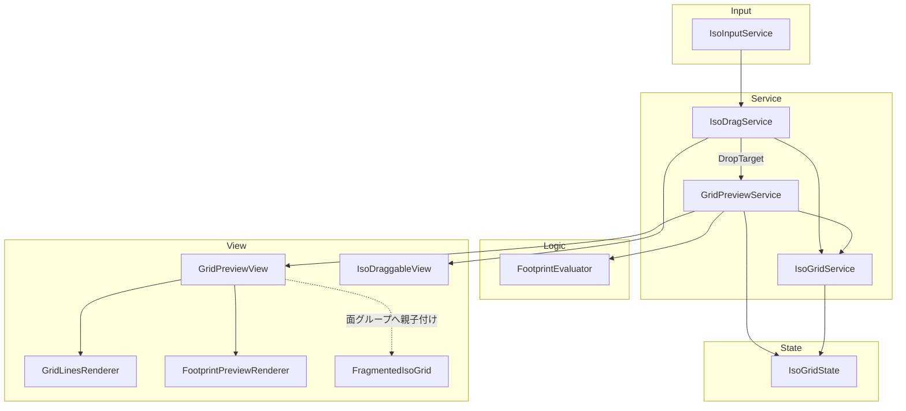
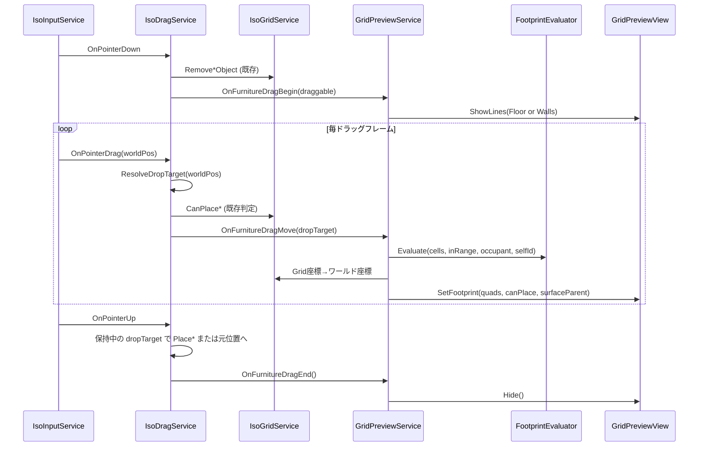
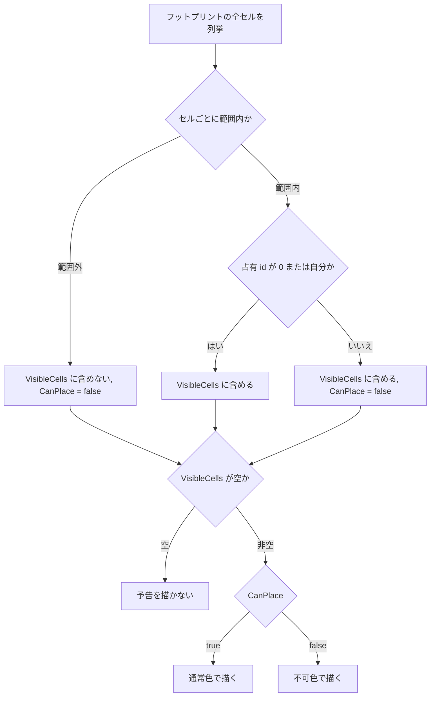

# Design Document: 家具設置時のグリッド線表示

## Overview

**Purpose**: Home シーンの模様替え (Redecorate) で家具をドラッグしている間、配置先グリッドのマス目を線で表示し、離した場合に占めるマスを面で予告する。予告は配置可否で色を変える。

**Users**: プレイヤーが家具の位置決めに使う。開発者は Inspector で色・太さ・描画順を調整する。

**Impact**: `IsoDragService` に「落下先の解決」を一本化する小さなリファクタが入る。`FragmentedIsoGrid` に面 `SortingGroup` が追加され、家具上家具の描画順が「常に親より手前」に固定される。セーブデータ・`IsoGridState` は変更しない。

### Goals
- ドラッグ中だけ、対象面 (床 / 壁) のグリッド線を実機で表示する
- 離した時の配置結果と可否を、ドラッグ中の予告面で正確に示す
- 予告の可否判定を実配置の判定と構造的に一致させる
- 描画は入力・セーブデータ・既存の配置ロジックに干渉しない

### Non-Goals
- 家具上グリッド (`FragmentedIsoGrid`) 上のグリッド線表示 (要件 2.3 は床線のみ)
- ドラッグ中のスナップ挙動の変更 (家具は従来どおり自由追従し、離した時にスナップ)
- グリッド線の常時表示、Redecorate モード全体での表示
- `IsoGridGizmo` の置き換え (Editor 用 Gizmo は残す)
- 画面ピクセル固定の線幅 (線幅はワールド単位)

## Requirements Traceability

| Requirement | Summary | Components | Interfaces | Flows |
|---|---|---|---|---|
| 1.1 | ドラッグ開始で線表示 | IsoDragService, GridPreviewService, GridPreviewView | `OnFurnitureDragBegin`, `ShowLines` | ドラッグ開始 |
| 1.2 | 終了・キャンセルで非表示 | IsoDragService, GridPreviewService, GridPreviewView | `OnFurnitureDragEnd`, `Hide` | ドラッグ終了 |
| 1.3 | 非ドラッグ時は非表示 | GridPreviewView | 初期状態 `Hide` | — |
| 1.4 | 原点・セルサイズ・角度・幅・高さに一致 | GridPreviewService | `IsoGridService.FloorGridToWorld` / `WallGridToWorld` で頂点生成 | — |
| 1.5 | 実機で表示 | GridPreviewView | `MeshRenderer` + URP 2D マテリアル | — |
| 2.1 | 床家具は床線のみ | GridPreviewService | `ShowLines(GridSurface.Floor)` | ドラッグ開始 |
| 2.2 | 壁家具は壁線のみ | GridPreviewService | `ShowLines(GridSurface.Walls)` | ドラッグ開始 |
| 2.3 | 家具上家具も床線 | GridPreviewService | `IsWallPlacement == false` で床扱い | ドラッグ開始 |
| 3.1 | 背景より手前・家具より奥 | GridPreviewView | `sortingOrder` -10 | — |
| 3.2 | 入力を消費しない | GridPreviewView | Collider を持たない | — |
| 3.3 | 既存の配置挙動を維持 | IsoDragService | `DropTarget` は既存判定の結果をそのまま使う | ドラッグ移動 |
| 4.1 / 4.2 | 色・透明度・太さを Inspector 設定 | GridPreviewView | `[SerializeField]` | — |
| 4.3 | View 未配置でも動作 | GridPreviewService | `AttachView` の nullable 保持 | — |
| 5.1 | State・セーブデータ非変更 | GridPreviewService | `IsoGridState` を読み取りのみ | — |
| 5.2 | Redecorate 終了で残存しない | IsoInputService (既存), GridPreviewService | 既存の `OnPointerUp` 強制発行 → `OnFurnitureDragEnd` | ドラッグ終了 |
| 6.1 / 6.2 | 予告面の表示と追従 | IsoDragService, GridPreviewService, FootprintEvaluator, GridPreviewView | `OnFurnitureDragMove(DropTarget)`, `SetFootprint` | ドラッグ移動 |
| 6.3 / 6.4 | 可否で色分け | FootprintEvaluator, GridPreviewView | `FootprintEvaluation.CanPlace` | ドラッグ移動 |
| 6.5 / 6.6 | 範囲外セルは描かない | FootprintEvaluator | `FootprintEvaluation.VisibleCells` | ドラッグ移動 |
| 6.7 | 家具上グリッドに予告 | IsoDragService, GridPreviewView, FragmentedIsoGrid | `DropTarget.Grid`, 面 `SortingGroup` | ドラッグ移動 |
| 6.8 | 壁グリッドに予告 | IsoDragService, GridPreviewService | `DropTarget.Side` | ドラッグ移動 |
| 6.9 | 終了で予告非表示 | GridPreviewService | `Hide` | ドラッグ終了 |
| 6.10 | 実配置と同一判定 | IsoDragService | `ResolveDropTarget` を予告と配置で共用 | ドラッグ移動・終了 |
| 6.11 | 可否色を Inspector 設定 | GridPreviewView | `[SerializeField]` | — |
| 6.12 | 線・家具より手前 | GridPreviewView | `sortingOrder` 100 / 面グループ内 32000 | — |

## Architecture

### Existing Architecture Analysis
- ドラッグは `IsoInputService` (入力) → `IsoDragService` (ライフサイクル) → `IsoGridService` (座標変換・可否判定) → `IsoGridState` の一方向で成立している
- ドラッグ付随機能は「Service に `OnFurnitureDragMove` / `OnFurnitureDragEnd` を生やし `IsoDragService` から呼ぶ」型が `RedecorateCameraService`、`FurnitureStowService` で確立済み。本機能も同型で接続する
- 現行の `IsoDragService` は、ドラッグ中 (`UpdateDragSortingOrder`) と離した時 (`EndFloorDrag`) で同じ Raycast と `CanPlace*` を別々に呼んでいる。本機能でこの重複を `ResolveDropTarget` に寄せる
- `IsoInputService` は Redecorate モード離脱時にドラッグ中なら `OnPointerUp` を強制発行するため、要件 5.2 は既存機構で満たされる
- 描画順の実測値は `research.md` 参照: 背景 -47 / -46、床家具 0、家具上家具は親 `SortingGroup` 内で 0 以上

### Architecture Pattern & Boundary Map



**Architecture Integration**:
- Selected pattern: 既存の「ドラッグ付随 Service + 3 フック」パターン。`IsoDragService` が唯一の呼び出し元
- Domain boundaries: `IsoDragService` が「どこに落ちるか」を決め、`GridPreviewService` が「何を塗るか」を決め、`GridPreviewView` が「どう描くか」だけを持つ。`FootprintEvaluator` はセル列挙と可否の純粋計算
- Existing patterns preserved: View → Service → State の依存方向、`autoInjectGameObjects` + `[Inject] Init` による View の自己登録、Logic アセンブリ + EditMode テスト
- New components rationale: `GridPreviewService` (判定結果を描画命令に変換する責務)、`GridPreviewView` (ランタイム描画はプロジェクト初導入で独立させる)、`FootprintEvaluator` (要件 6.4〜6.6 の境界値をテストで固定する)、`DropTarget` (予告と配置が同じ値を見るための値型)
- Steering compliance: `Home.Service` / `Home.View` / `Home.GridPreviewLogic` の名前空間、`/// comment` 形式、`[Inject]` 付与、`#nullable enable`

### Technology Stack

| Layer | Choice / Version | Role in Feature | Notes |
|---|---|---|---|
| Rendering | URP 17.3 2D Renderer、`MeshFilter` + `MeshRenderer` | グリッド線と予告面の手続きメッシュ描画 | マテリアルは `Universal Render Pipeline/2D/Sprite-Unlit-Default` (頂点カラー対応、透過)。プロジェクト初の手続きメッシュ |
| Sorting | `SortingGroup` (UnityEngine.Rendering) | 家具上グリッドの面グループ | `FragmentedIsoGrid.Awake` で `AddComponent`、order 1 |
| DI | VContainer 1.17 | `GridPreviewService` を Scoped 登録、`GridPreviewView` を `autoInjectGameObjects` で自己登録 | 新規依存なし |
| Logic / Test | `Cat.Home.GridPreviewLogic` asmdef (`noEngineReferences: true`) + NUnit EditMode | セル列挙と可否判定 | `Root/AudioLogic` と同じ構成 |

## System Flows

### ドラッグ開始 → 移動 → 終了



**Key decisions**:
- `ResolveDropTarget` はドラッグ中と離した時で同じメソッドを使う。離した時は保持中の値を再利用するか、同じメソッドを最終位置で呼ぶかのどちらでもよいが、別ロジックを書いてはならない
- 壁ドラッグの `WallSide` 反転 (`x < 0`) は `ResolveDropTarget` より前に走る。既存順序を維持する
- Redecorate 離脱によるキャンセルは `IsoInputService` の `OnPointerUp` 強制発行を経由するため、`IsoDragService` 側に特別な分岐は不要

### 予告面の可否判定



## Components and Interfaces

| Component | Domain/Layer | Intent | Req Coverage | Key Dependencies (P0/P1) | Contracts |
|---|---|---|---|---|---|
| DropTarget | Home.Service (値型) | 落下先の面・位置・可否を 1 つの値で表す | 6.7, 6.8, 6.10 | — | State |
| IsoDragService (変更) | Home.Service | 落下先を毎フレーム解決し、予告と配置に同じ値を渡す | 1.1, 1.2, 3.3, 6.2, 6.10 | IsoGridService (P0), GridPreviewService (P1) | Service |
| GridPreviewService | Home.Service | `DropTarget` を描画命令に変換する | 1.4, 2.1〜2.3, 4.3, 5.1, 6.1〜6.9 | IsoGridService (P0), IsoGridState (P0), FootprintEvaluator (P0), GridPreviewView (P1) | Service |
| FootprintEvaluator | Home.GridPreviewLogic | セル列挙と可否・可視セルの純粋計算 | 6.3〜6.6 | — | Service |
| GridPreviewView | Home.View | 線と予告面の描画、Inspector 設定 | 1.3, 1.5, 3.1, 3.2, 4.1, 4.2, 6.11, 6.12 | GridPreviewService (P0) | Service |
| FragmentedIsoGrid (変更) | Home.View | 面 `SortingGroup` を提供 | 6.7, 6.12 | — | — |
| HomeScope (変更) | Home.Scope | `GridPreviewService` 登録、`GridPreviewView` を autoInject | — | — | — |

### Service 層

#### DropTarget

| Field | Detail |
|---|---|
| Intent | ドラッグ中の家具が「今離したらどこに置かれ、置けるか」を表す不変値 |
| Requirements | 6.7, 6.8, 6.10 |

**Responsibilities & Constraints**
- `IsoDragService` だけが生成する。`GridPreviewService` は読むだけ
- `Surface` が `Fragmented` のときのみ `Grid` が非 null

**Contracts**: State [x]

##### State Management
```csharp
public enum DropSurface { Floor, Wall, Fragmented }

public readonly struct DropTarget
{
    public DropSurface Surface { get; }
    public WallSide Side { get; }                 // Surface == Wall のとき有効
    public FragmentedIsoGrid? Grid { get; }       // Surface == Fragmented のとき非 null
    public Vector2Int FootprintStart { get; }     // 各面のグリッド座標系
    public bool CanPlace { get; }                 // IsoGridService.CanPlace* の結果
}
```
- Invariants: `CanPlace` は `Surface` に対応する `CanPlace*` を `selfUserFurnitureId` 付きで呼んだ結果と一致する

#### IsoDragService (変更)

| Field | Detail |
|---|---|
| Intent | 落下先解決を一本化し、予告 Service へ 3 フックで通知する |
| Requirements | 1.1, 1.2, 3.3, 6.2, 6.10 |

**Responsibilities & Constraints**
- 新設 `ResolveDropTarget(Vector3 worldPos): DropTarget` が、現行 `UpdateDragSortingOrder` の Raycast + `CanPlaceFragmentedObject` と `EndFloorDrag` の床判定、`EndWallDrag` の壁判定を吸収する
- 解決順序は既存どおり: 家具上グリッド (Raycast ヒットかつ配置可) → 床。壁家具は壁のみ
- `EndFloorDrag` / `EndWallDrag` は `ResolveDropTarget` の結果で `Place*` するか、`CanPlace == false` なら元位置に戻す (既存挙動)
- `UpdateDragSortingOrder` の再親子付けと `SortingOrder` 更新は `DropTarget` を入力にして残す

**Dependencies**
- Outbound: `GridPreviewService` — `OnFurnitureDragBegin` / `OnFurnitureDragMove` / `OnFurnitureDragEnd` (P1)
- Outbound: `IsoGridService` — 座標変換・可否判定 (P0)

**Contracts**: Service [x]

##### Service Interface
```csharp
// 既存の public API は変更しない。内部メソッドの契約のみ定める
DropTarget ResolveDropTarget(Vector3 worldPos);
```
- Preconditions: `_currentIsoDraggableView != null`。壁家具は `WallSide` の反転処理を済ませてから呼ぶ
- Postconditions: 返り値は副作用を持たない (State を変更しない)
- Invariants: 同じ `worldPos` と State に対して、予告と配置で同じ `DropTarget` が得られる

**Implementation Notes**
- Integration: `HandlePointerDrag` の末尾で `ResolveDropTarget` → `_currentDropTarget` に保持 → `GridPreviewService.OnFurnitureDragMove(_currentDropTarget)`。`HandlePointerUp` は `OnFurnitureDragEnd` を `_currentIsoDraggableView == null` の早期 return より前に呼ぶ (`FurnitureStowService` と同じ位置)
- Validation: 既存の床・壁・家具上の配置と復帰がすべて従来どおり動くこと (3.3)。しまう (Stow) 経路でも `OnFurnitureDragEnd` が呼ばれること
- Risks: リファクタ範囲が `IsoDragService` の中心部に及ぶ。変更後に Editor で床 / 壁 / 家具上 / 範囲外 / 占有済み / しまうの 6 経路を手動確認する

#### GridPreviewService

| Field | Detail |
|---|---|
| Intent | `DropTarget` から線の表示面と予告面の四角形・色を決め、View に渡す |
| Requirements | 1.4, 2.1, 2.2, 2.3, 4.3, 5.1, 6.1, 6.3〜6.9 |

**Responsibilities & Constraints**
- `IsoGridState` / `IsoGridService` は読み取りのみ (5.1)
- View が未登録なら何もしない (4.3)。初回のみ `Debug.LogWarning`
- 線の頂点列は面ごとに初回だけ生成し、以後は表示切替だけ行う

**Dependencies**
- Inbound: `IsoDragService` — 3 フック (P0)
- Inbound: `GridPreviewView` — `AttachView` による自己登録 (P1)
- Outbound: `IsoGridService` — `FloorGridToWorld` / `WallGridToWorld` / `IsValidFloorPosition` / `GetFloorUserFurnitureId` / `IsValidWallPosition` / `GetWallUserFurnitureId` (P0)
- Outbound: `IsoGridState` — `FragmentedGrids[parentId].Cells` / `Size` (P0)
- Outbound: `FootprintEvaluator` (P0)
- Outbound: `GridPreviewView` (P1, nullable)

**Contracts**: Service [x]

##### Service Interface
```csharp
public sealed class GridPreviewService
{
    public void AttachView(GridPreviewView view);
    public void OnFurnitureDragBegin(IsoDraggableView draggable);
    public void OnFurnitureDragMove(in DropTarget target);
    public void OnFurnitureDragEnd();
}
```
- Preconditions: `OnFurnitureDragMove` は `OnFurnitureDragBegin` の後にのみ呼ばれる
- Postconditions:
  - `OnFurnitureDragBegin`: 壁家具なら `ShowLines(GridSurface.Walls)`、それ以外は `ShowLines(GridSurface.Floor)`
  - `OnFurnitureDragMove`: `FootprintEvaluator.Evaluate` の結果が可視セル 0 なら `ClearFootprint`、それ以外は `SetFootprint(quads, canPlace, parent)`。`parent` は `Surface == Fragmented` のとき `target.Grid.transform`、それ以外は null
  - `OnFurnitureDragEnd`: `Hide` (線・予告とも非表示、予告の親子付け解除)
- Invariants: `SetFootprint` に渡す `canPlace` は `FootprintEvaluation.CanPlace` であり、`DropTarget.CanPlace` と一致する (両者は同じセル集合・同じ占有情報から導かれる)

**Implementation Notes**
- Integration: `HomeScope` に `builder.Register<GridPreviewService>(Lifetime.Scoped)`。`IsoDragService` のコンストラクタ引数に追加
- Validation: セルの世界座標は `FloorGridToWorld(cell)`, `(cell + (1,0))`, `(cell + (1,1))`, `(cell + (0,1))` の 4 点。壁は `WallGridToWorld(side, ...)`、家具上は `grid.LocalGridToWorld(...)`。`IsoGridGizmo` と同じ格子になることを Editor で重ねて確認する
- Risks: 家具上グリッドの占有情報は `IsoGridState.FragmentedGrids` を親家具 id で引く。`DropTarget.Grid.GetParentUserFurnitureId()` で解決する

### Logic 層

#### FootprintEvaluator

| Field | Detail |
|---|---|
| Intent | フットプリントのセル列挙と、可否・可視セルの純粋計算 |
| Requirements | 6.3, 6.4, 6.5, 6.6 |

**Responsibilities & Constraints**
- `UnityEngine` 非依存 (`Cat.Home.GridPreviewLogic` asmdef、`noEngineReferences: true`)
- 範囲判定と占有取得は呼び出し側が関数で渡す。面の種別を知らない

**Contracts**: Service [x]

##### Service Interface
```csharp
namespace Home.GridPreviewLogic
{
    public readonly record struct GridCell(int X, int Y);

    public readonly struct FootprintEvaluation
    {
        public bool CanPlace { get; }
        public IReadOnlyList<GridCell> VisibleCells { get; }   // 範囲内セルのみ
    }

    public static class FootprintEvaluator
    {
        public static FootprintEvaluation Evaluate(
            GridCell footprintStart,
            GridCell footprintSize,
            int selfUserFurnitureId,
            Func<GridCell, bool> isInRange,
            Func<GridCell, int> occupantIdOf);
    }
}
```
- Preconditions: `footprintSize.X >= 1 && footprintSize.Y >= 1`
- Postconditions:
  - `CanPlace == true` ⇔ 全セルが範囲内かつ占有 id が 0 または `selfUserFurnitureId`
  - `VisibleCells` は範囲内セルのみ、列挙順は x 外側 / y 内側 (既存 `CanPlace*` と同順)
  - 全セル範囲外なら `VisibleCells.Count == 0` かつ `CanPlace == false`
- Invariants: 入力に副作用を与えない。アロケーションは `VisibleCells` の 1 リストのみ

**Implementation Notes**
- Validation: EditMode テストで 5 ケース (全部可 / 占有あり / 部分範囲外 / 全域外 / 自分の id は占有扱いしない)。各テストに日本語 `[Description]`
- Risks: なし

### View 層

#### GridPreviewView

| Field | Detail |
|---|---|
| Intent | 線と予告面の手続きメッシュ描画。Inspector 設定の保持 |
| Requirements | 1.3, 1.5, 3.1, 3.2, 4.1, 4.2, 6.11, 6.12 |

**Responsibilities & Constraints**
- 判断ロジックを持たない。Service から受け取った四角形と色を描くだけ
- Collider を持たない (3.2)
- `Awake` で `Hide` 相当の初期状態にする (1.3)
- 子に 2 つの描画オブジェクトを持つ:
  - `GridLinesRenderer` — 床 / 左壁 / 右壁の 3 メッシュをキャッシュ。`sortingOrder = -10` (Inspector 変更可)
  - `FootprintPreviewRenderer` — 毎フレーム再構築。床・壁では `sortingOrder = 100`、家具上では `target.Grid.transform` の子に付け替えて `sortingOrder = 32000` (面グループ内、子家具の最大 order より上)

**Dependencies**
- Outbound: `GridPreviewService` — `[Inject] Init` で `AttachView(this)` (P0)
- External: `Universal Render Pipeline/2D/Sprite-Unlit-Default` マテリアル (P0、Inspector 参照)

**Contracts**: Service [x]

##### Service Interface
```csharp
public enum GridSurface { Floor, Walls }

public sealed class GridPreviewView : MonoBehaviour
{
    [Inject] public void Init(GridPreviewService service);

    // 面ごとの線分列 (ワールド座標の始点・終点ペア) を初回だけ受け取る
    public void SetLines(GridSurface surface, IReadOnlyList<(Vector3 Start, Vector3 End)> segments);
    public void ShowLines(GridSurface surface);

    // 各四角形はワールド座標 4 頂点。parent が非 null なら子に付け替えて面グループ内で描く
    public void SetFootprint(IReadOnlyList<Vector3> quadCorners, bool canPlace, Transform? parent);
    public void ClearFootprint();

    public void Hide();
}
```
- Preconditions: `SetLines` は `ShowLines` の前に同じ `surface` で呼ばれている
- Postconditions: `Hide` 後は両 renderer が非表示で、予告 renderer は View 自身の子に戻っている
- Invariants: メッシュ更新のたびに `RecalculateBounds` を呼ぶ。マテリアルのインスタンス化をしない

**Inspector 設定**
| 項目 | 型 | 既定 |
|---|---|---|
| 線色 (透明度含む) | `Color` | 白 α0.35 |
| 線幅 (ワールド単位) | `float` | 0.02 |
| 線 `sortingOrder` | `int` | -10 |
| 予告 通常色 | `Color` | 白 α0.25 |
| 予告 不可色 | `Color` | 赤 α0.35 |
| 予告 `sortingOrder` (床・壁) | `int` | 100 |
| 予告 `sortingOrder` (面グループ内) | `int` | 32000 |
| マテリアル | `Material` | `Sprite-Unlit-Default` |

**Implementation Notes**
- Integration: シーンの `IsoGridSettingsView` と同階層に `GridPreview` GameObject を置き、`HomeScope.autoInjectGameObjects` に追加。子 2 つは `MeshFilter` + `MeshRenderer` のみ
- Validation: 線は始点・終点と幅から 4 頂点の細長い四角形に展開する。頂点・色・インデックスは事前確保したリストを再利用し、`Mesh.MarkDynamic` を予告メッシュに付ける。家具上への付け替えは `SetParent(parent, worldPositionStays: false)` の後に localPosition を 0 に戻し、頂点は `parent.InverseTransformPoint` でローカル化する
- Risks: `Sprite-Unlit-Default` の実機描画、`MeshRenderer` の bounds によるカリング。いずれも実機確認をタスク化

#### FragmentedIsoGrid (変更)

| Field | Detail |
|---|---|
| Intent | 面 `SortingGroup` (order 1) を提供し、子家具 (0 以上) と予告 (32000) を親スプライト (0) より手前で並べる |
| Requirements | 6.7, 6.12 |

**Implementation Notes**
- Integration: `Awake` で `GetComponent<SortingGroup>()` が null なら `AddComponent` し `sortingOrder = 1`、`sortAtRoot = false`。プレハブは編集しない
- Validation: 既存の家具上家具 (Bed 上など) の描画が変わらないことを Editor と実機で目視確認。`CalculateFragmentedSortingOrder` は変更しない
- Risks: 家具上家具が「常に親スプライトより手前」に固定される。想定どおりだが、親の一部 (ヘッドボード等) より奥に見せたいケースがあれば個別対応が必要

## Data Models

### Domain Model
- 永続データ・`IsoGridState` に変更なし (5.1)
- 新規の値型は `DropTarget` (Service 層、不変) と `FootprintEvaluation` / `GridCell` (Logic 層、不変) のみ。いずれもフレーム内で生成・消費され、保持されない

## Error Handling

### Error Strategy
- **View 未登録** (4.3): `GridPreviewService` は各フックで `_view == null` を確認してスキップ。初回のみ `Debug.LogWarning("[GridPreviewService] GridPreviewView is not attached")`
- **マテリアル未設定**: `GridPreviewView.Awake` で `Debug.LogError("[GridPreviewView] ...")` を出し、`enabled = false` にして描画をスキップ。ドラッグは継続する
- **`DropTarget.Surface == Fragmented` かつ `Grid == null`**: 契約違反。`Debug.LogError` の上で予告を消す。例外は投げない (ドラッグを止めない)
- **`IsoGridState.FragmentedGrids` に親 id が無い**: 家具上グリッドが未登録。`CanPlace = false` として不可色で描く (実配置も同様に失敗する)

### Monitoring
- ログは `[ClassName]` プレフィックス (tech.md)。ドラッグ毎フレームでのログ出力は禁止

## Testing Strategy

### Unit Tests (EditMode, `Cat.Home.GridPreviewLogic.Tests`)
- 全セル範囲内・未占有 → `CanPlace = true`、`VisibleCells` = 全セル
- 1 セルが他家具に占有 → `CanPlace = false`、`VisibleCells` = 全セル
- 一部セルが範囲外 → `CanPlace = false`、`VisibleCells` = 範囲内セルのみ
- 全セル範囲外 → `CanPlace = false`、`VisibleCells` 空
- 占有 id が自分の id → 占有扱いしない (`CanPlace = true`)

### Integration (Editor 手動)
- 床家具ドラッグ: 床線が出る / 壁線が出ない / 予告が追従する / 離すと線と予告が消える
- 壁家具ドラッグ: 左右の壁線が出る / 左右の壁をまたぐと予告が追従する
- 家具上ドラッグ: Bed 上で予告が親スプライト・ドラッグ中家具の手前に出る
- 占有済み・範囲外へドラッグ: 予告が赤 / はみ出し分は描かれない / 離すと元位置に戻る
- しまう (Stow) 経路とドラッグ中の Redecorate 離脱: 予告が残らない
- `GridPreview` GameObject を無効化した状態: 警告 1 回のみでドラッグは従来どおり

### Device (実機)
- Android / iOS で線と予告が透過描画されること
- ドラッグ中のフレームレートが従来と体感差ないこと

## Performance & Scalability
- 線メッシュ: 床 (33+33 本) + 左壁 (33+11 本) + 右壁 (33+11 本) をそれぞれ 1 メッシュ、初回生成のみ
- 予告メッシュ: 最大でも家具のフットプリント分 (十数枚の四角形)。毎ドラッグフレーム再構築、事前確保バッファ再利用、`MarkDynamic`
- draw call 増加は最大 2 (線 1 + 予告 1)
