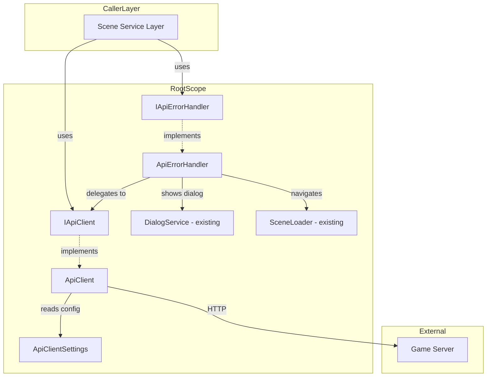
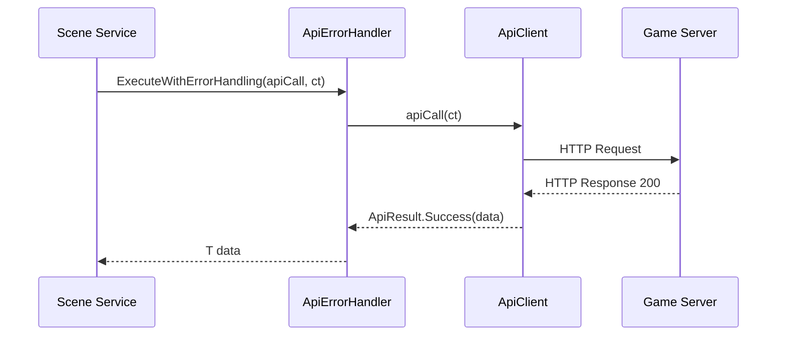
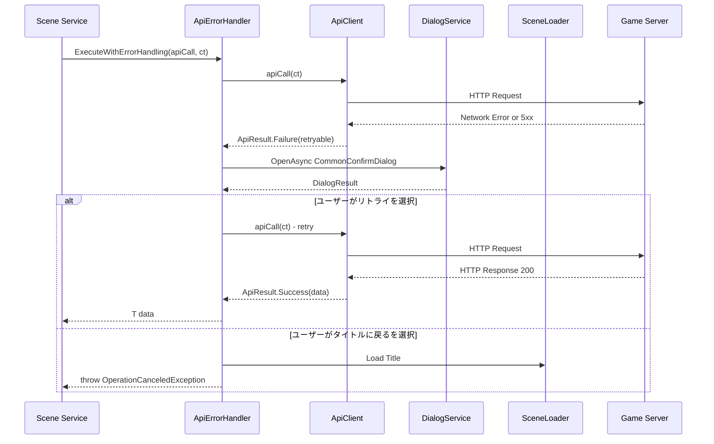
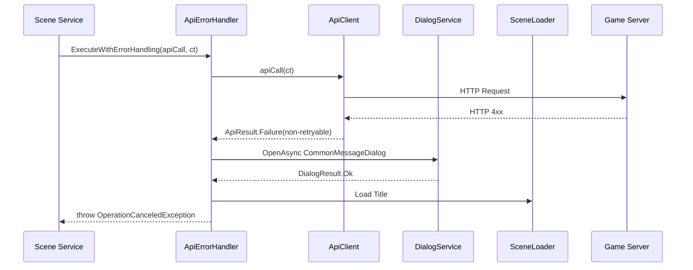
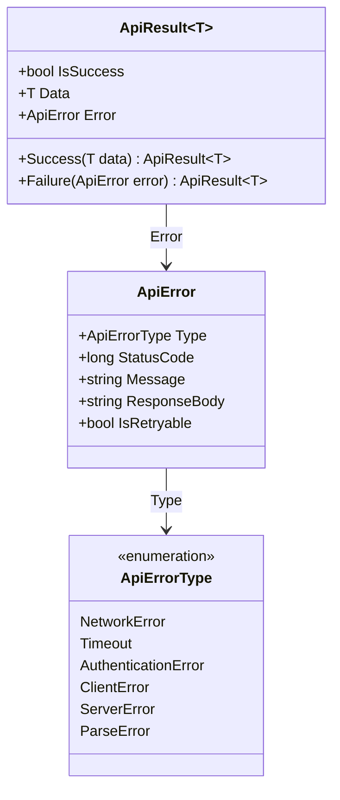

# Design Document: game-server-api-client

## Overview
**Purpose**: 専用ゲームサーバとのHTTP(S)通信を統一的に管理するAPIクライアント基盤を提供する。

**Users**: 各シーンのService層および将来的なAPIメソッド層が、本APIクライアントを通じてサーバと通信する。

**Impact**: RootScopeに新規サービス（ApiClient、ApiErrorHandler）を追加。既存サービスへの変更はRootScopeへの登録追加のみ。

### Goals
- UnityWebRequest + UniTaskベースの統一的なHTTP通信インターフェースを提供する
- 公開API/認証APIの透過的なBearer token管理
- エラーを構造化された型で分類・返却し、UIとの責務分離を実現する
- エラーハンドリングサービスによるリトライ制御・ダイアログ表示の一元化

### Non-Goals
- 各APIエンドポイントに対応する個別メソッドの定義（別specで対応予定）
- WebSocket/リアルタイム通信
- APIバージョニング
- オフラインキャッシュ/キュー
- レスポンスのメモリキャッシュ

## Architecture

### Architecture Pattern & Boundary Map



**Architecture Integration**:
- **Selected pattern**: Service層への追加。既存のRootScope Singletonパターンに準拠
- **Domain boundaries**: ApiClientはHTTP通信に専念し、UI操作を行わない。ApiErrorHandlerがUIとの橋渡しを担う
- **Existing patterns preserved**: VContainer DI、インターフェース抽象化、CancellationTokenパターン、エラーログフォーマット
- **New components rationale**: ApiClient（HTTP通信の一元管理）、ApiErrorHandler（エラーUI処理の一元管理）、ApiClientSettings（設定の外部化）

### Technology Stack

| Layer | Choice / Version | Role in Feature | Notes |
|-------|------------------|-----------------|-------|
| HTTP通信 | UnityWebRequest（Unity 6 built-in） | HTTP(S)リクエスト送受信 | プラットフォーム互換性が高い |
| 非同期 | UniTask（既存） | async/await + CancellationToken | `.WithCancellation(ct)` パターン |
| JSONシリアライズ | Newtonsoft.Json 3.2.1 | リクエスト/レスポンスのJSON処理 | 直接依存として導入済み |
| DI | VContainer 1.17.0（既存） | RootScope Singleton登録 | 既存パターンに準拠 |
| 計測 | System.Diagnostics.Stopwatch | レスポンスタイム計測 | .NET Standard 2.1 標準 |
| テスト | Unity Test Framework（Unity 6 built-in） | エラー分類・ハンドリングロジックのユニットテスト | Edit Mode Tests |

## System Flows

### 正常リクエストフロー



### エラーハンドリングフロー（リトライ可能エラー）



### エラーハンドリングフロー（リトライ不可エラー）



**Key Decisions**:
- タイトル遷移後は `OperationCanceledException` をスローし、呼び出し元のスタックを巻き戻す
- リトライループはApiErrorHandler内で完結し、呼び出し元にはリトライの存在が隠蔽される

## Requirements Traceability

| Requirement | Summary | Components | Interfaces | Flows |
|-------------|---------|------------|------------|-------|
| 1.1 | HTTP メソッドサポート | ApiClient | IApiClient | 正常リクエスト |
| 1.2 | UniTask非同期 | ApiClient | IApiClient | 全フロー |
| 1.3 | JSONシリアライズ | ApiClient | — | 正常リクエスト |
| 1.4 | 共通ヘッダー自動付与 | ApiClient | — | 正常リクエスト |
| 1.5 | CancellationToken | ApiClient | IApiClient | 全フロー |
| 2.1 | 公開APIサポート | ApiClient | IApiClient | 正常リクエスト |
| 2.2 | Bearer token自動付与 | ApiClient | IApiClient | 正常リクエスト |
| 2.3 | トークン設定 | ApiClient | IApiClient | — |
| 2.4 | トークンクリア | ApiClient | IApiClient | — |
| 3.1 | 構造化された結果型 | ApiResult, ApiError | — | 全フロー |
| 3.2 | エラー種別分類 | ApiError, ApiErrorType | — | エラーフロー |
| 3.3 | HTTPエラー情報 | ApiError | — | エラーフロー |
| 3.4 | リトライ可否判定 | ApiError | — | エラーフロー |
| 3.5 | エラーログ出力 | ApiClient | — | エラーフロー |
| 3.6 | UI操作禁止 | ApiClient | — | — |
| 4.1 | デリゲート実行メソッド | ApiErrorHandler | IApiErrorHandler | 全エラーフロー |
| 4.2 | 成功時の結果返却 | ApiErrorHandler | IApiErrorHandler | 正常リクエスト |
| 4.3 | リトライ不可エラー処理 | ApiErrorHandler | IApiErrorHandler | リトライ不可フロー |
| 4.4 | リトライ可能エラー処理 | ApiErrorHandler | IApiErrorHandler | リトライ可能フロー |
| 4.5 | リトライ再実行 | ApiErrorHandler | IApiErrorHandler | リトライ可能フロー |
| 4.6 | タイトル遷移 | ApiErrorHandler | IApiErrorHandler | 両エラーフロー |
| 4.7 | RootScope Singleton | ApiErrorHandler | — | — |
| 5.1 | ベースURL設定 | ApiClientSettings | — | — |
| 5.2 | タイムアウト設定 | ApiClientSettings | — | — |
| 6.1 | リクエストログ | ApiClient | — | 正常リクエスト |
| 6.2 | レスポンスログ | ApiClient | — | 正常リクエスト |
| 6.3 | ディレクティブ制御 | ApiClient | — | — |
| 6.4 | ログ無効化 | ApiClient | — | — |
| 7.1 | ApiClientインターフェース | ApiClient | IApiClient | — |
| 7.2 | ApiClient Singleton登録 | RootScope | — | — |
| 7.3 | ErrorHandlerインターフェース | ApiErrorHandler | IApiErrorHandler | — |
| 7.4 | ErrorHandler Singleton登録 | RootScope | — | — |
| 7.5 | 依存方向ルール準拠 | 全コンポーネント | — | — |

## Components and Interfaces

| Component | Domain/Layer | Intent | Req Coverage | Key Dependencies | Contracts |
|-----------|--------------|--------|--------------|------------------|-----------|
| ApiClient | Root/Service | HTTP通信の送受信とエラー分類 | 1, 2, 3, 6 | ApiClientSettings (P0), UnityWebRequest (P0) | Service |
| ApiErrorHandler | Root/Service | エラーUIとリトライ制御の一元化 | 4 | IApiClient (P0), IDialogService (P0), SceneLoader (P0) | Service |
| ApiClientSettings | Root/Service | 接続設定の一元管理 | 5 | なし | State |
| ApiResult | Root/Service | 通信結果の構造化 | 3.1 | なし | — |
| ApiError | Root/Service | エラー情報の構造化 | 3.2, 3.3, 3.4 | なし | — |
| ApiErrorType | Root/Service | エラー種別の列挙 | 3.2 | なし | — |

### Root / Service Layer

#### ApiClient

| Field | Detail |
|-------|--------|
| Intent | UnityWebRequestを用いたHTTP通信の送受信、JSON処理、エラー分類、ログ出力 |
| Requirements | 1.1-1.5, 2.1-2.4, 3.1-3.6, 6.1-6.4 |

**Responsibilities & Constraints**
- GET/POST/PUT/DELETE の各HTTPメソッドを提供
- Bearer tokenの保持と自動付与（認証付きリクエストのみ）
- UnityWebRequestExceptionをキャッチしApiResult<T>に変換
- ダイアログ表示やシーン遷移を行わない（3.6）
- `#if !PRODUCTION` ディレクティブでログ出力を制御

**Dependencies**
- Inbound: ApiErrorHandler — ExecuteWithErrorHandling内でデリゲートとして呼び出される (P0)
- Inbound: Scene Service層 — 直接利用も可能 (P1)
- External: UnityWebRequest — HTTP通信 (P0)
- External: Newtonsoft.Json — JSONシリアライズ/デシリアライズ (P0)
- Outbound: ApiClientSettings — ベースURL、タイムアウト取得 (P0)

**Contracts**: Service [x]

##### Service Interface

```csharp
public interface IApiClient
{
    void SetBearerToken(string token);
    void ClearBearerToken();

    UniTask<ApiResult<TResponse>> GetAsync<TResponse>(
        string path, CancellationToken cancellationToken);

    UniTask<ApiResult<TResponse>> PostAsync<TResponse>(
        string path, object body, CancellationToken cancellationToken);

    UniTask<ApiResult<TResponse>> PutAsync<TResponse>(
        string path, object body, CancellationToken cancellationToken);

    UniTask<ApiResult<TResponse>> DeleteAsync<TResponse>(
        string path, CancellationToken cancellationToken);
}
```

- Preconditions: ApiClientSettingsが注入済みであること
- Postconditions: 成功時はApiResult.Successにデシリアライズ済みデータを格納。失敗時はApiResult.FailureにApiErrorを格納。OperationCanceledExceptionはResult型に包まず伝播
- Invariants: Bearer tokenが未設定の場合、Authorizationヘッダーを付与しない

**Implementation Notes**
- Integration: `request.SendWebRequest().WithCancellation(cancellationToken)` でUniTask統合
- Integration: `System.Diagnostics.Stopwatch` でレスポンスタイム計測（ログ出力ディレクティブ内に配置）
- Integration: タイムアウトは UniTask `.Timeout(TimeSpan)` で設定。`TimeoutException` をキャッチして `ApiErrorType.Timeout` に分類。catch内で `request.Abort()` を呼び出してリクエストを中断する
- Validation: レスポンスのJSON デシリアライズ失敗時は `ApiErrorType.ParseError` として返却

---

#### ApiErrorHandler

| Field | Detail |
|-------|--------|
| Intent | API通信エラーに対する共通UI処理（ダイアログ表示）とリトライ制御 |
| Requirements | 4.1-4.7 |

**Responsibilities & Constraints**
- API呼び出しデリゲートの実行・エラー判定・リトライループを内包
- リトライ可能エラー: CommonConfirmDialog（リトライ/タイトル選択）を表示
- リトライ不可エラー: CommonMessageDialog（エラー通知）を表示後、タイトル画面に遷移
- タイトル遷移後は OperationCanceledException をスローして呼び出し元のスタックを巻き戻す

**Dependencies**
- Inbound: Scene Service層 — ExecuteWithErrorHandlingを呼び出す (P0)
- Outbound: IDialogService — ダイアログ表示 (P0)
- Outbound: SceneLoader — タイトル画面遷移 (P0)

**Contracts**: Service [x]

##### Service Interface

```csharp
public interface IApiErrorHandler
{
    UniTask<T> ExecuteWithErrorHandling<T>(
        Func<CancellationToken, UniTask<ApiResult<T>>> apiCall,
        CancellationToken cancellationToken);
}
```

- Preconditions: apiCallデリゲートがnullでないこと
- Postconditions: 成功時はTを返却。リトライ不可エラーまたはユーザーがタイトル選択時はOperationCanceledExceptionをスロー
- Invariants: リトライループはユーザーが「リトライ」を選択し続ける限り継続する

**Implementation Notes**
- Integration: `CommonConfirmDialogArgs("通信エラー", message, "リトライ", "タイトルに戻る")` でリトライ選択ダイアログ
- Integration: `CommonMessageDialogArgs("エラー", message)` でエラー通知ダイアログ
- Integration: `SceneLoader.Load(Const.SceneName.Title)` でタイトル遷移（定数名は実装時に確認）

---

#### ApiClientSettings

| Field | Detail |
|-------|--------|
| Intent | APIクライアントの接続設定を保持 |
| Requirements | 5.1-5.2 |

**Responsibilities & Constraints**
- ベースURLとタイムアウト時間を保持
- VContainer経由で注入される

**Contracts**: State [x]

##### State Management

```csharp
public class ApiClientSettings
{
#if PRODUCTION
    public const string BaseUrl = "https://api.example.com";
#else
    public const string BaseUrl = "http://localhost:8080";
#endif
    public const int TimeoutSeconds = 10;
}
```

- Persistence: コンパイルディレクティブで環境ごとに切り替え。ランタイム変更は想定しない
- Concurrency: 定数のみ。スレッドセーフ

## Data Models

### Domain Model



**ApiResult<T>**: 通信結果を表すジェネリック型。成功時は `Data` にデシリアライズ済みオブジェクト、失敗時は `Error` にエラー情報を格納する。

**ApiError**: エラーの詳細情報。`IsRetryable` プロパティでリトライ可否を判定する。

**ApiErrorType のマッピング**:

| ApiErrorType | 例外/条件 | IsRetryable |
|---|---|---|
| NetworkError | UnityWebRequestException (ConnectionError) | true |
| Timeout | TimeoutException | true |
| AuthenticationError | UnityWebRequestException (ProtocolError, ResponseCode == 401) | false |
| ClientError | UnityWebRequestException (ProtocolError, ResponseCode 400-499, 401除く) | false |
| ServerError | UnityWebRequestException (ProtocolError, ResponseCode 500-599) | true |
| ParseError | JsonException（デシリアライズ失敗） | false |

### Data Contracts & Integration

**APIリクエスト/レスポンスのシリアライズ**:
- フォーマット: JSON（Content-Type: application/json）
- ライブラリ: Newtonsoft.Json（`JsonConvert.SerializeObject` / `DeserializeObject<T>`）
- DTOクラスは `[JsonProperty("snake_case")]` 属性でサーバ側のフィールド名にマッピング

## Error Handling

### Error Strategy
APIクライアントとエラーハンドリングサービスで責務を明確に分離する。

- **ApiClient**: `UnityWebRequestException` をキャッチし、`ApiErrorType` に分類して `ApiResult<T>` として返却。`Debug.LogError` でログ出力
- **ApiErrorHandler**: `ApiResult<T>` のエラー情報に基づき、ダイアログ表示とシーン遷移を制御

### Error Categories and Responses

**リトライ可能エラー（NetworkError, Timeout, ServerError）**: ApiErrorHandler が CommonConfirmDialog でリトライ/タイトル選択を提示

**リトライ不可エラー（AuthenticationError, ClientError, ParseError）**: ApiErrorHandler が CommonMessageDialog でエラー通知後、タイトル画面に遷移

**キャンセル（OperationCanceledException）**: ApiClient/ApiErrorHandler ともにResult型に包まず、そのまま伝播

### Monitoring
- エラーログ: `Debug.LogError($"[ApiClient] {message}")` 形式（既存プロジェクト規約に準拠）
- APIログ（開発時のみ）: `#if !PRODUCTION` ディレクティブで制御。リクエスト（メソッド、エンドポイント、ボディ）とレスポンス（ステータスコード、ボディ、レスポンスタイム）を `Debug.Log` で出力

## Testing Strategy

Unity Test Framework（Edit Mode Tests）を使用し、テスト可能なロジック部分に絞ってユニットテストを実装する。UnityWebRequestの実際のHTTP通信やタイムアウト発火など、モック困難な部分はテスト対象外とする。

### Unit Tests（実装対象）
- ApiResult: Success/Failureの構築とプロパティアクセス
- ApiError: 各ApiErrorTypeに対するIsRetryableの判定（NetworkError/Timeout/ServerError → true、AuthenticationError/ClientError/ParseError → false）
- ApiErrorHandler: リトライ可能エラー → ConfirmDialog → リトライ選択時にデリゲート再実行（IDialogService/SceneLoaderをモック）
- ApiErrorHandler: リトライ不可エラー → MessageDialog → タイトル遷移（IDialogService/SceneLoaderをモック）
- ApiErrorHandler: 成功時に結果をそのまま返却

### テスト対象外
- UnityWebRequestの実際のHTTP通信
- タイムアウトの実際の発火
- ネットワークエラーの再現

## Security Considerations
- Bearer tokenはメモリ上に保持する。永続化はAPIクライアントの責務外（ログイン機能側で管理）
- `#if !PRODUCTION` を本番ビルドで有効化し、リクエスト/レスポンスボディがログに出力されないようにする
- HTTPS通信の強制はサーバ側のURL設定（ApiClientSettings.BaseUrl）に依存する
