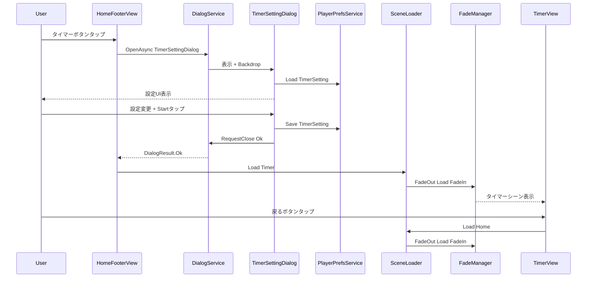
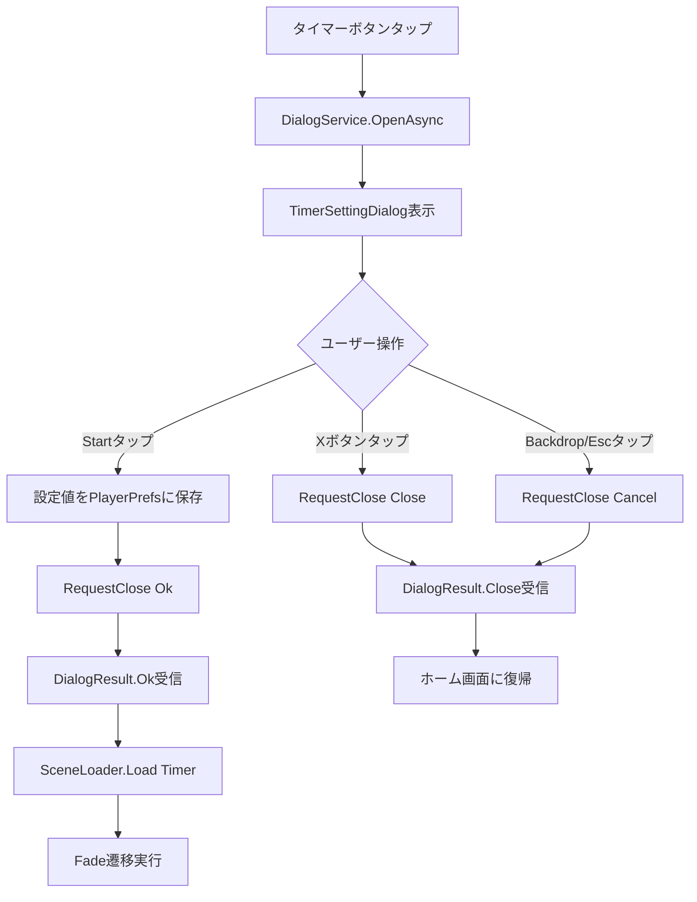
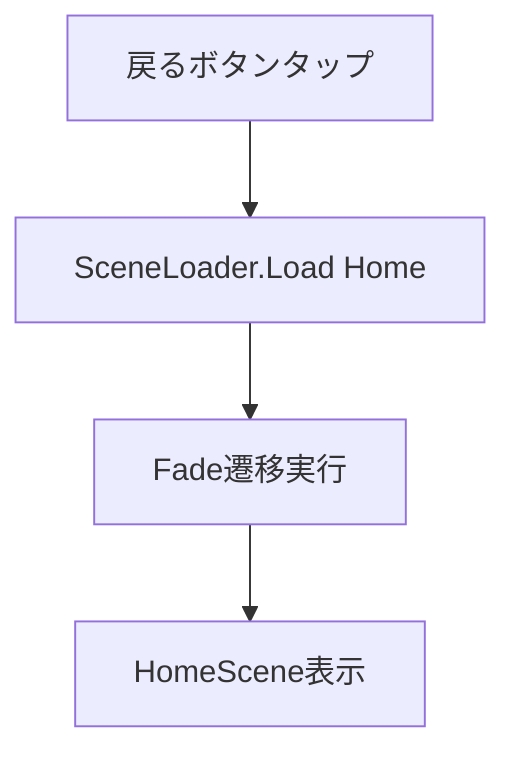
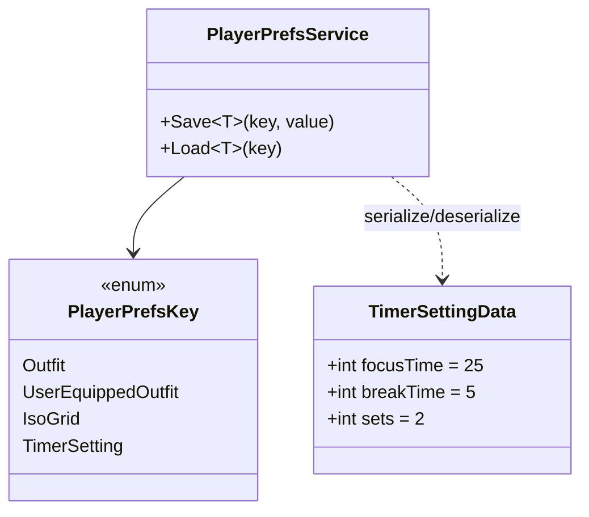

# 技術設計書: ホーム画面からタイマー画面へのシーン遷移

## Overview

**Purpose**: ホーム画面のタイマーボタン押下から、ポモドーロタイマー設定ダイアログの表示、設定値の永続化、タイマーシーンへのフェード遷移、ホームへの復帰までの一連のフローを実現する。

**Users**: アプリユーザーがホーム画面からポモドーロタイマー機能にアクセスし、集中時間・休憩時間・セット回数を設定して利用する。

**Impact**: 既存の`HomeFooterView`のタイマーボタン動作を「直接シーン遷移」から「ダイアログ表示→シーン遷移」に変更する。既存のSceneLoader/FadeService/DialogServiceはそのまま利用。

### Goals
- タイマー設定ダイアログによるポモドーロ設定（集中/休憩/セット回数）の入力と永続化
- フェード演出を伴うHomeシーン⇔Timerシーンの双方向遷移
- 既存のダイアログシステム・シーン遷移システムのパターンに従った実装

### Non-Goals
- ポモドーロタイマーのカウントダウン・通知ロジック（タイマー機能本体は別仕様）
- タイマー設定のクラウド同期
- タイマー画面の詳細なUI設計（戻るボタン以外）

## Architecture

### Existing Architecture Analysis

**維持するパターン**:
- **SceneLoader → FadeManager → FadeService**: フェード遷移の実行フロー（変更なし）
- **DialogService.OpenAsync<TDialog, TArgs>()**: Addressablesベースのダイアログ表示（変更なし）
- **BaseDialogView<TArgs>**: ダイアログ基底クラスの継承パターン（変更なし）
- **PlayerPrefsService**: JSON永続化パターン（PlayerPrefsKey enumの拡張のみ）
- **VContainer DI**: RootScope（Singleton）+ SceneScope（Scoped）の階層構造（変更なし）

**変更が必要な既存コンポーネント**:
- `HomeFooterView`: `IDialogService`注入の追加、タイマーボタンのasyncハンドラ化
- `PlayerPrefsService`: `PlayerPrefsKey`に`TimerSetting`を追加
- `TimerScope`: 必要なコンポーネントのDI登録

### Architecture Pattern & Boundary Map



**Architecture Integration**:
- **Selected pattern**: 既存のシーンベース + DI + ダイアログシステムの拡張
- **Domain boundaries**: ダイアログView → TimerSetting/View、設定データ → TimerSetting/State、タイマーシーンUI → Timer/View
- **Existing patterns preserved**: BaseDialogView継承、PlayerPrefsService永続化、SceneLoader遷移
- **New components rationale**: タイマー設定ダイアログ（UI）、設定データクラス（永続化）、タイマーシーンView（戻るボタン）

### Technology Stack

| Layer | Choice / Version | Role in Feature | Notes |
|-------|------------------|-----------------|-------|
| UI | Unity UGUI + TMP | ダイアログUI、タイマーシーンUI | 既存パターン準拠 |
| DI | VContainer 1.17.0 | コンポーネント注入 | RootScope/SceneScope既存 |
| Async | UniTask | ダイアログのasync/await | CancellationToken対応 |
| Asset | Addressables 2.7.6 | ダイアログPrefabロード | `Dialogs/`パス規約 |
| Persistence | PlayerPrefs + JsonUtility | 設定値の永続化 | 既存PlayerPrefsService |

## System Flows

### タイマーボタンタップ → ダイアログ表示 → シーン遷移フロー



### タイマーシーン → ホーム復帰フロー



## Requirements Traceability

| Requirement | Summary | Components | Interfaces | Flows |
|-------------|---------|------------|------------|-------|
| 1.1 | タイマーボタン→ダイアログ表示 | HomeFooterView, TimerSettingDialog | IDialogService.OpenAsync | タイマーボタンフロー |
| 1.2 | Backdrop表示 | BackdropView | DialogContainer.UpdateBackdrop | ダイアログ表示フロー |
| 1.3 | ×ボタン表示 | TimerSettingDialog | BaseDialogView._closeButton | — |
| 1.4 | ×ボタンで閉じる | TimerSettingDialog | BaseDialogView.RequestClose | ダイアログ閉じフロー |
| 2.1 | 集中時間設定（デフォルト25分、1〜60分） | TimerSettingDialog, TimerSettingData | — | — |
| 2.2 | 休憩時間設定（デフォルト5分、1〜60分） | TimerSettingDialog, TimerSettingData | — | — |
| 2.3 | セット回数設定（デフォルト2回、1〜10回） | TimerSettingDialog, TimerSettingData | — | — |
| 2.4 | Startボタン表示 | TimerSettingDialog | — | — |
| 2.5 | 閉じる時に設定値を永続化 | TimerSettingDialog | PlayerPrefsService.Save | 設定保存フロー |
| 2.6 | 再表示時に設定値を復元 | TimerSettingDialog | PlayerPrefsService.Load | ダイアログ表示フロー |
| 3.1 | Start→ダイアログ閉じる | TimerSettingDialog | RequestClose Ok | Startフロー |
| 3.2 | Start→タイマーシーン遷移 | HomeFooterView | SceneLoader.Load | シーン遷移フロー |
| 3.3 | フェード演出での遷移 | FadeManager, FadeService | — | Fadeフロー（既存） |
| 3.4 | 遷移中のタップ無視 | FadeView | CanvasGroup.blocksRaycasts | Fadeフロー（既存） |
| 4.1 | タイマーUI基本画面 | TimerView | — | — |
| 4.2 | 戻るボタン常時表示 | TimerView | — | — |
| 4.3 | VContainer DI構成 | TimerScope | IContainerBuilder | — |
| 5.1 | 戻るボタン→ホーム遷移 | TimerView | SceneLoader.Load | 復帰フロー |
| 5.2 | ホーム初期状態復帰 | HomeStarter | HomeState | 復帰フロー（既存） |
| 5.3 | 復帰中のタップ無視 | FadeView | CanvasGroup.blocksRaycasts | Fadeフロー（既存） |
| 6.1 | フェードアウト0.5秒 | FadeService | SceneLoader.Load defaults | Fadeフロー（既存） |
| 6.2 | フェードイン0.5秒 | FadeService | SceneLoader.Load defaults | Fadeフロー（既存） |
| 6.3 | Fadeシーンアンロード | FadeService | UnloadFadeScene | Fadeフロー（既存） |
| 7.1 | タイマーロード失敗時の復帰 | FadeManager | try-catch + FadePhase.None | エラーフロー（既存） |
| 7.2 | ホームロード失敗時の復帰 | FadeManager | try-catch + FadePhase.None | エラーフロー（既存） |

## Components and Interfaces

| Component | Domain/Layer | Intent | Req Coverage | Key Dependencies | Contracts |
|-----------|--------------|--------|--------------|-----------------|-----------|
| TimerSettingDialog | TimerSetting/View | タイマー設定ダイアログUI | 1.1-1.4, 2.1-2.6, 3.1 | DialogService (P0), PlayerPrefsService (P0) | State |
| TimerSettingData | TimerSetting/State | 設定値の永続化データ | 2.1-2.3, 2.5-2.6 | — | State |
| HomeFooterView（変更） | Home/View | ダイアログ表示→遷移フロー制御 | 1.1, 3.2 | IDialogService (P0), SceneLoader (P0) | — |
| PlayerPrefsService（変更） | Root/Service | TimerSetting永続化キー追加 | 2.5, 2.6 | — | — |
| TimerView | Timer/View | 戻るボタンUI | 4.1, 4.2, 5.1 | SceneLoader (P0) | — |
| TimerScope（変更） | Timer/Scope | DI登録 | 4.3 | — | — |

### TimerSetting / View

#### TimerSettingDialog

| Field | Detail |
|-------|--------|
| Intent | ポモドーロタイマーの設定UI（集中時間・休憩時間・セット回数）を表示し、設定値の読み書きを行う |
| Requirements | 1.1, 1.2, 1.3, 1.4, 2.1, 2.2, 2.3, 2.4, 2.5, 2.6, 3.1 |

**Responsibilities & Constraints**
- `BaseDialogView`を継承し、Addressablesで`Dialogs/TimerSettingDialog.prefab`として管理
- ×ボタンはBaseDialogViewの`_closeButton`シリアライズフィールドで自動対応
- Startボタン押下時: 設定値を保存→`RequestClose(DialogResult.Ok)`
- ×ボタン押下時: 設定値を保存→`RequestClose(DialogResult.Close)`（BaseDialogView標準動作）
- ダイアログ表示時: PlayerPrefsから設定値をロードし復元

**Dependencies**
- Inbound: `DialogService` — ダイアログの生成・表示 (P0)
- Outbound: `PlayerPrefsService` — 設定値の読み書き (P0)

**Contracts**: State [x]

##### State Management

```csharp
/// ダイアログのSerializeFieldとUI制御
[SerializeField] TMP_Text _focusTimeText;
[SerializeField] TMP_Text _breakTimeText;
[SerializeField] TMP_Text _setsText;
[SerializeField] Button _startButton;
[SerializeField] Button _focusTimeUpButton;
[SerializeField] Button _focusTimeDownButton;
[SerializeField] Button _breakTimeUpButton;
[SerializeField] Button _breakTimeDownButton;
[SerializeField] Button _setsUpButton;
[SerializeField] Button _setsDownButton;

/// 内部状態
int _focusTime;    // 1-60, default 25
int _breakTime;    // 1-60, default 5
int _sets;         // 1-10, default 2
```

- PlayerPrefsServiceを`[Inject]`で受け取り、Awake/OnInitializeで設定値をロード
- +/-ボタンで各値をインクリメント/デクリメント（範囲制約付き）
- Start/×ボタン押下時にPlayerPrefsServiceへ保存

**Implementation Notes**
- `BaseDialogView`を引数なしで継承（ダイアログ表示時に外部から値を渡す必要がない — 自身でPlayerPrefsから読み取る）
- Animatorの"Open"/"Close"アニメーションはPrefab側で設定
- `[Inject]`で`PlayerPrefsService`を受け取る（`DialogContainer`がVContainerのDI注入を実行）

### TimerSetting / State

#### TimerSettingData

| Field | Detail |
|-------|--------|
| Intent | ポモドーロタイマー設定値のPlayerPrefs永続化用データクラス |
| Requirements | 2.1, 2.2, 2.3, 2.5, 2.6 |

**Contracts**: State [x]

##### State Management

```csharp
[Serializable]
public class TimerSettingData
{
    public int focusTime = 25;
    public int breakTime = 5;
    public int sets = 2;
}
```

- `[Serializable]`属性を付与（`JsonUtility.ToJson/FromJson<T>`の要件）
- フィールド名はcamelCase（JsonUtilityはpublicフィールドをシリアライズ）
- デフォルト値はフィールド初期化子で定義

**Implementation Notes**
- `record`型は使用不可（JsonUtility非対応）
- PlayerPrefsにデータがない場合、`JsonUtility.FromJson<TimerSettingData>("")`はnullを返すため、呼び出し側でnullチェックし`new TimerSettingData()`にフォールバック

### Home / View（変更）

#### HomeFooterView

| Field | Detail |
|-------|--------|
| Intent | タイマーボタン押下時にTimerSettingDialogを表示し、Start確定後にシーン遷移を実行する |
| Requirements | 1.1, 3.2 |

**変更内容**

```csharp
/// Init メソッドの変更
[Inject]
public void Init(
    HomeStateSetService homeStateSetService,
    SceneLoader sceneLoader,
    IDialogService dialogService  // 追加
)
```

- タイマーボタンリスナーを変更:
  1. `IDialogService.OpenAsync<TimerSettingDialog>(ct)`を呼び出し
  2. 戻り値が`DialogResult.Ok`の場合のみ`sceneLoader.Load(Const.SceneName.Timer)`を実行
- `destroyCancellationToken`をCancellationTokenとして使用

**Implementation Notes**
- `onClick.AddListener`にasync lambdaを渡す場合、UniTaskVoidの`.Forget()`パターンを使用
- ダイアログがCancel/Closeで閉じた場合はシーン遷移を行わない

### Root / Service（変更）

#### PlayerPrefsService

| Field | Detail |
|-------|--------|
| Intent | PlayerPrefsKey enumにTimerSettingを追加 |
| Requirements | 2.5, 2.6 |

**変更内容**

```csharp
public enum PlayerPrefsKey
{
    Outfit,
    UserEquippedOutfit,
    IsoGrid,
    TimerSetting,  // 追加
}
```

### Timer / View

#### TimerView

| Field | Detail |
|-------|--------|
| Intent | タイマーシーンの基本UIと戻るボタン |
| Requirements | 4.1, 4.2, 5.1 |

**Responsibilities & Constraints**
- 戻るボタンを常時表示
- 戻るボタン押下で`SceneLoader.Load(Const.SceneName.Home)`を呼び出し

**Dependencies**
- Outbound: `SceneLoader` — ホームシーンへの遷移 (P0)

**Contracts**: なし

```csharp
/// SerializeField
[SerializeField] Button _backButton;

/// DI注入
[Inject]
public void Init(SceneLoader sceneLoader)
```

**Implementation Notes**
- `_backButton.onClick.AddListener`で`SceneLoader.Load(Home)`を直接呼び出し（asyncは不要）
- タイマーのカウントダウンUIは本仕様のスコープ外

### Timer / Scope（変更）

#### TimerScope

| Field | Detail |
|-------|--------|
| Intent | TimerシーンのVContainer DI登録 |
| Requirements | 4.3 |

**変更内容**

```csharp
protected override void Configure(IContainerBuilder builder)
{
    builder.RegisterComponentInHierarchy<TimerView>();
}
```

## Data Models

### Domain Model



### Physical Data Model

**Storage**: PlayerPrefs（Key-Value）

| Key | Value Type | Format | Example |
|-----|-----------|--------|---------|
| `TimerSetting` | JSON string | `JsonUtility.ToJson(TimerSettingData)` | `{"focusTime":25,"breakTime":5,"sets":2}` |

## Error Handling

### Error Strategy

本機能固有のエラーハンドリングは最小限。既存のFadeManager/DialogServiceのエラーハンドリングを活用。

### Error Categories and Responses

| エラー | 既存対応 | 追加対応 |
|--------|---------|---------|
| Timerシーンロード失敗 | FadeManager: catch → `Debug.LogError` + `FadePhase.None` | 不要（要件7.1対応済み） |
| Homeシーンロード失敗 | FadeManager: catch → `Debug.LogError` + `FadePhase.None` | 不要（要件7.2対応済み） |
| ダイアログPrefabロード失敗 | DialogService: catch → `Debug.LogError` + throw | HomeFooterViewでのcatchを検討 |
| PlayerPrefsの読み書き失敗 | なし | `TimerSettingData`のnullチェック + デフォルト値フォールバック |

## Testing Strategy

### Unit Tests
- `TimerSettingData`: デフォルト値の正確性、JSONシリアライズ/デシリアライズの整合性
- `TimerSettingDialog`: 設定値の+/-ボタンによる増減が範囲内に収まること
- `PlayerPrefsKey.TimerSetting`: enum値の存在確認

### Integration Tests
- HomeFooterView → DialogService → TimerSettingDialog → SceneLoader: ダイアログOk後にシーン遷移が発生すること
- TimerSettingDialog: PlayerPrefsへの保存と読み込みの往復テスト
- TimerView → SceneLoader: 戻るボタンでホームシーンに遷移すること

### E2E/UI Tests
- ホームフッター → タイマーボタン → ダイアログ表示 → 設定変更 → Start → タイマーシーン表示 → 戻る → ホーム復帰
- ダイアログの×ボタン/Backdrop押下でホーム画面に復帰すること
- 設定値がアプリ再起動後も永続化されていること
