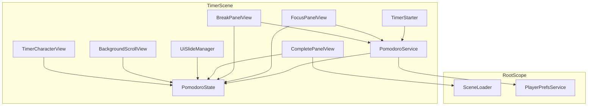
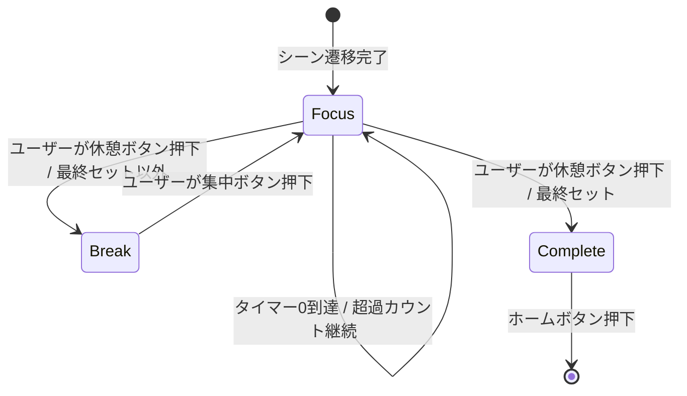
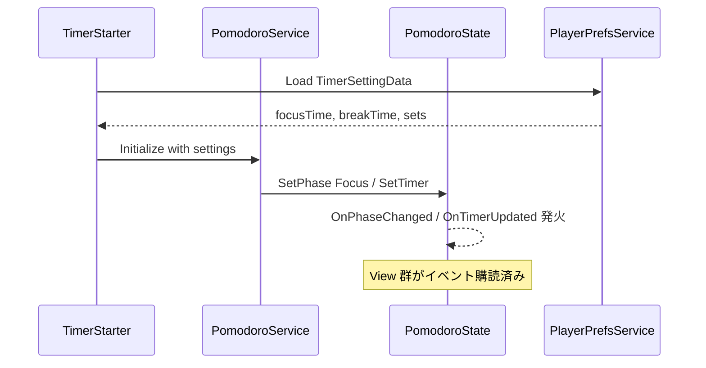
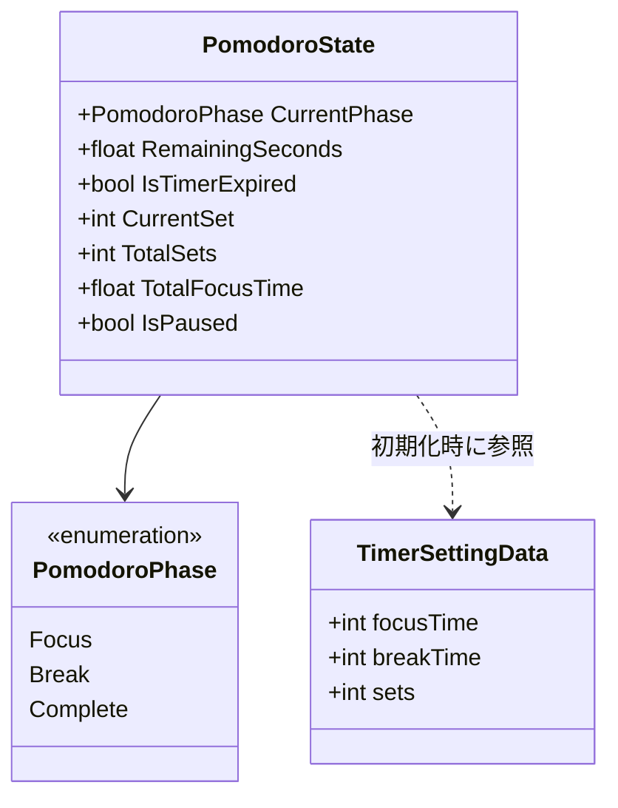

# テクニカルデザイン: Pomodoroタイマーシーン

## Overview

**目的**: Pomodoro テクニックに基づいたタイマーシーンを提供し、ユーザーが集中・休憩のリズムを視覚的に体験できるようにする。
**ユーザー**: アプリ利用者がホームシーンでタイマー設定後、集中と休憩のサイクルを実行する。
**影響**: 既存の Timer シーン scaffold（TimerScope, ReturnButtonView）を拡張し、Pomodoro タイマーの全機能を実装する。

### ゴール
- 集中・休憩・完了の 3 フェーズを明確に管理し、ユーザーに現在のフェーズを視覚的に伝える
- スライドアニメーションによる UI 切替演出で、フェーズ変更の体験を向上させる
- キャラクターアニメーションと背景スクロールで、タイマー進行の臨場感を演出する

### 非ゴール
- タイマー履歴の永続化・統計機能（History シーンの範囲）
- バックグラウンド復帰時のタイマー補正（将来の改善項目）
- プッシュ通知による休憩・集中の促し
- キャラクターの着せ替え反映（ホームシーン専用機能）

## Architecture

### 既存アーキテクチャ分析

- **シーンベース + VContainer DI パターン**: 各シーンが独立した LifetimeScope を持ち、RootScope から共通サービスを利用
- **依存方向**: View → Service → State（逆方向禁止）
- **エントリーポイント**: `IStartable` 実装による起動
- **シーン遷移**: SceneLoader + FadeService によるフェード遷移（実装済み）
- **既存 Timer scaffold**: `TimerScope`（SceneScope 継承）と `ReturnButtonView`（ホーム遷移ボタン）のみ

### Architecture Pattern & Boundary Map



**アーキテクチャ統合**:
- **採用パターン**: 既存のシーンベース + VContainer DI パターンを踏襲
- **境界**: Timer シーン内で Service/State/View/Starter/Manager の標準レイヤーに分離
- **既存パターン維持**: SceneScope 継承、IStartable エントリーポイント、PlayerPrefs によるデータ読み出し
- **新規コンポーネントの理由**: Pomodoro ロジック（Service/State）とビジュアル要素（各 View）は既存になく新規作成が必要
- **ステアリング準拠**: 依存方向ルール（View → Service → State）を厳守

### Technology Stack

| レイヤー | 選択/バージョン | 役割 | 備考 |
|---------|---------------|------|------|
| DI | VContainer 1.17.0 | TimerScope での依存性注入 | 既存利用 |
| 非同期 | UniTask | タイマーカウントダウン、アニメーション制御 | 既存利用 |
| アニメーション | Unity AnimationCurve | UI スライドアニメーション | FadeView と同じパターン |
| キャラクター | Unity Animator | 走行・完了モーション制御 | 新規セットアップ |
| データ永続化 | PlayerPrefs | TimerSettingData の読み出し | 既存利用 |

## System Flows

### Pomodoro ステートマシン



**主要な決定事項**:
- 集中タイマーが 0 に到達してもカウントは継続（超過時間を表示）。ユーザーが休憩ボタンを押すまで Focus ステートを維持
- 休憩タイマーが 0 に到達すると「集中しよう」メッセージを表示し、集中ボタンが出現。ユーザー操作まで Break ステートを維持
- **最終セットの遷移ルール**: 最終セット（CurrentSet == TotalSets）の集中タイマー超過後、ユーザーが休憩ボタンを押すと Break を経由せず直接 Complete に遷移する（最終セットは休憩なし）。Break → Complete のパスは存在しない

### タイマーシーン起動シーケンス



## Requirements Traceability

| 要件 | 概要 | コンポーネント | インターフェース | フロー |
|------|------|---------------|----------------|--------|
| 1.1 | シーン遷移完了後に集中ステートで開始 | TimerStarter, PomodoroService | PomodoroService.Initialize | 起動シーケンス |
| 1.2 | 集中タイマー0到達後もカウント継続+メッセージ | PomodoroService, FocusPanelView | PomodoroState.OnTimerExpired | ステートマシン |
| 1.3 | 休憩タイマー0到達で「集中しよう」メッセージ | PomodoroService, BreakPanelView | PomodoroState.OnTimerExpired | ステートマシン |
| 1.4 | 全セット完了で完了ステート遷移 | PomodoroService | PomodoroState.OnPhaseChanged | ステートマシン |
| 1.5 | 3種類のステート | PomodoroState | PomodoroPhase enum | — |
| 2.1 | 集中タイマー残り時間表示 | FocusPanelView | PomodoroState.OnTimerUpdated | — |
| 2.2 | 休憩タイマー残り時間表示 | BreakPanelView | PomodoroState.OnTimerUpdated | — |
| 2.3 | 集中タイマー0到達後の経過時間表示 | FocusPanelView | PomodoroState.OnTimerUpdated | — |
| 2.4 | 完了時の合計集中時間表示 | CompletePanelView | PomodoroState.TotalFocusTime | — |
| 2.5 | 残りセット数表示 | FocusPanelView, BreakPanelView | PomodoroState.RemainingSets | — |
| 2.6 | 合計集中時間表示 | FocusPanelView, BreakPanelView | PomodoroState.TotalFocusTime | — |
| 3.1 | 休憩ボタンで休憩遷移 | FocusPanelView, PomodoroService | PomodoroService.TransitionToBreak | ステートマシン |
| 3.2 | 集中ボタンで次セット集中遷移 | BreakPanelView, PomodoroService | PomodoroService.TransitionToFocus | ステートマシン |
| 3.3 | 一時停止ボタン | FocusPanelView, BreakPanelView, PomodoroService | PomodoroService.Pause | — |
| 3.4 | 再開ボタン | FocusPanelView, BreakPanelView, PomodoroService | PomodoroService.Resume | — |
| 3.5 | ホームボタンでシーン遷移 | FocusPanelView, BreakPanelView, CompletePanelView | SceneLoader.Load | — |
| 3.6 | 完了時はホームボタンのみ表示 | CompletePanelView | — | — |
| 4.1 | 集中タイマー未到達時は休憩ボタン非表示 | FocusPanelView | PomodoroState.IsTimerExpired | — |
| 4.2 | 集中タイマー0到達で休憩ボタン表示 | FocusPanelView | PomodoroState.OnTimerExpired | — |
| 4.3 | 休憩タイマー未到達時は集中ボタン非表示 | BreakPanelView | PomodoroState.IsTimerExpired | — |
| 4.4 | 休憩タイマー0到達で集中ボタン表示 | BreakPanelView | PomodoroState.OnTimerExpired | — |
| 5.1 | ホームから渡された設定を使用 | TimerStarter | PlayerPrefsService.Load | 起動シーケンス |
| 5.2 | 1セット完了+休憩ボタンでセット進行 | PomodoroService | PomodoroState.CurrentSet | ステートマシン |
| 5.3 | 全セット集中完了で完了遷移 | PomodoroService | PomodoroState.OnPhaseChanged | ステートマシン |
| 5.4 | 完了時の合計集中時間表示 | CompletePanelView | PomodoroState.TotalFocusTime | — |
| 6.1 | 集中/休憩/完了の独立 UI | FocusPanelView, BreakPanelView, CompletePanelView | — | — |
| 6.2 | 集中→休憩のスライド切替 | UiSlideManager | PomodoroState.OnPhaseChanged | — |
| 6.3 | 休憩→集中のスライド切替 | UiSlideManager | PomodoroState.OnPhaseChanged | — |
| 6.4 | 完了遷移時のスライド切替 | UiSlideManager | PomodoroState.OnPhaseChanged | — |
| 7.1 | 集中/休憩中のキャラクター走行アニメ | TimerCharacterView | PomodoroState.OnPhaseChanged | — |
| 7.2 | 完了時のキャラクター完了モーション | TimerCharacterView | PomodoroState.OnPhaseChanged | — |
| 8.1 | 集中/休憩中の背景スクロール | BackgroundScrollView | PomodoroState.OnPhaseChanged | — |
| 8.2 | キャラクター後方に背景配置 | BackgroundScrollView | — | — |
| 8.3 | 完了時の背景スクロール停止 | BackgroundScrollView | PomodoroState.OnPhaseChanged | — |
| 9.1 | ホーム→タイマーのフェード遷移 | SceneLoader（既存） | — | — |
| 9.2 | タイマー→ホームのフェード遷移 | SceneLoader（既存） | — | — |
| 9.3 | 既存 SceneLoader 使用 | SceneLoader（既存） | — | — |

## Components and Interfaces

| コンポーネント | レイヤ��� | 役割 | 要件カバレッジ | 主要依存 | コントラクト |
|---------------|---------|------|--------------|---------|-------------|
| PomodoroState | State | Pomodoro の全状態とイベント通知 | 1.5, 2.1-2.6, 4.1-4.4 | なし | State |
| PomodoroService | Service | タイマーロジック、フェーズ遷移、サイクル管理 | 1.1-1.4, 3.1-3.4, 5.1-5.3 | PomodoroState (P0), PlayerPrefsService (P0) | Service |
| TimerStarter | Starter | シーン起動、設定読み込み、タイマー開始 | 1.1, 5.1 | PomodoroService (P0), PlayerPrefsService (P0) | — |
| UiSlideManager | Manager | 3面 UI のスライドアニメーション管理 | 6.1-6.4 | PomodoroState (P0) | — |
| FocusPanelView | View | 集中フェーズ UI（タイマー、ボタン、メッセージ） | 1.2, 2.1, 2.3, 2.5, 2.6, 3.1, 3.3-3.5, 4.1, 4.2 | PomodoroService (P0), PomodoroState (P0), SceneLoader (P1) | — |
| BreakPanelView | View | 休憩フェーズ UI（タイマー、ボタン、メッセージ） | 1.3, 2.2, 2.5, 2.6, 3.2-3.5, 4.3, 4.4 | PomodoroService (P0), PomodoroState (P0), SceneLoader (P1) | — |
| CompletePanelView | View | 完了フェーズ UI（合計時間、ホームボタン） | 2.4, 3.5, 3.6, 5.4 | PomodoroState (P0), SceneLoader (P0) | — |
| BackgroundScrollView | View | 背景の右→左スクロール | 8.1-8.3 | PomodoroState (P1) | — |
| TimerCharacterView | View | キャラクターアニメーション制御 | 7.1, 7.2 | PomodoroState (P1) | — |

### State レイヤー

#### PomodoroState

| フィールド | 詳細 |
|-----------|------|
| 役割 | Pomodoro タイマーの全状態を保持し、変更を Action イベントで通知する |
| 要件 | 1.5, 2.1-2.6, 4.1-4.4 |

**責務 & 制約**
- Pomodoro の現在フェーズ、タイマー残り時間、セット進行、合計集中時間、一時停止状態、タイマー超過フラグを保持
- イベント通知のみを担当し、ロジックは持たない
- 状態変更は PomodoroService からのみ行われる

**依存**
- Inbound: PomodoroService — 状態更新 (P0)
- Inbound: 全 View — 状態読み取り・イベント購読 (P0)

**コントラクト**: State [x]

##### State Management

```csharp
enum PomodoroPhase { Focus, Break, Complete }

class PomodoroState
{
    /// 現在のフェーズ
    PomodoroPhase CurrentPhase { get; }

    /// タイマー残り時間（秒）。0以下の場合は超過時間
    float RemainingSeconds { get; }

    /// タイマーが0に到達したか
    bool IsTimerExpired { get; }

    /// 現在のセット番号（1始まり）
    int CurrentSet { get; }

    /// 総セット数
    int TotalSets { get; }

    /// 残りセット数
    int RemainingSets { get; }

    /// 合計集中時間（秒）
    float TotalFocusTime { get; }

    /// 一時停止中か
    bool IsPaused { get; }

    /// フェーズ変更イベント
    Action<PomodoroPhase> OnPhaseChanged { get; set; }

    /// タイマー更新イベント（毎フレーム）
    Action<float> OnTimerUpdated { get; set; }

    /// タイマー0到達イベント
    Action OnTimerExpired { get; set; }

    /// 一時停止状態変更イベント
    Action<bool> OnPauseChanged { get; set; }

    /// 状態を設定するメソッド群（PomodoroService から呼び出し）
    void SetPhase(PomodoroPhase phase);
    void SetRemainingSeconds(float seconds);
    void SetTimerExpired(bool expired);
    void SetCurrentSet(int set);
    void SetTotalFocusTime(float time);
    void SetPaused(bool paused);
    void Setup(int totalSets);
}
```

- **永続化**: なし（シーンライフサイクルに紐づく揮発性状態）
- **並行性**: シングルスレッド（Unity メインスレッド）

### Service レイヤー

#### PomodoroService

| フィールド | 詳細 |
|-----------|------|
| 役割 | Pomodoro タイマーのカウントダウンロジック、フェーズ遷移、サイクル管理を担当する |
| 要件 | 1.1-1.4, 3.1-3.4, 5.1-5.3 |

**責務 & 制約**
- タイマー設定（集中時間、休憩時間、セット数）に基づきカウントダウンを実行
- フェーズ遷移ルールを管理（集中→休憩→集中...→完了）
- 一時停止/再開のトグル制御
- 合計集中時間の累算
- CancellationToken を受け取り、シーン破棄時にタイマーループをキャンセル

**依存**
- Outbound: PomodoroState — 状態更新 (P0)
- Outbound: PlayerPrefsService — TimerSettingData 読み出し (P0)

**コントラクト**: Service [x]

##### Service Interface

```csharp
class PomodoroService
{
    /// コンストラクタで CancellationToken を受け取り、全タイマーループで使用する
    [Inject]
    PomodoroService(PomodoroState state, PlayerPrefsService prefsService, CancellationToken cancellationToken);

    /// タイマー設定を読み込み、集中フェーズでタイマーを開始する
    /// 事前条件: TimerSettingData が PlayerPrefs に保存済み
    /// 事後条件: PomodoroState が Focus フェーズで初期化され、カウントダウン開始
    UniTask StartAsync();

    /// 休憩フェーズに遷移する
    /// 事前条件: CurrentPhase == Focus かつ IsTimerExpired == true
    /// 事後条件: 最終セット（CurrentSet == TotalSets）の場合は Complete に遷移。それ以外は Break に遷移し休憩タイマー開始
    void TransitionToBreak();

    /// 次のセットの集中フェーズに遷移する
    /// 事前条件: CurrentPhase == Break かつ IsTimerExpired == true
    /// 事後条件: CurrentPhase == Focus、集中タイマー開始、CurrentSet +1
    void TransitionToFocus();

    /// タイマーを一時停止する
    /// 事後条件: IsPaused == true、カウントダウン停止
    void Pause();

    /// タイマーを再開する
    /// 事後条件: IsPaused == false、カウントダウン再開
    void Resume();
}
```

- **不変条件**: フェーズ遷移は定義されたルール（Focus→Break→Focus...→Complete）のみ許可
- **タイマーループ**: `UniTask` ベースの Update ループ。`Time.deltaTime` で毎フレーム減算。一時停止中はスキップ

### Starter レイヤー

#### TimerStarter

| フィールド | 詳細 |
|-----------|------|
| 役割 | シーンのエントリーポイント。設定読み込みとタイマー開始を行う |
| 要件 | 1.1, 5.1 |

**責務 & 制約**
- `IStartable.Start()` で `PomodoroService.StartAsync()` を呼び出す
- 例外を catch して `Debug.LogError` でログ出力（FadeStarter と同パターン）

**依存**
- Outbound: PomodoroService — タイマー開始 (P0)

**実装メモ**
- `FadeStarter` と同じ async void Start パターンを踏襲
- TimerScope で `CancellationTokenSource` を生成し、`CancellationToken` を DI コンテナに登録する。PomodoroService がコンストラクタで受け取り、全タイマーループで使用する。TimerScope の `OnDestroy` で `CancellationTokenSource.Cancel()` を呼び出し、シーン破棄時にタイマーループを確実にキャンセルする

### Manager レイヤー

#### UiSlideManager

| フィールド | 詳細 |
|-----------|------|
| 役割 | 3面 UI（集中/休憩/完了パネル）のスライドイン/アウトアニメーションを管理する |
| 要件 | 6.1-6.4 |

**責務 & 制約**
- `PomodoroState.OnPhaseChanged` を購読し、フェーズに応じてパネルの RectTransform をスライドアニメーション
- 初期状態: FocusPanelView が画面内、BreakPanelView と CompletePanelView が画面外（右側）
- アニメーション: AnimationCurve + UniTask で RectTransform.anchoredPosition を補間

**依存**
- Inbound: PomodoroState — フェーズ変更イベント (P0)
- Outbound: FocusPanelView, BreakPanelView, CompletePanelView — RectTransform 制御 (P0)

**実装メモ**
- `FadeView.AnimateFade` と同パターンで `AnimationCurve.EaseInOut` を使用
- 現在のパネルを左へスライドアウト、次のパネルを右からスライドイン（同時実行）
- MonoBehaviour として実装し、SerializeField でパネルの RectTransform と AnimationCurve を受け取る

### View レイヤー

#### FocusPanelView

| フィールド | 詳細 |
|-----------|------|
| 役割 | 集中フェーズの UI 表示と操作 |
| 要件 | 1.2, 2.1, 2.3, 2.5, 2.6, 3.1, 3.3-3.5, 4.1, 4.2 |

**責務 & 制約**
- タイマー残り時間を `mm:ss` 形式で表示。0到達後は超過時間を表示
- 「休憩しよう」メッセージを IsTimerExpired 時に表示
- 休憩ボタン: IsTimerExpired 時のみ表示、押下で `PomodoroService.TransitionToBreak()`
- 一時停止/再開ボタン: `PomodoroService.Pause()` / `Resume()`
- ホームボタン: `SceneLoader.Load(Const.SceneName.Home)`
- 残りセット数と合計集中時間を常時表示

**依存**
- Outbound: PomodoroService — 操作 (P0)
- Inbound: PomodoroState — 状態読み取り・イベント購読 (P0)
- Outbound: SceneLoader — ホーム遷移 (P1)

#### BreakPanelView

| フィールド | 詳細 |
|-----------|------|
| 役割 | 休憩フェーズの UI 表示と操作 |
| 要件 | 1.3, 2.2, 2.5, 2.6, 3.2-3.5, 4.3, 4.4 |

**責務 & 制約**
- FocusPanelView と対称的な構造
- 「集中しよう」メッセージを IsTimerExpired 時に表示
- 集中ボタン: IsTimerExpired 時のみ表示、押下で `PomodoroService.TransitionToFocus()`
- 一時停止/再開ボタン、ホームボタン、残りセット数、合計集中時間は FocusPanelView と同様

**依存**
- Outbound: PomodoroService — 操作 (P0)
- Inbound: PomodoroState — 状態読み取り・イベント購読 (P0)
- Outbound: SceneLoader — ホーム遷移 (P1)

#### CompletePanelView

| フィールド | 詳細 |
|-----------|------|
| 役割 | 完了フェーズの UI 表示 |
| 要件 | 2.4, 3.5, 3.6, 5.4 |

**責務 & 制約**
- 合計集中時間を表示
- ホームボタンのみ表示（他のボタンなし）

**依存**
- Inbound: PomodoroState — 合計集中時間読み取り (P0)
- Outbound: SceneLoader — ホーム遷移 (P0)

#### BackgroundScrollView

| フィールド | 詳細 |
|-----------|------|
| 役割 | 背景の右→左連続スクロール |
| 要件 | 8.1-8.3 |

**責務 & 制約**
- 2枚の背景スプライトを横に並べ、`Transform.Translate` で左方向に移動
- 画面外に出たスプライトを反対側に再配置（無限ループ）
- `PomodoroState.OnPhaseChanged` を購読し、Complete 時にスクロールを停止
- `PomodoroState.OnPauseChanged` を購読し、一時停止時にスクロールを停止

**依存**
- Inbound: PomodoroState — フェーズ・一時停止状態 (P1)

**実装メモ**
- MonoBehaviour の Update で毎フレーム移動
- スクロール速度は SerializeField で設定可能

#### TimerCharacterView

| フィールド | 詳細 |
|-----------|------|
| 役割 | キャラクターの走行・完了アニメーション制御 |
| 要件 | 7.1, 7.2 |

**責務 & 制約**
- Animator コンポーネントを SerializeField で参照
- `PomodoroState.OnPhaseChanged` を購読し、フェーズに応じてアニメーションステートを切り替え
  - Focus / Break: "Run" アニメーション
  - Complete: "Complete" アニメーション
- `PomodoroState.OnPauseChanged` を購読し、一時停止時に Animator.speed = 0

**依存**
- Inbound: PomodoroState — フェーズ・一時停止状態 (P1)

**実装メモ**
- Animator Controller は Unity Editor で作成（Run, Complete の 2 ステート + Idle）
- アニメーションアセットが未準備の場合は空の Animator Controller で対応可能

### Scope レイヤー

#### TimerScope（既存拡張）

既存の `TimerScope` を拡張し、新規コンポーネントを登録する。

```csharp
/// 登録内容（概念）
/// - CancellationTokenSource を生成し、CancellationToken を Register
/// - PomodoroState: Lifetime.Scoped
/// - PomodoroService: Lifetime.Scoped
/// - RegisterEntryPoint<TimerStarter>()
/// - RegisterComponentInHierarchy: UiSlideManager, FocusPanelView, BreakPanelView,
///   CompletePanelView, BackgroundScrollView, TimerCharacterView
/// - 既存の ReturnButtonView 登録を削除
/// - OnDestroy で CancellationTokenSource.Cancel() / Dispose()
```

## Data Models

### Domain Model



**ビジネスルール & 不変条件**:
- `CurrentSet` は 1 ≤ CurrentSet ≤ TotalSets の範囲
- `TotalFocusTime` は単調増加（減少しない）
- フェーズ遷移は Focus → Break → Focus → ... → Complete の順序のみ許可
- Complete への遷移は `CurrentSet == TotalSets` かつ最終集中タイマー超過後のみ

### 既存データモデル（変更なし）

- `TimerSettingData`（`TimerSetting/State/TimerSettingData.cs`）: focusTime（分）, breakTime（分）, sets（回数）— 変更不要
- `PlayerPrefsKey.TimerSetting`: 既存のキーをそのまま使用

## Error Handling

### エラー戦略

| エラー種別 | 対応 |
|-----------|------|
| TimerSettingData が null（PlayerPrefs 未保存） | デフォルト値（25分/5分/2セット）で開始 |
| タイマー開始時の例外 | `Debug.LogError` でログ出力。TimerStarter で catch |
| フェーズ遷移の不正呼び出し（事前条件不成立） | 無視（処理をスキップ）し、`Debug.LogWarning` でログ |

## Testing Strategy

### Unit Tests
- PomodoroService: フェーズ遷移ルールの正確性（Focus→Break→Focus→Complete）
- PomodoroService: セットカウント進行の正確性
- PomodoroService: 合計集中時間の累算正確性
- PomodoroState: イベント発火の正確性

### Integration Tests
- TimerStarter → PomodoroService → PomodoroState の初期化フロー
- PlayerPrefsService からの設定読み込み → タイマー開始の E2E フロー

### Manual Tests（Unity Editor）
- UI スライドアニメーションの視覚確認
- キャラクターアニメーションの走行・完了モーション確認
- 背景スクロールのループ動作確認
- 全フェーズを通したフルサイクル操作確認
