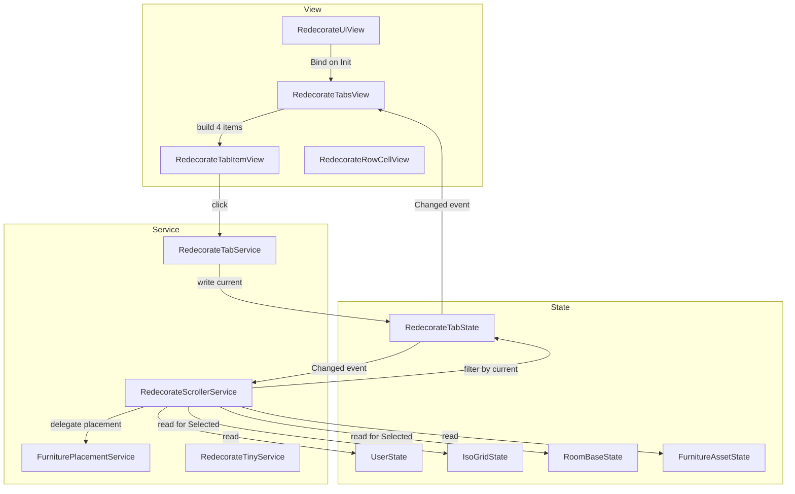
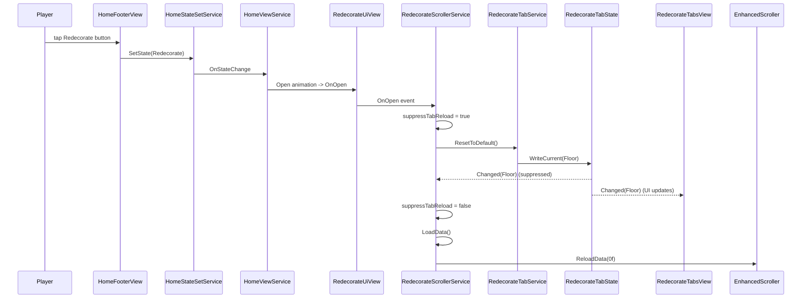
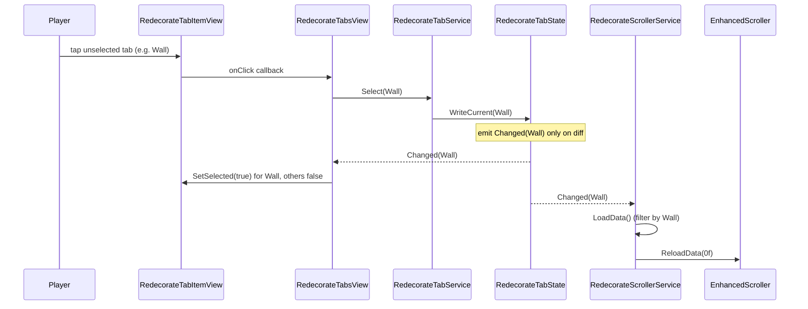
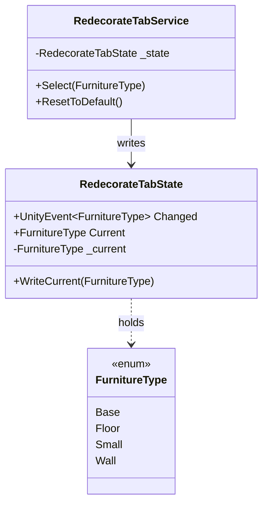

# Technical Design — redecorate-furniture-type-tabs

## Overview

**Purpose**: リデコレート (Home シーン内の家具配置 UI) に `Cat.Furniture.FurnitureType` (`Base` / `Floor` / `Small` / `Wall`) で家具を絞り込む単一階層タブ UI を追加し、所持家具をタイプ別に効率よく一覧・配置できるようにする。

**Users**: Home シーンでリデコレート画面を開くプレイヤー。家具数の増加に伴いグリッド一覧から目的の家具を探す手間が増えるため、タイプ別フィルタによる体験改善を提供する。

**Impact**: 既存の `RedecorateUiView` / `RedecorateScrollerService` の挙動 (家具グリッド + 配置・選択フロー) は維持したまま、タブ選択状態を新設の SSOT (`RedecorateTabState`) に集約し、`RedecorateScrollerService.LoadData()` のループ内に 1 種のフィルタ条件を差し込む。`FurniturePlacementService`、`IsoGridState`、`RoomBaseState`、`RedecorateTinyService`、`UserState` などへの変更は発生しない。

### Goals
- リデコレート画面で `FurnitureType` 4 種類のタブを常に表示し、必ず 1 つだけ選択された状態を保証する (`R1`, `R3`)。
- タブ選択に追従してグリッドが対応 `FurnitureType` の `Furniture` のみで再描画される (`R4`)。
- 既存の家具配置 (`PlaceFurniture` / `PlaceBase`)、選択判定 (`UpdateSelectionStates`)、Tiny 化 (`RedecorateTinyService`) の挙動を変更せずに統合する (`R5`)。
- 新規アセットを追加せず、既存の `Assets/UI/Home/Closet/Textures/` 配下のアセットのみで視覚化する (`R6`)。
- 既存の `View → Service → State` 依存方向と `HomeScope` DI 構成、コーディング規約を厳守する (`R7`)。

### Non-Goals
- 大タブに相当する 2 段階タブ階層の導入 (`R7.6` により単一階層のみ)。
- `FurnitureType` enum の拡張 (将来 5 番目を追加する場合は本機能の範囲外。動的構築への移行を Follow-up に残す)。
- Closet 既存タブ機構との共通化リファクタリング (`research.md` Option B として検討済 / 採用見送り)。
- `IsoGridState` / `RoomBaseState` / `UserState.UserFurnitures` のデータモデル変更。
- 家具の所持状態フィルタや並び順カスタマイズ、検索機能などの追加。

---

## Architecture

### Existing Architecture Analysis

リデコレート画面は `Home` シーンの `View → Service → State` 4 層パターンに従って構築済み:

- **View**: `RedecorateUiView` が `EnhancedScroller`、`Tiny` トグル、戻るボタンを保持。`UiView` 基底クラス経由で In/Out アニメーションと `OnOpen` イベントを発火する。
- **Service**: `RedecorateScrollerService` が `IEnhancedScrollerDelegate` + `IStartable` を実装。`OnOpen` 購読 → `LoadData()` でグリッドを毎回再構築 → セル選択時に `FurniturePlacementService` を呼び出す。
- **State**: `RedecorateFurnitureData` (UI バインド用)、`IsoGridState` / `RoomBaseState` (配置確定状態)、`UserState.UserFurnitures` (所持家具マスター紐付け)。
- **DI**: `HomeScope` で全依存を `Lifetime.Scoped` で登録、`RedecorateScrollerService` は `RegisterEntryPoint`。

Closet 側で同パターンの 2 段階タブ機構 (`ClosetTabState` + `ClosetTabService` + `ClosetMajorTabsView` + `ClosetMinorTabsView` + `ClosetMinorTabItemView`) が既に稼働しており、本機能はこの「マイナータブ相当」だけを Redecorate に複製する。

**保持すべき既存パターン**:
- `View → Service → State` の単方向依存 (`R7.1`)。
- `HomeScope` 集中型 DI 構成 (`R7.3`)。
- `UiView.OnOpen` 起点での再構築 + `Scroller.ReloadData(0f)` でのスクロール先頭リセット。
- `UnityEvent<T>` ベースの状態変更通知 (Closet `MajorChanged` / `MinorChanged` と同型)。
- `_suppressMinorReload` 風の二重実行防止フラグ (`OnOpen` 内の `ResetToDefault` と `LoadData` の競合回避)。

### Architecture Pattern & Boundary Map

選択パターン: **Closet マイナータブ流儀の単一階層複製** (`research.md` Option A)。



**Architecture Integration**:
- **Selected pattern**: Single-level tab pattern based on `ClosetMinorTab*` reference. State と Service を新設してタブの選択状態と遷移を集約し、`RedecorateScrollerService` には購読 + フィルタの最小拡張だけを行う。
- **Domain/feature boundaries**: タブ選択状態は `RedecorateTabState` が単独で所有 (SSOT)。Closet タブ状態 (`ClosetTabState`) とは完全に独立し、相互参照しない (`R7.6`)。
- **Existing patterns preserved**: `View → Service → State` 単方向依存、`UiView.OnOpen` 起点の再構築、`HomeScope` 集中型 DI。
- **New components rationale**: `RedecorateTabState` (選択状態 SSOT)、`RedecorateTabService` (遷移ロジックの単一責任化)、`RedecorateTabsView` (4 タブ静的バインドコンテナ)、`RedecorateTabItemView` (タブ 1 個の表示・クリック)。
- **Steering compliance**: `_camelCase` / `[Inject]` / `/// comment` / `private` 省略 / `Lifetime.Scoped` を遵守 (`R7.5`)。

### Technology Stack

| Layer | Choice / Version | Role in Feature | Notes |
|-------|------------------|-----------------|-------|
| Frontend / UI | Unity 6 (6000.x.x) UGUI + EnhancedScroller | タブ表示・グリッド再描画 | 既存 `RedecorateUiView` の構成を踏襲 |
| Async | UniTask (既存) | 不要 (本機能は同期処理のみ) | タブ切替は同期で完結 |
| DI | VContainer 1.17.0 | `RedecorateTabState` / `RedecorateTabService` の `Scoped` 登録 | `HomeScope.Configure` に 2 行追加 |
| Asset Management | Addressables 2.9.1 (既存) | 不要 | アイコンは Sprite として直接 SerializeField 参照 |
| Animation | (なし) | タブ切替時のアニメーションは行わない | サンプル画像から直接的なフィードバックを採用 |

> 新規ライブラリ・バージョン追加なし。すべて既存スタック内で完結。詳細な依存検証は `research.md` の "Existing Code Inventory" を参照。

---

## System Flows

### Flow 1: リデコレートを開く → 既定タブで表示


**Key decisions**:
- `OnOpen` で `ResetToDefault()` → `LoadData()` を順に実行。`Changed` イベントは `RedecorateTabsView` の UI 同期だけに使い、`RedecorateScrollerService` 側では二重 `LoadData` を抑止 (`R3.3` / `R4.4`)。
- 既定値はサービス層 `RedecorateTabService.ResetToDefault` が `RedecorateTabState.Default` (= `FurnitureType.Floor`) を書く。`RedecorateTabState.Default` を 1 行差替で別タブに変更可能 (`R3.1`)。

### Flow 2: タブ切替 → グリッドフィルタ更新


**Key decisions**:
- 同一タブ再タップ時は `RedecorateTabState.WriteCurrent` が早期 return し、`Changed` を発火しない → `LoadData` 再構築は走らない (`R4.4`)。
- `LoadData` は `_userState.UserFurnitures` を走査するループ内で `furniture.FurnitureType != _redecorateTabState.Current` を `continue` で除外する。フィルタは O(N) のシンプルなスキップ条件で、既存の Selected 復元や Base 分岐に影響を与えない (`R4.1` / `R5.3`)。

---

## Requirements Traceability

| Requirement | Summary | Components | Interfaces | Flows |
|-------------|---------|------------|------------|-------|
| 1.1 | Open 時にタブを表示 | RedecorateUiView, RedecorateTabsView | `Init(...)`, `Bind(...)` | Flow 1 |
| 1.2 | 4 タブ常時表示 | RedecorateTabsView | 4 SerializeField | Flow 1 |
| 1.3 | 必ず 1 つ選択 | RedecorateTabState, RedecorateTabService | `Default`, `ResetToDefault()` | Flow 1 |
| 1.4 | enum 宣言順 | RedecorateTabsView | SerializeField 順序: Base→Floor→Small→Wall | — |
| 1.5 | グリッド上部に配置 | RedecorateUiView (Inspector レイアウト) | — | — |
| 2.1〜2.4 | タブと FurnitureType の 1:1 マッピング | RedecorateTabsView | `Bind(...)` の `FurnitureType` 引数 | Flow 2 |
| 2.5 | 重複なし | RedecorateTabsView | enum 値 1 個ずつバインド | — |
| 2.6 | 未割当タブを表示しない | RedecorateTabsView | enum 全 4 件を網羅 | — |
| 3.1 | 既定 Floor | RedecorateTabState | `Default = FurnitureType.Floor` | Flow 1 |
| 3.2 | 既定でフィルタ済 | RedecorateScrollerService | `LoadData()` がフィルタを適用 | Flow 1 |
| 3.3 | 再オープンでリセット | RedecorateScrollerService | `OnOpen → ResetToDefault()` | Flow 1 |
| 3.4 | ゼロ選択不可 | RedecorateTabState | `Current` は常に有効値 | — |
| 4.1 | フィルタ更新 | RedecorateScrollerService | `LoadData()` のループ内フィルタ | Flow 2 |
| 4.2 | スクロール先頭リセット | RedecorateScrollerService | `Scroller.ReloadData(0f)` | Flow 2 |
| 4.3 | 空状態 | RedecorateScrollerService | `_data.Count == 0` で `GetNumberOfCells = 1` (ダミー行のみ) | — |
| 4.4 | 連続選択時の再構築抑止 | RedecorateTabState | `WriteCurrent` 差分判定 | Flow 2 |
| 4.5 | 旧 SelectedChanged リスナ解除 | RedecorateScrollerService | `LoadData()` 冒頭の既存リスナ解除ループ | — |
| 5.1〜5.2 | 既存配置フローの維持 | RedecorateScrollerService | `OnCellViewSelected` (既存) を変更しない | — |
| 5.3 | Selected 判定の維持 | RedecorateScrollerService | `UpdateSelectionStates()` をフィルタ後 `_data` に対して呼ぶ | — |
| 5.4 | 副作用排除 | RedecorateTabService | フィルタは読み取りのみ | — |
| 5.5 | Tiny 化を破壊しない | RedecorateTabService, RedecorateTinyService | タブ系経路から `RedecorateTinyService` を呼ばない | — |
| 6.1〜6.2 | 視覚フィードバック | RedecorateTabItemView | `SetSelected(bool)` で `_backgroundImage.color` を切替 | — |
| 6.3〜6.4 | 既存アセットのみ使用 | RedecorateTabsView (SerializeField の Sprite) | アイコンは `makeovwr_tab_*_white.png` を割当 | — |
| 6.5 | Closet 流儀で実装 | RedecorateTabItemView | `ClosetMinorTabItemView` と同じ構造 | — |
| 7.1〜7.6 | アーキテクチャ規約準拠 | (全コンポーネント) | View→Service→State 維持、HomeScope DI、最小変更 | — |

---

## Components and Interfaces

### Component Summary

| Component | Domain/Layer | Intent | Req Coverage | Key Dependencies (P0/P1) | Contracts |
|-----------|--------------|--------|--------------|--------------------------|-----------|
| RedecorateTabState | Home.State | 選択中 `FurnitureType` を保持し変更通知を発火する SSOT | 1.3, 1.4, 3.1, 3.4, 4.4 | (なし) | State |
| RedecorateTabService | Home.Service | タブ選択遷移と既定値復帰の唯一の操作窓口 | 1.3, 3.1, 4.4, 5.4 | RedecorateTabState (P0) | Service |
| RedecorateTabsView | Home.View | 4 タブの静的バインドと `Changed` 購読による選択ハイライト同期 | 1.2, 1.4, 2.1〜2.6, 6.1〜6.4 | RedecorateTabService (P0), RedecorateTabState (P0), RedecorateTabItemView (P0) | (UI) |
| RedecorateTabItemView | Home.View | タブ 1 個分の表示 + クリック発火 | 6.1〜6.5 | (なし — presenter 単独) | (UI) |
| RedecorateUiView (拡張) | Home.View | `RedecorateTabsView` をシリアライズ参照しバインド経路を確立 | 1.1, 1.5, 7.1, 7.3 | RedecorateTabService (P0), RedecorateTabState (P0), RedecorateTabsView (P0) | (UI) |
| RedecorateScrollerService (拡張) | Home.Service | タブ変更購読 + LoadData フィルタ + OnOpen 既定値復帰 | 3.2, 3.3, 4.1〜4.5, 5.1〜5.5 | RedecorateTabState (P0), RedecorateTabService (P0) | Service |
| HomeScope (拡張) | Home.Scope | DI 統合 (State + Service) | 7.3 | (登録対象) | (DI) |

> プレゼン専用 (`RedecorateTabsView`、`RedecorateTabItemView`) は Implementation Note のみ。新規境界を持つ State / Service / 既存拡張点には詳細ブロックを設ける。

### State Layer

#### RedecorateTabState

| Field | Detail |
|-------|--------|
| Intent | 選択中 `FurnitureType` の SSOT。差分のみ `Changed` を発火する。 |
| Requirements | 1.3, 1.4, 3.1, 3.4, 4.4 |

**Responsibilities & Constraints**
- `Current` は必ず `FurnitureType` 列挙のいずれかの値であり、`Default` (= `FurnitureType.Floor`) で初期化される (`R3.1` / `R3.4`)。
- `WriteCurrent(value)` は同値時に no-op (差分のみ Invoke) — 連続選択時の再構築抑止に必須 (`R4.4`)。
- View / Service の双方から購読される。書き込み窓口は `RedecorateTabService` のみとする運用契約 (依存方向遵守 / `R7.1`)。
- マッピング (タブ ↔ `FurnitureType`) はタブ 1:1 のため Closet のような静的辞書は持たない。タブ表示順の SSOT は **Prefab Hierarchy における `RedecorateTabItemView` GameObject の sibling 順序** (LayoutGroup 子要素並び) で、`Base` → `Floor` → `Small` → `Wall` の順序を保証する (`R1.4`)。SerializeField 名 (`_baseTabItem` / `_floorTabItem` / `_smallTabItem` / `_wallTabItem`) は意味付けのみで視覚順序は規定しない。Inspector 配線ぶれの保険として `RedecorateTabsView.Bind` 内で `transform.SetSiblingIndex` を呼びコード側でも順序を強制する (実装詳細は `RedecorateTabsView` Implementation Note 参照)。

**Dependencies**
- Inbound: `RedecorateTabService` (P0) — `WriteCurrent` 呼出元。
- Inbound: `RedecorateTabsView` (P0) / `RedecorateScrollerService` (P0) — `Changed` 購読。
- Outbound: なし。

**Contracts**: State [✓]

##### State Management
- **State model**: 単一フィールド `FurnitureType _current` + `UnityEvent<FurnitureType> Changed`。
- **Persistence & consistency**: 永続化なし (`Lifetime.Scoped`、Scope 破棄で揮発)。
- **Concurrency strategy**: Unity メインスレッドのみで操作されるため不要。

##### Service Interface (Conceptual)
```csharp
public class RedecorateTabState
{
    public const FurnitureType Default = FurnitureType.Floor;
    public readonly UnityEvent<FurnitureType> Changed;

    public FurnitureType Current { get; }
    public void WriteCurrent(FurnitureType value); // diff only
}
```
- **Preconditions**: `value` は `FurnitureType` 列挙の有効値であること。
- **Postconditions**: 値が変化した場合のみ `Changed` を 1 回だけ発火する。
- **Invariants**: `Current` は常に `FurnitureType` の値。null になり得ない。

**Implementation Notes**
- Integration: VContainer に `Lifetime.Scoped` で登録。`HomeScope.Configure` に 1 行追加。
- Validation: なし (enum で型保証)。
- Risks: `Default` を将来差し替える場合、再オープン時の挙動が変わる点だけ要確認 (`R3.3`)。

---

### Service Layer

#### RedecorateTabService

| Field | Detail |
|-------|--------|
| Intent | タブ選択遷移と既定値復帰を一元管理する操作窓口。 |
| Requirements | 1.3, 3.1, 4.4, 5.4 |

**Responsibilities & Constraints**
- `Select(FurnitureType)`: 入力値を `RedecorateTabState.WriteCurrent` に委譲。同値時は no-op (`R4.4`)。
- `ResetToDefault()`: `RedecorateTabState.WriteCurrent(RedecorateTabState.Default)` を呼ぶ。`OnOpen` 経路から呼ばれることを想定 (`R3.3`)。
- 任意の State (`IsoGridState` / `RoomBaseState` / `UserState`) への書込みを行わない (`R5.4`)。
- View からの直接 State 書換を排除し、依存方向 (View → Service → State) を保つ (`R7.1`)。

**Dependencies**
- Inbound: `RedecorateTabsView` (P0) — `Select` 呼出元。`RedecorateScrollerService` (P0) — `ResetToDefault` 呼出元。
- Outbound: `RedecorateTabState` (P0) — 書込先。
- External: なし。

**Contracts**: Service [✓]

##### Service Interface
```csharp
public sealed class RedecorateTabService
{
    [Inject]
    public RedecorateTabService(RedecorateTabState redecorateTabState);

    public void Select(FurnitureType type);   // diff -> Write
    public void ResetToDefault();             // Write(Default)
}
```
- **Preconditions**: `type` は `FurnitureType` 列挙の有効値。
- **Postconditions**: `RedecorateTabState.Current` が `type` (または `Default`) と等しくなる。値変化時のみ `Changed` を発火。
- **Invariants**: 状態書込み以外の副作用なし。

**Implementation Notes**
- Integration: `HomeScope.Configure` に `Lifetime.Scoped` で 1 行追加。`[Inject]` をコンストラクタへ。
- Validation: enum 値範囲チェックは不要 (型で保証)。
- Risks: `Select` から `Changed` が連鎖発火するため、`RedecorateScrollerService` 側で `LoadData` の二重実行抑止フラグ (`_suppressTabReload`) を `OnOpen` 経路にだけ立てる必要がある (詳細は `RedecorateScrollerService` 拡張を参照)。

---

### View Layer (Presentation)

> 以下 2 件はプレゼン専用 (新境界なし) のため、Implementation Note のみで詳細ブロックを省略する。

#### RedecorateTabsView (新規)
- 4 件の `RedecorateTabItemView` を SerializeField で静的に保持し、`Bind(RedecorateTabService, RedecorateTabState)` で結線する。`ClosetMajorTabsView` の流儀を踏襲。
- 各 `_baseTabItem` / `_floorTabItem` / `_smallTabItem` / `_wallTabItem` のクリックを `RedecorateTabService.Select(<FurnitureType>)` に結線する (`R1.4` / `R2.1〜2.4`)。
- `RedecorateTabState.Changed` 購読で 4 件の `SetSelected(bool)` を一括更新 (`R6.1` / `R6.2`)。
- 初回バインド時に `OnChanged(_redecorateTabState.Current)` を 1 回呼んで初期描画を同期する (`R1.3`)。
- `OnDestroy` で `Changed` リスナを解除する (Closet 流儀)。
- **タブ表示順の強制**: `Bind` の冒頭で `_baseTabItem.transform.SetSiblingIndex(0)` / `_floorTabItem.transform.SetSiblingIndex(1)` / `_smallTabItem.transform.SetSiblingIndex(2)` / `_wallTabItem.transform.SetSiblingIndex(3)` を順に呼び、Prefab Hierarchy の sibling 順序が崩れていてもコード側で `Base` → `Floor` → `Small` → `Wall` を保証する (`R1.4`)。
- Inspector 配線: 4 タブの `Sprite` (アイコン) は `makeovwr_tab_room_white.png` (Base) / `makeovwr_tab_floor_white.png` (Floor) / `makeovwr_tab_accessories_white.png` (Small) / `makeovwr_tab_wall_white.png` (Wall) を割当 (`R6.3`)。

#### RedecorateTabItemView (新規)
- `Button _button` + `Image _backgroundImage` + `Image _iconImage` の 3 SerializeField。
- `Bind(Sprite icon, UnityAction onClick)` でアイコン割当 + クリック結線 (`ClosetMinorTabItemView` 流儀)。
- `SetSelected(bool selected)` で `_backgroundImage.color = selected ? Color.white : Color.clear` (`R6.5`)。
- `OnDestroy` で `_button.onClick.RemoveAllListeners()` を呼ぶ。
- Prefab 新設: `Assets/UI/Home/Redecorate/Prefabs/RedecorateTabItem.prefab` を Closet `TabItem.prefab` から派生で作成し、スクリプトを `RedecorateTabItemView` に差し替える (Closet と独立させ Prefab 上で互換破壊しない)。
- **Prefab 最小構造仕様** (R6.1 / R6.2 / R6.5 達成のため必須):
  ```
  RedecorateTabItem (RectTransform + Button + Image=_backgroundImage + RedecorateTabItemView)
    ├ Image=_backgroundImage: Raycast Target=true / 初期 color=Color.clear (alpha=0 でもクリック判定維持)
    └ Icon (RectTransform + Image=_iconImage)
        └ Image=_iconImage: Raycast Target=false / Preserve Aspect=true / sprite は親 View からバインド
  ```
  - 不変条件: `_backgroundImage` は親 GameObject 直付けの単一 Image とし、選択切替は **`color` のみ** で表現する (sprite 差替は行わない / `R6.5`)。
  - クリック判定はルート GameObject の `Button` + `_backgroundImage` (Raycast Target) で確保。子 `Icon` は `Raycast Target=false` で透過。
  - 非選択時 `Color.clear` で alpha=0 でも Unity UI のクリック判定は Raycast Target フラグ依存のため維持される。

---

### Existing Component Extensions

#### RedecorateUiView (拡張)

| Field | Detail |
|-------|--------|
| Intent | リデコレート画面ルートに `RedecorateTabsView` への参照を追加し、Init 時に Bind を張る中継役。 |
| Requirements | 1.1, 1.5, 7.1, 7.3 |

**Responsibilities & Constraints**
- 既存の戻るボタン結線、Tiny 機能、`UiView` 由来の `OnOpen` 機構には変更を加えない (`R5.5`)。
- 追加するのは `[SerializeField] RedecorateTabsView _tabsView` 1 件と、`Init([Inject])` メソッドへの `RedecorateTabService` / `RedecorateTabState` 引数の 2 件のみ。
- `_tabsView is null` の場合は `Debug.LogError` でログを残し処理を継続する (Closet 流儀)。

**Dependencies**
- Inbound: `HomeViewService` (P1) — 既存の Open/Close 機構。
- Outbound: `RedecorateTabsView` (P0)、`RedecorateTabService` (P0)、`RedecorateTabState` (P0)。

**Contracts**: (UI/View)

**Implementation Notes**
- Integration: 既存 `Init(HomeStateSetService)` に引数 2 件を追加。VContainer は引数追加に追従する。
- Validation: SerializeField 未設定の場合のエラーログ。
- Risks: Inspector で `_tabsView` の割当漏れがあると黙ってタブが動かないため、`Init` 内で null チェックの `Debug.LogError` を必ず置く。

#### RedecorateScrollerService (拡張)

| Field | Detail |
|-------|--------|
| Intent | タブ変更購読・既定値復帰・LoadData ループ内フィルタの 3 点を最小侵襲で組み込む。 |
| Requirements | 3.2, 3.3, 4.1〜4.5, 5.1〜5.5 |

**Responsibilities & Constraints**
- `OnOpen` 経路 (新設) で `_suppressTabReload = true` ガード下に `_redecorateTabService.ResetToDefault()` → `_suppressTabReload = false` → `Initialize()` (既存) を順に実行 (`R3.3`)。
- `_redecorateTabState.Changed` 購読を `Start()` で 1 回だけ追加し、`_suppressTabReload` が立っていない & `_redecorateUiView.gameObject.activeInHierarchy` の場合のみ `LoadData()` を呼ぶ (`R4.1` / `R4.4`)。
- 既存 `LoadData()` のループ内に `if (furniture.FurnitureType != _redecorateTabState.Current) continue;` を 1 行追加。Selected 復元 (`UpdateSelectionStates()`) はフィルタ後 `_data` に対し既存どおり呼出 (`R4.5` / `R5.3`)。
- `LoadData()` 末尾の `Scroller.ReloadData()` を `Scroller.ReloadData(0f)` に置換 (スクロール先頭リセット / `R4.2`)。
- `OnCellViewSelected` の既存ロジック (Base / Floor / Wall / Small 分岐 + Tiny 化) は完全に手を加えない (`R5.1` / `R5.2` / `R5.5`)。
- `IsoGridState`、`RoomBaseState`、`UserState`、`FurniturePlacementService` への書込みは追加しない (`R5.4`)。

**Dependencies**
- Inbound: `RedecorateUiView.OnOpen` (既存)、`RedecorateTabState.Changed` (新規)。
- Outbound: `RedecorateTabService` (新規 P0)、`RedecorateTabState` (新規 P0)、既存依存はそのまま。
- External: なし。

**Contracts**: Service [✓]

##### Service Interface (差分のみ)
```csharp
public class RedecorateScrollerService : IEnhancedScrollerDelegate, IStartable
{
    // 追加コンストラクタ引数
    [Inject]
    public RedecorateScrollerService(
        // ... existing args ...
        RedecorateTabState redecorateTabState,
        RedecorateTabService redecorateTabService);

    // 追加 / 変更
    bool _suppressTabReload;            // 新規 private field
    void OnOpen();                       // 新規 (UiView.OnOpen ハンドラを差替)
    void OnTabChanged(FurnitureType _);  // 新規 (Changed ハンドラ)
    // LoadData / Initialize は既存のままシグネチャ不変
}
```

`OnTabChanged` のガード条件は以下 3 段で確定 (R4.1 / R4.4 / Asset 未ロード時の安全性を一括保証):

```csharp
void OnTabChanged(FurnitureType _)
{
    if (_suppressTabReload) return;                                // OnOpen 中の ResetToDefault による発火を抑止
    if (!_redecorateUiView.gameObject.activeInHierarchy) return;   // Redecorate 非アクティブ時の空走を抑止
    if (!_furnitureAssetState.IsLoaded) return;                    // Asset 未ロード時の空走を抑止 (Initialize の OnLoaded 経路に委譲)
    LoadData();
}
```

`OnOpen` も同様に擬似コードで集約:

```csharp
void OnOpen()
{
    _suppressTabReload = true;
    try
    {
        _redecorateTabService.ResetToDefault();   // Changed 発火 → OnTabChanged は suppress により no-op
    }
    finally
    {
        _suppressTabReload = false;
    }
    Initialize();                                  // 既存ロジック (Delegate 設定 + IsLoaded 分岐)
}
```

- **Preconditions**: `Start()` で `OnOpen` / `OnTabChanged` / `OnCellViewSelected` の 3 イベント購読が完了している。
- **Postconditions**: タブ変更 1 回につき `LoadData()` が高々 1 回実行される。
- **Invariants**: タブ操作は読取り専用 — `IsoGridState` / `RoomBaseState` / `UserState` / `FurniturePlacementService` を呼ばない。

**Implementation Notes**
- Integration: コンストラクタ引数追加に伴い、既存 DI (`HomeScope` での `RegisterEntryPoint<RedecorateScrollerService>`) は変更不要 (VContainer が自動解決)。
- Validation: `Start()` 内で `RedecorateTabState`/`RedecorateTabService` の null チェックは不要 (DI 強制)。
- Risks:
  - `Start()` の listener 登録は **`_redecorateUiView.OnOpen.AddListener(Initialize)` を `OnOpen` ハンドラに置換** する形で行う (旧 `Initialize` 直接購読は撤去)。これにより `Initialize` の二重呼出は発生しない。Service Interface 節の `OnOpen` 擬似コードを参照。
  - `_furnitureAssetState.IsLoaded` 未達状態で `OnOpen` が走った場合、`Initialize` 内で `OnLoaded += LoadData` 経路に乗る。タブ Changed が同じ未ロード window で来た場合は `OnTabChanged` 側の `IsLoaded` ガードで no-op となり、Asset ロード完了後の `LoadData` で現在の `_redecorateTabState.Current` を反映する単一経路に収束する (詳細は `OnTabChanged` 擬似コードのガード 3 段を参照)。

#### HomeScope (拡張)

| Field | Detail |
|-------|--------|
| Intent | 新規 State + Service の DI 登録を 1 箇所に集約する。 |
| Requirements | 7.3 |

**Responsibilities & Constraints**
- `Configure(IContainerBuilder)` に以下 2 行を追加:
  ```csharp
  builder.Register<RedecorateTabState>(Lifetime.Scoped);
  builder.Register<RedecorateTabService>(Lifetime.Scoped);
  ```
- `RedecorateTabsView` / `RedecorateTabItemView` は `RedecorateUiView` の SerializeField 経由で参照されるため、追加 `RegisterComponent` は不要。
- 既存登録順は変更しない (`State → Service → EntryPoint` のグルーピング保持)。

**Dependencies**
- Inbound: VContainer ランタイム。
- Outbound: `RedecorateTabState`、`RedecorateTabService`。

**Contracts**: (DI)

**Implementation Notes**
- Integration: `Lifetime.Scoped` のみ使用。シングルトン化しない (Home シーンでの揮発状態で十分)。
- Validation: 単体テスト不要 (Unity プレイ時に解決成功で OK)。
- Risks: 登録順依存は無し。

---

## Data Models

新規データ構造は `RedecorateTabState._current` (`FurnitureType`) のみで、永続化は行わない。`RedecorateFurnitureData` / `UserFurniture` / `FurnitureAssetState` 等の既存モデルには変更なし。

### Domain Model (差分)



### Logical Data Model
- 単一 enum 値の保持のみ。リレーションなし。
- `Default` は `RedecorateTabState` のクラス定数 (`const FurnitureType Default = FurnitureType.Floor`)。

### Physical Data Model
- ストレージ層なし (PlayerPrefs / Addressables / DB いずれも未使用)。

### Data Contracts & Integration
- `UnityEvent<FurnitureType> Changed` を購読する側は `RemoveListener` を `OnDestroy` で必ず呼ぶ (Closet `ClosetMinorTabsView` のリスナ管理パターンに合わせる)。

---

## Error Handling

### Error Strategy

本機能は外部 I/O や非同期処理を伴わない同期 UI コンポーネントで、想定エラーは構造的な未配線のみ。`tech.md` の `Debug.LogError` 規約に従い、復帰可能な未配線はログ + フォールバック (no-op) を採用する。

### Error Categories and Responses

| カテゴリ | 発生条件 | 応答 |
|---------|---------|------|
| 構成エラー (Inspector 未配線) | `RedecorateUiView._tabsView` が null / `RedecorateTabsView._{base,floor,small,wall}TabItem` が null | `Debug.LogError($"[ClassName] _xxx is not assigned")` を出力し、当該タブの bind / SetSelected をスキップ。再生は継続する。 |
| FurnitureAsset 未ロード | `_furnitureAssetState.IsLoaded == false` でタブ変更が来る | 既存 `Initialize()` の `OnLoaded += LoadData` パターンに合流。タブ変更経路でも `IsLoaded` 未達なら `LoadData` をスキップ。 |
| Tab 値範囲外 | `RedecorateTabService.Select` に未定義 enum 値 (キャスト経由) | enum で型保証されるため通常発生しない。発生時は `RedecorateTabState.WriteCurrent` で値そのまま書込まれるが `_data` フィルタで全件スキップとなり空状態 (`R4.3`) が成立する。 |

### Monitoring
追加のロギングフレームワーク導入なし。`tech.md` の `Debug.LogError($"[ClassName] {msg}")` パターンを踏襲する。

---

## Testing Strategy

> 本プロジェクトは Unity 単体テスト基盤を持たないため、検証は Editor Play モードでの手動 E2E と、Closet タブ機構との挙動同値性確認を中心に行う。`structure.md` / `tech.md` に専用テスト規約はないため、本機能は手動検証のみ。

### Editor Play E2E Tests
1. **既定タブ表示**: Home → Redecorate を開き、Floor タブが選択状態 + Floor のみグリッドに表示されることを確認 (`R1.3` / `R3.1`)。
2. **タブ切替フィルタ**: Base/Floor/Small/Wall を順にタップし、各 `FurnitureType` の家具のみが描画される & スクロール先頭に戻ることを確認 (`R4.1` / `R4.2`)。
3. **空状態**: 所持していない `FurnitureType` のタブを選んだ際、グリッドが空 (ダミー行のみ) になることを確認 (`R4.3`)。
4. **再オープンリセット**: タブを Wall に切替 → 戻る → 再度開いて Floor に戻っていることを確認 (`R3.3`)。
5. **Base 配置整合**: Base タブ選択 → Base 家具タップ → 部屋が切替わる & 既存の `RoomBaseState.PlacedBaseUserFurnitureId` で Selected が反映されることを確認 (`R5.2` / `R5.3`)。
6. **Tiny 化非干渉**: Tiny 中にタブ切替 → Tiny が解除されないこと、タブ切替後に Tiny 操作が引き続き動くことを確認 (`R5.5`)。

### Integration Verification
1. `RedecorateTabState.Changed` の発火回数が同一タブ再タップ時 0 回 / 異タブタップ時 1 回 / `OnOpen` で 0〜1 回 (Default 一致時 0、変化時 1) であることを Editor で観察 (`R4.4`)。
2. `RedecorateScrollerService.LoadData()` のフィルタ後セル数が `_userState.UserFurnitures.Count(f => f.FurnitureType == current)` と一致することを Inspector または `Debug.Log` で確認 (`R4.1`)。
3. `IsoGridState` / `RoomBaseState` / `UserState.UserFurnitures` がタブ操作前後で完全一致 (= タブ操作で副作用が無い) ことを Editor で確認 (`R5.4`)。

### Visual Regression
1. 4 タブの非選択時 / 選択時の見た目が `ClosetMinorTabItemView` と整合 (背景色 white / clear 切替) していることを目視で確認 (`R6.1` / `R6.2` / `R6.5`)。
2. アイコンに `makeovwr_tab_room/floor/accessories/wall_white.png` 以外が混入していないことを Inspector で確認 (`R6.3` / `R6.4`)。

---

## Multi-Agent Implementation Notes

> **目的**: 本機能の実装フェーズで複数のサブエージェント (`Agent` ツール) を並列起動できる箇所と、シーケンシャルに実行すべき箇所を明示する。タスク生成 (`/kiro:spec-tasks`) およびコミット段階のオーナーシップ判断に利用する。

### 並列実行可能 (Parallel-safe via Multi-Agent)

以下は依存関係が独立しており、別エージェントへ並列分割可能:

| 並列バンドル | 担当範囲 | 依存 | 競合ファイル |
|------------|---------|------|--------------|
| **Bundle A: 新規 State** | `Assets/Scripts/Home/State/RedecorateTabState.cs` の新規作成 | (なし) | 新規ファイルのみ |
| **Bundle B: 新規 TabItemView** | `Assets/Scripts/Home/View/RedecorateTabItemView.cs` の新規作成 | (なし) | 新規ファイルのみ |
| **Bundle C: 新規 Prefab 雛形 (Editor 操作)** | `Assets/UI/Home/Redecorate/Prefabs/RedecorateTabItem.prefab` の作成 (Closet `TabItem.prefab` から派生コピー + スクリプト差替) | Bundle B 完了 (スクリプト Type 名解決のため) | 新規 Prefab のみ |

> Bundle A / B は完全に独立したファイル新設のため `Agent(subagent_type=general-purpose, run_in_background=true)` を 2 並列で投入できる。

### シーケンシャル必須 (Single-Agent or Strict Order)

以下は依存・編集競合があるため、単一エージェントが順番に処理する:

| ステップ | 担当範囲 | 依存 | 理由 |
|--------|---------|------|------|
| Step 1 | `RedecorateTabService.cs` 新規作成 | Bundle A | `RedecorateTabState` 型参照のため |
| Step 2 | `RedecorateTabsView.cs` 新規作成 | Bundle A + Bundle B + Step 1 | 3 者の型を同時参照 |
| Step 3 | `HomeScope.cs` 修正 (Register 追加) | Step 1 | `HomeScope.cs` を後段でも触るため `RedecorateUiView` 拡張と同タイミングが安全 |
| Step 4 | `RedecorateUiView.cs` 修正 (SerializeField + Init 引数) | Step 2 | `RedecorateTabsView` 型と DI 引数を同時に追加するため |
| Step 5 | `RedecorateScrollerService.cs` 修正 (購読 + フィルタ + OnOpen 改修) | Step 1 + Step 3 | DI 解決とタブ State/Service 取得が前提 |
| Step 6 | Inspector 配線 (Prefab 内アイコン割当 / `RedecorateUiView` への TabsView 参照割当 / Hierarchy sibling 順序確認) | 全コード完了 | Editor GUI 操作のため Agent 不要 (人手確認必須)。チェックリスト: ① `RedecorateTabItem.prefab` の `_backgroundImage` (ルート Image) と `_iconImage` (Icon 子) が正しい Image を参照しているか / ② `_backgroundImage.Raycast Target=true` / ③ `_iconImage.Raycast Target=false` & `Preserve Aspect=true` / ④ `RedecorateTabsView` Prefab 内で 4 件の `RedecorateTabItemView` GameObject の sibling 順序が `Base` → `Floor` → `Small` → `Wall` (コード側 `SetSiblingIndex` でも保険を掛けるが Inspector で目視確認) / ⑤ 4 タブ Sprite が `makeovwr_tab_room/floor/accessories/wall_white.png` で割当済 / ⑥ `RedecorateUiView._tabsView` が割当済 |

### Agent 投入ガイダンス
- **並列バンドル A / B / C** はそれぞれ短時間 (1 ファイル分の生成) で完結するため、`Agent(subagent_type=general-purpose, run_in_background=true)` で同時起動する想定。
- **Step 1〜5** はファイル間依存があるため、メインエージェントが順次 `Edit` / `Write` で処理する (`Agent` への分割は不要)。
- **Step 6** は Unity Editor 操作 (UnityMCP が利用可能な場合は `mcp__unity` 系で半自動化、不可の場合は人手で実施)。

> 詳細なタスク粒度・想定時間・依存グラフは `/kiro:spec-tasks` で `tasks.md` に展開する。

---

## Supporting References
- `.kiro/specs/redecorate-furniture-type-tabs/research.md` — ギャップ分析、既存資産棚卸し、リスク評価。
- `.kiro/steering/closet.md` — Closet 既存タブ実装の参照点 (実装パターン継承元)。
- `.kiro/steering/structure.md` / `tech.md` — 層構成、命名・コーディング規約。
- `Assets/Scripts/Home/View/ClosetMinorTabsView.cs` / `ClosetMinorTabItemView.cs` — 流儀の一次情報。
- `Assets/Scripts/Home/State/ClosetTabState.cs` / `Service/ClosetTabService.cs` — State/Service 設計の参考実装。
- `Assets/UI/Home/Closet/Textures/Icons/makeovwr_tab_*_white.png` — Redecorate タブアイコン (4 種、流用元)。
