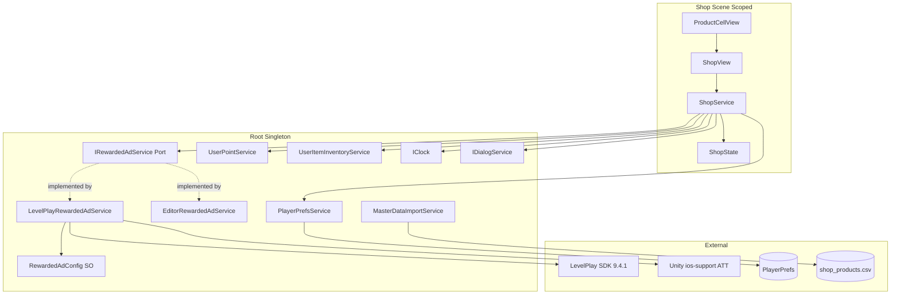
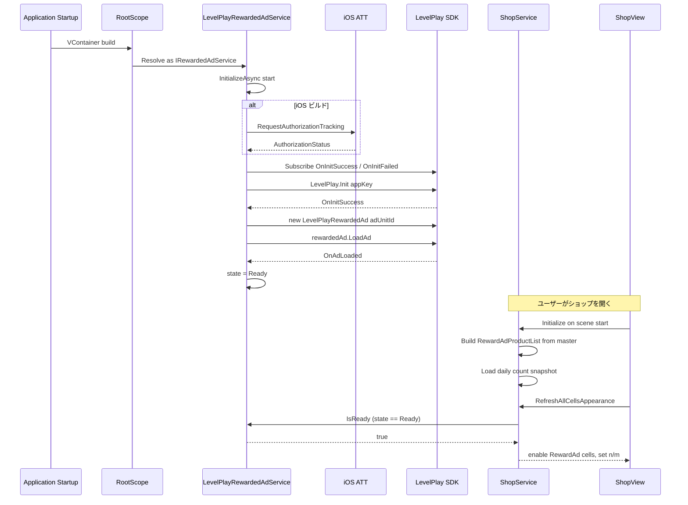
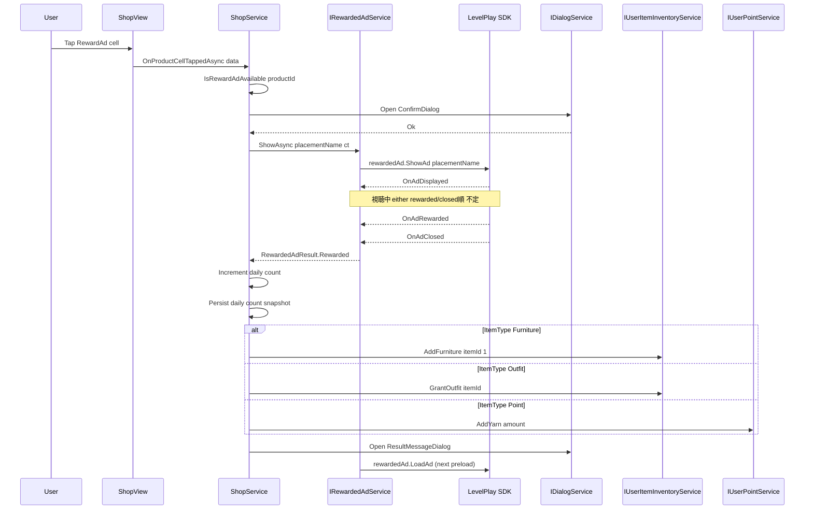
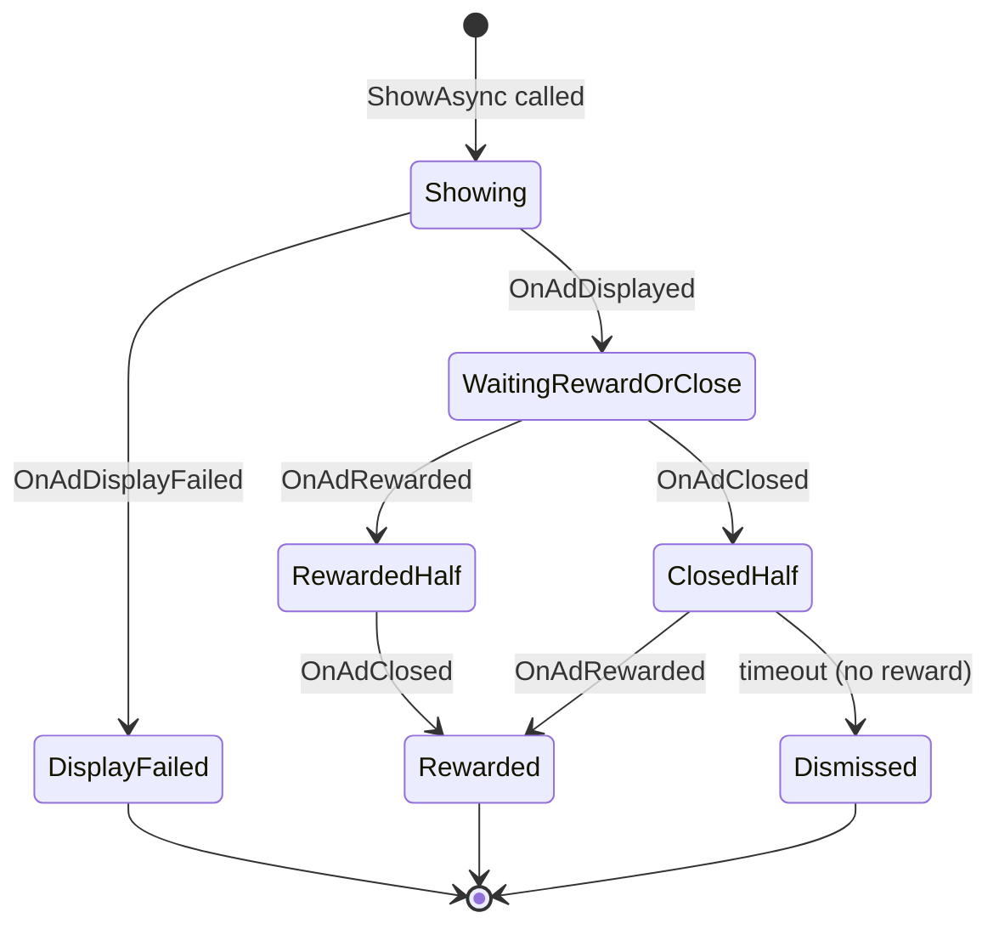

# Design Document: rewarded-ad-shop-product

## Overview

**Purpose**: 本機能はショップ画面における新しい商品獲得チャネルとして、LevelPlay リワード動画広告の視聴と引き換えに家具・着せ替え・毛糸ポイントをプレイヤーへ付与する経路を確立する。既存ショップ実装に意図的に空けられたフックポイント (`CurrencyType.RewardAd`, `ShopState.RewardAdProductList`, `ShopView._rewardAdCells`, `ShopService.OnProductCellTappedAsync` の RewardAd 分岐) を稼働させ、不足する LevelPlay SDK 抽象、マスターデータ拡張、日次キャップ管理、残数表示 UI を補完する。

**Users**: 本アプリのエンドユーザー (毛糸経済を消費せずアイテムを獲得したいプレイヤー) と、運営担当者 (マスターデータのみで商品ラインナップ・付与数・日次上限をコントロールしたい)。

**Impact**: 既存 `ShopService` / `ShopState` / `ProductCellView` / `MasterDataImportService` を後方互換に拡張し、Root レイヤに広告 SDK 抽象を新設する。`shop_products.csv` のスキーマが 6 → 8 カラムに拡張されるが、Yarn 既存商品行は空 2 カラムを追加するのみで意味は変わらない。

### Goals

- LevelPlay SDK 抽象 (`IRewardedAdService`) を Root レイヤに導入し、Shop 層は抽象経由でのみ利用
- リワード広告商品マスターを `shop_products.csv` で運営可能 (付与数・日次上限を含む)
- 視聴完了時のみ報酬付与、視聴セッション間で二重付与しない
- 日次上限消化時は既存売り切れ表示 UI を流用し、JST 0:00 で自動リセット

### Non-Goals

- Server-to-Server コールバックによる付与検証 (クライアント完結 / 既決定)
- バナー広告・インタースティシャル広告
- Real Money (IAP) 商品の実装 (`CurrencyType.RealMoney` は当面コード上の防御のみ維持)
- 海外向け展開 (タイムゾーンは JST 固定)
- Test Suite を本番ビルドに同梱する仕組み (本機能では未対応)

## Architecture

### Existing Architecture Analysis

本機能は以下の既存システムを尊重しながら拡張する：

- **シーンベース + VContainer DI**: `Root.Scope.RootScope` (Singleton) + 各 `SceneScope` (Scoped) の 2 層構造
- **依存方向**: View → Service → State を厳守 (`.kiro/steering/structure.md`)
- **時刻抽象**: `IClock.UtcNow` 経由 (直接 `DateTime.Now` 禁止) — 既存 UTC のみだが、本機能で JST 変換ヘルパを追加
- **永続化パターン**: `PlayerPrefsService.Save<T>(PlayerPrefsKey, value)` + JsonUtility + `Version` フィールド付き Snapshot
- **既存ショップ統合点** (gap-analysis.md 参照): `CurrencyType.RewardAd` / `RewardAdProductList` / `_rewardAdCells` / `OnProductCellTappedAsync` の RewardAd 分岐
- **コーディング規約**: `#nullable enable`、`_camelCase` private フィールド、`[Inject]` コンストラクタ、UniTask 末尾 `CancellationToken`、クラスコンテキスト付きログ

### Architecture Pattern & Boundary Map

採用パターン: **Hexagonal Lite (ポート＆アダプタ)** — 広告 SDK を Root のポート (`IRewardedAdService`) で抽象化し、実機 (LevelPlay) / Editor (即時報酬) / 非対応プラットフォーム (NoOp) の 3 アダプタを VContainer 登録時に切替。



**Architecture Integration**:
- **選択パターン**: Hexagonal Lite — SDK 抽象 1 ポート + 3 アダプタ、本体ロジックは抽象のみに依存
- **ドメイン境界**: 広告 SDK 制御 (Root) と ショップビジネスロジック (Shop) を明確に分離。Shop 層は LevelPlay SDK 型を一切参照しない
- **既存パターン保持**: `IXxxService` パターン、Singleton/Scoped Lifetime、`[Inject]` + `#nullable enable`、`PlayerPrefsKey` enum、Snapshot/Version 永続化
- **新規コンポーネント正当化**:
  - `IRewardedAdService` ポート — Shop と SDK の結合を断つため必須
  - `LevelPlayRewardedAdService` アダプタ — 実機本番、SDK 直接参照を局所化
  - `EditorRewardedAdService` アダプタ — Editor 上での動作確認、テスト容易性
  - `RewardedAdConfig` ScriptableObject — App Key/Ad Unit ID のコードリテラル排除
- **ステアリング適合**: View → Service → State 単方向依存、`IClock` 経由、`PlayerPrefsService` 経由

### Technology Stack & Alignment

| Layer | Choice / Version | Role in Feature | Notes |
|-------|------------------|-----------------|-------|
| Game Engine | Unity 6000.3.12f1 | 実行基盤 | 既存。変更なし |
| DI | VContainer 1.17.0 | サービス登録、コンストラクタ注入 | 既存。`RootScope.Configure` でアダプタ切替 |
| Async | UniTask | `ShowAsync` / `InitializeAsync` の `UniTask<T>` API | 既存 |
| Ad SDK | `com.unity.services.levelplay` 9.4.1 | リワード広告制御 | 新規依存 |
| Ad Dependency Resolver | `com.google.external-dependency-manager` (Git/UPM) | Android/iOS ネイティブ依存解決 | 新規依存 (既導入済み) |
| iOS ATT | `com.unity.ads.ios-support` | ATT ダイアログ表示 | 新規依存 (iOS ビルド時のみ実効) |
| Storage | `PlayerPrefs` 経由 `PlayerPrefsService` | 日次カウント永続化 | 既存。新規 `PlayerPrefsKey.RewardAdDailyCount` |
| Master Data | `Resources/shop_products.csv` | リワード広告商品マスター | 既存、8 カラムに拡張 |
| Config | `RewardedAdConfig` ScriptableObject | App Key / Ad Unit ID 保持 | 新規 |

> 拡張詳細・代替案・SDK API は `research.md` 参照。

## System Flows

### 起動 → 視聴可能までのライフサイクル (Sequence)



### 視聴フロー (Sequence)



### 結果確定ステートマシン (State)



`ClosedHalf` 経過後、報酬イベントが追加で来た場合も `Rewarded` に確定する。`Dismissed` 確定の判定は実装上「`OnAdClosed` 発火 + 一定の grace 時間 (例: 200ms) 経過しても `OnAdRewarded` が来ない」で行う。これは LevelPlay の同一フレーム内発火順序に対応するため。

## Requirements Traceability

| Requirement | Summary | Components | Interfaces | Flows |
|-------------|---------|------------|------------|-------|
| 1.1 / 1.2 | SDK 非同期初期化、成功時の初回ロード発行 | LevelPlayRewardedAdService | `IRewardedAdService.InitializeAsync` | 起動シーケンス |
| 1.3 / 1.4 | 初期化失敗扱い、未完了状態の表明 | LevelPlayRewardedAdService | `IRewardedAdService.State` / `IsReady` | — |
| 1.5 | SDK 型を抽象経由のみで公開 | IRewardedAdService | — | — |
| 2.1–2.6 | ロード制御・指数バックオフ・状態通知 | LevelPlayRewardedAdService | `IRewardedAdService.State`, `OnStateChanged` | 起動シーケンス |
| 3.1 | マスターから RewardAd 抽出して State 投入 | ShopService 拡張 | `BuildRewardAdProductList` | — |
| 3.2 | RewardAd セル描画 | ShopView | 既存 SetupCategoryCells 経由 | — |
| 3.3 / 3.4 | ボタン状態と視聴可否の連動 | ShopService, ShopView | `IRewardedAdService.IsReady`, `IsAffordable`, `RefreshAllCellsAppearance` | — |
| 3.5 | Outfit 既所持 OR 日次残 0 → 売り切れ | ShopService `IsSoldOut` 拡張 | — | — |
| 3.6 | 時限抽選から除外維持 | 既存 ShopService `SplitShopProductsForTimedShop` | — | — |
| 4.1–4.7 | 視聴フロー全体 (ダイアログ・付与・結果メッセージ) | ShopService 拡張 | `OnProductCellTappedAsync` RewardAd 分岐 | 視聴シーケンス |
| 5.1–5.6 | 1 セッション 1 結果、二重付与防止、順序非依存 | LevelPlayRewardedAdService 内 RewardedAdSession | `IRewardedAdService.ShowAsync` | 結果確定ステートマシン |
| 6.1 | 未準備時タップ不成立 | ShopView | 既存 SetInteractable 経由 | — |
| 6.2 / 6.3 / 6.5 | 表示失敗・途中離脱・付与失敗メッセージ | ShopService 拡張 | `IDialogService` | 視聴シーケンス |
| 6.4 | 初期化未完了の長時間検知 | ShopService 拡張 | `IRewardedAdService.State` | — |
| 7.1 | Editor スタブ即時 Rewarded | EditorRewardedAdService | `IRewardedAdService.ShowAsync` | — |
| 7.2 / 7.3 | プラットフォーム別 App Key / Ad Unit | RewardedAdConfig | — | — |
| 7.4 | iOS ATT 応答待ち | LevelPlayRewardedAdService | `InitializeAsync` 内 ATT 呼び出し | 起動シーケンス |
| 7.5 | 構成アセット経由の取得 | RewardedAdConfig | — | — |
| 7.6 | コールバックメインスレッド | LevelPlay SDK 仕様で保証 | — | — |
| 8.1–8.5 | アーキテクチャ規約遵守 | RootScope, IRewardedAdService | — | — |
| 9.1–9.8 | マスター拡張、付与数、日次上限 | MasterDataImportService 拡張, ShopProduct 拡張, ProductData 拡張 | `ShopProduct.Amount/DailyCap` | — |
| 10.1–10.7 | 日次カウント管理・永続化・JST リセット・サイクル更新非干渉 | ShopService 拡張, RewardAdDailyCountSnapshot | `GetDailyRemainingCount`, `IncrementDailyCount` | — |
| 11.1–11.5 | n/m 残数表示 | ProductCellView 拡張, ShopView, ShopService | `SetRemainingCount`, `GetDailyRemainingCount` | — |

## Components and Interfaces

| Component | Domain/Layer | Intent | Req Coverage | Key Dependencies (P0/P1) | Contracts |
|-----------|--------------|--------|--------------|--------------------------|-----------|
| `IRewardedAdService` | Root.Service (port) | 広告 SDK の抽象ポート | 1.5, 5.1, 8.1, 8.2, 8.3 | — | Service, State |
| `LevelPlayRewardedAdService` | Root.Service (adapter) | LevelPlay SDK 実機実装 | 1.1, 1.2, 1.3, 1.4, 2.1–2.6, 5.1, 5.3, 5.4, 5.5, 7.2, 7.3, 7.4, 7.6 | LevelPlay SDK (P0), RewardedAdConfig (P0), IClock (P1) | Service, State |
| `EditorRewardedAdService` | Root.Service (adapter) | Editor 用スタブ | 7.1 | — | Service |
| `RewardedAdConfig` | Root.Service (config SO) | App Key / Ad Unit ID 構成 | 7.2, 7.3, 7.5 | — | State |
| `ShopService` 拡張 | Shop.Service | 視聴フロー・日次キャップ・残数算出 | 3.1, 3.3–3.6, 4.1–4.7, 5.2, 5.6, 6.2–6.5, 10.1–10.7, 11.2, 11.5 | IRewardedAdService (P0), IUserItemInventoryService (P0), IUserPointService (P0), IDialogService (P0), IClock (P0), PlayerPrefsService (P0), ShopState (P0), MasterDataState (P0) | Service, State |
| `ShopProduct` 拡張 | Shop.State | 付与数・日次上限フィールド追加 | 9.1, 9.2, 9.3, 9.6 | — | State |
| `ProductData` 拡張 | Shop.State | UI 用付与数の引き渡し | 4.4 | — | State |
| `RewardAdDailyCountSnapshot` | Shop.State | 日次カウント永続化 Snapshot | 10.1 | — | State |
| `ProductCellView` 拡張 | Shop.View | n/m 残数表示の API 追加 | 11.1, 11.3, 11.4 | — | (UI 拡張のみ) |
| `ShopView` 微修正 | Shop.View | RewardAd セルの残数表示パス呼び出し | 11.2, 11.4 | ShopService (P0), ShopState (P1) | (UI 拡張のみ) |
| `MasterDataImportService` 拡張 | Root.Service | 8 カラム CSV パース対応 | 9.1, 9.2, 9.3, 9.4, 9.5, 9.8 | — | Service |
| `PlayerPrefsKey.RewardAdDailyCount` | Root.Service (enum) | 日次カウント永続化キー | 10.1 | — | State |
| `RootScope` 拡張 | Root.Scope | IRewardedAdService の VContainer 登録 | 7.1, 8.1 | VContainer (P0) | — |

### Root Layer

#### IRewardedAdService

| Field | Detail |
|-------|--------|
| Intent | LevelPlay SDK を Shop 層から完全に隠蔽する抽象ポート |
| Requirements | 1.5, 5.1, 8.1, 8.2, 8.3 |

**Responsibilities & Constraints**
- 初期化、ロード状態管理、視聴セッション開始、結果通知の 4 責務
- 1 回の `ShowAsync` 呼び出しに対し 1 件の終端結果のみ返却 (`Rewarded` / `Dismissed` / `DisplayFailed` / `NotReady` のいずれか)
- 実装クラスは LevelPlay SDK 型を一切公開しない

**Dependencies**
- Inbound: `ShopService` — 視聴フローを駆動 (P0)
- Outbound: なし (抽象)
- External: なし (抽象)

**Contracts**: Service [x] / API [ ] / Event [ ] / Batch [ ] / State [x]

##### Service Interface

```csharp
public enum RewardedAdState
{
    Uninitialized,
    Initializing,
    Loading,
    Ready,
    Showing,
    Failed
}

public enum RewardedAdResult
{
    Rewarded,
    Dismissed,
    DisplayFailed,
    NotReady
}

public interface IRewardedAdService
{
    RewardedAdState State { get; }
    bool IsReady { get; }

    event Action<RewardedAdState> StateChanged;

    UniTask InitializeAsync(CancellationToken cancellationToken);
    UniTask<RewardedAdResult> ShowAsync(string placementName, CancellationToken cancellationToken);
}
```

- Preconditions: `InitializeAsync` は RootScope 完成後 1 回呼ばれる。`ShowAsync` 呼び出し時、`IsReady == true` でない場合は `NotReady` 即時返却
- Postconditions: `ShowAsync` 完了後、内部で次回広告のロードを開始
- Invariants: 同時実行 1 セッションのみ (2 つ目の `ShowAsync` は呼び出し側で排他、Service 側は防御として `NotReady` を返してもよい)

##### State Management
- State モデル: `RewardedAdState` 6 値の有限状態機械
- 持続化: なし (プロセス毎の揮発)
- 並行性: メインスレッド前提 (LevelPlay 仕様)

**Implementation Notes**
- 純粋な抽象。Shop 層含む利用側は LevelPlay 型を参照禁止
- ステート遷移ログは `Debug.Log` でクラスコンテキスト付き

#### LevelPlayRewardedAdService

| Field | Detail |
|-------|--------|
| Intent | LevelPlay SDK 9.4.1 を `IRewardedAdService` に適合させる実機実装 |
| Requirements | 1.1, 1.2, 1.3, 1.4, 2.1–2.6, 5.1, 5.3, 5.4, 5.5, 7.2, 7.3, 7.4, 7.6 |

**Responsibilities & Constraints**
- LevelPlay `Init` → ロード → 表示 → 結果確定 のライフサイクル全体管理
- iOS ビルドでは `InitializeAsync` 内で ATT ダイアログ表示後に `LevelPlay.Init` を呼ぶ
- `OnAdRewarded` / `OnAdClosed` の順序非依存ステートマシン (`RewardedAdSession` 内部クラス)
- ロード失敗時は指数バックオフ (1s, 2s, 4s, 8s, 16s, 32s, 上限 60s) で最大 5 回再試行

**Dependencies**
- Inbound: VContainer 解決経由で `IRewardedAdService` として参照される (P0)
- Outbound: `RewardedAdConfig` — App Key / Ad Unit ID 取得 (P0)、`IClock` — タイムアウトタイマー (P1)
- External: LevelPlay SDK 9.4.1 (P0)、Unity ios-support ATT (P1 / iOS のみ)

**Contracts**: Service [x] / API [ ] / Event [ ] / Batch [ ] / State [x]

**Implementation Notes**
- `#if UNITY_ANDROID || UNITY_IOS` 配下でのみ LevelPlay 型参照、それ以外は internal NoOp パス
- `RewardedAdSession` 内部クラスは 1 セッション 1 インスタンス、`UniTaskCompletionSource<RewardedAdResult>` を 1 個保持
- `_rewardedFired` / `_closedFired` の 2 フラグで `OnAdRewarded` / `OnAdClosed` 合流を判定
- 結果確定後の二重 `TrySetResult` は ignore (`_completed` フラグで防御)
- すべての LevelPlay コールバック内処理はメインスレッド前提 (LevelPlay 仕様)
- ATT 呼び出しは `#if UNITY_IOS && !UNITY_EDITOR` で条件分岐

#### EditorRewardedAdService

| Field | Detail |
|-------|--------|
| Intent | Editor 上で LevelPlay SDK を呼ばずに即時報酬を返すスタブ |
| Requirements | 7.1 |

**Responsibilities & Constraints**
- `InitializeAsync` は即時完了
- `ShowAsync` は短いウェイト (例: 100ms) 後に `RewardedAdResult.Rewarded` を返却
- `IsReady` は常に true、`State` は `Ready` 固定
- 本実装に基づく日次カウント増加は本番と同じ経路で発生 (運用テスト整合性のため)

**Dependencies**
- Inbound: VContainer (P0)
- Outbound: なし
- External: なし

**Contracts**: Service [x] / API [ ] / Event [ ] / Batch [ ] / State [ ]

**Implementation Notes**
- `#if UNITY_EDITOR` 配下でのみ有効
- 永続化キャップを尊重するため、`ShowAsync` 自体は無条件 Rewarded を返し、日次キャップは ShopService 側で判定

#### RewardedAdConfig (ScriptableObject)

| Field | Detail |
|-------|--------|
| Intent | App Key / Rewarded Ad Unit ID のコードリテラル排除と Inspector 設定 |
| Requirements | 7.2, 7.3, 7.5 |

**Responsibilities & Constraints**
- Android / iOS 別の App Key と Rewarded Ad Unit ID を SerializeField で保持
- 公開メソッド `GetAppKey()` / `GetRewardedAdUnitId()` はプリプロセッサで対象を選択
- 配置: `Assets/Settings/Ads/RewardedAdConfig.asset` (Resources or 直接 Inject)

**Contracts**: State [x]

##### State Management
- フィールド:
  ```csharp
  [SerializeField] string _androidAppKey;
  [SerializeField] string _androidRewardedAdUnitId;
  [SerializeField] string _iosAppKey;
  [SerializeField] string _iosRewardedAdUnitId;
  [SerializeField] string _defaultPlacementName = "ShopRewardAd";
  [SerializeField] int _maxLoadRetryCount = 5;
  [SerializeField] float _loadRetryInitialDelaySeconds = 1f;
  [SerializeField] float _loadRetryMaxDelaySeconds = 60f;
  ```

**Implementation Notes**
- VContainer 登録: `builder.RegisterComponent(rewardedAdConfig)` または Resources 経由ロード
- `Resources/RewardedAdConfig` 配置で `Resources.Load<RewardedAdConfig>("RewardedAdConfig")` ロードが最も既存パターン (`Resources/outfits.csv` 等) と整合

### Shop Layer

#### ShopService (拡張)

| Field | Detail |
|-------|--------|
| Intent | リワード広告商品の表示判定・視聴フローオーケストレーション・日次キャップ管理を統合 |
| Requirements | 3.1, 3.3–3.6, 4.1–4.7, 5.2, 5.6, 6.2–6.5, 10.1–10.7, 11.2, 11.5 |

**Responsibilities & Constraints**
- `Initialize` 時に `BuildRewardAdProductList` を呼び `ShopState.RewardAdProductList` を充填
- `Initialize` 時に `LoadRewardAdDailyCount` を呼び永続化スナップショットを復元、JST 日付が変わっていればリセット
- `OnProductCellTappedAsync` の `CurrencyType.RewardAd` 分岐を実装 (確認ダイアログ → `ShowAsync` → 結果分岐 → 付与 → メッセージ)
- `IsSoldOut` を拡張: `Outfit` 既所持 OR (`CurrencyType.RewardAd` かつ日次残数 0) で売り切れ
- `IsAffordable` の `RewardAd` 分岐を「`IRewardedAdService.IsReady` かつ 日次残 ≥ 1」に変更
- 新規 API: `int GetDailyRemainingCount(uint productId)`、`bool IsRewardAdAvailable(uint productId)`
- 視聴セッション単位の完了フラグ (`_processingProductId`) で多重タップ防止

**Dependencies**
- Inbound: `ShopView` — タップイベント (P0)
- Outbound: `IRewardedAdService` — 広告制御 (P0)、`IUserItemInventoryService` (P0)、`IUserPointService` (P0)、`IDialogService` (P0)、`IClock` (P0)、`PlayerPrefsService` (P0)、`ShopState` (P0)、`MasterDataState` (P0)
- External: なし

**Contracts**: Service [x] / API [ ] / Event [ ] / Batch [ ] / State [x]

##### Service Interface (追加部分)

```csharp
public partial class ShopService
{
    public int GetDailyRemainingCount(uint productId);
    public bool IsRewardAdAvailable(uint productId);
    UniTask OnRewardAdProductTappedAsync(ProductData data, CancellationToken ct);
}
```

##### State Management
- 日次カウント: `Dictionary<uint, int> _dailyCountByProductId` をプロセス内保持
- リセット日付: `DateOnly _lastResetJstDate`
- 永続化: `PlayerPrefsKey.RewardAdDailyCount` 経由 `RewardAdDailyCountSnapshot` (Version + Date + 各 productId のカウント)
- 永続化トリガー: 報酬付与成功直後、リセット適用時

**Implementation Notes**
- 既存の `TryGrantPurchasedItem` を `ItemType.Point` ケースに拡張: `_userPointService.AddYarn(data.Amount)`
- 視聴前ダイアログ文言: `購入確認` ではなく `視聴確認` / `広告を視聴してアイテムを獲得しますか？` 等
- 視聴後ダイアログ文言: 報酬付与内容に応じて切替
- 既存の `OnProductCellTappedAsync` の `RewardAd` 分岐 (現状 `return;`) を `await OnRewardAdProductTappedAsync(data, ct)` に置き換え
- マスター再インポート時の整合性: `LoadRewardAdDailyCount` で `MasterDataState.ShopProducts` 上に存在しない productId のエントリは破棄

#### ShopProduct (拡張)

| Field | Detail |
|-------|--------|
| Intent | 付与数と日次上限のマスター属性を保持 |
| Requirements | 9.1, 9.2, 9.3, 9.6 |

**Contracts**: State [x]

##### State Management

```csharp
public sealed record ShopProduct(
    uint Id,
    string Name,
    ItemType ItemType,
    uint ItemId,
    int Price,
    CurrencyType CurrencyType,
    int Amount,           // 付与数 (デフォルト 1、Point/RewardAd で重要)
    int? DailyCap         // 日次上限。null = 既定値適用
);
```

**Implementation Notes**
- 既存 Yarn 商品行は `Amount = 1`, `DailyCap = null` でロード
- `Amount` 列が空文字なら 1、`DailyCap` 列が空文字なら null

#### ProductData (拡張)

| Field | Detail |
|-------|--------|
| Intent | UI と付与処理が `Amount` を参照できるよう拡張 |
| Requirements | 4.4 |

**Contracts**: State [x]

##### State Management

```csharp
public record ProductData(
    string Name,
    string IconPath,
    int Price,
    CurrencyType CurrencyType,
    ProductType ProductType,
    ItemType ItemType,
    uint? ProductId,
    uint? ItemId,
    int? YarnAmount = null,
    int Amount = 1        // 新規: 付与数 (RewardAd / Point で意味を持つ)
);
```

**Implementation Notes**
- 既存 `YarnAmount` は IAP YarnPack 用に残置 (今期未使用)
- `Amount` は `ShopProduct.Amount` をそのまま転送

#### RewardAdDailyCountSnapshot (新規)

| Field | Detail |
|-------|--------|
| Intent | 日次カウント永続化のシリアライズ単位 |
| Requirements | 10.1 |

**Contracts**: State [x]

##### State Management

```csharp
[Serializable]
public class RewardAdDailyCountSnapshot
{
    public const int CurrentVersion = 1;
    public int Version;
    public string JstDate;        // YYYY-MM-DD
    public DailyCountEntry[] Entries;

    [Serializable]
    public class DailyCountEntry
    {
        public uint ProductId;
        public int Count;
    }
}
```

**Implementation Notes**
- `JstDate` は文字列保存で `DateOnly` 直接 JsonUtility 非対応を回避
- 永続化先: `PlayerPrefsKey.RewardAdDailyCount`
- `Version` 不一致時は全リセット (`UserPointSnapshot` と同パターン)

#### ProductCellView (拡張) — Implementation Note

UI 拡張のみのため Full ブロック省略。要件 11.1, 11.3, 11.4 対応。

- **新規 SerializeField**: `[SerializeField] TMP_Text? _remainingCountText`
- **新規 API**: `void SetRemainingCount(int remaining, int dailyCap)` — `_remainingCountText.text = $"{remaining}/{dailyCap}"`。フィールド未割当時は警告ログのみ (既存 `_dimOverlay` パターン踏襲)
- **非表示制御**: 残数 0 のとき `SetSoldOut(true)` を併用 (既存売り切れ Overlay 流用)
- **Yarn 商品で非表示**: `ShopView.RefreshCategoryAppearance` 内で RewardAd 商品の場合のみ `SetRemainingCount` を呼ぶ、それ以外は呼ばない (`_remainingCountText.gameObject.SetActive(false)` のフォールバックも `Setup` で 1 度実施)

#### ShopView (微修正) — Implementation Note

UI 拡張のみのため Full ブロック省略。要件 11.2, 11.4 対応。

- `RefreshCategoryAppearance` で `_rewardAdCells` のみ `SetRemainingCount` 呼び出しを追加
- `SetupCategoryCells` で初回設置時に `SetRemainingCount` を初期化
- 既存 `OnProductCellTapped → ShopService.OnProductCellTappedAsync` のパスをそのまま流用 (内部で RewardAd 分岐に振り分け)

### Root Layer (拡張)

#### MasterDataImportService (拡張)

| Field | Detail |
|-------|--------|
| Intent | `shop_products.csv` の 6 → 8 カラム拡張に対応 |
| Requirements | 9.1, 9.2, 9.3, 9.4, 9.5, 9.8 |

**Contracts**: Service [x]

**Implementation Notes**
- カラム数判定: `if (columns.Length < 8)` (6 → 8 へ変更)
- `amount` パース: 空文字なら 1、`int.TryParse` 失敗時はスキップしログ
- `daily_cap` パース: 空文字なら `null`、`int.TryParse` 失敗時はスキップしログ
- `ShopProduct` コンストラクタ呼び出しを 2 引数増しに変更

#### RootScope (拡張)

| Field | Detail |
|-------|--------|
| Intent | `IRewardedAdService` の VContainer 登録 (プリプロセッサで実装切替) |
| Requirements | 7.1, 8.1 |

**Implementation Notes**

```csharp
// 概念表現 (実装詳細はタスクフェーズ)
#if UNITY_EDITOR
    builder.Register<EditorRewardedAdService>(Lifetime.Singleton).As<IRewardedAdService>();
#elif UNITY_ANDROID || UNITY_IOS
    builder.Register<LevelPlayRewardedAdService>(Lifetime.Singleton).As<IRewardedAdService>();
#else
    builder.Register<EditorRewardedAdService>(Lifetime.Singleton).As<IRewardedAdService>();
#endif

// RewardedAdConfig は Resources からロードして Component 登録、または Resolve 時に Resources.Load
builder.RegisterInstance(Resources.Load<RewardedAdConfig>("RewardedAdConfig"));
```

- `IRewardedAdService` 起動時の `InitializeAsync` を発火するため `RegisterEntryPoint<RewardedAdServiceStarter>()` を追加するか、`UserDataImportService` 同様の IStartable 起点クラスを新設
- 既存 RootScope に 3 行追加程度の最小変更

## Data Models

### Domain Model

- **集約**: `ShopProduct` (マスター属性) と `RewardAdDailyCountState` (動的状態) の 2 つ
- **不変条件**:
  - `ShopProduct.Amount > 0`
  - `ShopProduct.DailyCap > 0` or null
  - 日次カウント `0 <= count <= EffectiveDailyCap`
  - `RewardAdDailyCountSnapshot.JstDate` は ISO 8601 日付形式 (`YYYY-MM-DD`)

### Logical Data Model

**`shop_products.csv` (拡張後ヘッダ)**:
```
id,name,item_type,item_id,price,currency_type,amount,daily_cap
```

| カラム | 型 | Required | デフォルト | 備考 |
|--------|-----|----------|----------|------|
| id | uint | ✓ | — | 商品の一意 ID |
| name | string | ✓ | — | 表示名 |
| item_type | enum | ✓ | — | `furniture` / `outfit` / `point` |
| item_id | uint | ✓ | — | 付与対象 ID (`point` の場合は 0 or 未使用) |
| price | int | ✓ | — | RewardAd 商品では 0 |
| currency_type | string | ✓ | — | `yarn` / `reward_ad` |
| amount | int | optional | 1 | 付与数 (`point` で重要) |
| daily_cap | int | optional | null | 日次上限。null = 既定値 |

**既定日次上限**: `RewardAdShopConstants.DefaultDailyCap = 5` (新規定数クラス、`TimedShopConstants` 同位置に新設)

**例 (リワード広告行追加)**:
```
47,YarnSmallPack,point,0,0,reward_ad,100,5
48,SmallBox,furniture,3,0,reward_ad,1,3
```

### Data Contracts & Integration

**Persistence Snapshot (PlayerPrefs JSON)**:
```json
{
  "Version": 1,
  "JstDate": "2026-05-23",
  "Entries": [
    { "ProductId": 47, "Count": 2 },
    { "ProductId": 48, "Count": 0 }
  ]
}
```

- 保存キー: `PlayerPrefsKey.RewardAdDailyCount` → 文字列キー `"RewardAdDailyCount"`
- `Version` 不一致時は全リセット (Count=0 から再開)
- マスターから消えた `ProductId` のエントリはロード時に破棄

## Error Handling

### Error Strategy

| エラー区分 | 検出 | 対応 |
|-----------|------|------|
| LevelPlay 初期化失敗 | `OnInitFailed` イベント | `RewardedAdState.Failed` に遷移、以降の `ShowAsync` は即時 `NotReady` |
| ロード失敗 | `OnAdLoadFailed` | 指数バックオフ最大 5 回、上限超過で `RewardedAdState.Failed` |
| 表示失敗 | `OnAdDisplayFailed` | `RewardedAdResult.DisplayFailed` 返却、ShopService がメッセージダイアログ表示 |
| 途中離脱 | `OnAdClosed` のみ発火 | `RewardedAdResult.Dismissed` 返却、ShopService が中断メッセージ表示 (誘導文なし) |
| 報酬付与失敗 (`AddFurniture` 等) | 戻り値の `IsSuccess == false` | エラーログ + 結果メッセージで「付与失敗」を併記 (既存 Yarn 商品と同パターン) |
| マスター CSV パースエラー | カラム数不足/数値不正 | 該当行スキップ + Warning ログ、他行は継続 |
| 永続化スナップショット破損 | `JsonUtility.FromJson` で null/例外 | 例外捕捉 → 初期状態にフォールバック + Error ログ |
| JST 日付境界またぎ | 起動時 + 視聴完了時の判定 | 全エントリ Count=0 にリセット + 即時永続化 |

### Monitoring

- すべての異常パスで `Debug.LogError($"[クラス名] {message}")` または `Debug.LogWarning(...)` をクラスコンテキスト付きで出力 (既存パターン踏襲)
- LevelPlay コールバック内ハンドラ例外は try/catch で抑止し、`StateChanged` イベントの後続購読者を保護 (既存 `UserPointService.FireYarnBalanceChanged` パターン踏襲)

## Testing Strategy

### Unit Tests (3–5 件想定)
- `ShopService.GetDailyRemainingCount` — マスター上限・カウント変化・null 既定値の 3 ケース
- `ShopService.IsSoldOut` — Outfit 所持 / RewardAd 日次 0 / 通常状態の判定
- `RewardAdDailyCountSnapshot` シリアライズ/デシリアライズ — Version 整合、マスター不在 productId 排除
- JST 境界判定ヘルパ — UTC 14:59 → JST 23:59、UTC 15:00 → JST 翌日 0:00 の境界
- `MasterDataImportService.ImportShopProducts` — 8 カラム / 旧 6 カラム / 空 amount/daily_cap の各ケース

### Integration Tests (3–5 件想定)
- `ShopService` 視聴フロー (Editor スタブ使用): タップ → 確認 → ShowAsync → Rewarded → 付与 → 日次カウント増 → メッセージ
- 日次キャップ到達 → 売り切れ表示 → JST 翌日 → リセット → 再視聴可能
- マスター再インポートで存在しなくなった productId のカウント破棄
- LevelPlay スタブで `Dismissed` 返却時の中断メッセージ表示 (誘導文なし)

### Manual / E2E (実機検証必須)
- Android 実機: 初回起動 → 広告ロード → ショップ視聴 → 報酬付与
- iOS 実機: ATT ダイアログ表示 → 各応答 (Authorized / Denied) で広告ロード継続
- Editor: スタブで即時 Rewarded 確認 + 日次キャップ到達まで連続視聴

### Performance / Load
- 視聴フロー全体で `ShowAsync` 開始からダイアログ表示完了まで 200ms 以内 (Editor スタブ計測)
- 起動時の広告 Init/Load が UI スレッドをブロックしないこと (UniTask の `Forget` で発火・状態は `IsReady` 経由で問合せ)

## Security Considerations

- **App Key / Ad Unit ID の保護**: ScriptableObject に格納するが、ビルドに同梱されるため難読化はしない (LevelPlay App Key はサーバー検証用ではなくクライアント側識別子のため低リスク)
- **クライアント完結の付与検証**: Server-to-Server コールバックを使わない設計上、改ざんリスクは残存。MVP として許容、将来必要なら `IRewardedAdService` の戻り値検証に署名トークンを追加する余地を残す
- **個人情報**: ATT 応答や広告 ID はアプリで保持しない (LevelPlay 内部のみ)。ユーザー識別は LevelPlay の `LevelPlay.SetDynamicUserId` を MVP では使用しない

## Performance & Scalability

- **広告ロード**: アプリ起動直後にバックグラウンドロード、UniTask 経由で UI ブロックしない
- **日次カウント永続化**: 各視聴後 1 回 `PlayerPrefs.SetString` 呼び出し (既存 UserPointService と同等)。商品数 10 個程度想定なので JSON サイズは 1KB 未満
- **マスター CSV**: 46 行 → 約 50 行への増加。`Resources.Load<TextAsset>` で同期ロード (既存パターン維持)
- **Reward Cell UI**: `_rewardAdCells` の Inspector 設置数 (例: 5) が上限。マスターで定義する商品数はこの数以下とする運用ルール

## Supporting References (Optional)

- 既存ショップ統合点詳細、SDK API 仕様の生引用、CSV 行サンプル、ATT ステータス 5 値の詳細は `research.md` および `gap-analysis.md` 参照
- LevelPlay 公式ドキュメント URL: `research.md` の References セクション
