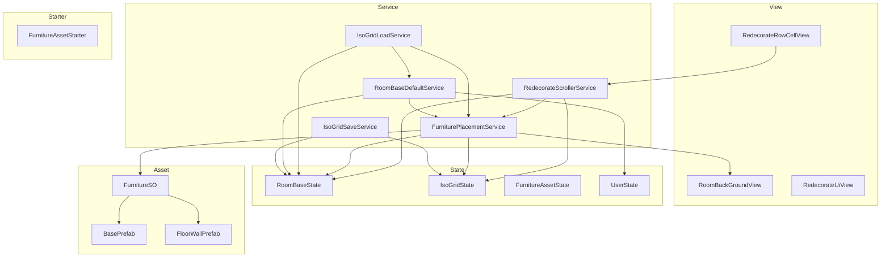
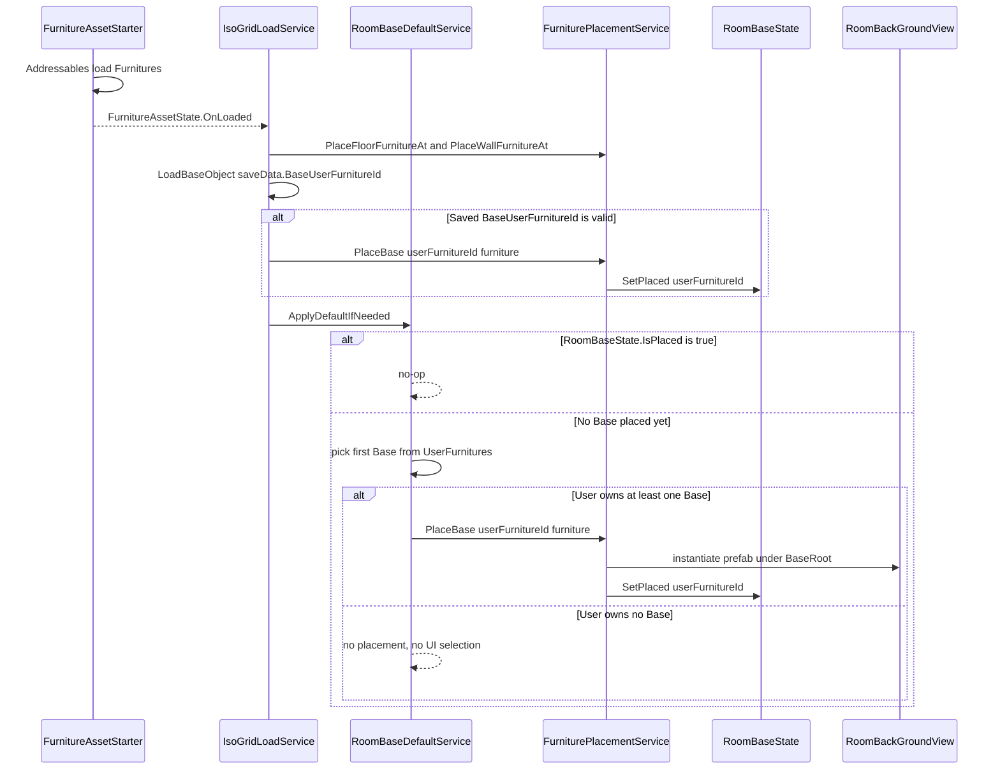
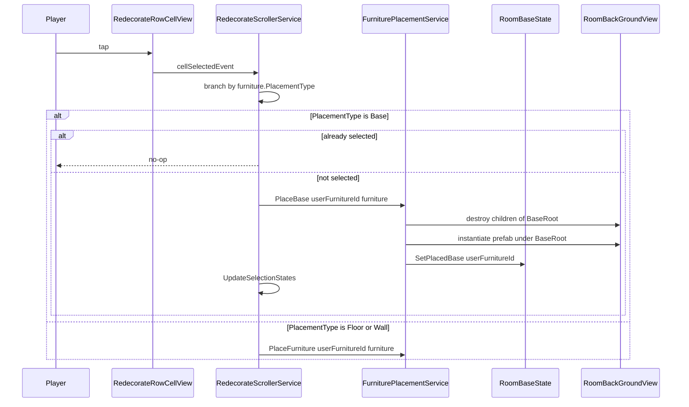
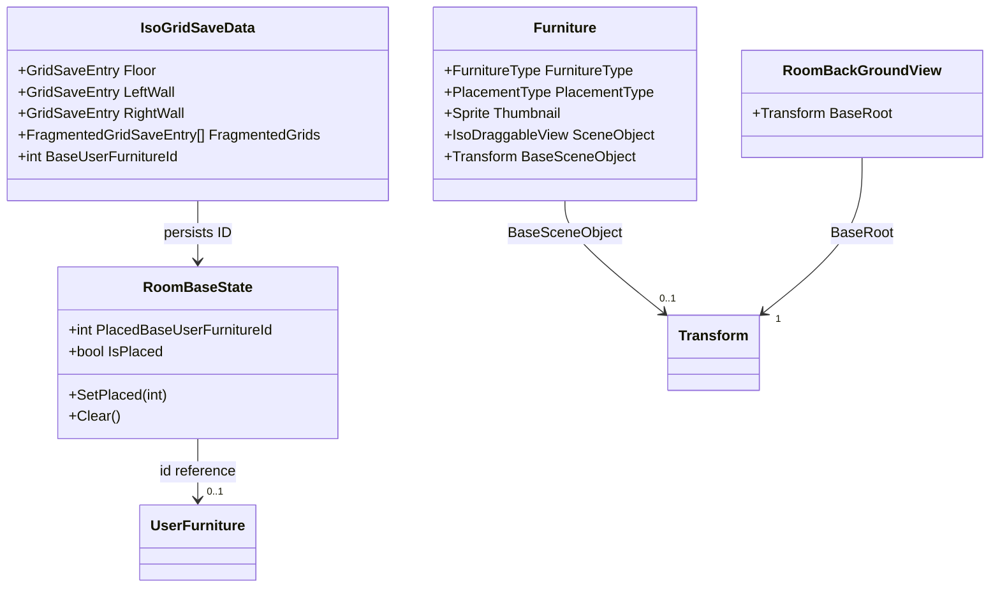
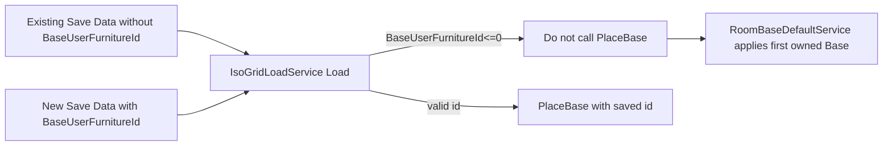

# Technical Design: room-base-placement

## Overview

**Purpose**: Home シーンの模様替えに 3 つ目の家具配置タイプ `PlacementType.Base` (部屋そのもの) を追加し、`RoomBackGround` GameObject 配下にプレイヤー所持 Base を排他的に 1 つだけ配置できるようにする。

**Users**: 模様替え機能を使うプレイヤー、および Home シーン拡張を行う開発者。

**Impact**: 既存の Floor / Wall 配置経路には触れず、`FurniturePlacementService` に専用メソッド `PlaceBase` を新設する。`Cat.Furniture.Furniture` SO に Base プレハブ参照用の新フィールドを 1 つ追加し、`Home.State` に `RoomBaseState`、`Home.View` に `RoomBackGroundView`、`Home.Service` に `RoomBaseDefaultService` を加える。永続化スキーマ `IsoGridSaveData` に Base 用フィールドを 1 件追加する。デフォルト Base 適用は `IsoGridLoadService.Load` 末尾の post-load フックから明示的に呼ぶ (`OnLoaded` 直接購読の競合を回避)。

### Goals
- `PlacementType.Base` のセル選択で `RoomBackGround` 配下に Base を配置できる
- 起動時に「ユーザー所持の最初の Base」を自動配置し、常に 1 つだけ存在させる
- セル再選択で旧 Base 取り外し → 新 Base 配置を同期メソッド内で実行 (中間状態を観測させない)
- Floor / Wall 既存メソッドのシグネチャ・振る舞いを変更しない (要件 5.8)
- Base 経路で `IsoDraggableView` を一切参照しない (要件 5.6 / 5.7)

### Non-Goals
- Base のドラッグ操作・グリッド占有・Fragmented 連携 (構造的に発生しない)
- Closet 機能や Outfit 系への影響
- マスター/ユーザー CSV への BaseA エントリ追加そのもの (動作検証用にデータ作業として別途行う)
- Base 取り外しのみのユーザー操作 UI (要件 6.5 で明示的に提供しない)

## Architecture

### Existing Architecture Analysis

| 観点 | 現状 | 本要件での扱い |
|------|------|----------------|
| 配置サービス | `FurniturePlacementService.PlaceFurniture` が `PlacementType.Wall` のみ分岐し、それ以外はすべて Floor 経路へフォールスルー (`FurniturePlacementService.cs:32-37`) | Base が Floor 経路に流れ込むのを防ぐため `PlaceFurniture` は Base を弾き、専用 `PlaceBase` を呼ぶようにする |
| ScriptableObject | `Furniture.SceneObject : IsoDraggableView` (Floor/Wall 用) | Base 用に `BaseSceneObject : Transform` フィールドを追加 (Floor/Wall は null のまま) |
| グリッド State | `IsoGridState` が Floor / LeftWall / RightWall / FragmentedGrids を保持 (`IsoGridState.cs`) | Base はセルを占有しないため `IsoGridState` には登録しない。新 `RoomBaseState` が現在配置中 ID を保持 |
| ドラッグ系 | `IsoDragService` は `Physics2D.RaycastAll` → `GetComponentInParent<IsoDraggableView>` で対象を検出 (`IsoDragService.cs:328-362`) | Base プレハブには `IsoDraggableView` が無いため自然に検出対象外 (要件 6.2 を構造的に満たす) |
| 永続化 | `IsoGridSaveService` / `IsoGridLoadService` が `IsoGridSaveData` (`Floor/LeftWall/RightWall/FragmentedGrids`) を `PlayerPrefs` に保存 | `IsoGridSaveData` に `BaseUserFurnitureId : int` を追加 (sentinel `-1` = 未設定) |
| 起動シーケンス | `FurnitureAssetStarter` → `FurnitureAssetState.OnLoaded` → `IsoGridLoadService.Load` で Floor/Wall 復元 | `IsoGridLoadService.Load` 末尾で `RoomBaseDefaultService.ApplyDefaultIfNeeded()` を直接呼び、Base 復元 → 不在時のデフォルト適用までを単一エントリで完結 (`OnLoaded` 多重購読を排除) |
| シーン参照 | `RoomBackGround` GameObject は `Home.unity` 上に既存 (Transform のみ、子に `RoomObject`) | `RoomBackGroundView : MonoBehaviour` を新規アタッチし、`HomeScope` の `RegisterComponent` で DI |

### Architecture Pattern & Boundary Map

採用パターン: **既存 View → Service → State レイヤ構造の踏襲 + Base 専用サブシステムの追加**。Floor/Wall 系統と Base 系統を物理的に分離 (異なる State / Service / プレハブフィールド) し、`FurniturePlacementService` のみが両系統のエントリポイントを束ねる。起動時の協調は `IsoGridLoadService.Load` 末尾の post-load フックに集約する (多重 `OnLoaded` 購読を回避)。



**Boundary 整理**:
- `RoomBaseState` は Base 専用の単一選択 ID のみを保持。Floor/Wall 系の `IsoGridState` には影響を与えない。
- `RoomBackGroundView` は `RoomBackGround` GameObject への型安全な参照を提供する Marker View で、Base インスタンスの親 Transform (`BaseRoot`) を露出する。`BaseRoot` 配下は **Base インスタンス専用 Transform** であり、デバッグ補助・装飾オブジェクト等を一切配置してはならない (`PlaceBase` が全子を破棄する不変条件)。
- `FurniturePlacementService` は Floor/Wall 既存パスと Base パスをそれぞれ持ち、内部的に `IsoDraggableView` を扱うコードと扱わないコードが分離される。
- 起動時の責務分離: Floor/Wall/Base 復元 = `IsoGridLoadService`、デフォルト Base フォールバック = `RoomBaseDefaultService`。`IsoGridLoadService.Load` 末尾で `RoomBaseDefaultService.ApplyDefaultIfNeeded()` を直接呼ぶ単線フローとし、両者は `RoomBaseState` を介して結果を引き渡す。

### Technology Stack

| Layer | Choice / Version | Role in Feature | Notes |
|-------|------------------|-----------------|-------|
| Frontend / View | Unity 6 (6000.x) MonoBehaviour | `RoomBackGroundView` の親 Transform 露出 | 既存 View パターン (`CharacterView` 等) と同じ |
| Service / DI | VContainer 1.17.0 | `RoomBaseState` `RoomBackGroundView` `RoomBaseDefaultService` の登録 | `HomeScope` の既存登録パターンを踏襲 |
| Data | C# `[Serializable]` + JsonUtility | `IsoGridSaveData.BaseUserFurnitureId` の追加 | sentinel `-1` で未設定を表現 (JsonUtility は nullable 不可) |
| Asset | ScriptableObject (`Cat.Furniture.Furniture`) + Unity Prefab | Base プレハブの参照を `Transform BaseSceneObject` 経由で保持 | Addressables 経由ロード経路は既存 `FurnitureAssetStarter` を再利用 |
| Persistence | `Root.Service.PlayerPrefsService` (`PlayerPrefsKey.IsoGrid`) | 拡張済み `IsoGridSaveData` を保存 | 既存キーに同居、後方互換は sentinel で確保 |

## System Flows

### Default Base placement on Home startup



決定ポイント:
- `IsoGridLoadService.Load` が `OnLoaded` 唯一のハンドラ。`saveData == null` を含む全分岐で末尾に `RoomBaseDefaultService.ApplyDefaultIfNeeded()` を呼ぶ (単線フロー)。
- `RoomBaseDefaultService` は `IStartable` ではなく通常 Service。`OnLoaded` を直接購読しないため、Multicast Delegate の購読順や VContainer の `RegisterEntryPoint` 順序に依存しない。
- 復元 ID が無効 / ユーザー所持外の場合、`LoadBaseObject` は `PlaceBase` を呼ばず黙って戻り、`ApplyDefaultIfNeeded` がフォールバックで先頭 Base を配置する。

### Cell tap replacement (atomic swap)



`PlaceBase` は同期メソッドとして「旧破棄 → 新生成 → State 更新」を 1 コールで完結させ、要件 4.5 の中間状態非観測を構造的に保証する。

## Requirements Traceability

| Requirement | Summary | Components | Interfaces | Flows |
|-------------|---------|------------|------------|-------|
| 1.1 | Base セル選択で `RoomBackGround` 配下に配置 | `FurniturePlacementService`, `RedecorateScrollerService`, `RoomBackGroundView` | `PlaceBase` | Cell tap |
| 1.2 | `IsoGridState` に登録しない | `FurniturePlacementService` | `PlaceBase` | Cell tap |
| 1.3 | 親が `RoomBackGround` のままを保証 | `FurniturePlacementService`, `RoomBackGroundView` | `PlaceBase` | Cell tap |
| 1.4 | プレハブ参照が null なら警告 + 配置失敗 | `FurniturePlacementService` | `PlaceBase` | — |
| 2.1 | 常に 1 つの Base がアクティブ | `RoomBaseState`, `FurniturePlacementService`, `RoomBaseDefaultService` | `PlaceBase`, `RoomBaseState.PlacedBaseUserFurnitureId` | Default placement |
| 2.2 | 2 つ以上の Base を発生させない | `FurniturePlacementService` | `PlaceBase` (内部で旧 Base を必ず除去) | Cell tap |
| 2.3 | 配置中の Base セルが選択中表示 | `RedecorateScrollerService`, `RedecorateFurnitureData` | `UpdateSelectionStates` | Cell tap |
| 2.4 | Base 未配置状態をユーザー操作で発生させない | `RedecorateScrollerService` | `OnCellViewSelected` (Base 取り外し UI を提供しない) | Cell tap |
| 3.1 | 起動時にデフォルト Base を配置 | `RoomBaseDefaultService`, `IsoGridLoadService`, `FurniturePlacementService` | `RoomBaseDefaultService.ApplyDefaultIfNeeded` | Default placement |
| 3.2 | デフォルトは `UserFurnitures` 内の最初の Base | `RoomBaseDefaultService` | `RoomBaseDefaultService.ApplyDefaultIfNeeded` | Default placement |
| 3.3 | Base 未所持なら配置せず選択中表示も無し | `RoomBaseDefaultService`, `RedecorateScrollerService` | `RoomBaseState.PlacedBaseUserFurnitureId == -1` 分岐 | Default placement |
| 3.4 | 起動時に対応セルを選択中表示 | `RedecorateScrollerService` | `UpdateSelectionStates` | Default placement → Redecorate Open |
| 4.1 | 別 Base タップで新規配置 | `RedecorateScrollerService`, `FurniturePlacementService` | `PlaceBase` | Cell tap |
| 4.2 | 旧 Base シーンオブジェクトの取り外し | `FurniturePlacementService` | `PlaceBase` | Cell tap |
| 4.3 | 既選択 Base 再タップは何もしない | `RedecorateScrollerService` | `OnCellViewSelected` (Base 分岐) | Cell tap |
| 4.4 | UI セル選択中表示の更新 | `RedecorateScrollerService` | `UpdateSelectionStates` | Cell tap |
| 4.5 | 中間状態 (0 個 / 2 個以上) を観測させない | `FurniturePlacementService` | `PlaceBase` (同期メソッド) | Cell tap |
| 5.1 | `PlaceBase` メソッド公開 | `FurniturePlacementService` | `PlaceBase` | — |
| 5.2 | 入力は `userFurnitureId` と `Cat.Furniture.Furniture` | `FurniturePlacementService` | `PlaceBase` | — |
| 5.3 | 既存 Base を取り外して新規配置 | `FurniturePlacementService` | `PlaceBase` | Cell tap |
| 5.4 | `PlacementType` が Base 以外なら警告 | `FurniturePlacementService` | `PlaceBase` | — |
| 5.5 | `RedecorateScrollerService` が `PlaceBase` を呼ぶ | `RedecorateScrollerService` | `OnCellViewSelected` | Cell tap |
| 5.6 | `IsoDraggableView` を一切参照しない | `FurniturePlacementService` | `PlaceBase` | — |
| 5.7 | `Furniture.SceneObject` (IsoDraggableView 型) に依存しない | `FurniturePlacementService`, `Furniture` SO | `PlaceBase`, `Furniture.BaseSceneObject` | — |
| 5.8 | Floor/Wall 既存メソッド非変更 | `FurniturePlacementService` | 既存 4 メソッド | — |
| 6.1 | Base プレハブに `IsoDraggableView` を付けない | `Furniture` SO 運用ルール, Base プレハブ | — | — |
| 6.2 | Iso Drag System は Base を検出しない | `IsoDragService` (既存) | (副次的: Base に IsoDraggableView が無いため Raycast で対象外) | — |
| 6.3 | Floor/LeftWall/RightWall/Fragmented を占有しない | `FurniturePlacementService` | `PlaceBase` (IsoGridState を触らない) | — |
| 6.4 | Floor/Wall 配置可否判定に影響を与えない | `FurniturePlacementService` | (既存ロジック) | — |
| 6.5 | Base 取り外しのみの UI を提供しない | `RedecorateScrollerService` | `OnCellViewSelected` (Base ブランチに削除分岐を作らない) | — |
| 7.1 | View → Service → State の依存方向を守る | 全コンポーネント | — | — |
| 7.2 | Base 専用状態は `Home.State` 配下 | `RoomBaseState` | — | — |
| 7.3 | 配置・差し替えオーケストレーションを Service 層で実行 | `FurniturePlacementService` | `PlaceBase` | — |
| 7.4 | コーディング規約に準拠 | 全新規ファイル | — | — |
| 7.5 | `HomeScope` の DI 登録パターンに沿う | `HomeScope` | `Configure` | — |

## Components and Interfaces

| Component | Domain/Layer | Intent | Req Coverage | Key Dependencies (P0/P1) | Contracts |
|-----------|--------------|--------|--------------|--------------------------|-----------|
| `Cat.Furniture.Furniture` (拡張) | Asset / SO | Base プレハブ参照を保持する `BaseSceneObject` フィールド追加 | 5.7, 1.4 | — | State |
| `Home.State.RoomBaseState` | State | 現在配置中の Base の `userFurnitureId` を保持 | 2.1, 2.2, 7.2 | — | State |
| `Home.View.RoomBackGroundView` | View | `RoomBackGround` GameObject の型安全な参照と Base 親 Transform を提供 | 1.1, 1.3 | (Scene 上の `RoomBackGround` GameObject) (P0) | View |
| `Home.Service.FurniturePlacementService` (拡張) | Service | `PlaceBase` メソッド追加、`PlaceFurniture` の Base 弾き | 1.1-1.4, 2.2, 4.2, 4.5, 5.1-5.8, 6.3, 7.3 | `RoomBaseState` (P0), `RoomBackGroundView` (P0), 既存 `IsoGridState`/`IsoGridService` (P1) | Service |
| `Home.Service.RedecorateScrollerService` (拡張) | Service | Base セル分岐とデフォルト後の選択表示同期 | 1.1, 2.3, 2.4, 3.4, 4.1, 4.3, 4.4, 5.5, 6.5 | `FurniturePlacementService` (P0), `RoomBaseState` (P0) | Service |
| `Home.Service.RoomBaseDefaultService` | Service | ロード後フックでデフォルト Base を必要時のみ配置 | 3.1, 3.2, 3.3 | `UserState` (P0), `MasterDataState` (P0), `FurnitureAssetState` (P0), `FurniturePlacementService` (P0), `RoomBaseState` (P0) | Service |
| `Home.Service.IsoGridSaveService` (拡張) | Service | Base ID を `IsoGridSaveData` に書き出す | 2.1 (永続) | `RoomBaseState` (P0) | Batch |
| `Home.Service.IsoGridLoadService` (拡張) | Service | Base 復元 (`LoadBaseObject`) と `RoomBaseDefaultService.ApplyDefaultIfNeeded` の post-load 呼び出し | 3.1 (復元) | `RoomBaseState` (P0), `FurniturePlacementService` (P0), `RoomBaseDefaultService` (P0) | Batch |
| `Root.State.IsoGridSaveData` (拡張) | State | `BaseUserFurnitureId` フィールド追加 | 2.1 (永続) | — | State |
| `Home.Scope.HomeScope` (拡張) | Scope | 新規 State / View / Starter の DI 登録 | 7.5 | VContainer (P0) | — |

### Asset / SO

#### `Cat.Furniture.Furniture` (extension)

| Field | Detail |
|-------|--------|
| Intent | Floor/Wall 用 `SceneObject` (`IsoDraggableView`) と独立した、Base プレハブ参照フィールドを追加する |
| Requirements | 1.4, 5.7 |

**Responsibilities & Constraints**
- Base プレハブの Root Transform を `BaseSceneObject` フィールドで保持する。
- 既存の `SceneObject` フィールドは Floor / Wall 専用。Base 家具では null のまま運用される。
- Floor/Wall 家具では `BaseSceneObject` を null のまま運用する。
- 既存 SO 資産 (`LargeBox.asset` 等) は新フィールドが追加されてもデフォルト null となり、機能影響無し。

**Contracts**: State [x]

##### State Definition
```csharp
namespace Cat.Furniture
{
    public class Furniture : ScriptableObject
    {
        public FurnitureType FurnitureType;
        public PlacementType PlacementType;
        public Sprite Thumbnail;
        public IsoDraggableView SceneObject;        // Floor/Wall 用 (既存)
        public Transform BaseSceneObject;           // Base 用 (新規)
    }
}
```
- Invariants: `PlacementType.Base` の SO は `BaseSceneObject != null` かつ `SceneObject == null`。Floor / Wall は逆。
- 検証: `PlaceBase` 実行時に `furniture.PlacementType == Base` と `BaseSceneObject != null` を確認 (要件 1.4, 5.4)。

**Implementation Notes**
- Integration: BaseA.asset の `BaseSceneObject` に `BaseA.prefab` の Root Transform を割り当てる作業をタスクに含める。
- Validation: 設計上は実行時チェックのみ。エディタ側の `OnValidate` は導入しない (オーバーエンジニアリング回避)。
- Risks: Furniture SO アセットすべてに `BaseSceneObject: {fileID: 0}` がメタ追記される (機能影響なし、レビュー時に告知)。

### State

#### `Home.State.RoomBaseState`

| Field | Detail |
|-------|--------|
| Intent | 現在 `RoomBackGround` 配下に配置中の Base の `userFurnitureId` を一意に保持する単純データ State |
| Requirements | 2.1, 2.2, 7.2 |

**Responsibilities & Constraints**
- 単一フィールド `int PlacedBaseUserFurnitureId` (sentinel `-1` = 未配置) を保持する。
- GameObject 参照は持たない (純粋データ。Service が `RoomBackGroundView` 経由で実体を参照)。
- 値の変更は `FurniturePlacementService.PlaceBase` (および `IsoGridLoadService` での復元) からのみ行う。

**Dependencies**
- Inbound: `FurniturePlacementService` — set/get (P0)
- Inbound: `RedecorateScrollerService` — read (UpdateSelectionStates) (P0)
- Inbound: `RoomBaseDefaultService` — read (default skip 判定) (P0)
- Inbound: `IsoGridLoadService` — set (復元時) (P0)
- Inbound: `IsoGridSaveService` — read (保存時) (P0)

**Contracts**: State [x]

##### State Definition
```csharp
namespace Home.State
{
    public class RoomBaseState
    {
        public const int UnplacedId = -1;

        public int PlacedBaseUserFurnitureId { get; private set; } = UnplacedId;

        public bool IsPlaced => PlacedBaseUserFurnitureId != UnplacedId;

        public void SetPlaced(int userFurnitureId) => PlacedBaseUserFurnitureId = userFurnitureId;
        public void Clear() => PlacedBaseUserFurnitureId = UnplacedId;
    }
}
```
- Preconditions: `SetPlaced` は呼び出し側が事前にシーン上の旧 Base を破棄済みであること (`PlaceBase` がこれを保証)。
- Invariants: `IsPlaced == true` の時、`RoomBackGroundView` の Base コンテナに対応 GameObject が存在する。
- 並行性: VContainer Scoped (HomeScope ライフサイクル) + Unity メインスレッドのみアクセス。

**Implementation Notes**
- Integration: `HomeScope.Register<RoomBaseState>(Lifetime.Scoped)`。
- Validation: なし (内部不変条件は `PlaceBase` 側の同期実行で担保)。
- Risks: `RoomBaseState` と実際の GameObject の整合は `PlaceBase` を経由しない経路では崩れる。設計上は `PlaceBase` のみが Base GameObject を生成・破棄する唯一のエントリポイントとする。

### View

#### `Home.View.RoomBackGroundView`

| Field | Detail |
|-------|--------|
| Intent | `RoomBackGround` GameObject への型安全な参照と、Base インスタンスの親 Transform を提供する Marker View |
| Requirements | 1.1, 1.3 |

**Responsibilities & Constraints**
- `RoomBackGround` GameObject にアタッチされ、`HomeScope` から `RegisterComponent` 経由で DI される。
- 子に Base 専用コンテナ Transform `_baseRoot` を `[SerializeField]` で保持し、`Transform BaseRoot` プロパティで露出する。
- **不変条件 (運用ルール)**: `_baseRoot` 直下に存在する Transform は **常に Base インスタンスのみ** とする。`PlaceBase` は配置のたびに `_baseRoot` の **全子を無条件に `Object.Destroy`** することで「2 個以上同時配置」(要件 2.2) と「中間状態の非観測」(要件 4.5) を構造的に保証する設計。デバッグ用 GameObject、エディタ補助物、装飾オブジェクトを `_baseRoot` 配下に配置することを禁止する。
- 既存の `RoomBackGround` 直下子オブジェクト (`RoomObject` 等) は `_baseRoot` の **兄弟** として配置し、Base 配置・破棄処理の影響を受けないものとする。

**Dependencies**
- Outbound: なし (View はリーフ)
- Inbound: `FurniturePlacementService` — `BaseRoot` 経由で全子破棄 + 子としてインスタンス化 (P0)

**Contracts**: View [x]

##### Component Definition
```csharp
namespace Home.View
{
    /// `RoomBackGround` GameObject を表す Marker View。
    /// `_baseRoot` 配下は Base インスタンス専用領域であり、`PlaceBase` が呼び出されるたびに
    /// `_baseRoot` の全子が無条件に `Object.Destroy` される。
    /// デバッグ補助・装飾等を `_baseRoot` 配下に置くことを禁止する。
    public class RoomBackGroundView : MonoBehaviour
    {
        [Header("Base 配置専用ルート (このTransform直下にBase以外を置かないこと)")]
        [SerializeField] Transform _baseRoot;

        /// Base インスタンスの親 Transform。
        /// 直下の子は Base インスタンスのみが存在することを呼び出し側が保証する。
        /// `PlaceBase` はこの直下の全子を破棄する。
        public Transform BaseRoot => _baseRoot;
    }
}
```

**Implementation Notes**
- Integration: シーン上の `RoomBackGround` GameObject に `RoomBackGroundView` をアタッチし、`_baseRoot` には新規子 Transform `Bases` を作って割り当てる。既存子 `RoomObject` は `RoomBackGround` 直下のまま維持し、`Bases` の **外側** に配置する (兄弟関係)。
- Validation: `_baseRoot` 未設定の場合、`PlaceBase` が NullReferenceException 級になる。Inspector アサインを必須とし、ランタイムでの null チェック警告は `PlaceBase` に集約する。
- Risks: `BaseRoot` 配下に他オブジェクトが混入すると `PlaceBase` 実行時に無告知で破棄される。これは要件 2.2 / 4.5 を構造保証するための意図的設計。`[Header]` 注記とクラス・プロパティの doc コメントで運用ルールを明示することで、レビュー時に検出しやすくする。
- Risks: 既存の `RoomBackGround.transform.position` (-0.039, 4.49, 0) を維持。`_baseRoot` の Local 座標は (0, 0, 0) を推奨し、Base プレハブ自身が SpriteRenderer の SortingOrder を保持する。

### Service

#### `Home.Service.FurniturePlacementService` (extension)

| Field | Detail |
|-------|--------|
| Intent | 既存の Floor/Wall/Fragmented 配置 API に加え、Base 専用の `PlaceBase` を公開する。 |
| Requirements | 1.1-1.4, 2.2, 4.2, 4.5, 5.1-5.8, 6.3, 7.3 |

**Responsibilities & Constraints**
- `PlaceBase(int userFurnitureId, Cat.Furniture.Furniture furniture)` を新設。
- Base 経路では `IsoGridState` / `IsoGridService` / `IsoDraggableView` / `FindObjectsByType<IsoDraggableView>` を一切呼ばない。
- `PlaceFurniture` の冒頭分岐に `PlacementType.Base` 弾きを追加し、誤って Floor 経路に流れないようにする (要件 5.5 を構造的に補強)。
- 既存 4 メソッド (`PlaceFurniture`, `PlaceFloorFurnitureAt`, `PlaceWallFurnitureAt`, `PlaceFragmentedFurnitureAt`) のシグネチャ・振る舞いは変更しない (要件 5.8)。

**Dependencies**
- Inbound: `RedecorateScrollerService`, `RoomBaseDefaultService`, `IsoGridLoadService` — `PlaceBase` 呼び出し (P0)
- Outbound: `RoomBaseState` — set (P0)
- Outbound: `RoomBackGroundView` — `BaseRoot` 経由で子破棄/生成 (P0)
- External: Unity `Object.Instantiate` / `Object.Destroy` / `SceneManager.MoveGameObjectToScene` (P0)

**Contracts**: Service [x]

##### Service Interface
```csharp
namespace Home.Service
{
    public partial class FurniturePlacementService
    {
        // 既存メソッド (変更なし)
        public Vector3? PlaceFurniture(int userFurnitureId, Cat.Furniture.Furniture furniture);
        public Vector3? PlaceFloorFurnitureAt(int userFurnitureId, Cat.Furniture.Furniture furniture, Vector2Int gridPos);
        public Vector3? PlaceWallFurnitureAt(int userFurnitureId, Cat.Furniture.Furniture furniture, WallSide side, Vector2Int gridPos);
        public Vector3? PlaceFragmentedFurnitureAt(int parentUserFurnitureId, int userFurnitureId, Cat.Furniture.Furniture furniture, Vector2Int localGridPos);
        public bool RemoveFurniture(int userFurnitureId, Cat.Furniture.Furniture furniture);

        // 新規メソッド
        public bool PlaceBase(int userFurnitureId, Cat.Furniture.Furniture furniture);
    }
}
```
- `PlaceBase` Preconditions:
  - `furniture != null`
  - `furniture.PlacementType == PlacementType.Base` (異なる場合は警告ログ + false 返却 / 要件 5.4)
  - `furniture.BaseSceneObject != null` (null の場合は警告ログ + false 返却 / 要件 1.4)
- `PlaceBase` Postconditions:
  - 戻り値 true の場合: `RoomBackGroundView.BaseRoot` の子に新しい Base インスタンスが 1 個だけ存在し、`RoomBaseState.PlacedBaseUserFurnitureId == userFurnitureId`。
  - 戻り値 false の場合: 既存の Base 配置状態は変更されない。
- Invariants:
  - 同期メソッドであり、メソッド内の中間状態 (旧破棄後・新生成前) は外部観測不可 (要件 4.5)。
  - Floor/Wall 経路の `IsoGridState` は `PlaceBase` から触らない (要件 1.2, 6.3)。

##### `PlaceBase` 内部処理 (擬似フロー)
1. `PlacementType` 検証 → 不一致なら `Debug.LogWarning` + return false。
2. `BaseSceneObject` 検証 → null なら `Debug.LogWarning` + return false。
3. `RoomBackGroundView.BaseRoot` の **全子 Transform を無条件で `Object.Destroy`** (旧 Base の取り外し / 要件 4.2 + 要件 2.2 の構造保証)。`BaseRoot` 配下は Base 専用とする運用ルールに依存する (詳細は `RoomBackGroundView` 節)。
4. `Object.Instantiate(furniture.BaseSceneObject, BaseRoot)` で新 Base を生成。`SceneManager.MoveGameObjectToScene` で Home シーンへ明示移動 (`PlaceFloorFurnitureAt` 既存パターン踏襲)。
5. `RoomBaseState.SetPlaced(userFurnitureId)` で State 同期。
6. return true。

手順 3〜5 は同期メソッド内で連続実行され、外部観測可能な中間状態 (旧 Base が破棄され新 Base が未生成) が存在しない (要件 4.5)。

**Implementation Notes**
- Integration: `PlaceFurniture` の先頭で `if (furniture.PlacementType == PlacementType.Base) { Debug.LogWarning("[FurniturePlacementService] Use PlaceBase for Base placement type"); return null; }` を追加 (誤呼び出しに対する fail-fast)。`RedecorateScrollerService` 側で正しく分岐するよう徹底する (要件 5.5)。
- Validation: `BaseRoot` の **直下のみ** を破棄対象とし、`RoomBackGround` 兄弟階層 (`RoomObject` 等) には触れない。`foreach (Transform child in _baseRoot) Object.Destroy(child.gameObject);` のような単純な実装で十分。
- Risks: `BaseRoot` 配下に意図しない子オブジェクトが存在すると `PlaceBase` 実行時に破棄される。これは要件 2.2 / 4.5 を構造保証するための意図的挙動であり、運用ルール (Base インスタンス以外を `BaseRoot` 配下に置かない) を `RoomBackGroundView` のクラス doc コメント・`[Header]` 注記・本設計書で明文化する。命名 prefix や instanceId による選別は導入しない (シンプルさ優先)。

#### `Home.Service.RedecorateScrollerService` (extension)

| Field | Detail |
|-------|--------|
| Intent | セル選択イベントで `PlacementType.Base` を分岐し `PlaceBase` へ委譲、選択中表示の判定にも `RoomBaseState` を加味する。 |
| Requirements | 1.1, 2.3, 2.4, 3.4, 4.1, 4.3, 4.4, 5.5, 6.5 |

**Responsibilities & Constraints**
- DI に `RoomBaseState` を追加 (コンストラクタ + `[Inject]`)。
- `OnCellViewSelected`: `furniture.PlacementType` で分岐し、Base の場合は既選択判定→未選択時のみ `PlaceBase` を呼び出す (要件 4.3)。Floor / Wall は既存通り `PlaceFurniture` を呼ぶ。
- `UpdateSelectionStates`: Base 種別データの `Selected` 判定を `RoomBaseState.PlacedBaseUserFurnitureId == data.UserFurnitureId` に切り替える。Floor/Wall は既存の `IsoGridState.EnumerateAllGrids` 判定を維持する。
- Base 取り外し UI を提供しないため、Base ブランチに「再タップで取り外し」分岐は実装しない (要件 4.3, 6.5)。

**Dependencies**
- Inbound: `RedecorateRowCellView` — `cellSelectedEvent` (既存 P0)
- Outbound: `FurniturePlacementService` — `PlaceBase` / `PlaceFurniture` (P0)
- Outbound: `RoomBaseState` — read (P0)
- Outbound: `IsoGridState` — read (既存 P1)

**Contracts**: Service [x]

##### Updated Method Sketches
```csharp
void OnCellViewSelected(RedecorateRowCellView cellView)
{
    // ... 既存ガード ...
    var furniture = selectedData.Furniture;
    var userFurnitureId = selectedData.UserFurnitureId;

    if (furniture.PlacementType == PlacementType.Base)
    {
        if (!selectedData.Selected)
        {
            _furniturePlacementService.PlaceBase(userFurnitureId, furniture);
            // Base はカメラ移動・Tiny 化を行わない (背景差し替えのみ)
        }
        UpdateSelectionStates();
        return;
    }

    // 既存 Floor / Wall 経路 (変更なし)
    if (!selectedData.Selected) { /* PlaceFurniture + camera/tiny */ }
    UpdateSelectionStates();
}

public void UpdateSelectionStates()
{
    for (var i = 0; i < _data.Count; i++)
    {
        var data = _data[i];
        if (data.Furniture.PlacementType == PlacementType.Base)
        {
            data.Selected = _roomBaseState.PlacedBaseUserFurnitureId == data.UserFurnitureId;
        }
        else
        {
            data.Selected = _isoGridState.EnumerateAllGrids()
                .Any(g => g.ObjectPositions.ContainsKey(data.UserFurnitureId));
        }
    }
}
```

**Implementation Notes**
- Integration: 既存テスト (もしあれば) では Floor/Wall 種別データの判定経路が変わらないことを確認する。
- Validation: Base 種別かつ `_data[i].Furniture == null` のケースは既存ガードでスキップ済み。
- Risks: 起動直後 (Redecorate 未オープン) は `_data` が空のため `UpdateSelectionStates` を呼んでも副作用なし。Open 時の `LoadData` 経由で再評価される。

#### `Home.Service.IsoGridSaveService` / `IsoGridLoadService` (extension)

| Field | Detail |
|-------|--------|
| Intent | 既存の Floor/Wall/Fragmented 永続化に Base ID の入出力を追加し、Load 末尾でデフォルト適用フックを呼ぶ。 |
| Requirements | 2.1 (永続), 3.1 (復元) |

**Responsibilities & Constraints**
- `IsoGridSaveService.Save`: `IsoGridSaveData.BaseUserFurnitureId = _roomBaseState.PlacedBaseUserFurnitureId` を書き込む。コンストラクタ DI に `RoomBaseState` を追加 (`[Inject]` 必須)。
- `IsoGridLoadService.Load`: 既存の Floor/Wall/Fragmented 復元の後に新メソッド `LoadBaseObject(int)` を呼ぶ。さらに最末尾 (saveData が null の経路を含むすべての分岐の後) で `_roomBaseDefaultService.ApplyDefaultIfNeeded()` を呼ぶ。コンストラクタ DI に `RoomBaseDefaultService` を追加。
- **`GetFurnitureAsset` には一切手を加えない** (Floor/Wall 既存挙動・要件 5.8 のスピリットを保持)。Base 復元は `LoadBaseObject` に閉じ、その内部で `PlacementType == Base` と `BaseSceneObject != null` を独自検証する。

**Contracts**: Batch [x]

##### Save Snippet
```csharp
var saveData = new IsoGridSaveData
{
    Floor = ...,
    LeftWall = ...,
    RightWall = ...,
    FragmentedGrids = ...,
    BaseUserFurnitureId = _roomBaseState.PlacedBaseUserFurnitureId,
};
```

##### Load — Top-level Flow
```csharp
void Load()
{
    _furnitureAssetState.OnLoaded -= Load;

    var saveData = _playerPrefsService.Load<IsoGridSaveData>(PlayerPrefsKey.IsoGrid);

    if (saveData != null)
    {
        _userState.IsoGridSaveData = saveData;

        var floorLoaded = LoadFloorObjects(saveData.Floor);
        var leftWallLoaded = LoadWallObjects(saveData.LeftWall, WallSide.Left);
        var rightWallLoaded = LoadWallObjects(saveData.RightWall, WallSide.Right);
        var fragmentedLoaded = LoadFragmentedObjects(saveData.FragmentedGrids);
        LoadBaseObject(saveData.BaseUserFurnitureId);

        Debug.Log($"IsoGridLoadService: Loaded Floor={floorLoaded}, LeftWall={leftWallLoaded}, RightWall={rightWallLoaded}, Fragmented={fragmentedLoaded}, Base={_roomBaseState.PlacedBaseUserFurnitureId}");
    }
    else
    {
        Debug.Log("IsoGridLoadService: No saved data found");
    }

    // Post-load フック: 保存値の有無に関わらずここで必ずデフォルト適用判定を行う。
    // `RoomBaseDefaultService` 側で `RoomBaseState.IsPlaced == true` ならスキップ。
    _roomBaseDefaultService.ApplyDefaultIfNeeded();
}
```

##### Load — `LoadBaseObject` (Base 専用パス、`GetFurnitureAsset` を使わない)
```csharp
void LoadBaseObject(int baseUserFurnitureId)
{
    if (baseUserFurnitureId <= 0) return; // -1 sentinel または旧データの 0 は未設定扱い

    var userFurniture = _userState.UserFurnitures?
        .FirstOrDefault(f => f.Id == baseUserFurnitureId);
    if (userFurniture is null) return;

    var masterFurniture = _masterDataState.Furnitures?
        .FirstOrDefault(f => f.Id == userFurniture.FurnitureID);
    if (masterFurniture is null) return;

    var furnitureAsset = _furnitureAssetState.Get(masterFurniture.Name);
    if (furnitureAsset is null) return;
    if (furnitureAsset.PlacementType != PlacementType.Base) return;
    if (furnitureAsset.BaseSceneObject is null) return;

    // PlaceBase 内で RoomBaseState.SetPlaced も実施される
    _furniturePlacementService.PlaceBase(baseUserFurnitureId, furnitureAsset);
}
```

**Implementation Notes**
- Integration: 既存 `GetFurnitureAsset` は Floor/Wall 専用のまま (内部で `furnitureAsset?.SceneObject is null` を null として弾く挙動も据え置き)。Base 経路は `LoadBaseObject` に完全隔離。
- Validation: 復元 ID がユーザー所持外 (Shop 売却等) または `PlacementType` 不一致 / `BaseSceneObject` null の場合、`LoadBaseObject` は黙って return。続いて呼ばれる `ApplyDefaultIfNeeded` がフォールバックで先頭 Base を配置する。
- Risks: 旧データに `BaseUserFurnitureId` フィールドが無い場合、JsonUtility は `0` で復元する。`<= 0` を未設定として扱うことで「0 = 未設定」「1 以上 = 配置 ID」「-1 = 明示的な未配置」のいずれもデフォルトフォールバック側で安全に処理される。

### Default placement (post-load hook)

#### `Home.Service.RoomBaseDefaultService`

| Field | Detail |
|-------|--------|
| Intent | Load 完了後に呼ばれ、Base 未配置のときだけユーザー所持の最初の Base を配置する post-load フックの実体。 |
| Requirements | 3.1, 3.2, 3.3 |

**Responsibilities & Constraints**
- `IStartable` ではなく **通常 Service**。`FurnitureAssetState.OnLoaded` を直接購読しない (`IsoGridLoadService` との購読順依存を排除)。
- 単一の公開メソッド `ApplyDefaultIfNeeded()` を持ち、`IsoGridLoadService.Load` の最末尾から同期的に呼び出される。
- `RoomBaseState.IsPlaced == true` (= Load が復元済み) なら即 return。
- `RoomBaseState.IsPlaced == false` の場合のみ `UserState.UserFurnitures` を順に走査し、最初に見つかった `PlacementType.Base` の家具を `FurniturePlacementService.PlaceBase` で配置。
- ユーザーが Base を 1 件も所持していない場合は何もしない (要件 3.3)。
- 呼び出し時点で `FurnitureAssetState.IsLoaded == true` であることを前提とする (`IsoGridLoadService` の責務として `OnLoaded` 後にのみ呼ぶ)。

**Dependencies**
- Inbound: `IsoGridLoadService.Load` — `ApplyDefaultIfNeeded()` 呼び出し (P0)
- Outbound: `UserState` — `UserFurnitures` 走査 (P0)
- Outbound: `MasterDataState` — `Furnitures` から `PlacementType` を判定 (P0)
- Outbound: `FurnitureAssetState` — 家具アセット取得 (P0)
- Outbound: `FurniturePlacementService` — `PlaceBase` 呼び出し (P0)
- Outbound: `RoomBaseState` — `IsPlaced` 読み取り (P0)

**Contracts**: Service [x]

##### Service Interface
```csharp
namespace Home.Service
{
    public class RoomBaseDefaultService
    {
        [Inject]
        public RoomBaseDefaultService(
            UserState userState,
            MasterDataState masterDataState,
            FurnitureAssetState furnitureAssetState,
            FurniturePlacementService furniturePlacementService,
            RoomBaseState roomBaseState);

        /// `IsoGridLoadService.Load` 末尾から呼ばれる post-load フック。
        /// Base 未配置かつユーザーが Base を所持していれば、最初の所持 Base を配置する。
        /// すでに配置済み or 所持無し なら no-op。
        public void ApplyDefaultIfNeeded();
    }
}
```
- Preconditions: `FurnitureAssetState.IsLoaded == true` (呼び出し側 `IsoGridLoadService` が保証)。`MasterDataState` / `UserState` インポート済み。
- Postconditions:
  - 呼び出し前 `RoomBaseState.IsPlaced == true` → 状態不変、no-op。
  - 呼び出し前 `IsPlaced == false` かつ `UserFurnitures` に Base 1 件以上 → 配置成功で `IsPlaced == true`。
  - 呼び出し前 `IsPlaced == false` かつ Base 未所持 → 状態不変。
- Invariants: 配置に失敗 (`PlaceBase` が false) しても再試行しない (静的フォールバックの 1 回のみ)。

**Implementation Notes**
- Integration: `HomeScope.Register<RoomBaseDefaultService>(Lifetime.Scoped)` で登録 (`RegisterEntryPoint` 不要)。
- Validation: `_userState.UserFurnitures` が null の場合は警告ログを出さず単に no-op (Floor/Wall も同条件)。
- Risks: `UserState.UserFurnitures` の順序がユーザー所持順と一致する前提 (`MasterDataImportService` 仕様に依存)。要件 3.2 の「最初のエントリ」は配列順で解釈する。

### Scope

#### `Home.Scope.HomeScope` (extension)

| Field | Detail |
|-------|--------|
| Intent | 新規 State / View / Starter を VContainer に登録する。 |
| Requirements | 7.5 |

**Responsibilities & Constraints**
- 既存の `[SerializeField]` 群に `RoomBackGroundView _roomBackGroundView` を追加。
- `Configure` で:
  - `builder.RegisterComponent(_roomBackGroundView);`
  - `builder.Register<RoomBaseState>(Lifetime.Scoped);`
  - `builder.Register<RoomBaseDefaultService>(Lifetime.Scoped);` (`RegisterEntryPoint` ではなく通常 `Register` であることに注意)
- `IsoGridSaveService` / `IsoGridLoadService` のコンストラクタ依存に `RoomBaseState` (および `IsoGridLoadService` には `RoomBaseDefaultService`) が追加されるため、VContainer の自動解決でカバーされる。
- `RoomBaseDefaultService` は `IStartable` を実装しないため、`IsoGridLoadService.Load` 末尾から明示的に呼び出される (`OnLoaded` の購読順序に依存しない単線フロー)。

**Implementation Notes**
- Integration: 起動シーケンスは `FurnitureAssetState.OnLoaded` → `IsoGridLoadService.Load` (Floor/Wall/Fragmented/Base 復元 → `ApplyDefaultIfNeeded`) という単一エントリで完結する。`OnLoaded` の購読は `IsoGridLoadService` のみ。
- Validation: SerializeField 未設定時は実行時 NullReferenceException。`HomeScope.Configure` 冒頭で null チェック + ログを既存スタイルに合わせて入れる選択肢もあるが、既存実装は明示チェックを行っていないため踏襲する。
- Risks: 既存シーン (`Home.unity`) の `HomeScope` インスタンスに `_roomBackGroundView` の SerializeField が増えるため、シーン保存時に差分が出る。レビュー時に告知する。

## Data Models

### Domain Model



不変条件:
- `PlacementType.Base` の `Furniture` は `BaseSceneObject != null` (要件 1.4 / 5.7)
- `RoomBaseState.IsPlaced` ⇔ `RoomBackGroundView.BaseRoot` 配下に Base GameObject が 1 個存在
- 永続データ復元後: `IsoGridSaveData.BaseUserFurnitureId == RoomBaseState.PlacedBaseUserFurnitureId` (Load 直後)

### Logical Data Model

`IsoGridSaveData` は既存スキーマに 1 フィールド追加するのみ。

```csharp
[Serializable]
public class IsoGridSaveData
{
    public GridSaveEntry Floor;
    public GridSaveEntry LeftWall;
    public GridSaveEntry RightWall;
    public FragmentedGridSaveEntry[] FragmentedGrids;
    public int BaseUserFurnitureId = -1; // 新規。-1 = 未配置 sentinel
}
```

- 後方互換: 旧セーブデータには `BaseUserFurnitureId` フィールドが無いが、JsonUtility は欠損時に `int` のデフォルト値 `0` で復元する。`RoomBaseState.UnplacedId = -1` と `0` を別値として扱うと旧データで誤動作するため、Load 側では `BaseUserFurnitureId <= 0` を未設定扱いする実装にする (UserFurnitureId は 1 以上が前提 / `user_furnitures.csv` で `id,furniture_id` が 1 始まり)。

### Data Contracts & Integration

外部 API はなし。すべてプロセス内・PlayerPrefs ローカル永続化。

## Error Handling

### Error Strategy

| 種別 | 状況 | 戦略 |
|------|------|------|
| 入力エラー (要件 5.4) | `PlaceBase` に `PlacementType != Base` の `Furniture` が渡された | `Debug.LogWarning("[FurniturePlacementService] PlaceBase called with non-Base PlacementType: {furniture.PlacementType}")` + `return false`。配置状態は不変 |
| 入力エラー (要件 1.4) | `furniture.BaseSceneObject == null` | `Debug.LogWarning("[FurniturePlacementService] Furniture has no BaseSceneObject: id={userFurnitureId}")` + `return false` |
| 起動時エラー | `UserState.UserFurnitures == null` | 警告ログ無しで `RoomBaseDefaultService` は何もしない (既存 Starter の Outfit 適用と同じ静的フォールバック) |
| 復元エラー | `IsoGridSaveData.BaseUserFurnitureId` が現在の `UserFurnitures` に存在しない | `IsoGridLoadService` は `PlaceBase` を呼ばず黙って次へ。`RoomBaseDefaultService` が後段でデフォルト配置にフォールバック |
| シーン構成エラー | `RoomBackGroundView._baseRoot` 未設定 | NullReferenceException が `PlaceBase` で発生。エディタアサイン必須とし、ログメッセージは Unity 標準スタックトレースに任せる |
| 状態不整合 | `RoomBaseState.IsPlaced == true` だが `BaseRoot` 配下に GameObject が無い (異常系) | 設計上は発生し得ない (`PlaceBase` 同期実行のため)。万一発生した場合 `PlaceBase` の旧破棄処理は no-op で進行し、新規配置で自然に整合する |

### Monitoring

- ログ: 既存規約 `Debug.LogXxx("[ClassName] message")` を踏襲 (`tech.md`)。
- メトリクス: 不要 (ローカルゲーム機能)。

## Testing Strategy

### Unit Tests
- `FurniturePlacementService.PlaceBase`: 正常系で `RoomBaseState.PlacedBaseUserFurnitureId` が更新され、`BaseRoot` 配下に GameObject が 1 つ生成される。
- `FurniturePlacementService.PlaceBase`: `PlacementType != Base` で false 返却 + State 不変。
- `FurniturePlacementService.PlaceBase`: `BaseSceneObject == null` で false 返却 + State 不変。
- `FurniturePlacementService.PlaceBase`: 既存 Base が配置中の状態で別 ID を渡すと旧 GameObject が破棄され、新 GameObject に置き換わる (中間状態無し)。
- `RedecorateScrollerService.UpdateSelectionStates`: Base 種別データのみ `RoomBaseState` で判定、Floor/Wall は `IsoGridState` で判定。

### Integration Tests
- 起動シーケンス: `FurnitureAssetState.OnLoaded` 後に Load → デフォルトの順で実行されること。
  - 保存データに有効 Base ID あり: ロードで配置、`RoomBaseDefaultService` は no-op。
  - 保存データに Base ID 無し (旧データ含む): `RoomBaseDefaultService` が先頭 Base を配置。
  - ユーザーが Base を 1 件も所持していない: 何も配置されず、Redecorate UI でも Base 選択中表示が無い。
- セル再選択: Base セル A → Base セル B の順にタップして、最終的に B のみが配置されている。
- Redecorate を閉じた瞬間 `IsoGridSaveService.Save` が走り、`PlayerPrefs` の `IsoGrid` キーに `BaseUserFurnitureId` が含まれる。

### E2E / UI Tests (Unity Play モード)
- Home シーン起動 → BaseA が `RoomBackGround/Bases` 配下に配置されている。
- Redecorate を開き Base セルを選択中表示で確認、別 Base セルをタップして見た目が切り替わる。
- ドラッグ操作: Base スプライトをタップ&ドラッグしても何も起きない (要件 6.2 の構造的検証)。
- 配置中 Base は Floor / Wall 家具の配置可否判定に影響しない (Wall を Base の上に配置できる)。

### Performance / Load
- Base GameObject は 1 個固定のため負荷は最小。専用測定は不要。
- 起動時の `Object.Instantiate` 1 回 / `Object.Destroy` 1 回のみで、フレーム落ちリスクは無視できる。

## Migration Strategy

`IsoGridSaveData` のスキーマ拡張は前方互換 (古いセーブは `BaseUserFurnitureId == 0` として読み込まれ、`RoomBaseDefaultService` がデフォルト Base を配置する) なので、明示的なマイグレーション処理は不要。


