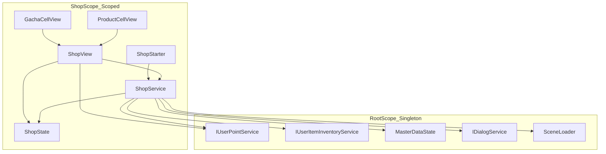
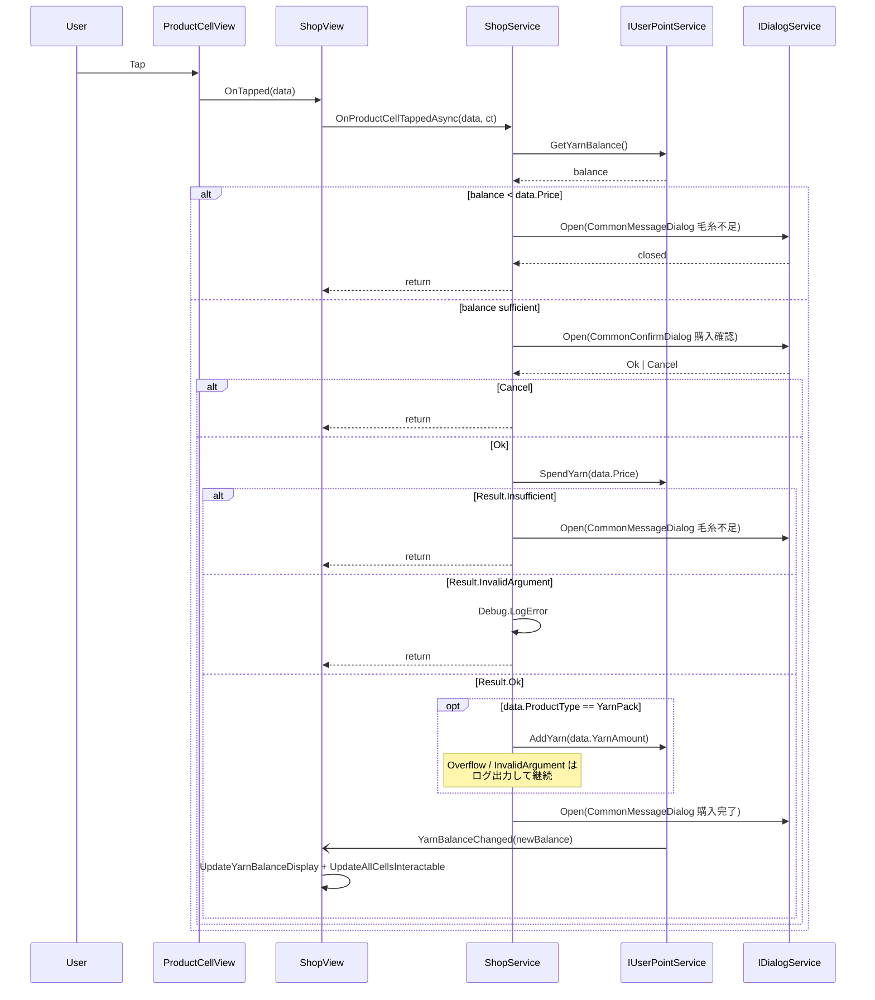
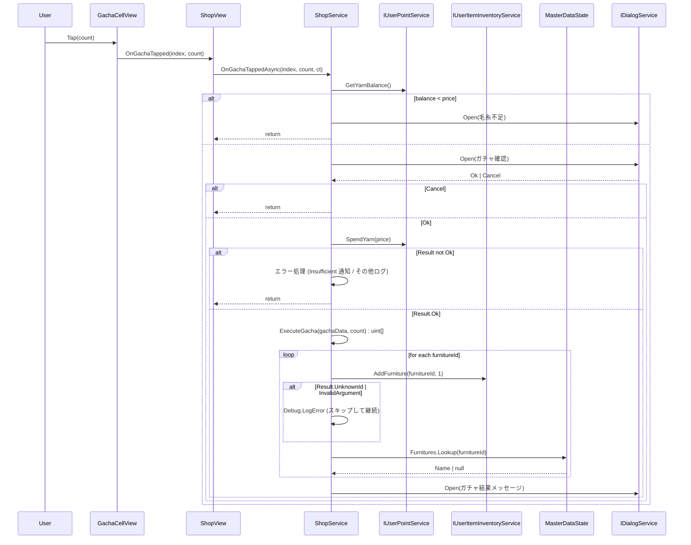
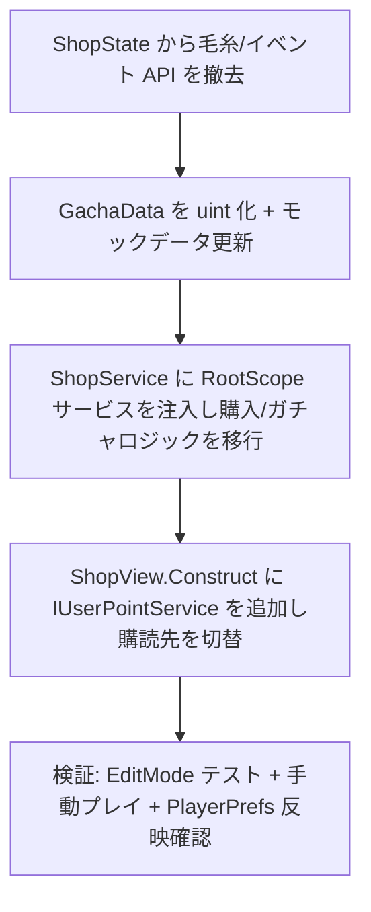

# Technical Design — shop-item-point-migration

## Overview

**Purpose**: ショップシーンにおける毛糸 (ポイント通貨) 残高とガチャで獲得する家具の所持管理を、RootScope の共通サービス (`IUserPointService` / `IUserItemInventoryService`) に一本化する。これにより状態の真実の源を一元化し、永続化と変更通知を RootScope 側で完結させる。
**Users**: ショップ画面を操作するプレイヤーは、他シーンと整合した残高で購入・ガチャを実行できる。プロジェクト開発者は `ShopState` に独自のポイント/インベントリ状態が残らないことで、グローバル状態の二重管理を避けられる。
**Impact**: `ShopState` からポイント・インベントリ責務を削除し、`ShopService` / `ShopView` は RootScope サービスへ直接依存する構成に切り替わる。`GachaData.RewardFurnitureIds` は `IReadOnlyList<uint>` へ型変更され、モックデータ・データ契約とも一括で更新される (本アプリは未リリースのため後方互換性は考慮しない)。

### Goals

- `ShopService` の毛糸参照・消費・加算を `IUserPointService` に統合し、結果コード (`Insufficient` / `InvalidArgument` / `Overflow`) を適切にハンドリングする。
- `ShopView` の残高表示とセル `interactable` 更新を `IUserPointService.YarnBalanceChanged` 購読に切り替える。
- ガチャ抽選結果を `IUserItemInventoryService.AddFurniture` 経由で所持インベントリへ加算し、家具マスターと連携する。
- `ShopState` を「ショップシーン固有 UI 状態」に縮退させ、ポイント/インベントリ API を完全撤去する。

### Non-Goals

- 時限ショップ機能 (`timed-shop` 仕様) および商品マスター化は対象外。
- リアルマネー (`CurrencyType.RealMoney`) の課金処理実装は従来通りモック扱いで据え置く。
- 着せ替え (`outfit`) 商品は現ショップに存在しないため、`GrantOutfit` 連携は実装しない。
- 家具マスターへのガチャ対象 ID の本番登録は `timed-shop` 仕様で対応する。本仕様では `UnknownId` を許容し、ログ出力で縮退する。
- 初期毛糸残高のシード投入 (例: 旧 `10000` の復元) は実装せず、`UserPointService` の PlayerPrefs 復元に委ねる。

## Architecture

### Existing Architecture Analysis

- **Shop シーンの層構造**: `Shop.State / Shop.Service / Shop.View / Shop.Scope / Shop.Starter` の 5 層で、依存方向は `View → Service → State`。本仕様では層構造を維持したまま `Shop.State` の責務を削り、`Shop.Service` / `Shop.View` の依存先を `Root.Service` に接続する。
- **RootScope の契約**: `IUserPointService` / `IUserItemInventoryService` は `Lifetime.Singleton` で `As<TInterface>().AsSelf()` 登録済み。`ShopScope` は `SceneScope` 継承による親スコープ解決で参照可能であり、**再登録は不要**。
- **MasterData 依存**: `UserItemInventoryService` は `MasterDataState.IsImported` を待機するが、`SceneScope` が `Awake` で MasterDataImport を保証するため、`ShopStarter.Start` 実行時点では完了している。
- **永続化**: `UserPointService.AddYarn` / `SpendYarn` は成功時に `PlayerPrefs` へ自動保存する。本仕様では保存タイミングを明示制御せず、サービス既定の挙動に委ねる。

### Architecture Pattern & Boundary Map

選定パターン: **既存 VContainer レイヤード (View → Service → State) を継続しつつ、Shop.Service から RootScope サービスへ直接依存する**。新コンポーネントや抽象化層は導入しない (評価詳細は `research.md` の "Architecture Pattern Evaluation")。



**Architecture Integration**:
- **Selected pattern**: Direct Extension — `ShopService` / `ShopView` が RootScope 契約へ直接依存。
- **Domain boundaries**: ポイント/インベントリの**真実の源**は RootScope 側サービスのみ。`ShopState` は UI タブ・モック商品リストなどシーン固有状態に限定する。
- **Preserved patterns**: `[Inject]` コンストラクタ注入、`View → Service → State` の依存方向、`SceneScope` 継承、`#nullable enable`、クラスコンテキスト付きエラーログ。
- **New components rationale**: 新規クラスは追加しない。メッセージ変換は `ShopService` の private メソッドで集約 (`research.md` Decision "エラーメッセージ変換")。
- **Steering compliance**: `tech.md` の「RootScope Singleton / SceneScope Scoped / `[Inject]` 必須」規約、`structure.md` の「View → Service → State」「_camelCase private / readonly 初期化」に準拠。

### Technology Stack

| Layer | Choice / Version | Role in Feature | Notes |
|-------|------------------|-----------------|-------|
| Runtime | Unity 6 (6000.x) + URP 17.3.0 | ショップシーン (UI / DI) の実行基盤 | 既存。本仕様で変更なし |
| DI | VContainer 1.17.0 | `IUserPointService` / `IUserItemInventoryService` の解決 | 親スコープ継承で解決 (再登録禁止) |
| Async | UniTask | 購入・ガチャ非同期フロー (`UniTask` + `CancellationToken`) | 既存規約: 末尾引数 `CancellationToken` |
| Persistence | PlayerPrefsService + PlayerPrefs | 毛糸残高 (`PlayerPrefsKey.UserPoint`)、家具所持 (`PlayerPrefsKey.UserItemInventory`) の自動保存 | `UserPointService` / `UserItemInventoryService` 内部で完結 |
| Master Data | `MasterDataImportService` / `MasterDataState` | ガチャ家具の ID 検証・名称解決 | `SceneScope.Awake` で import 完了を保証 |
| Dialog | `IDialogService` + `CommonMessageDialog` / `CommonConfirmDialog` | 購入確認・購入完了・エラー通知 UI | 既存実装をそのまま利用 |

新規ライブラリ導入はなし。差分は既存 API の再配線と `GachaData` の型変更に限定される。

## System Flows

### Flow 1: 毛糸通貨商品の購入フロー



**Key decisions**:
- 事前残高チェック (Yarn 商品) は確認ダイアログ表示前に実施し、無駄な確認操作を避ける (R6)。
- `SpendYarn` 結果コードを分岐し、`Insufficient` はユーザー通知、`InvalidArgument` はログのみ (R2.3 / R2.4)。
- 残高表示と `interactable` 更新は `YarnBalanceChanged` ハンドラへ一本化する。購入完了メッセージ側では手動更新しない。

### Flow 2: ガチャ実行フロー



**Key decisions**:
- `AddFurniture` の `UnknownId` / `InvalidArgument` は**部分失敗**として扱い、残りの結果処理を継続する (R7.3 / R7.4)。
- 結果メッセージの家具名は `MasterDataState.Furnitures` の `Name` を引き、未解決時は `uint` ID をそのまま表示する (R7.5)。

## Requirements Traceability

| Requirement | Summary | Components | Interfaces / Contracts | Flows |
|-------------|---------|------------|------------------------|-------|
| 1.1, 1.3, 1.5 | ShopService の残高参照を `IUserPointService.GetYarnBalance` に統一し、`ShopState.YarnBalance` を撤去 | ShopService, ShopState | `IUserPointService` | Flow 1 |
| 1.2, 1.4 | ShopView の残高表示初期化・更新を `IUserPointService` ベースへ | ShopView | `IUserPointService` | Flow 1 |
| 2.1, 2.2, 2.5, 2.6 | 毛糸消費を `SpendYarn` に切り替え、`ShopState.ConsumeYarn` を撤去 | ShopService, ShopState | `IUserPointService.SpendYarn` | Flow 1, 2 |
| 2.3 | `Insufficient` 時の購入中止＋メッセージ | ShopService | `CommonMessageDialog` | Flow 1, 2 |
| 2.4 | `InvalidArgument` 時のエラーログ＋中止 | ShopService | `Debug.LogError` | Flow 1, 2 |
| 3.1 | YarnPack 購入成功時 `AddYarn` | ShopService | `IUserPointService.AddYarn` | Flow 1 |
| 3.2, 3.3 | `Overflow` / `InvalidArgument` 時のログ＋通知縮退 | ShopService | `Debug.LogError` | Flow 1 |
| 3.4, 3.5 | `ShopState.AddYarn` 撤去 | ShopState | — | — |
| 4.1, 4.2, 4.3 | `YarnBalanceChanged` 購読・残高表示更新・セル再計算 | ShopView | `IUserPointService.YarnBalanceChanged` | Flow 1 |
| 4.4 | ShopView 破棄時の購読解除 | ShopView | `OnDestroy` Hook | — |
| 4.5, 4.6 | `ShopState.OnYarnBalanceChanged` 撤去 | ShopState, ShopView | — | — |
| 5.1, 5.2, 5.3 | セル interactable 判定の残高ソース差し替え | ShopService | `IUserPointService.GetYarnBalance` | Flow 1, 2 |
| 5.4 | RealMoney 常時 `interactable=true` (既存挙動維持) | ShopService | — | Flow 1 |
| 6.1, 6.2 | 商品タップ時の事前残高チェック＋ダイアログ抑止 | ShopService | `CommonMessageDialog` | Flow 1 |
| 6.3, 6.4 | ガチャタップ時の事前残高チェック＋ダイアログ抑止 | ShopService | `CommonMessageDialog` | Flow 2 |
| 6.5 | 残高検証で `ShopState` を参照しない | ShopService | — | — |
| 7.1, 7.2 | ガチャ結果家具を `AddFurniture(uint,1)` で加算 | ShopService, GachaData | `IUserItemInventoryService.AddFurniture` | Flow 2 |
| 7.3, 7.4 | `UnknownId` / `InvalidArgument` の部分失敗許容 | ShopService | `Debug.LogError` | Flow 2 |
| 7.5 | 家具名称を MasterDataState から解決 (フォールバック: ID 表示) | ShopService | `MasterDataState.Furnitures` | Flow 2 |
| 8.1, 8.5 | `ShopState` からポイント/インベントリ状態を撤去 | ShopState | — | — |
| 8.2 | タブ・商品リストは保持可能 | ShopState | — | — |
| 8.3, 8.4 | Service / View は `ShopState` を経由せず Root サービスに直接依存 | ShopService, ShopView | `IUserPointService` | Flow 1, 2 |
| 9.1 | ShopService コンストラクタに Root サービスを注入 | ShopService | `[Inject]` コンストラクタ | — |
| 9.2 | ShopView.Construct に `IUserPointService` を追加 | ShopView | `[Inject]` Construct | — |
| 9.3 | `ShopScope` で RootScope サービスを再登録しない | ShopScope | VContainer 親スコープ解決 | — |
| 9.4 | 依存方向 View→Service→State を維持 | 全体 | — | — |
| 9.5 | `ShopStarter.Start` が残高前提の初期化を実行可能 | ShopStarter, ShopService | `ShopService.Initialize` | — |
| 10.1 | タブ・セル配置・ダイアログフローを維持 | ShopView, ShopService | — | Flow 1, 2 |
| 10.2 | 購入完了メッセージの文言維持 | ShopService | `CommonMessageDialog` | Flow 1 |
| 10.3 | 購入確認 No 時の残高無操作 | ShopService | — | Flow 1 |
| 10.4 | 多重実行ガード `_isProcessing` の継続 | ShopView | — | — |
| 10.5 | シーン再訪問時に `IUserPointService` の残高が反映 | ShopService, ShopView | `IUserPointService.GetYarnBalance` | — |

## Components and Interfaces

### Component Summary

| Component | Domain/Layer | Intent | Req Coverage | Key Dependencies | Contracts |
|-----------|--------------|--------|--------------|------------------|-----------|
| `ShopService` | Shop / Service | 毛糸参照・消費・加算、ガチャ抽選・家具加算、購入ダイアログ制御の中核 | 1.1, 1.3, 2.1–2.6, 3.1–3.5, 5.1–5.4, 6.1–6.5, 7.1–7.5, 8.3, 9.1, 9.5, 10.2, 10.3, 10.5 | `IUserPointService` (P0), `IUserItemInventoryService` (P0), `MasterDataState` (P0), `IDialogService` (P0), `SceneLoader` (P1), `ShopState` (P1) | Service |
| `ShopView` | Shop / View | 残高表示・セル interactable・タブ制御の MonoBehaviour UI | 1.2, 1.4, 4.1–4.6, 8.4, 9.2, 10.1, 10.4 | `ShopService` (P0), `IUserPointService` (P0), `ShopState` (P1) | Service + State subscription |
| `ShopState` | Shop / State | タブ状態・商品モックリストのみを保持 (ポイント/インベントリ API 撤去) | 1.5, 2.6, 3.5, 4.5, 4.6, 8.1, 8.2, 8.5 | — | State |
| `GachaData` (record) | Shop / State | ガチャ価格 + 抽選対象 `uint` 家具 ID | 7.1, 7.2 | — | Data contract |
| `ShopScope` | Shop / Scope | `ShopState` / `ShopService` / `ShopView` / `ShopStarter` の DI 登録 (RootScope サービスは再登録しない) | 9.3 | VContainer (P0) | — |
| `ShopStarter` | Shop / Starter | `IStartable.Start` で `ShopService.Initialize` を呼び出す | 9.5 | `ShopService` (P0) | — |

### Shop / Service

#### ShopService

| Field | Detail |
|-------|--------|
| Intent | 毛糸残高参照・消費・加算、ガチャ抽選と家具加算、購入 UX の中核ロジック |
| Requirements | 1.1, 1.3, 2.1, 2.2, 2.3, 2.4, 2.5, 3.1, 3.2, 3.3, 5.1, 5.2, 5.3, 5.4, 6.1, 6.2, 6.3, 6.4, 6.5, 7.1, 7.2, 7.3, 7.4, 7.5, 8.3, 9.1, 9.5, 10.2, 10.3 |

**Responsibilities & Constraints**
- 毛糸残高のクエリ・更新はすべて `IUserPointService` 経由。`ShopState.YarnBalance` への参照は発生させない。
- ガチャ結果の家具 ID (`uint`) を `IUserItemInventoryService.AddFurniture(id, 1)` で 1 件ずつ加算し、結果コードによる部分失敗を許容する。
- 家具名称表示は `MasterDataState.Furnitures` を走査して解決し、未登録時は ID をそのまま表示する。
- 購入確認・購入完了・残高不足・ガチャ結果のダイアログは `IDialogService` 経由で表示する。
- `CurrencyType.RealMoney` は残高判定の対象外。`interactable` は常に `true`、課金処理は未実装モック扱い。

**Dependencies**
- Outbound: `IUserPointService` — 毛糸残高参照/更新/通知 (P0)
- Outbound: `IUserItemInventoryService` — ガチャ家具加算 (P0)
- Outbound: `MasterDataState` — 家具 ID → Name 解決 (P0)
- Outbound: `IDialogService` — 購入確認/通知ダイアログ (P0)
- Outbound: `SceneLoader` — GoBack 遷移 (P1)
- Outbound: `ShopState` — タブ切替・商品モックリスト参照 (P1)
- Inbound: `ShopStarter` (P0), `ShopView` (P0)

`IUserPointService` / `IUserItemInventoryService` の詳細契約は `research.md` References を参照。本設計ではインターフェース既存のまま利用する。

**Contracts**: Service [x] / API [ ] / Event [ ] / Batch [ ] / State [ ]

##### Service Interface

```csharp
public class ShopService
{
    [Inject]
    public ShopService(
        ShopState state,
        IUserPointService userPointService,
        IUserItemInventoryService userItemInventoryService,
        MasterDataState masterDataState,
        IDialogService dialogService,
        SceneLoader sceneLoader);

    // 既存シグネチャ維持
    void Initialize();
    void SetCurrentTab(ShopTab tab);
    void SetupGachaCell(GachaCellView cell, int index);
    void SetupProductCell(ProductCellView cell, ProductData data);
    void GoBack();
    UniTask OnProductCellTappedAsync(ProductData data, CancellationToken ct);
    UniTask OnGachaTappedAsync(int gachaIndex, int count, CancellationToken ct);
}
```

- **Preconditions**:
  - 全 `[Inject]` 依存は非 null。RootScope / ShopScope の DI 解決完了後にインスタンス化される。
  - `MasterDataState.IsImported == true` (SceneScope.Awake で保証)。
- **Postconditions**:
  - `OnProductCellTappedAsync` 完了後: 毛糸通貨購入が成立した場合のみ `SpendYarn`、YarnPack の場合のみ `AddYarn` が呼ばれている。失敗時は残高変更なし。
  - `OnGachaTappedAsync` 完了後: 成立時は `SpendYarn` + `AddFurniture * count` が呼ばれ、ダイアログで結果を通知。`UnknownId` / `InvalidArgument` は部分失敗としてスキップされる。
- **Invariants**:
  - `ShopState` のポイント/インベントリ関連 API は参照・呼出しなし (コンパイラレベルで保証)。
  - `CurrencyType.Yarn` 購入時は確認ダイアログ表示前と `SpendYarn` 呼び出し前の 2 箇所で残高チェックを行う (事前チェックは UX 保護、本チェックは競合更新対策)。

**Implementation Notes**
- **Integration**: `ShopService.ExecuteGacha` は `IReadOnlyList<uint>` を受け取る形に変わる。既存 `System.Random` 実装を維持し、戻り値を `uint[]` (または `IReadOnlyList<uint>`) にする。
- **Validation**: `IUserPointService.SpendYarn` / `AddYarn` 結果コード分岐は switch または `if/else if` で明示。`PointOperationErrorCode` の列挙変更時はコンパイラで検知可能。
- **Risks**: メッセージ変換の集約を private メソッド化するため、将来の拡張で肥大化した場合はユーティリティ切り出しを検討 (`research.md` Decision 参照)。

### Shop / View

#### ShopView

| Field | Detail |
|-------|--------|
| Intent | ショップ UI (タブ・セル・残高表示) の MonoBehaviour。`IUserPointService` 変更を購読する |
| Requirements | 1.2, 1.4, 4.1, 4.2, 4.3, 4.4, 4.5, 4.6, 8.4, 9.2, 10.1, 10.4 |

**Responsibilities & Constraints**
- 残高表示 (`_yarnBalanceText`) とセル `interactable` 更新は `IUserPointService.YarnBalanceChanged` の単一経路で行う。
- `Start` 時点で `IUserPointService.GetYarnBalance()` を取得し初期表示する。
- `OnDestroy` で `YarnBalanceChanged -= OnYarnBalanceChanged` を確実に呼ぶ (Singleton 側へのリーク防止)。
- タブ切替・購入/ガチャタップの UX は既存維持 (`_isProcessing` ガード、タブビジュアル、コンテンツ切替)。

**Dependencies**
- Outbound: `ShopService` — ユーザー操作の委譲 (P0)
- Outbound: `IUserPointService` — 残高表示と変更購読 (P0)
- Outbound: `ShopState` — タブ状態と商品リスト参照 (P1)
- External: Unity UI (`Button`, `TMP_Text`) — 既存 SerializeField (P1)
- Inbound: `GachaCellView` / `ProductCellView` (P0), VContainer (P0)

**Contracts**: Service [ ] / API [ ] / Event [ ] / Batch [ ] / State [x] (View-local subscription state)

##### Service Interface

```csharp
public class ShopView : MonoBehaviour
{
    [Inject]
    public void Construct(
        ShopState state,
        ShopService shopService,
        IUserPointService userPointService);

    // MonoBehaviour lifecycle: Start / OnDestroy は既存維持
    // 公開イベント: event Action? OnBackButtonClicked; (既存維持)
}
```

- **Preconditions**: `Construct` は VContainer により `Start` より前に呼ばれる。全依存は非 null。
- **Postconditions**:
  - `Start` 完了後: `YarnBalanceChanged` に `OnYarnBalanceChanged` ハンドラが登録されている。
  - `OnDestroy` 完了後: 全イベントハンドラが解除されている (`ShopState.OnTabChanged` 含む)。
- **Invariants**: `ShopState.YarnBalance` / `OnYarnBalanceChanged` への参照・購読は存在しない。

**Implementation Notes**
- **Integration**: 既存 `UpdateAllCellsInteractable` は残高変更ハンドラからのみ呼ばれる (タブ切替時は呼ばない)。
- **Validation**: `Construct` 引数追加は VContainer の解決が通れば自動保証される。起動時に `NullReferenceException` が出る場合は ShopScope の `RegisterComponent` 漏れを疑う。
- **Risks**: Singleton `IUserPointService` のハンドラにラムダをキャプチャせず、メソッド参照 (`OnYarnBalanceChanged`) を渡すことで解除漏れを防ぐ。

### Shop / State

#### ShopState (縮退後)

| Field | Detail |
|-------|--------|
| Intent | ショップシーンの UI 固有状態 (タブ・商品モックリスト) のみ保持 |
| Requirements | 1.5, 2.6, 3.5, 4.5, 4.6, 8.1, 8.2, 8.5 |

**Responsibilities & Constraints**
- 保持する公開 API は `CurrentTab` / `SetCurrentTab` / `OnTabChanged` / `GachaList` / `ItemProductList` / `PointProductList` のみ。
- **撤去する API**: `YarnBalance` (property), `ConsumeYarn(int)`, `AddYarn(int)`, `OnYarnBalanceChanged` (event)。
- 毛糸残高・家具所持数のキャッシュを保持しない。

**Contracts**: State [x]

##### State Model

```csharp
public class ShopState
{
    public ShopTab CurrentTab { get; private set; }
    public event Action<ShopTab>? OnTabChanged;

    public List<GachaData> GachaList { get; }
    public List<ProductData> ItemProductList { get; }
    public List<ProductData> PointProductList { get; }

    public void SetCurrentTab(ShopTab tab);
}
```

- **State model**: タブは `ShopTab` 列挙 (`Item` / `Point`)、商品リストは `ShopService.Initialize` で投入されるシーン内モック。
- **Persistence & consistency**: 永続化なし (シーン破棄で揮発)。ポイント/インベントリの永続化は `IUserPointService` / `IUserItemInventoryService` 側で実施。
- **Concurrency strategy**: Unity メインスレッド単一実行。並列更新は発生しない。

**Implementation Notes**
- **Integration**: 既存呼び出し元 (`ShopService`, `ShopView`) が API 撤去によりコンパイルエラーになるため、同コミットで全箇所を差し替える。
- **Validation**: `grep -n "YarnBalance\|ConsumeYarn\|AddYarn\|OnYarnBalanceChanged" Assets/Scripts/Shop/` で残存参照ゼロを確認。
- **Risks**: 他シーンからの参照はないが、Inspector 経由のシリアライズ依存がないか `ShopScope` の SerializeField / プレハブを確認する。

### Shop / State — Data Contract Change

#### GachaData (record)

```csharp
public record GachaData(
    int SinglePrice,
    int TenPrice,
    IReadOnlyList<uint> RewardFurnitureIds);
```

- **変更点**: `List<string>` → `IReadOnlyList<uint>`。モックデータ (`ShopService.InitializeMockData`) は `uint` リテラルで投入する。
- **Impact**: `ShopState` 内外の参照を一括で更新する (未リリースのため互換レイヤー不要)。
- **Rationale**: `IUserItemInventoryService.AddFurniture` との型整合 (R7.2)。

### Shop / Scope & Starter (差分なし / 軽微)

#### ShopScope

- 変更なし。`IUserPointService` / `IUserItemInventoryService` は RootScope の Singleton 登録を継承する (R9.3)。
- `ShopState` / `ShopService` / `ShopView` / `ShopStarter` の登録は既存のまま。

#### ShopStarter

- 変更なし。`ShopService.Initialize()` 内部実装が変わるのみ。`Initialize` はモック商品リスト投入のみで残高前提を持たないため、R9.5 を満たす。

## Data Models

### Domain Model

- **Aggregate root (RootScope, 既存)**: `UserPointState` (毛糸残高), `UserItemInventoryState` (家具/着せ替え所持)。本仕様ではこの 2 集約の契約を Shop から利用する側として接続するだけで、集約自体を変更しない。
- **Aggregate root (ShopScope, 縮退後)**: `ShopState` — タブ状態と商品モックリスト (揮発)。
- **Value object**: `GachaData` (`uint` 家具 ID 配列に変更), `ProductData` (変更なし)。
- **Domain event**: Shop 境界外。毛糸変更は `IUserPointService.YarnBalanceChanged`、家具変更は `IUserItemInventoryService.FurnitureChanged` (本仕様では ShopView 側では購読しない)。

### Logical Data Model

本仕様は Shop 固有のモックデータ構造 (`ProductData` / `GachaData`) と、既存 RootScope 契約 (`IUserPointService` / `IUserItemInventoryService`) の接続のみを扱う。物理ストレージ (PlayerPrefs スナップショット) は RootScope サービス側で完結しており、本仕様で変更しない。

### Data Contracts & Integration

- **ShopService → IUserPointService**:
  - Query: `GetYarnBalance() : int`
  - Mutate: `SpendYarn(int) : PointOperationResult`, `AddYarn(int) : PointOperationResult`
  - Event: `YarnBalanceChanged : Action<int>` (ShopView 購読)
  - Error envelope: `PointOperationResult { IsSuccess, Error (InvalidArgument | Insufficient | Overflow), Balance }`
- **ShopService → IUserItemInventoryService**:
  - Mutate: `AddFurniture(uint furnitureId, int amount) : ItemInventoryResult`
  - Error envelope: `ItemInventoryResult { IsSuccess, Error (InvalidArgument | UnknownId) }`
- **ShopService → MasterDataState**:
  - Read: `Furnitures : Furniture[]` — `Id` / `Name` による名称解決。`IsImported` は SceneScope.Awake で保証済みのため再チェック不要。

## Error Handling

### Error Strategy

| エラー発生源 | 種類 | ShopService の処理 | ユーザー通知 |
|--------------|------|---------------------|--------------|
| `IUserPointService.SpendYarn` = `Insufficient` | Business (残高不足) | 後続購入処理を中止 | `CommonMessageDialog` で「毛糸が足りません。」(R2.3) |
| `IUserPointService.SpendYarn` = `InvalidArgument` | Programmer / System | `Debug.LogError($"[ShopService] ...")` + 購入中止 | 通知なし (R2.4) |
| `IUserPointService.AddYarn` = `Overflow` | System | `Debug.LogError` + 購入完了ダイアログ内で加算失敗メッセージを付記 | 購入完了メッセージに併記 (R3.2) |
| `IUserPointService.AddYarn` = `InvalidArgument` | Programmer | `Debug.LogError` + 加算スキップ | 通知なし (R3.3) |
| `IUserItemInventoryService.AddFurniture` = `UnknownId` | Data (マスター未整備) | `Debug.LogError` + 該当家具のみスキップ、残りを継続 | 通知なし (R7.3) |
| `IUserItemInventoryService.AddFurniture` = `InvalidArgument` | Programmer | `Debug.LogError` + 該当家具のみスキップ | 通知なし (R7.4) |
| ダイアログキャンセル | User | 残高・インベントリ操作なし | ダイアログを閉じる (R10.3) |
| `UniTask` キャンセル (`OperationCanceledException`) | Lifecycle | 既存挙動維持 (Shop シーン破棄時のキャンセル) | 通知なし |

### Monitoring

- `Debug.LogError($"[ShopService] {message}\n{stacktrace}")` 形式で `tech.md` 規約に従う。
- 事前チェックが Duplicated (`OnTappedAsync` 入口 + `SpendYarn` 内部) でも、残高不足が両方で検知されるのは許容 (UX 保護のため)。

## Testing Strategy

> プロジェクトは Unity EditMode / PlayMode テストを前提とする。本仕様では以下の観点を最低限カバーする。

### Unit Tests (EditMode, ShopService 単体)

1. `SpendYarn` が `Insufficient` を返すと `IDialogService.OpenAsync` に残高不足メッセージが渡される。
2. `SpendYarn` が `Ok` を返しかつ `ProductType.YarnPack` の場合に `AddYarn(data.YarnAmount)` が 1 回呼ばれる。
3. `ExecuteGacha` が `IReadOnlyList<uint>` を返し、`AddFurniture` が抽選数と同数コールされる。
4. `AddFurniture` が `UnknownId` を返しても後続の抽選結果処理が継続する。
5. `CurrencyType.RealMoney` の `UpdateProductCellInteractable` が残高非依存で `true` になる。

### Integration Tests (EditMode, ShopScope + RootScope 模擬)

1. VContainer で `ShopScope` をビルドし、`ShopService` が `IUserPointService` / `IUserItemInventoryService` を解決できる。
2. `IUserPointService.YarnBalanceChanged` 発火で `ShopView._yarnBalanceText.text` が更新される。
3. ShopView の `OnDestroy` 後に `YarnBalanceChanged` を手動発火しても例外が出ない (購読解除済み)。

### PlayMode / UI Tests (任意)

1. ショップシーン遷移 → 毛糸商品購入 → `PlayerPrefs` にスナップショットが書き込まれる。
2. ショップを離脱して再入場した際、残高が前回購入結果を反映している (R10.5)。

## Migration Strategy

本アプリは未リリースのため、データ移行・段階的ロールアウト・後方互換は不要。作業単位はコミットの見通しを良くするための論理分割に留める。



- **Step 1**: `ShopState` の該当 API を削除し、意図的にコンパイルエラーを発生させて `ShopService` / `ShopView` の残存参照を洗い出す。
- **Step 2**: `GachaData` 型変更とモックデータの `uint` リテラル化を揃える。
- **Step 3**: RootScope サービス注入と購入フローの置換を完了させる。
- **Step 4**: ShopView の購読替えと `OnDestroy` 解除。
- **Validation**: 各ステップ後に Unity Editor でコンパイル成功と EditMode テストのグリーンを確認。

## Supporting References

- `Assets/Scripts/Root/Service/IUserPointService.cs` — `PointOperationResult` / `PointOperationErrorCode` 定義。
- `Assets/Scripts/Root/Service/IUserItemInventoryService.cs` — `ItemInventoryResult` / `ItemInventoryErrorCode` / `FurnitureChange` 定義。
- `Assets/Scripts/Root/Scope/RootScope.cs` — Singleton 登録。
- `Assets/Scripts/Shop/Service/ShopService.cs` / `Shop/View/ShopView.cs` / `Shop/State/ShopState.cs` — 現行実装。
- `.kiro/specs/shop-item-point-migration/gap-analysis.md` — 現状分析と採用案の根拠 (Option A Preferred)。
- `.kiro/specs/shop-item-point-migration/research.md` — パターン評価・設計判断・リスクの詳細ログ。
- `.kiro/steering/tech.md` / `structure.md` — 依存方向・命名・ログ規約。
