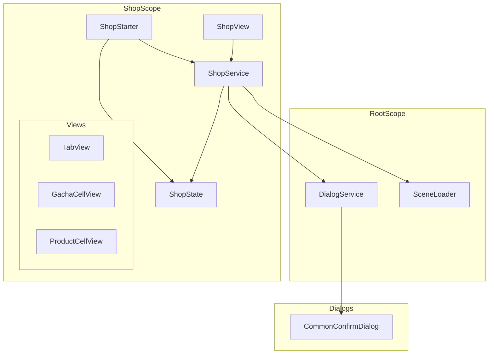
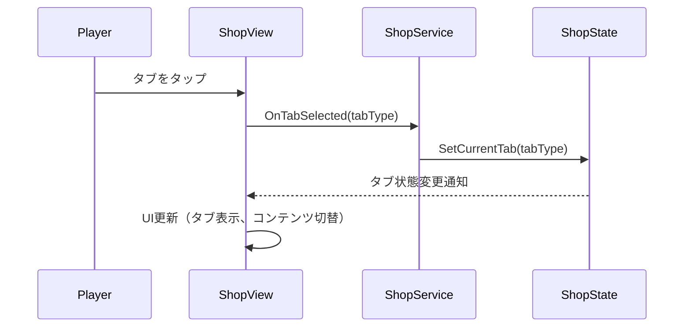
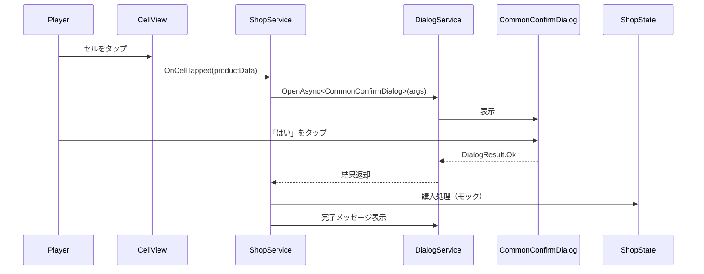
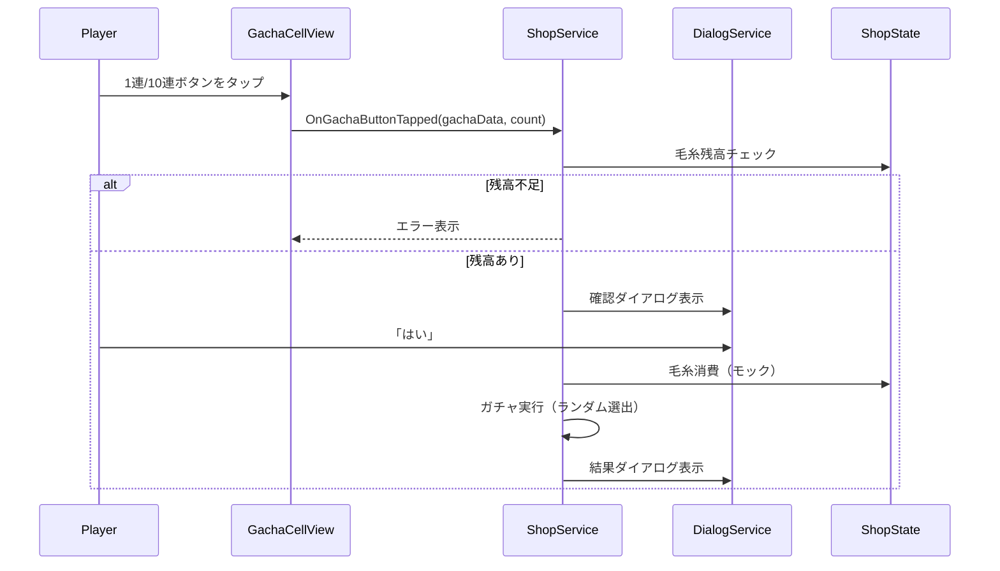
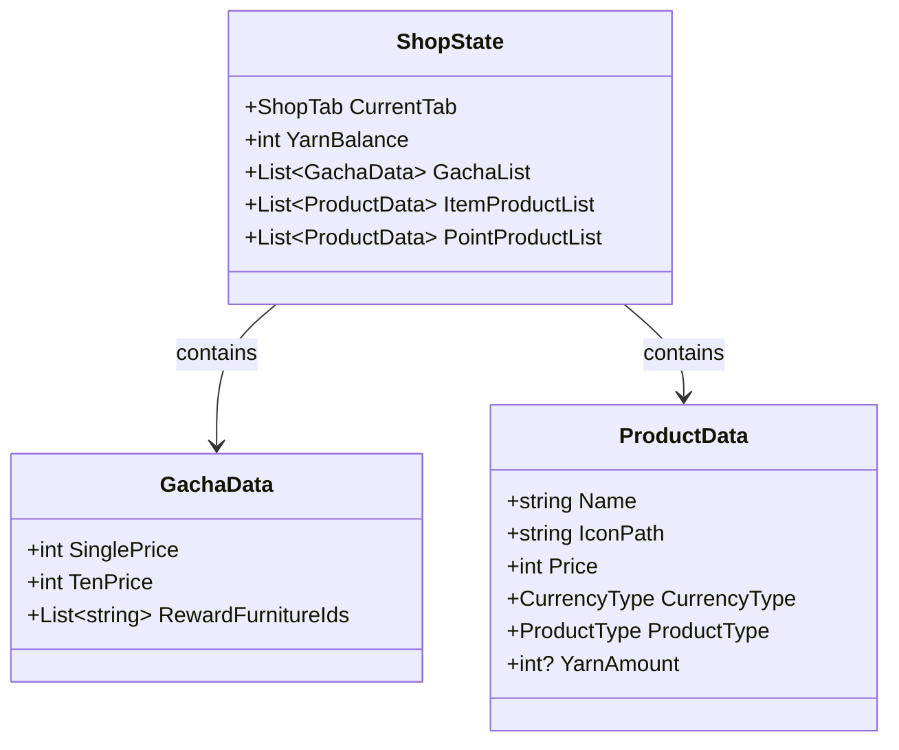

# Design Document: shop-scene-mock

## Overview

**Purpose**: ショップ画面のモック実装を提供し、プレイヤーがアイテムや毛糸（ゲーム内通貨）を閲覧・購入できる基盤を構築する。

**Users**: プレイヤーがショップでアイテム購入、ガチャ実行、毛糸パック購入を行う。開発者がモックデータで動作確認を行う。

**Impact**: 新規シーン（Shop）の追加、汎用確認ダイアログ（CommonConfirmDialog）の新規作成。既存のDialogServiceと統合。

### Goals
- プロジェクトの標準的なシーンアーキテクチャに従ったショップシーンの実装
- アイテムタブと毛糸タブの切り替え機能
- ガチャ（1連/10連）、アイテム購入、毛糸パック購入のモック動作
- 汎用確認ダイアログの提供（他機能でも再利用可能）
- 手動配置セルとLayout Groupによる自動レイアウトの併用

### Non-Goals
- 実際のサーバー連携や決済処理（モック動作のみ）
- マスターデータとの連携（ハードコードされたモックデータを使用）
- セルの動的生成（手動配置のみ）
- ガチャ演出アニメーション（結果表示のみ）

## Architecture

### Existing Architecture Analysis

プロジェクトはシーンベースアーキテクチャ + VContainer DIパターンを採用。各シーンが独立したLifetimeScopeを持ち、RootScopeから共通サービス（SceneLoader、DialogService等）を利用する。

**既存パターン**:
- SceneScope継承、SerializeFieldでViewバインド
- IStartable実装によるエントリーポイント
- 依存方向: View → Service → State

**統合ポイント**:
- DialogService: 確認ダイアログの表示
- SceneLoader: シーン遷移
- RootScope: 共通サービスへのアクセス

### Architecture Pattern & Boundary Map



**Architecture Integration**:
- Selected pattern: シーンベースアーキテクチャ（既存パターン準拠）
- Domain boundaries: Shop機能はShopScope内に閉じる、ダイアログはRoot共通
- Existing patterns preserved: SceneScope継承、IStartable、View→Service→State
- New components rationale: CommonConfirmDialogは既存SampleCommonConfirmDialogが引数非対応のため新規作成
- Steering compliance: VContainer DI、依存方向ルール、命名規則を遵守

### Technology Stack

| Layer | Choice / Version | Role in Feature | Notes |
|-------|------------------|-----------------|-------|
| UI Framework | Unity UI (uGUI) | ショップUI表示 | Canvas, Button, ScrollRect等 |
| DI Framework | VContainer 1.17.0 | 依存性注入 | ShopScope, RegisterEntryPoint |
| Async | UniTask | 非同期処理 | ダイアログ待機、シーン遷移 |
| Asset Management | Addressables 2.7.6 | ダイアログロード | Dialogs/CommonConfirmDialog.prefab |
| Layout | VerticalLayoutGroup + LayoutElement | セル自動レイアウト | 手動配置セルに適用 |

## System Flows

### タブ切り替えフロー



### 購入処理フロー（アイテム/毛糸パック）



### ガチャ実行フロー



## Requirements Traceability

| Requirement | Summary | Components | Interfaces | Flows |
|-------------|---------|------------|------------|-------|
| 1.1-1.5 | シーン構造 | ShopScope, ShopStarter | IStartable | - |
| 2.1-2.6 | タブ切り替え | ShopView, TabView | IShopService | タブ切り替えフロー |
| 3.1-3.4 | カテゴリ表示 | ShopView | - | - |
| 4.1-4.9 | ガチャカテゴリ | GachaCellView, ShopService | IShopService | ガチャ実行フロー |
| 5.1-5.5 | アイテムカテゴリ | ProductCellView, ShopService | IShopService | 購入処理フロー |
| 6.1-6.6 | 毛糸パック表示 | ProductCellView, ShopService | IShopService | 購入処理フロー |
| 7.1-7.7 | 汎用確認ダイアログ | CommonConfirmDialog, CommonConfirmDialogArgs | IDialogWithArgs | - |
| 8.1-8.6 | 購入処理 | ShopService | IShopService, IDialogService | 購入処理フロー |
| 9.1-9.4 | ガチャ実行処理 | ShopService | IShopService, IDialogService | ガチャ実行フロー |
| 10.1-10.3 | シーン遷移 | ShopService | SceneLoader | - |
| 11.1-11.6 | 状態管理 | ShopState | - | - |
| 12.1-12.5 | セルコンテンツ設定 | ShopService, CellViews | ICellView | - |

## Components and Interfaces

| Component | Domain/Layer | Intent | Req Coverage | Key Dependencies | Contracts |
|-----------|--------------|--------|--------------|------------------|-----------|
| ShopScope | Scope | DIコンテナ設定 | 1.3 | SceneScope (P0) | - |
| ShopStarter | Starter | シーン初期化 | 1.4 | ShopService, ShopState (P0) | IStartable |
| ShopService | Service | ビジネスロジック | 4, 5, 6, 8, 9, 10, 12 | ShopState, DialogService, SceneLoader (P0) | Service |
| ShopState | State | 状態管理 | 11 | - | State |
| ShopView | View | メインUI | 2, 3 | ShopService (P0) | - |
| GachaCellView | View | ガチャセル | 4 | ShopService (P0) | - |
| ProductCellView | View | 汎用商品セル | 5, 6 | ShopService (P0) | - |
| CommonConfirmDialog | Dialog | 汎用確認ダイアログ | 7 | BaseDialogView (P0) | State |

### Scope Layer

#### ShopScope

| Field | Detail |
|-------|--------|
| Intent | ショップシーンのDI設定を行う |
| Requirements | 1.3 |

**Responsibilities & Constraints**
- SceneScopeを継承し、RootScopeを親として設定
- SerializeFieldでViewコンポーネントをバインド
- State, Service, Starterを登録

**Dependencies**
- Inbound: Unity（シーンロード時に自動実行）
- Outbound: ShopView, ShopService, ShopState, ShopStarter

```csharp
namespace Shop.Scope
{
    public class ShopScope : SceneScope
    {
        [SerializeField] ShopView _shopView;

        protected override void Configure(IContainerBuilder builder)
        {
            builder.RegisterComponent(_shopView);
            builder.Register<ShopState>(Lifetime.Scoped);
            builder.Register<ShopService>(Lifetime.Scoped);
            builder.RegisterEntryPoint<ShopStarter>();
        }
    }
}
```

### Starter Layer

#### ShopStarter

| Field | Detail |
|-------|--------|
| Intent | シーン初期化のエントリーポイント |
| Requirements | 1.4 |

**Responsibilities & Constraints**
- IStartableを実装
- ShopServiceを通じて初期状態を設定
- モックデータの初期化

**Dependencies**
- Inbound: VContainer（EntryPoint）
- Outbound: ShopService, ShopState

##### Service Interface
```csharp
namespace Shop.Starter
{
    public class ShopStarter : IStartable
    {
        readonly ShopService _shopService;

        public ShopStarter(ShopService shopService)
        {
            _shopService = shopService;
        }

        public void Start()
        {
            _shopService.Initialize();
        }
    }
}
```

### Service Layer

#### ShopService

| Field | Detail |
|-------|--------|
| Intent | ショップのビジネスロジックを担当 |
| Requirements | 4.3, 4.7, 4.8, 5.3, 5.4, 6.4, 6.5, 8.1-8.5, 9.1-9.4, 10.2, 12.3 |

**Responsibilities & Constraints**
- タブ切り替えロジック
- セルへの商品データ設定
- 購入処理（モック）
- ガチャ実行処理（モック）
- シーン遷移

**Dependencies**
- Inbound: ShopView, CellViews
- Outbound: ShopState, IDialogService, SceneLoader

##### Service Interface
```csharp
namespace Shop.Service
{
    public enum ShopTab { Item, Point }
    public enum CurrencyType { Yarn, RealMoney }
    public enum ProductType { Item, YarnPack }

    public class ShopService
    {
        readonly ShopState _state;
        readonly IDialogService _dialogService;
        readonly SceneLoader _sceneLoader;

        public void Initialize();
        public void SetCurrentTab(ShopTab tab);
        public void SetupGachaCell(GachaCellView cell, int index);
        public void SetupProductCell(ProductCellView cell, ProductData data);
        public UniTask OnProductCellTappedAsync(ProductData data, CancellationToken ct);
        public UniTask OnGachaTappedAsync(int gachaIndex, int count, CancellationToken ct);
        public void GoBack();
    }
}
```

### State Layer

#### ShopState

| Field | Detail |
|-------|--------|
| Intent | ショップの状態を保持 |
| Requirements | 11.1-11.6 |

**Responsibilities & Constraints**
- 現在のタブ状態
- モック商品データ
- 所持毛糸情報

**Dependencies**
- Inbound: ShopService, ShopStarter

##### State Management
```csharp
namespace Shop.State
{
    public class ShopState
    {
        public ShopTab CurrentTab { get; private set; } = ShopTab.Item;
        public int YarnBalance { get; private set; } = 10000; // モック初期値

        public event Action<ShopTab>? OnTabChanged;
        public event Action<int>? OnYarnBalanceChanged;

        public List<GachaData> GachaList { get; } = new();
        public List<ProductData> ItemProductList { get; } = new();
        public List<ProductData> PointProductList { get; } = new();

        public void SetCurrentTab(ShopTab tab);
        public void ConsumeYarn(int amount);
        public void AddYarn(int amount);
    }

    /// ガチャデータ（価格と排出情報のみ。表示用のテキスト・画像はシーン上に固定配置）
    public record GachaData(
        int SinglePrice,
        int TenPrice,
        List<string> RewardFurnitureIds
    );

    public record ProductData(
        string Name,
        string IconPath,
        int Price,
        CurrencyType CurrencyType,
        ProductType ProductType,
        int? YarnAmount = null // 毛糸パックの場合のみ使用
    );
}
```

### View Layer

#### ShopView

| Field | Detail |
|-------|--------|
| Intent | ショップのメインUI |
| Requirements | 2.1-2.6, 3.1-3.4 |

**Responsibilities & Constraints**
- タブボタンの表示・切り替え
- Categories領域のスクロール管理
- タブ切り替え時のコンテンツ表示切替

**Dependencies**
- Inbound: ShopScope（RegisterComponent）
- Outbound: ShopService

```csharp
namespace Shop.View
{
    public class ShopView : MonoBehaviour
    {
        [Header("Tab Buttons")]
        [SerializeField] Button _itemTabButton;
        [SerializeField] Button _pointTabButton;

        [Header("Tab Content")]
        [SerializeField] GameObject _itemContent;
        [SerializeField] GameObject _pointContent;

        [Header("Navigation")]
        [SerializeField] Button _backButton;

        [Header("Tab Visual")]
        [SerializeField] Image _itemTabImage;
        [SerializeField] Image _pointTabImage;
        [SerializeField] Sprite _tabSelectedSprite;
        [SerializeField] Sprite _tabUnselectedSprite;
        [SerializeField] TMP_Text _itemTabText;
        [SerializeField] TMP_Text _pointTabText;
        [SerializeField] Color _tabSelectedTextColor;
        [SerializeField] Color _tabUnselectedTextColor;

        [Header("Yarn Balance Display")]
        [SerializeField] TMP_Text _yarnBalanceText;

        [Header("Cells")]
        [SerializeField] List<GachaCellView> _gachaCells;
        [SerializeField] List<ProductCellView> _itemCells;
        [SerializeField] List<ProductCellView> _pointCells;

        ShopService _shopService;

        [Inject]
        public void Construct(ShopState state, ShopService shopService);

        void SetupTabButtons();
        void OnTabChanged(ShopTab tab);
        void UpdateTabVisuals(ShopTab tab); // Sprite切り替え + テキスト色切り替え
    }
}
```

#### GachaCellView

| Field | Detail |
|-------|--------|
| Intent | ガチャセルのボタンイベント処理（画像・テキストはシーン上で固定） |
| Requirements | 4.1-4.6 |

```csharp
namespace Shop.View
{
    /// ガチャセルの表示（1連/10連ボタンのイベント処理のみ）
    /// 画像・テキストはシーン上に固定配置し、コードからの設定は行わない
    public class GachaCellView : MonoBehaviour
    {
        [SerializeField] Button _singleButton;
        [SerializeField] Button _tenButton;

        public int Index { get; private set; }
        public event Action<int, int>? OnGachaTapped; // index, count

        public void Setup(int index);
        public void SetButtonsInteractable(bool canAffordSingle, bool canAffordTen);
    }
}
```

#### ProductCellView

| Field | Detail |
|-------|--------|
| Intent | 汎用商品セルの表示（アイテム/毛糸パック共用） |
| Requirements | 5.1-5.2, 6.2-6.3 |

```csharp
namespace Shop.View
{
    public class ProductCellView : MonoBehaviour
    {
        [SerializeField] Image _icon;
        [SerializeField] TMP_Text _nameText;
        [SerializeField] TMP_Text _priceText;
        [SerializeField] Button _button;

        public ProductData Data { get; private set; }
        public event Action<ProductData>? OnTapped;

        public void Setup(ProductData data);
        public void SetInteractable(bool interactable);
    }
}
```

### Dialog Layer

#### CommonConfirmDialog

| Field | Detail |
|-------|--------|
| Intent | 汎用確認ダイアログ |
| Requirements | 7.1-7.7 |

**Responsibilities & Constraints**
- タイトル、メッセージ、ボタンテキストのカスタマイズ
- Addressables経由でロード
- モーダル表示

**Dependencies**
- Inbound: DialogService
- Outbound: BaseDialogView

##### State Management
```csharp
namespace Root.View
{
    public record CommonConfirmDialogArgs(
        string Title,
        string Message,
        string OkButtonText = "はい",
        string CancelButtonText = "いいえ"
    ) : IDialogArgs;

    public class CommonConfirmDialog : BaseDialogView<CommonConfirmDialogArgs>
    {
        [SerializeField] TMP_Text _titleText;
        [SerializeField] TMP_Text _messageText;
        [SerializeField] Button _okButton;
        [SerializeField] Button _cancelButton;
        [SerializeField] TMP_Text _okButtonText;
        [SerializeField] TMP_Text _cancelButtonText;

        protected override void OnInitialize(CommonConfirmDialogArgs args)
        {
            _titleText.text = args.Title;
            _messageText.text = args.Message;
            _okButtonText.text = args.OkButtonText;
            _cancelButtonText.text = args.CancelButtonText;
        }
    }
}
```

## Data Models

### Domain Model



### Logical Data Model

**ShopState**: シーンスコープでの状態管理、永続化なし（モック）

**商品データ**: ハードコードされたモックデータ、将来的にはマスターデータから取得

## Error Handling

### Error Categories and Responses

**User Errors**:
- 毛糸不足 → ボタン無効化、視覚的フィードバック

**System Errors**:
- ダイアログロード失敗 → Debug.LogError、操作継続可能

**Business Logic Errors**:
- 該当なし（モック動作）

### Monitoring

- Debug.LogErrorでクラスコンテキスト付きログ出力
- 例: `Debug.LogError($"[ShopService] {e.Message}\n{e.StackTrace}");`

## Testing Strategy

### Unit Tests
- ShopState: タブ切り替え、毛糸消費/追加のロジック
- ShopService: 購入処理、ガチャ実行のモックロジック

### Integration Tests
- DialogService連携: CommonConfirmDialogの表示と結果取得
- SceneLoader連携: 戻るボタンでのシーン遷移

### E2E/UI Tests
- タブ切り替え: ItemタブとPointタブの切り替え
- 購入フロー: セルタップ → 確認ダイアログ → 結果表示
- ガチャフロー: ボタンタップ → 確認 → 結果表示

## Optional Sections

### セルレイアウト設計

**手動配置 + Layout Group併用（セクション分離方式）**:

カテゴリ内で横長セルと3セルグリッドが混在するため、セクション単位でLayout Groupを使い分ける。

```
Categories (ScrollRect)
└── Viewport
    └── Content (VerticalLayoutGroup)
        ├── GachaCategory
        │   ├── Header
        │   └── Cells (VerticalLayoutGroup)
        │       ├── GachaCell_0 (LayoutElement: preferredHeight=200)
        │       └── GachaCell_1 (LayoutElement: preferredHeight=200)
        └── ItemCategory
            ├── Header
            └── Cells (VerticalLayoutGroup)
                ├── WideSection_0 ← 横長セル用セクション
                │   └── ItemCell_0 (LayoutElement: flexibleWidth=1)
                ├── GridSection_0 (GridLayoutGroup, constraintCount=3) ← 3セルグリッド用
                │   ├── ItemCell_1
                │   ├── ItemCell_2
                │   ├── ItemCell_3
                │   ├── ItemCell_4
                │   ├── ItemCell_5
                │   └── ItemCell_6
                └── WideSection_1 ← 横長セル用セクション（必要に応じて）
                    └── ItemCell_7 (LayoutElement: flexibleWidth=1)
```

**セクション種別**:
- **WideSection**: 横長セル用。`LayoutElement`で`flexibleWidth = 1`を設定
- **GridSection**: 3セルグリッド用。`GridLayoutGroup`で`constraintCount = 3`を設定

**LayoutElement設定**:
- 横長セル: `flexibleWidth = 1`, `preferredHeight = 固定値`
- グリッド用セル: `GridLayoutGroup`が自動でサイズ計算（cellSize指定）

## Supporting References

- Layout Group調査詳細: `research.md` Topic 3参照
- 既存DialogServiceパターン: `Assets/Scripts/Root/Service/DialogService.cs`
- 既存シーンパターン: `Assets/Scripts/Home/Scope/HomeScope.cs`
