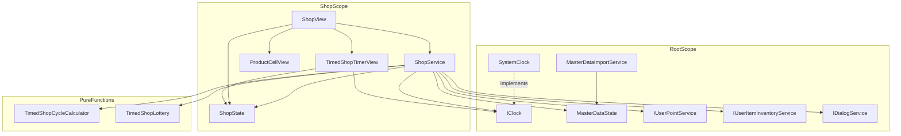
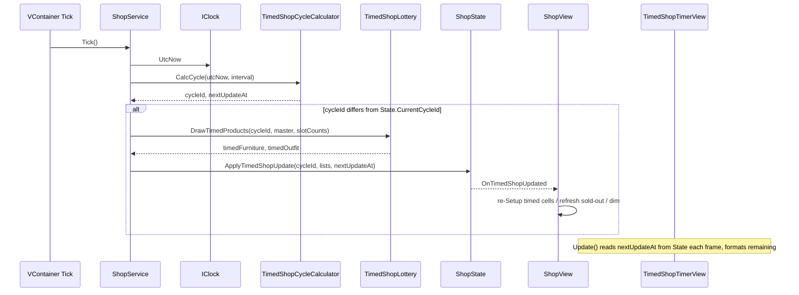
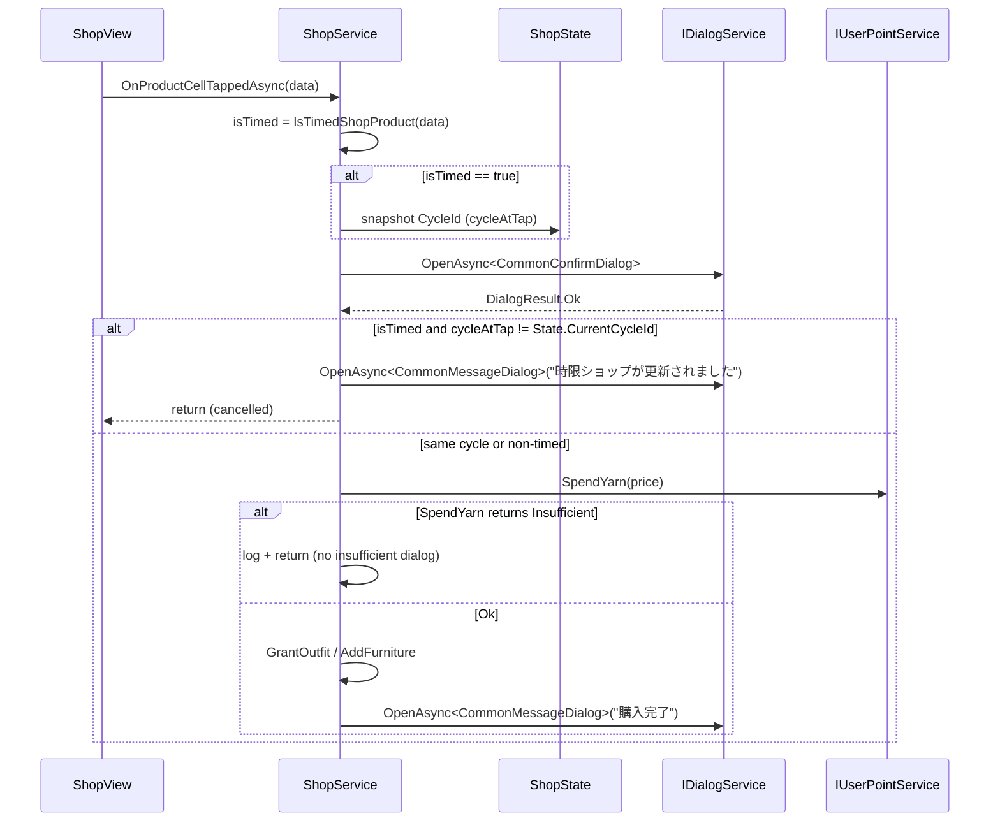
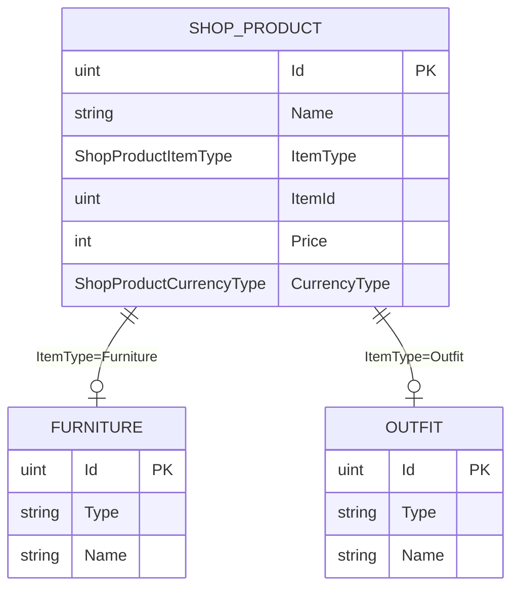

# Technical Design — timed-shop

## Overview

**Purpose**: 既存ショップ画面に「時限ショップ」カテゴリを追加し、家具・衣装の通常カテゴリを CSV マスタ駆動に再構成する。
**Users**: 本機能のエンドユーザーはプレイヤーで、30 分ごとに更新される時限商品とマスタ駆動の通常商品をショップ画面で閲覧・購入する。
**Impact**: 既存の `ShopService` / `ShopState` / `ShopView` を拡張し、`MasterDataImportService` にショップ商品マスタ読込を追加する。`Root.Service.IClock` を新規導入してサイクル算出の時刻取得を抽象化する。タブ UI はシーン上から撤去するが、コードは残置する（要件 2.2）。

### Goals
- 30 分間隔で全端末同一内容となる決定論的時限ショップを実装する。
- ショップ商品を CSV マスタから読み込み、コード変更なしで運用できる構造に置き換える。
- 既存 Shop の依存方向（View → Service → State）と Root サービス（`IUserPointService` / `IUserItemInventoryService`）を維持しつつ、ファイル追加を最小化する。

### Non-Goals
- リワード広告視聴商品（`currency_type = reward_ad`）の表示・購入処理（プレースホルダーのレイアウト枠のみ確保）。
- ガチャカテゴリの再表示（コード残置のみ、UI からは呼び出さない）。
- サーバー連携 / 認証時刻の利用（端末時刻ベースで完結する）。
- `point` 商品（毛糸パック）の購入処理改修（既存 `RealMoney` ProductType を保持）。
- Unity Editor 上のシーン編集・プレファブ作成・`SerializeField` 参照割当（D15 によりユーザー作業）。

## Architecture

### Existing Architecture Analysis

- **Scene-based + VContainer DI**: Shop シーンは `ShopScope` (Lifetime.Scoped) + RootScope (Lifetime.Singleton) の構成で、依存方向 `View → Service → State` を厳守する（steering: tech.md / structure.md）。
- **マスタロード**: `Root/Service/MasterDataImportService.cs` が `Resources.Load<TextAsset>("xxx")` → CSV パース → `MasterDataState.Xxx` 配列セットの確立されたパターンを持つ。`Imported` イベントは初回のみ発火（冪等）。
- **Tickable**: `VContainer.Unity.ITickable` 実装が 3 サービスで採用済み（`DialogContainer` / `IsoInputService` / `RedecorateCameraService`）。サービス層からのフレーム駆動オーケストレーションに整合する。
- **既存サービス再利用**: 残高は `IUserPointService` / 所持判定は `IUserItemInventoryService` に一本化済み（PR #45 の `shop-item-point-migration` で完了）。`ShopState` は通貨残高・所持情報を保持しない。
- **既存資産の保持**: `ShopTab` enum / `ShopState.CurrentTab` / `OnTabChanged` / `ShopService.SetCurrentTab` / `ShopView.UpdateTabVisuals` / `ShowContent` / `GachaCellView` / `GachaData` / `OnGachaTappedAsync` は削除せず、UI 経由で呼び出されない状態にする（要件 2.2 / 2.9）。

### Architecture Pattern & Boundary Map



**Architecture Integration**:
- **Selected pattern**: 既存 Scene + VContainer DI を踏襲。サイクル算出と抽選を純粋関数（`TimedShopCycleCalculator` / `TimedShopLottery`）に分離して、`ShopService` を `ITickable` 化することでフレーム駆動の責務を集約する（research.md: Decision「ハイブリッド採用」）。
- **Domain/feature boundaries**: マスタ層（Root.State.ShopProduct）/ アプリ層（Shop.State.ProductData）/ View 層（`ProductCellView` / `TimedShopTimerView`）/ 純粋関数層（Calculator/Lottery）。マスタは `Root` 側に置き、Shop シーン側はそれを表示用に変換する。
- **Existing patterns preserved**: `MasterDataImportService` の CSV ロード規約、`RootScope` の `Lifetime.Singleton` 規約、`SceneScope` の `Lifetime.Scoped` 規約、`ITickable` 実装規約、依存方向 `View → Service → State`。
- **New components rationale**: `IClock` は時刻取得のテスト容易性確保、`TimedShopCycleCalculator` / `TimedShopLottery` は決定論的アルゴリズムを純粋関数化することで単体テスト可能とし、`TimedShopTimerView` は単一タイマー UI（要件 6.1 / D12）の責務分離。
- **Steering compliance**: 命名（`PascalCase` / `_camelCase`）、`#nullable enable`、`[Inject]` 付与、CancellationToken を末尾引数に持つ async API、エラーログにクラスコンテキスト付与（`[ClassName]`）を遵守。

### Technology Stack

| Layer | Choice / Version | Role in Feature | Notes |
|-------|------------------|-----------------|-------|
| Runtime | Unity 6 (6000.x) / .NET Standard 2.1 | プラットフォーム実行基盤 | 既存スタック踏襲（変更なし） |
| DI | VContainer 1.17.0 | `RootScope` / `ShopScope` への登録、`ITickable` 配信 | 既存 |
| Async | UniTask | 購入確認・ダイアログ・購入完了メッセージ | 既存 |
| UI | TextMeshPro / UnityUI | 商品セル・タイマー表示 | 既存 |
| Asset Loading | Addressables 2.9.1 / Resources.Load | アイコン読込 (Addressables) / マスタ CSV 読込 (Resources) | 既存 |
| Random | `System.Random(int seed)` | 決定論的抽選（サイクル ID をシードに） | 新規ライブラリ追加なし。research.md「決定論性」項参照 |
| Time | `System.DateTimeOffset.UtcNow`（`SystemClock` 経由） | サイクル算出 | `IClock` を新規導入。詳細は research.md「IClock 抽象の最小 API」 |

> 新規パッケージ追加は不要。既存スタックの拡張のみで要件を満たす（research.md「外部ライブラリ確認」）。

## System Flows

### サイクル切替と再抽選



**Key Decisions**:
- サイクル境界判定は `cycleId` 等価比較のみで行い、複雑な閾値ロジックを排除する（端末スリープ復帰時にもそのまま機能する）。
- `OnTimedShopUpdated` は副作用イベントで、購読側は最新の `ShopState` を読み直す（再描画責務は View 側）。

### 購入確認中のサイクル切替検知（時限ショップ商品のみ）



**Key Decisions**:
- サイクル ID チェックは**時限ショップ由来のセル（`TimedFurnitureProductList` / `TimedOutfitProductList` の要素）に限定する**。通常カテゴリ家具/衣装はサイクル切替で内容が変わらないため、同じチェックを適用すると誤って購入が中止される（設計レビュー指摘 3 への対応、要件 9.7 は「時限ショップ商品の購入処理」節のみが対象範囲）。
- `IsTimedShopProduct(ProductData)` は `_state.TimedFurnitureProductList` / `_state.TimedOutfitProductList` への参照等価（`ReferenceEquals` または `Contains`）で判定する。同一マスタ ID の通常セルと時限セルが両立する場合でも、参照単位で識別できる。
- 「タップ時のサイクル ID」を `ShopService` のローカル変数に保持し、`SpendYarn` の直前で再比較する。
- `SpendYarn` が `Insufficient` を返した場合は毛糸不足ダイアログを表示せず、ログのみ。タップ可否再評価は `YarnBalanceChanged` 経由で View が処理する（要件 9.5 / 9.8）。

## Requirements Traceability

| Requirement | Summary | Components | Interfaces | Flows |
|-------------|---------|------------|------------|-------|
| 1.1, 1.10, 1.11 | shop_products.csv のロード | `MasterDataImportService` | `Import()` / `ImportShopProducts()` | — |
| 1.2, 1.3, 1.4, 1.5, 1.6 | マスタカラムと型 | `Shop.State.ShopProduct` | `ShopProduct` レコード | — |
| 1.7, 1.8 | `currency_type` と enum 拡張 | `Shop.State.CurrencyType` | enum `Yarn / RealMoney / RewardAd` | — |
| 1.9, 1.12 | `MasterDataState.ShopProducts` | `Root.State.MasterDataState` | `ShopProduct[] ShopProducts` | — |
| 2.1, 2.3, 2.4, 2.5, 2.6 | タブ UI 撤去・カテゴリ縦並び | `ShopView` (シーン編集はユーザー側) | `[SerializeField]` セルリスト追加 | — |
| 2.2, 2.9, 2.13 | タブ・ガチャの API 残置 | `ShopState` / `ShopService` / `GachaCellView` | 既存 API 据置 | — |
| 2.7, 2.8, 2.11, 2.12 | マスタ駆動初期化 | `ShopService.Initialize` | `BuildShopProductsFromMaster` | — |
| 2.10 | 既存 Shop シーン再利用 | — (Unity 作業) | — | — |
| 3.1, 3.2, 3.3, 3.5 | 時限セル領域 | `ShopView` / `ProductCellView` | `_timedFurnitureCells` / `_timedOutfitCells` | — |
| 3.4 | 時限バッジを表示しない | `ShopView` (Unity 作業) | — | — |
| 4.1 | 更新間隔定数 | `TimedShopConstants.UpdateInterval` | `TimeSpan UpdateInterval` | — |
| 4.2, 4.3, 4.5, 4.6 | 決定論的サイクル算出 | `TimedShopCycleCalculator` | `CalcCycle(now, interval)` | サイクル切替 |
| 4.4 | 境界到達時の即時再抽選 | `ShopService.Tick` | `Tick()` | サイクル切替 |
| 5.1, 5.2, 5.5, 5.10, 5.11 | 抽選母集合と独立抽選 | `ShopService.RebuildTimedShop` / `TimedShopLottery` | `DrawTimedProducts(...)` | サイクル切替 |
| 5.3, 5.4, 5.7, 5.8 | 一様乱数・非復元/復元抽出 | `TimedShopLottery` | `DrawTimedProducts(...)` | — |
| 5.6, 5.9 | 枠固定・空母集合警告 | `TimedShopLottery` / `ShopService` | `DrawTimedProducts(...)` | — |
| 6.1, 6.2, 6.3, 6.4, 6.6, 6.7 | タイマー UI 表示 | `TimedShopTimerView` | `Update()` で再計算 | — |
| 6.5 | 残り時間 0 で再抽選 + 表示切替 | `ShopService.Tick` / `TimedShopTimerView` | `OnTimedShopUpdated` | サイクル切替 |
| 7.1, 7.5 | 抽選母集合に所持判定を介在させない | `ShopService.RebuildTimedShop` | — | — |
| 7.2, 7.3, 7.4, 7.9 | 売り切れオーバーレイ表示 | `ProductCellView` | `SetSoldOut(bool)` | — |
| 7.6, 7.8 | OutfitChanged 購読再評価 | `ShopView` | `OutfitChanged` 購読 | — |
| 7.7 | 衣装付与 | `ShopService.OnTimedOutfitPurchased` | `IUserItemInventoryService.GrantOutfit` | 購入確認中のサイクル切替検知 |
| 8.1, 8.2 | 家具売り切れなし | `ShopView` | `SetSoldOut` 非呼出 | — |
| 8.3, 8.4, 8.5, 8.6 | 家具購入処理 | `ShopService.OnTimedFurniturePurchased` | `IUserItemInventoryService.AddFurniture` | 購入確認中のサイクル切替検知 |
| 9.1, 9.2, 9.3 | 購入確認ダイアログ | `ShopService.OnProductCellTappedAsync` | `IDialogService` | 購入確認中のサイクル切替検知 |
| 9.4, 9.5, 9.6, 9.10 | 暗め表示 + タップ無効 | `ProductCellView.SetDimmed` / `ShopView` | `YarnBalanceChanged` 購読 | — |
| 9.7 | サイクル切替時の購入中止 | `ShopService.OnProductCellTappedAsync` | — | 購入確認中のサイクル切替検知 |
| 9.8 | Insufficient 時にダイアログ非表示 | `ShopService.TrySpendYarnAsync` | — | 購入確認中のサイクル切替検知 |
| 9.9 | reward_ad 商品のスタブ | `ShopService.OnProductCellTappedAsync` | — | — |
| 10.1, 10.2, 10.3, 10.4, 10.6 | ShopState 拡張 | `Shop.State.ShopState` | フィールド・イベント追加 | — |
| 10.5 | マスタ型に基づく商品データ | `Root.State.ShopProduct` / `Shop.State.ProductData` | レコード | — |
| 10.7, 10.8 | 通貨/所持情報を State 外で管理・依存方向維持 | `ShopService` / `ShopView` | 既存 Root サービス購読 | — |

## Components and Interfaces

### Component Summary

| Component | Domain/Layer | Intent | Req Coverage | Key Dependencies (P0/P1) | Contracts |
|-----------|--------------|--------|--------------|--------------------------|-----------|
| `IClock` / `SystemClock` | Root.Service | 時刻取得抽象 | 4.2 | — | Service |
| `Shop.State.ShopProduct` | Shop.State | ショップ商品マスタ行 | 1.2–1.6, 10.5 | `Shop.State.ItemType` (P0), `Shop.State.CurrencyType` (P0) | State |
| `MasterDataState` 拡張 | Root.State | ショップ商品配列 | 1.9, 1.12 | `Shop.State.ShopProduct` (P0) | State |
| `MasterDataImportService` 拡張 | Root.Service | shop_products.csv ロード | 1.1, 1.10, 1.11 | MasterDataState (P0) | Service |
| `Shop.State.CurrencyType` 拡張 | Shop.State | RewardAd 値追加 | 1.7, 1.8 | — | State |
| `Shop.State.ItemType` 新設 | Shop.State | 付与アイテム種別（Furniture/Outfit/Point） | 1.3 | — | State |
| `Shop.State.ProductData` 拡張 | Shop.State | 表示行（ItemType / ProductId 追加） | 1.3, 10.5 | `Shop.State.ShopProduct` (P0) | State |
| `Shop.State.ShopState` 拡張 | Shop.State | 時限ショップ状態保持 | 10.1–10.4, 10.6, 10.8 | — | State, Event |
| `Shop.Service.ShopService` 拡張 | Shop.Service | サイクル管理・抽選・購入分岐 | 2.7, 2.8, 2.11–2.13, 4.4, 5.1–5.10, 6.5, 7.6, 8.3–8.6, 9.1–9.10 | IClock (P0), MasterDataState (P0), IUserPointService (P0), IUserItemInventoryService (P0), IDialogService (P0), TimedShopCycleCalculator (P0), TimedShopLottery (P0), ShopState (P0) | Service, Event subscriber |
| `Shop.Service.TimedShopCycleCalculator` | Shop.Service (純粋関数) | サイクル ID / 残り時間 / シード算出 | 4.2, 4.3, 4.5, 4.6, 5.4 | — | Service (Pure) |
| `Shop.Service.TimedShopLottery` | Shop.Service (純粋関数) | 決定論的非復元/復元抽出 | 5.3, 5.4, 5.6, 5.7, 5.8, 5.9 | — | Service (Pure) |
| `Shop.Service.TimedShopConstants` | Shop.Service | 定数（更新間隔・抽選枠数） | 4.1, 5.5 | — | Constants |
| `Shop.View.ShopView` 改修 | Shop.View | 時限/家具/衣装セル管理・再評価 | 2.1, 2.3–2.6, 3.1, 3.3, 6.5, 7.6, 7.8, 9.4, 9.5, 9.6, 9.10 | ShopState (P0), ShopService (P0), IUserPointService (P0), IUserItemInventoryService (P0) | View |
| `Shop.View.ProductCellView` 拡張 | Shop.View | 暗め/売り切れ表示 API | 7.2, 7.3, 7.4, 9.4, 9.5 | — | View |
| `Shop.View.TimedShopTimerView` | Shop.View | 残り時間表示専用 View | 6.1–6.4, 6.6, 6.7 | IClock (P0), ShopState (P0) | View |

### Root.Service

#### `IClock` / `SystemClock`

| Field | Detail |
|-------|--------|
| Intent | 時刻取得をテスト容易にするための抽象 |
| Requirements | 4.2 |
| Owner / Reviewers | Root レイヤ |

**Responsibilities & Constraints**
- `IClock.UtcNow` は呼び出されるたびに最新の `DateTimeOffset` を返す。
- `SystemClock` は `DateTimeOffset.UtcNow` を直接返すだけの薄い実装。

**Dependencies**
- Inbound: `ShopService`（P0）、`TimedShopTimerView`（P0）
- Outbound: なし
- External: `System.DateTimeOffset`（P0）

**Contracts**: Service [x] / API [ ] / Event [ ] / Batch [ ] / State [ ]

##### Service Interface
```csharp
namespace Root.Service
{
    public interface IClock
    {
        DateTimeOffset UtcNow { get; }
    }

    public sealed class SystemClock : IClock
    {
        public DateTimeOffset UtcNow => DateTimeOffset.UtcNow;
    }
}
```
- Preconditions: なし
- Postconditions: 戻り値は呼び出し時点の UTC 時刻
- Invariants: 呼び出しごとに単調非減少（システム時刻が後退しない限り）

**Implementation Notes**
- Integration: `RootScope` で `builder.Register<SystemClock>(Lifetime.Singleton).As<IClock>();` を追加。
- Validation: `ShopService` / `TimedShopTimerView` 以外のクライアントが増えるまで API は最小のまま据え置く。
- Risks: 端末時刻の手動変更によりサイクル算出が狂う（research.md: Risks 「端末時間書換」）。本フェーズでは Mitigation 不要（Non-Goal）。

### Shop.State / Root（マスタ層）

#### `Shop.State.ShopProduct`

| Field | Detail |
|-------|--------|
| Intent | shop_products.csv 1 行に対応するマスタ行 |
| Requirements | 1.2, 1.3, 1.4, 1.5, 1.6, 10.5 |

**Responsibilities & Constraints**
- 不変な値オブジェクト（record class）。
- `ItemType` / `CurrencyType` は文字列ではなく `Shop.State` 名前空間に定義する単一の enum を共用する（マスタ層と表示層で同一の型を参照する。設計レビュー指摘 1 への対応）。
- `Outfit` / `Furniture` 型は `ItemId` で `MasterDataState.Outfits` / `Furnitures` の `Id` と参照整合（FK 相当）。

**Dependencies**
- Inbound: `MasterDataImportService`（P0）, `ShopService`（P0）
- Outbound: `Shop.State.ItemType`（P0）, `Shop.State.CurrencyType`（P0）

**Contracts**: Service [ ] / API [ ] / Event [ ] / Batch [ ] / State [x]

##### State Management
```csharp
namespace Shop.State
{
    public sealed record ShopProduct(
        uint Id,
        string Name,
        ItemType ItemType,
        uint ItemId,
        int Price,
        CurrencyType CurrencyType
    );
}
```
- 状態モデル: マスタは初期化後に再読込されない（`MasterDataState.IsImported` で冪等）。
- 永続化: なし（`Resources/shop_products.csv` の静的データ）。
- 整合性: CSV パース失敗時は空配列とし、警告ログを出力（要件 1.11）。`item_type=point` 行の取り扱いは `ProductData` への射影段階で扱う（要件 1.6 は設計フェーズで具体化、本機能では `point` 商品の表示を実装しない）。

**Implementation Notes**
- Integration: マスタ行は Shop シーン固有のドメインのため `Shop.State` 名前空間に置き、`Root.State.MasterDataState.ShopProducts` フィールドが本型を参照する（既存 `Outfit` / `Furniture` がプロジェクト共通であるのに対し、`ShopProduct` は Shop シーンの責務）。
- Validation: `ItemType = Furniture/Outfit` で `ItemId` が対応マスタに存在しない場合、警告ログ + 該当行を除外。
- Risks: CSV 形式の手動編集ミス → Import ログで早期検出。

#### `MasterDataState` 拡張

| Field | Detail |
|-------|--------|
| Intent | ショップ商品マスタ配列の公開 |
| Requirements | 1.9, 1.12 |

**Responsibilities & Constraints**
- 既存 `Outfits` / `Furnitures` と同列のフィールドとして `ShopProducts` を追加。
- 既存パターン踏襲のため public フィールド（プロパティではない）。

**Contracts**: Service [ ] / API [ ] / Event [ ] / Batch [ ] / State [x]

##### State Management
```csharp
using Shop.State; // Shop.State.ShopProduct を参照

namespace Root.State
{
    public class MasterDataState
    {
        public bool IsImported { get; set; }
        public Outfit[] Outfits;
        public Furniture[] Furnitures;
        public ShopProduct[] ShopProducts;
    }
}
```
- 永続化: なし。
- 整合性: `ShopProducts` の `ItemId` は `Outfits.Id` または `Furnitures.Id` を参照（弱整合、Import 時に検証）。

**Implementation Notes**
- Integration: フィールド初期値は `Array.Empty<ShopProduct>()` とすることでヌル安全（既存コードの `Outfits` / `Furnitures` も空配列フォールバックを採用予定）。
- Risks: 既存 `Outfits` / `Furnitures` がヌル参照のままなら互換性は変わらない（変更しない）。

#### `MasterDataImportService` 拡張

| Field | Detail |
|-------|--------|
| Intent | shop_products.csv を既存パターンで読み込む |
| Requirements | 1.1, 1.10, 1.11 |

**Responsibilities & Constraints**
- `Import()` 内で `ImportOutfits` / `ImportFurnitures` と並んで `ImportShopProducts` を実行する（同一タイミング）。
- パース失敗時はクラスコンテキスト付きで `Debug.LogError` を出力し、`MasterDataState.ShopProducts = Array.Empty<ShopProduct>()` とする。

**Dependencies**
- Inbound: `UserDataImportService`（P0、既存）
- Outbound: `MasterDataState`（P0）
- External: `Resources.Load<TextAsset>("shop_products")`（P0）

**Contracts**: Service [x] / API [ ] / Event [x] / Batch [ ] / State [ ]

##### Service Interface
```csharp
public class MasterDataImportService
{
    public event Action Imported;
    public void Import();
    void ImportShopProducts();
}
```
- Preconditions: `MasterDataState.IsImported == false`
- Postconditions: 成功時は `MasterDataState.ShopProducts` に配列をセットし、`Imported` を 1 度だけ発火
- Invariants: `Import()` は冪等（既に Import 済みなら no-op）

##### Event Contract
- Published: `Imported`（パラメータなし、初回のみ）。本フェーズでは `ImportShopProducts` のメッセージ追加なし（既存購読側 `UserItemInventoryService` への影響なし）。

**Implementation Notes**
- Integration: `shop_products.csv` のヘッダ行: `id,name,item_type,item_id,price,currency_type`（要件 1.2 のカラム集合をこの順で確定）。CSV → `Shop.State.ItemType` / `Shop.State.CurrencyType` enum への変換を行う。
- Validation: 行ごとに `int.TryParse` / `Enum.TryParse`（大文字/小文字を許容）。`currency_type=real_money` は CSV 上は許容しない（マスタ用は `yarn` / `reward_ad` のみ）。失敗行は警告ログ + スキップ。
- Risks: `currency_type = real_money` のような旧値が混入しないよう CSV 編集ガイドラインを README に記載（実装フェーズで決定）。

### Shop.State

#### `Shop.State.CurrencyType` 拡張

| Field | Detail |
|-------|--------|
| Intent | リワード広告視聴を支払い手段として識別 |
| Requirements | 1.7, 1.8 |

**Contracts**: State [x]

##### State Management
```csharp
namespace Shop.State
{
    public enum CurrencyType
    {
        Yarn,
        RealMoney, // 既存（毛糸パック課金、本機能の購入処理対象外）
        RewardAd   // 新規（CSV `currency_type = reward_ad` に対応）
    }
}
```
- 永続化: なし。
- 互換性: 既存 `Yarn` / `RealMoney` 値の数値順は変更しない（保存データなし、配信前のため後方互換性懸念は低い）。
- 単一性: マスタ層・表示層・購入分岐すべてが本 enum を共用する（Root 側に重複 enum を持たない。設計レビュー指摘 1 への対応）。

**Implementation Notes**
- Risks: 共通 enum のため、マスタ層に存在しない値（`RealMoney`）が CSV から読まれることはなく、`MasterDataImportService` 側で値域を絞り込む（`yarn` / `reward_ad` のみ許容）。

#### `Shop.State.ProductData` 拡張

| Field | Detail |
|-------|--------|
| Intent | 表示用商品レコード。マスタ ID と付与アイテム種別を保持 |
| Requirements | 1.3, 10.5 |

**Contracts**: State [x]

##### State Management
```csharp
namespace Shop.State
{
    public enum ItemType
    {
        Furniture, // CSV `item_type = furniture`
        Outfit,    // CSV `item_type = outfit`
        Point      // CSV `item_type = point`（本機能では表示・購入対象外）
    }

    public record ProductData(
        string Name,
        string IconPath,
        int Price,
        CurrencyType CurrencyType,
        ProductType ProductType,    // 既存（Item / YarnPack）。本機能では原則 Item を使用
        ItemType ItemType,           // 新規：付与アイテム種別
        uint? ProductId,             // 新規：ShopProduct.Id（マスタ参照、null は本機能対象外）
        uint? ItemId,                // 新規：付与対象の Outfit.Id / Furniture.Id
        int? YarnAmount = null
    );
}
```
- `ProductType` は既存の互換目的で残置。新規時限/家具/衣装セルでは `ItemType` を判定軸とする。
- `ItemId` が `Outfit.Id` か `Furniture.Id` かは `ItemType` で判別。
- 「リワード広告視聴商品」かどうかは `CurrencyType == RewardAd` で識別する（`ItemType` には反映しない。要件 1.3）。

**Implementation Notes**
- Integration: 既存 `ProductCellView.Setup(ProductData)` の API は変更しない（追加カラムのみ）。
- Risks: `record` の positional 引数を増やすため、既存呼び出し箇所（`InitializeMockData`）はすべて削除されることを前提（要件 2.11–2.13）。

#### `Shop.State.ShopState` 拡張

| Field | Detail |
|-------|--------|
| Intent | 時限ショップの状態とイベントを保持 |
| Requirements | 10.1, 10.2, 10.3, 10.4, 10.6, 10.7, 10.8 |

**Responsibilities & Constraints**
- 通貨残高・所持情報は保持しない（既存制約、要件 10.7）。
- 既存 `ShopTab` / `CurrentTab` / `OnTabChanged` / `SetCurrentTab` はそのまま残置（要件 2.2）。
- `GachaList` は型・初期化のみ残置し、本機能では空のまま保持する（要件 2.13、`OnGachaTappedAsync` の動作担保）。
- 既存 `ItemProductList` / `PointProductList` は本機能で完全廃止する（モック削除と共に消費者が消えるため、要件 2.11 / 10.6 に整合する形で除去）。
- 時限ショップ用フィールドは `ShopService` 経由でのみ更新される（依存方向、要件 10.8）。

**Contracts**: State [x] / Event [x]

##### State Management
```csharp
namespace Shop.State
{
    public class ShopState
    {
        // 既存（残置：API 表面とガチャ状態のみ）
        public ShopTab CurrentTab { get; private set; } = ShopTab.Item;
        public event Action<ShopTab>? OnTabChanged;
        public List<GachaData> GachaList { get; } = new(); // 要件 2.13: 空のまま保持
        public void SetCurrentTab(ShopTab tab);

        // 新規（本機能で導入する表示中商品リスト）
        public List<ProductData> FurnitureProductList { get; } = new();        // 通常カテゴリ家具（最大 6 件、マスタ先頭から取得）
        public List<ProductData> OutfitProductList { get; } = new();           // 通常カテゴリ衣装（最大 6 件、マスタ先頭から取得）
        public List<ProductData> RewardAdProductList { get; } = new();         // 表示プレースホルダー（本フェーズは空のまま）
        public List<ProductData> TimedFurnitureProductList { get; } = new();   // 時限・家具
        public List<ProductData> TimedOutfitProductList { get; } = new();      // 時限・衣装

        public long CurrentCycleId { get; private set; }
        public DateTimeOffset NextUpdateAt { get; private set; }
        public event Action? OnTimedShopUpdated;

        public void ApplyTimedShopUpdate(
            long cycleId,
            DateTimeOffset nextUpdateAt,
            IReadOnlyList<ProductData> timedFurniture,
            IReadOnlyList<ProductData> timedOutfit);
    }
}
```
- `ApplyTimedShopUpdate` は内部で `TimedFurnitureProductList` / `TimedOutfitProductList` を差し替え、`CurrentCycleId` / `NextUpdateAt` を更新し、`OnTimedShopUpdated` を発火する。
- `CurrentCycleId` の初期値 `0` はサービス起動前を意味し、最初の Tick で必ず差し替わる。
- `RewardAdProductList` は本フェーズでは `ShopService` で populate しない（要件 2.6 / 9.9）。シーン上のセル枠（`_rewardAdCells`）はゼロ件運用とし、フィールドは将来拡張のためだけに用意する。

**Implementation Notes**
- Integration: `ItemProductList` / `PointProductList` は本機能で削除する（設計レビュー指摘 2 への対応）。`InitializeMockData()` の削除に伴って外部参照も無くなるため、後方互換のための残置は不要。
- Risks: 既存コードで `ItemProductList` / `PointProductList` を参照している箇所が gap-analysis 時点では `InitializeMockData()` のみであるため、当該メソッド除去と同時に削除可能。Inspector 経由の参照は存在しない。

### Shop.Service

#### `Shop.Service.TimedShopConstants`

| Field | Detail |
|-------|--------|
| Intent | 更新間隔・抽選枠数の定数集約 |
| Requirements | 4.1, 5.5 |

**Contracts**: なし（定数のみ）

```csharp
namespace Shop.Service
{
    public static class TimedShopConstants
    {
        public static readonly TimeSpan UpdateInterval = TimeSpan.FromMinutes(30);
        public const int TimedFurnitureSlotCount = 6;
        public const int TimedOutfitSlotCount = 6;
    }
}
```

**Implementation Notes**
- Integration: 内部参照のみで、`SerializeField` は使用しない（マジックナンバー禁止のため定数化）。
- Risks: 将来的に Inspector 設定にしたい場合は `ScriptableObject` 化を検討（本フェーズは Non-Goal）。

#### `Shop.Service.TimedShopCycleCalculator`

| Field | Detail |
|-------|--------|
| Intent | 時刻 → サイクル ID / 次回更新時刻 / 残り時間 / 抽選シード を算出する純粋関数 |
| Requirements | 4.2, 4.3, 4.5, 4.6, 5.4 |

**Responsibilities & Constraints**
- 純粋関数。状態を持たず、副作用なし。
- `cycleId = floor(epochSeconds / intervalSeconds)`（要件 4.2）。
- `seed` は `cycleId` を `int` に XOR 折り畳み（高 32bit XOR 低 32bit）（research.md「シード安全な算出」）。

**Contracts**: Service [x]（純粋関数）

##### Service Interface
```csharp
namespace Shop.Service
{
    public readonly struct TimedShopCycleSnapshot
    {
        public long CycleId { get; }                  // サイクル ID（量子化された epoch / interval）
        public DateTimeOffset CycleStartUtc { get; }  // サイクル開始時刻
        public DateTimeOffset NextUpdateAtUtc { get; } // 次サイクル開始時刻
        public TimeSpan Remaining { get; }            // 現在時刻からの残り
        public int Seed { get; }                      // 抽選シード（cycleId からの確定的写像）
    }

    public static class TimedShopCycleCalculator
    {
        public static TimedShopCycleSnapshot Calculate(DateTimeOffset utcNow, TimeSpan interval);
    }
}
```
- Preconditions: `interval > TimeSpan.Zero`
- Postconditions: 戻り値の `Remaining` は `[0, interval)` 範囲、`NextUpdateAtUtc - CycleStartUtc == interval`
- Invariants: 同一 `(utcNow, interval)` で同じ結果（純粋関数）

**Implementation Notes**
- Integration: `ShopService.Tick()` から呼び出され、結果を `ShopState` に反映する前のローカル変数として利用される。
- Validation: `interval == TimeSpan.Zero` は `ArgumentOutOfRangeException`（プログラマエラー）。
- Risks: epoch オーバーフロー（`long` 範囲、現実的に無視）。

#### `Shop.Service.TimedShopLottery`

| Field | Detail |
|-------|--------|
| Intent | サイクル別シードを使った決定論的非復元/復元抽出 |
| Requirements | 5.3, 5.4, 5.6, 5.7, 5.8, 5.9 |

**Responsibilities & Constraints**
- 純粋関数。状態を持たず、副作用なし（ログ出力は呼び出し側）。
- 母集合件数 ≥ 枠数: Fisher-Yates シャッフルの先頭 `slotCount` を返す（非復元抽出）。
- 母集合件数 < 枠数（ただし > 0）: `Random.Next(count)` を `slotCount` 回呼び復元抽出。
- 母集合件数 = 0: 空配列を返す（呼び出し側で警告ログ）。

**Contracts**: Service [x]（純粋関数）

##### Service Interface
```csharp
namespace Shop.Service
{
    public static class TimedShopLottery
    {
        public static IReadOnlyList<ShopProduct> DrawTimedProducts(
            IReadOnlyList<ShopProduct> source,
            int slotCount,
            int seed);
    }
}
```
- Preconditions: `source != null`、`slotCount > 0`
- Postconditions:
  - `source.Count == 0` の場合は空配列。
  - `source.Count >= slotCount` の場合は `slotCount` 件、互いに `ShopProduct.Id` が重複しない。
  - `0 < source.Count < slotCount` の場合は `slotCount` 件（重複あり）。
  - 同一 `(source の同一順序, slotCount, seed)` で同じ結果。
- Invariants: `source` の参照を変更しない（コピーして処理）。

**Implementation Notes**
- Integration: `ShopService.RebuildTimedShop` から `ItemType` でフィルタした `source` を 2 回（家具・衣装）渡して呼び出す。
- Validation: `slotCount <= 0` は `ArgumentOutOfRangeException`。
- Risks: クロスプラットフォームでの `System.Random` 系列差異（research.md「決定論性」）。実装時にスモーク test を追加。

#### `Shop.Service.ShopService` 拡張

| Field | Detail |
|-------|--------|
| Intent | サイクル管理 + マスタ駆動初期化 + 時限/家具/衣装の購入分岐を集約する Service |
| Requirements | 2.7, 2.8, 2.11, 2.12, 2.13, 4.4, 5.1, 5.2, 5.10, 5.11, 6.5, 7.1, 7.5, 7.7, 8.3–8.6, 9.1–9.10 |

**Responsibilities & Constraints**
- `VContainer.Unity.ITickable` を実装し、`Tick()` でサイクル切替を検知する（research.md: Decision「Tickable 集約」）。
- 既存の `OnGachaTappedAsync` / `SetCurrentTab` / `RefreshGachaCellInteractable` 等の API は残置（要件 2.2 / 2.9）。
- 既存 `InitializeMockData()` / `ShowYarnInsufficientAsync()` は削除（要件 2.11, 9.5, 9.10）。

**Dependencies**
- Inbound: `ShopStarter`（P0）、`ShopView`（P0）
- Outbound: `ShopState`（P0）、`MasterDataState`（P0）、`IUserPointService`（P0）、`IUserItemInventoryService`（P0）、`IDialogService`（P0）、`IClock`（P0）、`SceneLoader`（P1）
- External: `TimedShopCycleCalculator`（P0）、`TimedShopLottery`（P0）

**Contracts**: Service [x] / Event [x]（State 経由）

##### Service Interface
```csharp
namespace Shop.Service
{
    public class ShopService : ITickable
    {
        [Inject]
        public ShopService(
            ShopState state,
            IUserPointService userPointService,
            IUserItemInventoryService userItemInventoryService,
            MasterDataState masterDataState,
            IDialogService dialogService,
            SceneLoader sceneLoader,
            IClock clock);

        public void Initialize();                                  // マスタ駆動の初期化 + 初回サイクル算出
        public void Tick();                                        // サイクル切替検知
        public void SetupProductCell(ProductCellView cell, ProductData data);
        public void RefreshProductCellInteractable(ProductCellView cell, ProductData data, int balance);
        public bool IsAffordable(ProductData data, int balance);   // 暗め表示判定（9.4 / 9.10）
        public bool IsSoldOut(ProductData data);                   // 衣装売り切れ判定（7.3 / 7.5）
        public bool IsTimedShopProduct(ProductData data);          // 時限セル由来か判定（9.7 のサイクル検知対象）
        public UniTask OnProductCellTappedAsync(ProductData data, CancellationToken ct);
        public int GetYarnBalance();
        public TimedShopCycleSnapshot GetCurrentCycleSnapshot();   // タイマー View 用
        public void GoBack();

        // 既存 API（残置・改修なし）
        public void SetCurrentTab(ShopTab tab);
        public void SetupGachaCell(GachaCellView cell, int index);
        public void RefreshGachaCellInteractable(GachaCellView cell, int index, int balance);
        public UniTask OnGachaTappedAsync(int gachaIndex, int count, CancellationToken ct);
    }
}
```
- Preconditions:
  - `Initialize()` は `MasterDataImportService.Import()` 完了後に呼ばれる（既存 `SceneScope.Awake` で保証）。
  - `OnProductCellTappedAsync` の `data.ItemType` が `Furniture` / `Outfit` / `RewardAdReward` のいずれか。
- Postconditions:
  - `Initialize()` 後、`ShopState.FurnitureProductList` / `OutfitProductList` / `TimedFurnitureProductList` / `TimedOutfitProductList` がマスタ由来の値で埋まる。`GachaList` は空のまま（要件 2.13）。
  - `Tick()` でサイクル境界を越えた場合、`ApplyTimedShopUpdate` が呼ばれ `OnTimedShopUpdated` が発火する。
  - `OnProductCellTappedAsync` 完了後、購入成功なら `IUserPointService.SpendYarn` + `IUserItemInventoryService.GrantOutfit/AddFurniture` が実行され、購入完了メッセージが表示される。
- Invariants:
  - `_state.CurrentCycleId` は `Initialize()` 後常に最新サイクル ID と一致する。
  - 通貨残高・所持情報を `ShopState` に書き戻さない（要件 10.7）。

##### Event Contract
- Subscribed: `IUserPointService.YarnBalanceChanged`（暗め表示再評価のため View が直接購読、ServiceConfigure 不要）。`IUserItemInventoryService.OutfitChanged`（売り切れ再評価のため View が直接購読）。
- Published: `ShopState.OnTimedShopUpdated`（State 経由）。

**Implementation Notes**
- Integration:
  - 通常カテゴリ（家具/衣装）の表示リストは `BuildShopProductsFromMaster(ItemType.Furniture, take: 6)` のような単純取得で構築。先頭 6 件 / 全件のいずれかは設計確認事項だが、要件 2.4 / 2.5 で「6 件の手動配置」と定められているため、マスタの先頭 6 件を採用する。
  - 時限カテゴリは `RebuildTimedShop(seed)` で `TimedShopLottery` を呼び、`ShopProduct` → `ProductData` への射影を `BuildProductDataFromShopProduct(...)` で行う（マスタ参照で `IconPath` / `Name` を解決）。
  - サイクル ID 一致比較は `IsTimedShopProduct(data) == true` の場合のみ実行（要件 9.7、シーケンス図参照）。通常カテゴリ家具/衣装の購入はサイクル切替の影響を受けない。
- Validation:
  - `data.CurrencyType == CurrencyType.RewardAd` の場合は要件 9.9 のスタブとして即 `return`（本フェーズでは表示すらしない方針のため、原理上到達しない防御コード）。将来 Unity Ads 統合時にここへ広告再生分岐を追加する。
  - `data.ItemType == Outfit` で `IUserItemInventoryService.HasOutfit(data.ItemId)` が true の場合、購入処理を実行せず（売り切れセルは `Button.interactable = false` であるため通常は到達しないが、競合状態の防御として）。
- Risks:
  - `Tick()` が毎フレーム走るため `IClock.UtcNow` 呼び出しコストを意識（`DateTimeOffset.UtcNow` は十分軽量）。
  - `MasterDataState.ShopProducts` がヌルになり得る場合（旧コードからの移行直後）に備え、`?? Array.Empty<ShopProduct>()` で防御。

### Shop.View

#### `Shop.View.ShopView` 改修

| Field | Detail |
|-------|--------|
| Intent | カテゴリ縦並び表示・タイマー連携・残高/所持変動による再評価 |
| Requirements | 2.1, 2.3–2.6, 3.1, 3.3, 6.5, 7.6, 7.8, 9.4, 9.5, 9.6, 9.10 |

**Responsibilities & Constraints**
- 既存タブ関連 `[SerializeField]`（`_itemTabButton` / `_pointTabButton` / `_itemContent` / `_pointContent` / `_itemTabImage` 等）はコード上残置可能だが、シーン側で参照解除されることを前提に `null` 安全に保つ（既存実装どおり）。
- 新規 `[SerializeField]` フィールドを追加し、ユーザーが Inspector 上で参照を割り当てる（D15）。

**Dependencies**
- Inbound: なし（Unity 起動時にインジェクション）
- Outbound: `ShopState`（P0）、`ShopService`（P0）、`IUserPointService`（P0）、`IUserItemInventoryService`（P0）

**Contracts**: View [x]

##### View インターフェース（追加 SerializeField）
```csharp
namespace Shop.View
{
    public class ShopView : MonoBehaviour
    {
        // 既存（タブ関連、変更なし）...

        [Header("Yarn Balance Display")]
        [SerializeField] TMP_Text? _yarnBalanceText;

        [Header("Gacha Cells (kept for legacy)")]
        [SerializeField] List<GachaCellView> _gachaCells = new();

        [Header("Furniture Cells (6 cells)")]
        [SerializeField] List<ProductCellView> _furnitureCells = new();

        [Header("Outfit Cells (6 cells)")]
        [SerializeField] List<ProductCellView> _outfitCells = new();

        [Header("Reward-Ad Cells (placeholder, 0 cells in this phase)")]
        [SerializeField] List<ProductCellView> _rewardAdCells = new();

        [Header("Timed Shop Furniture Cells")]
        [SerializeField] List<ProductCellView> _timedFurnitureCells = new();

        [Header("Timed Shop Outfit Cells")]
        [SerializeField] List<ProductCellView> _timedOutfitCells = new();

        [Header("Timed Shop Timer")]
        [SerializeField] TimedShopTimerView? _timerView;

        [Inject]
        public void Construct(
            ShopState state,
            ShopService shopService,
            IUserPointService userPointService,
            IUserItemInventoryService userItemInventoryService);
    }
}
```
- 起動時のフロー: `Start()` で `SetupCells` → `SubscribeToStateEvents` → `SubscribeToCellEvents`。`UpdateTabVisuals` / `ShowContent` の呼び出しは削除（タブ UI 撤去）。
- 再評価: `YarnBalanceChanged` / `OutfitChanged` / `OnTimedShopUpdated` のいずれかで全カテゴリの `interactable` / 暗め / 売り切れ状態を再評価する。

**Implementation Notes**
- Integration:
  - 売り切れ判定は `ShopService.IsSoldOut(data)` を呼び、戻り値で `ProductCellView.SetSoldOut(bool)` を切り替える。
  - 暗め判定は `!ShopService.IsAffordable(data, balance)` を `SetDimmed(bool)` で反映。
  - 売り切れと暗めは独立に評価する（売り切れセルでも残高十分なら暗めにしない、要件 7.9）。
- Validation:
  - `_timerView` が null の場合は警告ログを出して動作継続（タイマー UI を含まないテストシーンへの配慮）。
- Risks:
  - 既存タブ関連 `[SerializeField]` の Inspector 上の解除をユーザー側で行う必要がある（D15）。シーン編集ガイドを設計引継ぎ書に明記。

#### `Shop.View.ProductCellView` 拡張

| Field | Detail |
|-------|--------|
| Intent | 暗め表示と売り切れ表示の API を追加 |
| Requirements | 7.2, 7.3, 7.4, 9.4, 9.5 |

**Responsibilities & Constraints**
- 既存 `Setup` / `SetInteractable` API は変更しない。
- 売り切れオーバーレイは `SetActive` 切替のみ（要件 7.2 / 7.3）。
- 暗め表示は `CanvasGroup.alpha` で実装（research.md: Decision「売り切れオーバーレイ実装」）。

**Contracts**: View [x]

##### View インターフェース（追加）
```csharp
namespace Shop.View
{
    public class ProductCellView : MonoBehaviour
    {
        [SerializeField] CanvasGroup? _canvasGroup;            // 新規（Inspector で本セルの CanvasGroup を参照）
        [SerializeField] GameObject? _soldOutOverlay;          // 新規（半透明黒+「売り切れ」ラベルを子に持つ）
        [SerializeField, Range(0f, 1f)] float _dimmedAlpha = 0.4f;

        public void SetDimmed(bool isDimmed);  // CanvasGroup.alpha 切替（暗め表示）
        public void SetSoldOut(bool isSoldOut); // _soldOutOverlay.SetActive + Button.interactable=false
        // 既存：Setup / SetInteractable / OnTapped イベント
    }
}
```
- 状態の優先度: 売り切れ ＞ タップ無効（残高不足）。両方が成立する場合、`SetSoldOut(true)` で `Button.interactable = false` を強制し、暗め表示は呼び出し側が任意に重ねる。
- 既存のイベント `OnTapped` は売り切れ・タップ無効状態では発火しない（Unity の `Button.interactable = false` 標準挙動）。

**Implementation Notes**
- Integration:
  - `Inspector` でユーザーが `_canvasGroup` / `_soldOutOverlay` を割り当てる。プレファブ更新が必要（D15）。
  - `_dimmedAlpha` の規定値は 0.4（research.md「暗め表示の数値」推奨範囲の中央付近）。
- Validation:
  - 参照が null の場合は警告ログを出して当該操作を no-op にする。
- Risks:
  - 既存の `ProductCellView` プレファブ（家具/衣装/毛糸パック共用）に上記オーバーレイ子要素を追加する必要がある。プレファブ未更新のシーンでは売り切れ表示が機能しないが、`SetActive` を no-op するため例外は出ない。

#### `Shop.View.TimedShopTimerView`

| Field | Detail |
|-------|--------|
| Intent | ショップ画面に 1 つだけ存在する単一カウントダウン UI |
| Requirements | 6.1, 6.2, 6.3, 6.4, 6.6, 6.7 |

**Responsibilities & Constraints**
- `MonoBehaviour` ＋ `TextMeshProUGUI` ＋ `Update()` の最小構成（要件 6.7、D12）。
- 表示形式は `mm:ss` または `HH:mm:ss`。残り時間が 1 時間未満なら `mm:ss`、それ以上なら `HH:mm:ss`（要件 6.3 の「人間が読みやすい」を文字列フォーマットで表現）。
- `enabled = false`（または GameObject 非アクティブ）の間は `Update` が呼ばれず更新停止（要件 6.6）。

**Dependencies**
- Inbound: なし（Unity 起動時にインジェクション）
- Outbound: `IClock`（P0）、`ShopState`（P0）

**Contracts**: View [x]

##### View インターフェース
```csharp
namespace Shop.View
{
    public class TimedShopTimerView : MonoBehaviour
    {
        [SerializeField] TextMeshProUGUI? _remainingText;

        [Inject]
        public void Construct(IClock clock, ShopState state);

        void Update();  // remaining = state.NextUpdateAt - clock.UtcNow を毎フレーム再計算
    }
}
```
- 表示更新ロジック: `var remaining = _state.NextUpdateAt - _clock.UtcNow; if (remaining < TimeSpan.Zero) remaining = TimeSpan.Zero;` のように負値クランプ。
- 初期化: `Awake` / `Start` 時点で `_state.NextUpdateAt == default` の場合は `--:--` 表示（`ShopService.Initialize` 完了前の防御）。

**Implementation Notes**
- Integration: `ShopView._timerView` に `[SerializeField]` で参照を割り当てる（ユーザー側）。
- Validation: `_remainingText == null` 警告ログ。
- Risks: 1 秒未満の精度更新が UI に過剰負荷を与える可能性は低いが、必要なら `Time.unscaledDeltaTime` で 1 秒間隔に粗く更新する最適化を検討（本設計では Update 毎更新で十分）。

### `Shop.Scope.ShopScope` 拡張

| Field | Detail |
|-------|--------|
| Intent | DI 登録の追加 |
| Requirements | 4.1, 6.1, 4.2 |

**Implementation Notes**
- 既存 `ShopState` / `ShopService` 登録を維持。`ShopService` は `ITickable` 実装になるため `As<ITickable>().AsSelf()` のように複数登録する。
- `_timerView` は `RegisterComponent` で個別登録するか、`ShopView` 経由で取得するかを実装フェーズで判断（既存 `ShopView` の `RegisterComponent` パターンに合わせるなら `_timerView` も `[SerializeField]` で持ち、`builder.RegisterComponent(_timerView)` を追加する）。

```csharp
protected override void Configure(IContainerBuilder builder)
{
    if (_shopView != null) builder.RegisterComponent(_shopView);
    if (_timerView != null) builder.RegisterComponent(_timerView);

    builder.Register<ShopState>(Lifetime.Scoped);
    builder.Register<ShopService>(Lifetime.Scoped).AsSelf().As<ITickable>();

    builder.RegisterEntryPoint<ShopStarter>();
}
```

### `Root.Scope.RootScope` 拡張

| Field | Detail |
|-------|--------|
| Intent | `IClock` を Singleton 登録 |
| Requirements | 4.2 |

```csharp
builder.Register<SystemClock>(Lifetime.Singleton).As<IClock>();
```

## Data Models

### Domain Model
- **集約**: ショップ商品マスタ（`ShopProduct`）はマスタデータ集約。表示用 `ProductData` はアプリ層の Read Model。
- **値オブジェクト**: `TimedShopCycleSnapshot`（不変な計算結果）。
- **イベント**: `ShopState.OnTimedShopUpdated`（時限ショップ内容更新時）、`ShopState.OnTabChanged`（既存、UI 経由では発火されない）、`IUserPointService.YarnBalanceChanged` / `IUserItemInventoryService.OutfitChanged` / `FurnitureChanged`（既存 Root イベント）。
- **不変条件**: 同一 `cycleId` で抽選結果は同一。`ShopState.CurrentCycleId == 0` の間は時限ショップ未初期化。

### Logical Data Model



- **参照整合**: `ShopProduct.ItemId` は `Furniture.Id` または `Outfit.Id` を参照（弱整合、Import 時にログ警告）。
- **キー**: `ShopProduct.Id` は CSV 行の主キー。

### Physical Data Model

**File**: `Assets/Resources/shop_products.csv`

| Column | Type | Constraint |
|--------|------|-----------|
| `id` | `uint` | NOT NULL, PRIMARY KEY |
| `name` | `string` | NOT NULL |
| `item_type` | `string` | enum: `furniture` / `outfit` / `point` |
| `item_id` | `uint` | NOT NULL（要件 1.4） |
| `price` | `int` | NOT NULL（>= 0） |
| `currency_type` | `string` | enum: `yarn` / `reward_ad` |

**Sample**:
```csv
id,name,item_type,item_id,price,currency_type
1,おしゃれな箱,furniture,1,80,yarn
2,中サイズ箱,furniture,2,60,yarn
3,小サイズ箱,furniture,3,40,yarn
4,壁の絵,furniture,4,120,yarn
5,旅人スタイル,outfit,1,200,yarn
6,鈴のリボン,outfit,2,150,reward_ad
```

> CSV のヘッダ行は `MasterDataImportService.ImportShopProducts` で `.Skip(1)` する（既存 outfits.csv / furnitures.csv と同パターン）。

### Data Contracts & Integration

- **API Data Transfer**: なし（サーバー連携なし）。
- **Event Schemas**:
  - `ShopState.OnTimedShopUpdated`: パラメータなし。購読側は `ShopState` の最新フィールドを直接読む。
  - `IUserItemInventoryService.OutfitChanged(uint outfitId)`: 既存。本機能では売り切れ再評価の引き金として購読する。
  - `IUserPointService.YarnBalanceChanged(int newBalance)`: 既存。本機能では暗め表示再評価の引き金として購読する。
- **Cross-Service Data Management**: なし（単一プロセス内で完結）。

## Error Handling

### Error Strategy

- **マスタ CSV パース失敗** (要件 1.11): `Debug.LogError($"[MasterDataImportService] ...")` を出してから `ShopProducts = Array.Empty<ShopProduct>()` でフォールバック。`Imported` イベントは通常通り発火（他マスタの利用を妨げない）。
- **抽選母集合 0 件** (要件 5.9): `Debug.LogWarning($"[ShopService] No timed-shop {itemType} master rows.")` を出力し、`TimedFurnitureProductList` または `TimedOutfitProductList` を空リストに設定する。View 側は空リストの場合に該当セル群を非表示にするか、空アイコンとして残すかを判断（実装フェーズで「セル GameObject の `SetActive(false)`」を採用予定）。
- **購入確認中のサイクル切替** (要件 9.7): `OnProductCellTappedAsync` 内でタップ時の `cycleId` を保持し、`SpendYarn` 直前で `_state.CurrentCycleId` と再比較。一致しない場合は `CommonMessageDialog` で「時限ショップが更新されました」を表示して中断。
- **`SpendYarn` が `Insufficient` を返却** (要件 9.8): 毛糸不足ダイアログを表示せず、ログ出力 + 中断。残高変動による再評価は `YarnBalanceChanged` で View が処理。
- **`AddFurniture` / `GrantOutfit` の失敗**: 既存の `OnGachaTappedAsync` と同等のエラーログを出し、購入完了メッセージで部分失敗の旨を補足する。
- **アイコンロード失敗**: `ProductCellView.LoadIconAsync` が既にエラーログ出力を行っているため踏襲。

### Error Categories and Responses

- **User Errors (4xx 相当)**:
  - 残高不足 → タップ無効化により発生せず（要件 9.5）。
  - 既所持衣装 → 売り切れオーバーレイで購入不可（要件 7.4）。
- **System Errors (5xx 相当)**: マスタ CSV 不在 / Resources 取得失敗 → 警告ログ + 空配列フォールバック。
- **Business Logic Errors (422 相当)**: サイクル切替中の購入 → 中止メッセージ。

### Monitoring

- すべての Service / View 実装はクラスコンテキスト付きで `Debug.LogError` / `Debug.LogWarning` を出力する（steering: tech.md「Error Logging」）。
- 抽選結果のサンプルログは出力しない（プレイヤーのプライバシーや UX 上不要）。

## Testing Strategy

### Unit Tests
- `TimedShopCycleCalculator.Calculate` を 4 ケースでテスト: (1) サイクル境界直前、(2) サイクル境界直後、(3) サイクル中央、(4) `interval == 30 min` で連続呼出時に `cycleId` が単調増加。
- `TimedShopLottery.DrawTimedProducts` を 5 ケースでテスト: (1) 母集合 0 件、(2) 母集合 < slot、(3) 母集合 == slot、(4) 母集合 > slot で同一シードなら同じ結果、(5) 異なるシードでは（高確率で）異なる結果。
- `Shop.State.ShopState.ApplyTimedShopUpdate` のフィールド更新と `OnTimedShopUpdated` 発火。
- `ShopService.OnProductCellTappedAsync` のサイクル切替検知（モックの `IClock` でサイクル ID を変化させ、購入が中止されることを確認）。

### Integration Tests
- `MasterDataImportService.Import()` で `shop_products.csv` を含む 3 マスタの一括ロードが成功することを確認。
- `ShopService.Initialize()` 後に `ShopState.FurnitureProductList` / `OutfitProductList` / `TimedFurnitureProductList` / `TimedOutfitProductList` が想定件数を持つことを確認。
- 残高変動 (`YarnBalanceChanged`) → `ShopView` の暗め表示再評価が走ることを確認。
- 衣装付与 (`OutfitChanged`) → `ShopView` の売り切れ表示再評価が走ることを確認。

### E2E/UI Tests
- Editor 上の Shop シーンで以下を手動確認: タブが消えカテゴリ縦並びになること、タイマーが秒単位でカウントダウンすること、サイクル境界（時刻を動かして検証）で時限商品が差し替わること、衣装付与後に売り切れオーバーレイが点灯すること、残高不足時に暗め＋タップ無効になること。

### Performance/Load
- `ShopService.Tick()` の毎フレーム実行コストを Profiler で確認（`IClock.UtcNow` + 整数比較のみで無視できる範囲を想定）。
- 抽選処理は `Initialize()` と境界跨ぎの 30 分に 1 度のみ。Profiler 観測不要。

## Optional Sections

### Performance & Scalability

- 時限ショップ更新は 30 分に 1 度発生するイベント駆動。常時の負荷増は `Tick()` 内の比較のみ（無視可）。
- マスタ CSV のサイズは家具 / 衣装件数程度（数十行〜100 行台）を想定し、起動時の追加コストは 10ms 以下。
- 大量の `ProductCellView` を再 Setup する場合の Addressables アイコンロードがコストになるため、サイクル境界での再 Setup は「セルの `Data` が変わった場合のみ」に限定する（実装フェーズで `RefreshCellsForTimedShop` の最適化として導入）。

## Supporting References

- `.kiro/specs/timed-shop/research.md` — 決定論的乱数の検証、`IClock` 抽象、純粋関数化の意思決定の根拠
- `.kiro/specs/timed-shop/gap-analysis.md` — 既存資産マッピングと制約事項
- `Assets/Scripts/Root/Service/MasterDataImportService.cs` — マスタロード規約
- `Assets/Scripts/Shop/Service/ShopService.cs` — 既存 Service 実装
- `Assets/Scripts/Shop/View/ProductCellView.cs` — 既存セル View 実装
