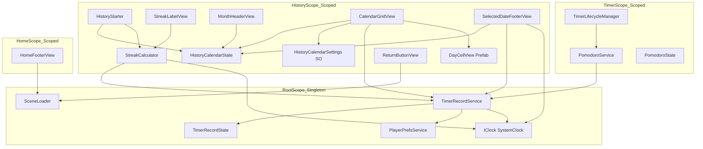
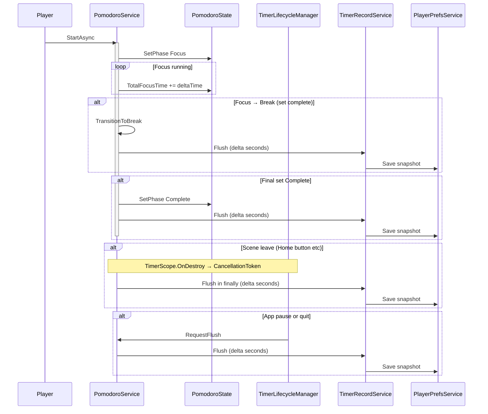
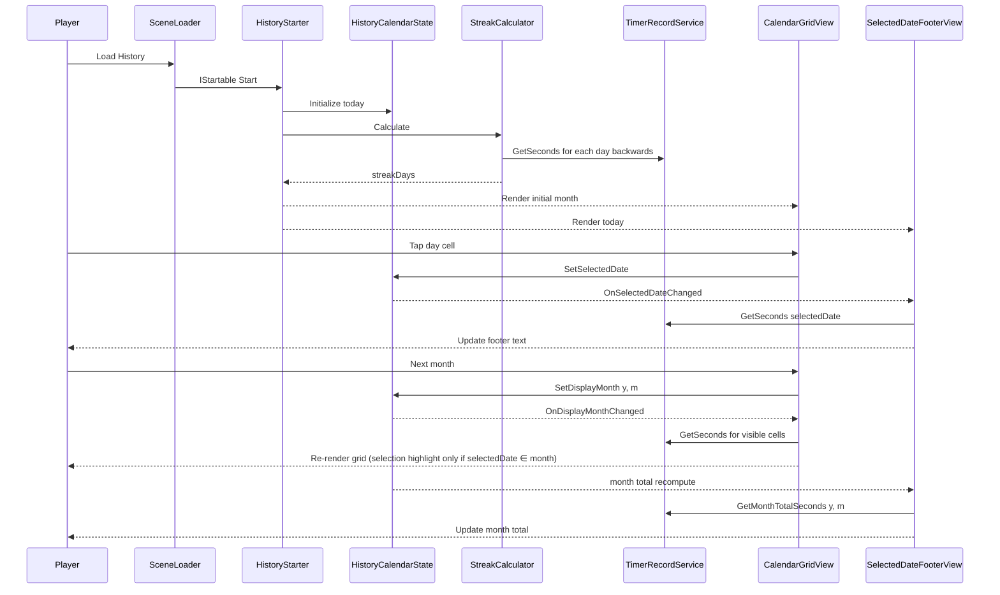
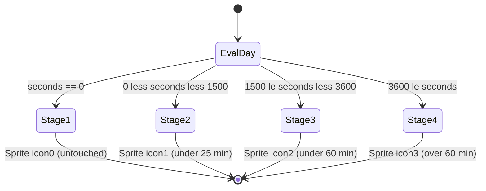
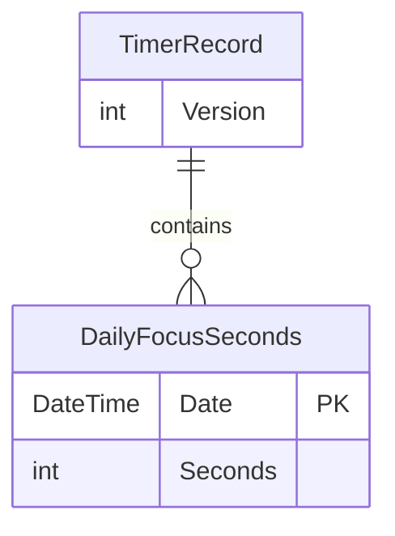

# Technical Design — timer-history-calendar

## Overview

**Purpose**: Pomodoro/タイマー機能で集中した時間 (秒) を日別に永続化し、`History` シーンのカレンダーで「連続使用日数 (ストリーク)」「日別集中量に応じたアイコン段階」「選択日の集中時間」「月別/当日の合計集中時間」として可視化する機能を提供する。

**Users**: アプリの全プレイヤー。タイマーで集中した結果を後から振り返ることで、継続的な集中体験のモチベーションを得る。

**Impact**: 既存タイマー (`Timer.Service.PomodoroService`) に「集中時間の確定書き込み」を 1 サービス呼出として追記し、空雛形だった `History` シーンに完全な閲覧 UI を導入する。`RootScope` には `TimerRecordService` (Singleton) を 1 つ追加。`Home/View/HomeFooterView` の `_historyButton` に履歴遷移の配線を 1 行追加する。

### Goals
- タイマー完了時・中断時 (シーン離脱・アプリ Pause/Quit) のいずれにおいても、確定済みの集中時間を失わずに日別記録へ加算する。
- 月送り対応のカレンダー UI で、4 段階の Sprite 切替と選択日ハイライト、選択日/月/当日の合計表示を成立させる。
- 既存の `RootScope`/`SceneScope`/`PlayerPrefsService`/`IClock`/Snapshot Pattern を踏襲し、新規アーキテクチャを持ち込まない。

### Non-Goals
- タイマー機能本体 (Pomodoro のフェーズ遷移ロジック) の改修。`PomodoroService` への呼出追加に留める。
- ヒートマップ的な高度な可視化 (週/年ビュー、ヒートマップ強度のグラデーション、複数指標切替) — 4 段階の Sprite 差し替えのみ。
- バックエンド同期や iCloud / Google Drive 等のクラウドストレージ。永続化は `PlayerPrefsService` のみ。
- アプリ強制終了 (kill -9 / OS による即時 kill) 直前の未フラッシュ秒数の救済。Pause/Quit ライフサイクルが呼ばれない場合の救済は本機能の対象外とする。
- 日跨ぎセッションの「開始日への按分」記録。集中時間は Flush 呼出時点の `IClock` 当日に一括加算する (例: 23:55 開始 → 0:30 完了は完了直前の Flush 時点 = 翌日に加算される)。
- History 画面を開いたまま 0 時を跨いだ場合の「今日の合計集中時間」表示の自動追従。ユーザー操作 (月送り / 日付タップ / シーン再入場) を起点に再評価する。

## Architecture

### Existing Architecture Analysis

- **Scene-based architecture + VContainer DI**: `RootScope` (Singleton 共通サービス) / `SceneScope` 派生 (Scoped) / `Lifetime.Scoped` の State/Service という階層。本機能もこのパターンに準拠。
- **依存方向ルール**: `View → Service → State`。逆流禁止。`Service → Service` 呼出は許容 (例: `PomodoroService` が `PlayerPrefsService` を直接利用する既存例あり)。
- **時刻抽象**: `IClock.UtcNow` のみ提供。ローカル日付化はサービス側で `clock.UtcNow.LocalDateTime.Date` を実施。
- **永続化**: `PlayerPrefsService.Save<T>/Load<T>` (`JsonUtility` ベース) + `[Serializable]` Snapshot クラス + `public const int CurrentVersion` のスキーマバージョニング。`PlayerPrefsKey` enum でキー管理。
- **既存 `History` シーン**: `HistoryScope` 空 Configure、`ReturnButtonView` (Home へ戻る) のみ。`History.unity` の UI Prefab は本機能で構築する。
- **既存 Pomodoro**: `PomodoroState.TotalFocusTime` (秒, float) を Focus フェーズ中のみ加算。`PomodoroPhase.Complete` 遷移で `OnPhaseChanged` 通知。`TimerScope.OnDestroy` で `CancellationToken` を Cancel し、`RunTimerLoopAsync` を中断する。

### Architecture Pattern & Boundary Map

採用パターン: **Hybrid** (`research.md` Decision: TimerRecord 配置先)。記録系 (永続化・横断参照) を `RootScope` に Singleton で集約し、History 固有の計算 (Streak、表示状態) は `HistoryScope` に Scoped で閉じる。



**Architecture Integration**:
- 選択パターン: Service-State 分離 + シーン境界での DI スコーピング (既存パターン継承)。
- ドメイン境界: 「記録の永続化」は Root に、「閲覧 UI と日付計算」は History に閉じる。`PomodoroService` は記録の確定 (Producer) のみを担い、参照は行わない。
- 既存パターン保持: `UserPointService` / `UserItemInventoryService` のスナップショット永続化、`SceneScope.Awake` の MasterData 保証、`Service → Service` の DI 経由直接呼出。
- 新規コンポーネントの存在理由:
  - `TimerRecordService` / `TimerRecordState` / `TimerRecordSnapshot` — 集中時間の単一ソース。
  - `TimerLifecycleManager` — `MonoBehaviour` のライフサイクルフックでアプリ Pause/Quit 時に確定処理を呼ぶ責務 (Pure C# サービスでは捕捉不可)。
  - `StreakCalculator` — 計算は History 固有でテスト容易性のため独立させる。
  - `HistoryCalendarSettings (ScriptableObject)` — 4 段階閾値とアイコン Sprite を Inspector で差し替え可能化 (要件 4)。
- Steering 適合: シーン名は `Const.SceneName.History` を継続使用。`#nullable enable` / `[Inject]` / `CancellationToken` 末尾引数を本機能の全 C# クラスで適用。

### Technology Stack

| Layer | Choice / Version | Role in Feature | Notes |
|-------|------------------|-----------------|-------|
| Runtime | Unity 6 (6000.x.x) / .NET Standard 2.1 | クライアント実行基盤 | 既存。`DateOnly` は未提供のため `DateTime.Date` を使用 |
| DI | VContainer 1.17.0 | Service/State の注入と寿命管理 | `RootScope` Singleton + `HistoryScope` Scoped を本機能で利用 |
| Async | UniTask | `CancellationToken` 末尾引数の async API | 既存パターン継承 |
| Persistence | `PlayerPrefsService` + `JsonUtility` | `TimerRecordSnapshot` のシリアライズ | `PlayerPrefsKey.TimerRecord` を新規追加 |
| UI | uGUI + TextMeshPro | カレンダー / フッター / ストリーク表示 | DOTween 連携は本機能では使用しない |
| Asset | ScriptableObject (`HistoryCalendarSettings.asset`) | 4 枚 Sprite + 3 閾値の外部化 | `Assets/Settings/History/` に配置 |
| Tween | DOTween (任意) | 月送り時のフェード演出 (オプション) | 採用は実装フェーズで判断 |

新規依存ライブラリは導入しない。既存スタックの利用範囲拡張のみ。

## System Flows

### Flow 1: 集中セッション中の記録確定タイミング (Sequence)



**Key Decisions**:
- 確定 (Flush) は **3 つのトリガ** で発火: ① フェーズ遷移 (`TransitionToBreak` / `Complete` 突入時) ② `RunTimerLoopAsync` の `finally` ブロック (キャンセル/例外含む) ③ アプリ Pause/Quit (MonoBehaviour ライフサイクル経由)。
- 二重加算防止のため、`PomodoroService` 内に `_flushedSeconds` を保持し、毎回 `current = floor(TotalFocusTime) - _flushedSeconds` の **差分のみ** を `TimerRecordService.AddSeconds(...)` に渡す。差分が 0 以下なら呼出を省略 (要件 1.10)。
- Pause 中は `TotalFocusTime` が増えないため、Pause 状態のままアプリが Quit されても確定済みの値は変化しない (要件 1.3)。
- **加算先日付**: `TimerRecordService.AddSeconds(int)` は内部で `IClock` の **Flush 呼出時点の** 当日 (`UtcNow.LocalDateTime.Date`) に紐付けて加算する。日跨ぎセッションは「Flush 時点の当日」に一括加算され、開始日への按分は行わない (Non-Goals 参照)。

### Flow 2: 履歴シーンの閲覧サイクル (Sequence)



**Key Decisions**:
- `HistoryCalendarState` は表示中 `(Year, Month)` と `SelectedDate` を保持し、変更時に View が購読しているイベントを発火する単一データソース。
- 月送りで `SelectedDate` が表示外になっても保持し続ける (要件 6.7)。Grid 側は「セルの日付 == SelectedDate」のときのみハイライトを描画 (要件 6.8)。
- 「今日の合計」はカレンダーの表示月に依存せず、`IClock` 当日基準で `TimerRecordService.GetTodayTotalSeconds()` を都度参照。

### Flow 3: 4 段階アイコン Sprite の決定ロジック (State)



**Key Decisions**:
- 閾値 `[0, 1500, 3600]` (秒) は `HistoryCalendarSettings.asset` 上の `int[] thresholdsSeconds` に格納。コードは `int FindStageIndex(int seconds, int[] thresholds)` の単一関数で段階を決定する。
- 表示中月外のセル (前月末・翌月頭) も同じ判定を通す (要件 4.7)。月外を視覚的に区別する処理 (要件 3.7) は段階 Sprite ではなくセル背景色 / アルファで実装する。

## Requirements Traceability

| Requirement | Summary | Components | Interfaces | Flows |
|-------------|---------|------------|------------|-------|
| 1.1, 1.4, 1.10 | 正常完了/同日複数回/0 秒以下除外の加算 | `TimerRecordService`, `PomodoroService` | `ITimerRecordService.AddSeconds` | Flow 1 |
| 1.2, 1.3, 1.5 | 中断時/アプリ終了時の確定、二重加算防止 | `PomodoroService`, `TimerLifecycleManager`, `TimerRecordService` | `PomodoroService.Flush`, `ITimerRecordService.AddSeconds` | Flow 1 |
| 1.6, 1.7 | 秒単位整数保持と IClock 経由ローカル日付 | `TimerRecordService`, `TimerRecordState` | `ITimerRecordService.GetSeconds`, `IClock.UtcNow` | — |
| 1.8, 1.9 | PlayerPrefs 永続化と初回起動 | `TimerRecordService`, `TimerRecordSnapshot`, `PlayerPrefsService` | `PlayerPrefsService.Save/Load` | — |
| 1.11 | スナップショット形式の戻り値 | `TimerRecordService` | `ITimerRecordService.GetAllRecords` | — |
| 2.1, 2.2, 2.3 | Home ⇄ History 遷移、多重抑止 | `HomeFooterView`, `History.View.ReturnButtonView`, `SceneLoader` | `SceneLoader.Load` | — |
| 3.1–3.7 | 月別カレンダー表示 / 月送り / 月外区別 | `MonthHeaderView`, `CalendarGridView`, `DayCellView`, `HistoryCalendarState` | `HistoryCalendarState.SetDisplayMonth` | Flow 2 |
| 4.1–4.7 | 4 段階 Sprite 差し替え / 閾値外部化 | `CalendarGridView`, `DayCellView`, `HistoryCalendarSettings` | `HistoryCalendarSettings.GetSpriteForSeconds` | Flow 3 |
| 5.1–5.7 | ストリーク計算と表示 | `StreakCalculator`, `StreakLabelView` | `StreakCalculator.Calculate` | Flow 2 |
| 6.1–6.8 | 選択日のハイライト / フッター連動 / 月送り跨ぎ維持 | `HistoryCalendarState`, `CalendarGridView`, `DayCellView`, `SelectedDateFooterView` | `HistoryCalendarState.SetSelectedDate` | Flow 2 |
| 7.1–7.7 | 月合計 / 当日合計 / 分単位 / 切り捨て統一 | `SelectedDateFooterView`, `TimerRecordService`, `FocusTimeFormatter` | `TimerRecordService.GetMonthTotalSeconds`, `TimerRecordService.GetTodayTotalSeconds`, `FocusTimeFormatter.SecondsToMinutes` | Flow 2 |
| 8.1–8.7 | アーキ整合 (層構造 / DI / IClock / Prefs / CTS / [Inject]) | 全コンポーネント | — | — |

## Components and Interfaces

### Component Summary

| Component | Domain/Layer | Intent | Req Coverage | Key Dependencies | Contracts |
|-----------|--------------|--------|--------------|------------------|-----------|
| `TimerRecordService` | Root/Service | 日別集中時間の単一ソース、永続化、参照 API | 1.1–1.11 | `TimerRecordState` (P0), `PlayerPrefsService` (P0), `IClock` (P0) | Service, State |
| `TimerRecordState` | Root/State | 日付→秒の `Dictionary` を保持 | 1.6, 1.11 | — | State |
| `TimerRecordSnapshot` | Root/Service | JsonUtility 用シリアライズ DTO | 1.8, 1.11 | — | State |
| `PomodoroService` (改修) | Timer/Service | 集中時間累積に加えて Flush 呼出を行う | 1.1, 1.2, 1.5 | `TimerRecordService` (P0) | Service |
| `TimerLifecycleManager` | Timer/Manager | アプリ Pause/Quit 時に Flush をトリガ | 1.3 | `PomodoroService` (P0) | Service |
| `HistoryStarter` | History/Starter | History シーン起動時の初期化 (`IStartable`) | 3.1, 5.1, 6.1 | `HistoryCalendarState` (P0), `StreakCalculator` (P1), `IClock` (P0) | Service |
| `HistoryCalendarState` | History/State | 表示中年月 / 選択日 / イベント通知 | 3.5–3.6, 6.7 | — | State |
| `StreakCalculator` | History/Service | 当日基準のストリーク日数算出 | 5.2–5.7 | `TimerRecordService` (P0), `IClock` (P0) | Service |
| `FocusTimeFormatter` | History/Service (static) | 秒→分の切り捨て変換ユーティリティ | 7.6, 7.7 | — | Service |
| `HistoryCalendarSettings` | History/Service (SO) | 4 枚 Sprite + 3 閾値 + 月外色設定 | 4.2, 4.5, 3.7 | — | State |
| `StreakLabelView` | History/View | 「N DAY 連続中！」表示 | 5.1 | `StreakCalculator` (P1) | UI |
| `MonthHeaderView` | History/View | 年月見出し + 前月/次月ボタン | 3.2, 3.5, 3.6 | `HistoryCalendarState` (P0) | UI |
| `WeekdayHeaderView` | History/View | 日月火水木金土の固定見出し | 3.3 | — | UI |
| `CalendarGridView` | History/View | 7×6 セル Pool の描画とイベント橋渡し | 3.4, 3.7, 4.1, 6.2, 6.3, 6.8 | `HistoryCalendarState` (P0), `TimerRecordService` (P0), `HistoryCalendarSettings` (P0), `DayCellView` (P0) | UI |
| `DayCellView` | History/View (Prefab) | 1 日分の数字 + Sprite + ハイライト | 3.7, 4.1, 4.3, 4.4, 6.3 | — | UI |
| `SelectedDateFooterView` | History/View | 選択日 / 月合計 / 当日合計の表示 | 6.4–6.6, 6.8, 7.1–7.5 | `HistoryCalendarState` (P0), `TimerRecordService` (P0), `IClock` (P0) | UI |
| `History.View.ReturnButtonView` | History/View (既存流用) | Home へ戻るボタン | 2.2 | `SceneLoader` (P0) | UI |
| `HomeFooterView` (改修) | Home/View | History ボタンの onClick 配線 | 2.1 | `SceneLoader` (P0) | UI |

UI コンポーネントは **Summary-only** で済ませ、新規境界を導入する Service/State 系のみ Full Block で詳述する。

---

### Domain: Root — 永続化と単一ソース

#### TimerRecordService

| Field | Detail |
|-------|--------|
| Intent | 日別集中時間 (秒) の単一ソース。加算/参照/永続化の API を提供する |
| Requirements | 1.1, 1.2, 1.4, 1.6, 1.7, 1.8, 1.9, 1.10, 1.11, 7.2, 7.4 |

**Responsibilities & Constraints**
- `AddSeconds(int seconds)` を **唯一の書き込み入口** とし、内部で **呼出時点の** 当日 (`IClock.UtcNow.LocalDateTime.Date`) に紐付けて加算 → `Save()`。日跨ぎセッションを開始日へ按分する処理は持たない (Non-Goals)。
- 0 以下の加算は無視 (要件 1.10)。
- 戻り値はすべてイミュータブル (`IReadOnlyDictionary<DateTime, int>` の不変写像) または値型で提供する (要件 1.11)。
- 内部 `Dictionary` のキーは `DateTime` (`Kind=Unspecified`, `TimeOfDay=00:00:00`) に正規化する。
- `RootScope` で `Lifetime.Singleton` + `As<ITimerRecordService>().AsSelf()` で登録 (UserPointService と同パターン)。

**Dependencies**
- Inbound: `PomodoroService` — Flush 書き込み (P0) / `StreakCalculator` — 日別記録参照 (P0) / `CalendarGridView`, `SelectedDateFooterView` — 表示用参照 (P0)
- Outbound: `TimerRecordState` — 状態保持 (P0) / `PlayerPrefsService` — 永続化 (P0) / `IClock` — 当日判定 (P0)
- External: なし

**Contracts**: Service [x] / API [ ] / Event [ ] / Batch [ ] / State [x]

##### Service Interface

```csharp
public interface ITimerRecordService
{
    /// 当日の日別記録に集中時間 (秒) を加算する。0 以下は無視する。
    void AddSeconds(int seconds);

    /// 指定日の集中時間 (秒) を取得する。記録がない場合は 0 を返す。
    int GetSeconds(DateTime date);

    /// 指定月 (年, 月) の合計集中時間 (秒) を取得する。
    int GetMonthTotalSeconds(int year, int month);

    /// 当日 (IClock 基準のローカル日付) の合計集中時間 (秒) を取得する。
    int GetTodayTotalSeconds();

    /// 全記録のイミュータブル写像を返す。日付昇順は保証しない。
    IReadOnlyDictionary<DateTime, int> GetAllRecords();

    /// 集中時間が加算されたとき発火する (date, addedSeconds, totalSecondsForDate)。
    event Action<DateTime, int, int>? FocusSecondsAdded;
}
```

- **Preconditions**: `AddSeconds` の引数 `seconds ≥ 0` を許容 (0 以下は no-op)。`GetSeconds` の `date` は時刻部分が 00:00 でなくても呼び出し側で日付比較できるよう内部で `.Date` 正規化する。
- **Postconditions**: `AddSeconds` 後に `GetSeconds(today) == previousValue + seconds`。`Save()` が完了した後に呼び出し元へ戻る (同期書込)。
- **Invariants**: `Dictionary` キーは時刻部分 00:00 / `Kind=Unspecified`。`Dictionary` の値は `≥ 0` の整数。

##### State Management
- **State model**: `TimerRecordState { Dictionary<DateTime, int> Records }`。
- **Persistence & consistency**: `AddSeconds` のたびに同期書込 (UserPointService と同パターン)。書込頻度は Flush タイミングに律されるため、フレーム毎の頻発は発生しない。
- **Concurrency**: Unity メインスレッドのみ。`async`/`await` の continuation も `PlayerLoopTiming.Update` で同スレッド復帰のため lock 不要。

**Implementation Notes**
- Integration: `RootScope.Configure` に `Register<TimerRecordState>(Lifetime.Singleton)` と `Register<TimerRecordService>(Lifetime.Singleton).As<ITimerRecordService>().AsSelf()` を追加。`PlayerPrefsKey` enum に `TimerRecord` を追加。
- Validation: コンストラクタで `Load()` を呼び、Snapshot Version 不一致なら空状態で初期化 (UserPointService と同パターン)。`MasterDataState.IsImported` 待機は不要 (本機能はマスターデータに依存しない)。
- Risks: アプリ強制終了時にメモリ上の未確定加算が消失するが、本機能の Non-Goals。Pause/Quit 経由は `TimerLifecycleManager` でカバー。

#### TimerRecordState

| Field | Detail |
|-------|--------|
| Intent | 日別集中時間の `Dictionary` を保持し、`TimerRecordService` から排他的に書込まれる |
| Requirements | 1.6, 1.11 |

**Responsibilities & Constraints**
- 公開 API は内部 `Dictionary` への参照を直接返さず、`IReadOnlyDictionary` として返す。
- `void Set(DateTime date, int seconds)`, `int Get(DateTime date)`, `IReadOnlyDictionary<DateTime, int> GetAll()` の 3 メソッドのみ提供。

**Dependencies**: なし
**Contracts**: State [x]

#### TimerRecordSnapshot

| Field | Detail |
|-------|--------|
| Intent | JsonUtility シリアライズ用の `[Serializable]` DTO |
| Requirements | 1.8, 1.9, 1.11 |

**Responsibilities & Constraints**
- `JsonUtility` 制約により `Dictionary` を直接保持できないため、エントリ配列で持つ (`UserItemInventorySnapshot` と同パターン)。
- `public const int CurrentVersion = 1` を持ち、ロード時に不一致なら破棄。

**Schema (Logical)**

```csharp
[Serializable]
public class TimerRecordSnapshot
{
    public const int CurrentVersion = 1;
    public int Version;
    public TimerRecordEntry[] Entries = Array.Empty<TimerRecordEntry>();
}

[Serializable]
public class TimerRecordEntry
{
    /// "yyyy-MM-dd" (例: "2026-05-04") 形式のローカル日付
    public string Date;
    public int Seconds;
}
```

**Implementation Notes**
- `Date` は `"yyyy-MM-dd"` 文字列。`TimerRecordService` 内のヘルパで `DateTime <-> string` を相互変換する。
- 異常な `Date` 文字列 (パース失敗) はロード時にスキップしログ出力 (`UserItemInventorySnapshot.Furnitures` の異常エントリ無視と同方針)。

**Contracts**: State [x]

---

### Domain: Timer — 集中時間の確定

#### PomodoroService (改修)

| Field | Detail |
|-------|--------|
| Intent | 既存ロジックを保ったまま、確定タイミング (Flush) で `TimerRecordService` に差分を渡す |
| Requirements | 1.1, 1.2, 1.5 |

**Responsibilities & Constraints**
- `_flushedSeconds`(int) を保持し、Flush ごとに `floor(TotalFocusTime) - _flushedSeconds` を `AddSeconds(...)` に渡してから `_flushedSeconds = floor(TotalFocusTime)` に更新。
- Flush タイミングは ① `TransitionToBreak` 内 (Focus 完了直後)、② `Complete` 遷移直前 (`SetPhase(PomodoroPhase.Complete)` の直前)、③ `RunTimerLoopAsync` の `try/finally` の `finally`、④ 公開メソッド `RequestFlush()` (TimerLifecycleManager から呼ばれる)。
- 二重加算は `_flushedSeconds` の差分計算で防止 (要件 1.5)。

**Dependencies**
- Inbound: `TimerStarter` — 起動 (P0) / `TimerLifecycleManager` — Pause/Quit 通知 (P0)
- Outbound: `PomodoroState` (P0) / `PlayerPrefsService` (P0, 既存) / `ITimerRecordService` (P0, 新規追加)

**Contracts**: Service [x]

##### Service Interface (差分のみ)

```csharp
public partial class PomodoroService
{
    /// 既存コンストラクタに ITimerRecordService を追加注入する。
    [Inject]
    public PomodoroService(
        PomodoroState state,
        PlayerPrefsService playerPrefsService,
        ITimerRecordService timerRecordService,
        CancellationToken cancellationToken);

    /// 外部 (Lifecycle Manager 等) からの確定要求。冪等。
    public void RequestFlush();
}
```

- **Preconditions**: 任意のフェーズで呼び出し可能。`_flushedSeconds` 初期値 0。
- **Postconditions**: 呼出後に `_flushedSeconds == floor(_state.TotalFocusTime)` が成立。
- **Invariants**: `_flushedSeconds ≤ floor(_state.TotalFocusTime)`。

**Implementation Notes**
- Integration: `RunTimerLoopAsync` のループ脱出処理を `try { while (...) { ... } } finally { Flush(); }` に変更。`TransitionToBreak` / `Complete` 直前で `Flush()` を呼ぶ。
- Validation: `Flush` の差分が 0 以下なら `TimerRecordService.AddSeconds` を呼ばない (要件 1.10 と整合)。
- Lifecycle: `StartAsync` 冒頭で `_flushedSeconds = 0` を明示的にリセットする。`PomodoroState.Setup` が `TotalFocusTime = 0f` を行うのと同フレームで併せて 0 化することで、Invariant `_flushedSeconds ≤ floor(TotalFocusTime)` を再起動時にも維持する。同一 `PomodoroService` インスタンスで `StartAsync` を再呼出するパス (将来追加され得る) でも安全。
- Risks: 既存の `TotalFocusTime` 計算ロジックに介入しないため、既存 View (CompletePanelView 等) への影響なし。

#### TimerLifecycleManager (新規)

| Field | Detail |
|-------|--------|
| Intent | `MonoBehaviour` のライフサイクルでアプリ Pause/Quit を捕捉し `PomodoroService.RequestFlush()` を呼ぶ |
| Requirements | 1.3 |

**Responsibilities & Constraints**
- `OnApplicationPause(bool pause)` で `pause == true` のとき `RequestFlush`。`OnApplicationQuit` でも `RequestFlush`。
- `MonoBehaviour` のため `[Inject] public void Construct(PomodoroService)` でフィールドインジェクション。`TimerScope.RegisterComponentInHierarchy<TimerLifecycleManager>()` で登録 (既存の `UiSlideManager` と同パターン)。
- iOS のバックグラウンド遷移時、Android のホームキー押下時、エディタの停止前にも呼ばれる。

**Dependencies**: `PomodoroService` (P0)
**Contracts**: Service [x]

**Implementation Notes**
- Integration: `Timer.unity` のシーン Hierarchy に空 GameObject を 1 つ配置し、`TimerLifecycleManager` をアタッチ。
- Validation: 同一フレーム中に Pause→Quit が連続して呼ばれても、`RequestFlush` の冪等性により問題なし (差分 0 になるため no-op)。
- Risks: OS による即時 kill (例: メモリプレッシャ) では `OnApplicationQuit` が呼ばれない。本機能の Non-Goals。

---

### Domain: History — 閲覧 UI と日付計算

#### HistoryStarter

| Field | Detail |
|-------|--------|
| Intent | History シーン起動時に `HistoryCalendarState` を当日で初期化し、各 View の初期描画を駆動する |
| Requirements | 3.1, 5.1, 6.1 |

**Responsibilities & Constraints**
- `IStartable.Start()` で実行。`IClock.UtcNow.LocalDateTime.Date` を取得し、`SetDisplayMonth(today.Year, today.Month)` と `SetSelectedDate(today)` を呼ぶ。
- `HistoryScope` で `RegisterEntryPoint<HistoryStarter>()`。

**Dependencies**: `HistoryCalendarState` (P0), `IClock` (P0)
**Contracts**: Service [x]

#### HistoryCalendarState

| Field | Detail |
|-------|--------|
| Intent | History シーンの「表示中年月」「選択日」を保持し、変更通知を発火する |
| Requirements | 3.5, 3.6, 6.2, 6.7 |

**Responsibilities & Constraints**
- `(int Year, int Month) DisplayMonth` と `DateTime SelectedDate` を保持。
- `SetDisplayMonth(int y, int m)` と `SetSelectedDate(DateTime date)` で変更し、変更後にイベント発火 (現在値と異なる場合のみ)。
- `IClock` には依存しない (初期値設定は `HistoryStarter` の責務)。

**Dependencies**: なし
**Contracts**: State [x]

##### State Interface

```csharp
public class HistoryCalendarState
{
    public int DisplayYear { get; }
    public int DisplayMonth { get; }
    public DateTime SelectedDate { get; }

    public event Action<int, int>? OnDisplayMonthChanged;
    public event Action<DateTime>? OnSelectedDateChanged;

    public void SetDisplayMonth(int year, int month);
    public void SetSelectedDate(DateTime date);
}
```

- **Preconditions**: `month` ∈ [1..12]、`year` ≥ 1。`date.Kind` は問わず内部で `.Date` 正規化。
- **Postconditions**: 変更後、対応するイベントが同期発火。

#### StreakCalculator

| Field | Detail |
|-------|--------|
| Intent | 当日基準で「過去方向に連続して集中時間記録のある日数」を返す |
| Requirements | 5.2, 5.3, 5.4, 5.5, 5.6, 5.7 |

**Responsibilities & Constraints**
- `Calculate()` 1 メソッドのみ提供。返り値は `int days`。
- 実装: 当日が `GetSeconds == 0` なら即 0 (要件 5.3)。それ以外は当日から `-1 day` ずつ走査し、連続して `> 0` の日数をカウント (要件 5.4)。`0` または記録欠如で打ち切り (要件 5.5)。
- パフォーマンス: 最大走査日数を `int.MaxValue` で抑える理論上の安全策は不要。実装上は記録ある最古日まで走査するか、安全弁として 10 年 (3650 日) 上限を設けてもよい。

**Dependencies**: `ITimerRecordService` (P0), `IClock` (P0)
**Contracts**: Service [x]

```csharp
public class StreakCalculator
{
    [Inject]
    public StreakCalculator(ITimerRecordService records, IClock clock);

    public int Calculate();
}
```

#### FocusTimeFormatter (静的ユーティリティ)

| Field | Detail |
|-------|--------|
| Intent | 秒→分の切り捨て変換と表示文字列化を 1 箇所に集約する (要件 7.6, 7.7) |
| Requirements | 7.6, 7.7 |

**Responsibilities & Constraints**
- DI 不要の `static class`。`int SecondsToMinutes(int seconds) => seconds / 60`。
- 表示文字列の整形 (例: `"125分"` / `"00時間"` 互換) は本クラスに集約。

```csharp
public static class FocusTimeFormatter
{
    public static int SecondsToMinutes(int seconds);   // floor(seconds / 60)
    public static string FormatMinutes(int seconds);   // 例: "125分"
}
```

**Contracts**: Service [x]

#### HistoryCalendarSettings (ScriptableObject)

| Field | Detail |
|-------|--------|
| Intent | 4 段階アイコン Sprite と段階閾値、月外セル装飾を Inspector で外部化する |
| Requirements | 3.7, 4.2, 4.3, 4.5, 4.6 |

**Responsibilities & Constraints**
- 配置: `Assets/Settings/History/HistoryCalendarSettings.asset` (新規ディレクトリ)。
- フィールド: `Sprite[] icons` (Length = 4, Inspector で範囲制約)、`int[] thresholdsSeconds` (Length = 3, 初期値 `{0, 1500, 3600}`)、`Color outOfMonthTint` (要件 3.7 の月外色)。
- 公開メソッド: `Sprite GetSpriteForSeconds(int seconds)` で段階決定と Sprite 取得を一括提供 (要件 4.6 を満たすため `Color` 計算ロジックを呼出側に漏らさない)。

```csharp
[CreateAssetMenu(menuName = "Cat/History/HistoryCalendarSettings")]
public sealed class HistoryCalendarSettings : ScriptableObject
{
    [SerializeField] Sprite[] _icons;            // length 4
    [SerializeField] int[] _thresholdsSeconds;   // length 3, e.g. {0, 1500, 3600}
    [SerializeField] Color _outOfMonthTint;

    public Sprite GetSpriteForSeconds(int seconds);
    public Color OutOfMonthTint { get; }
}
```

**Implementation Notes**
- `HistoryScope.Configure` で `RegisterInstance(_settings)` (Inspector 経由 `[SerializeField]` で受け取る) または `Resources.Load<HistoryCalendarSettings>` のいずれか。前者を推奨 (Resources 依存を増やさない)。

**Contracts**: State [x]

---

### Domain: History/View (Summary-only)

| Component | Intent | Implementation Note |
|-----------|--------|---------------------|
| `StreakLabelView` | `[N] DAY 連続中！` のテキスト更新 (5.1) | `Start()` で `StreakCalculator.Calculate()` を 1 度呼び TextMeshPro に反映。シーン中の再計算は不要 (シーン再入時に再計算)。 |
| `MonthHeaderView` | 年月見出し + 前月/次月ボタン (3.2, 3.5, 3.6) | `_state.SetDisplayMonth(year, month-1 or month+1)` を呼ぶ。年跨ぎは `(y, m)` の正規化 (`m == 0 → (y-1, 12)`, `m == 13 → (y+1, 1)`)。`OnDisplayMonthChanged` 購読でラベル更新。 |
| `WeekdayHeaderView` | 日月火水木金土の固定見出し (3.3) | 静的レイアウト。動的処理なし。 |
| `CalendarGridView` | 7×6=42 セルの Pool 描画 (3.4, 3.7, 4.1, 6.2, 6.3, 6.8) | `Awake` で 42 個の `DayCellView` を Instantiate して Pool。`OnDisplayMonthChanged` / `OnSelectedDateChanged` で `RenderCells()` を呼び、各セルに `Bind(date, seconds, sprite, isInMonth, isSelected)` を渡す。セルの月内判定は `cellDate.Year == DisplayYear && cellDate.Month == DisplayMonth`。 |
| `DayCellView` | 1 セルの数字 + Sprite + 選択ハイライト + 月外 Tint (3.7, 4.1, 4.3, 4.4, 6.3) | Prefab。`Button.onClick` で `_state.SetSelectedDate(_currentDate)`。`Bind(date, seconds, sprite, isInMonth, isSelected)` で全状態を 1 メソッドで設定。 |
| `SelectedDateFooterView` | 選択日 / 今月合計 / 当日合計の表示 (6.4–6.6, 6.8, 7.1–7.5) | `OnSelectedDateChanged` / `OnDisplayMonthChanged` 購読。当日合計の再評価タイミングは「シーン入場時」「月送り操作時」「日付タップ時」の 3 点のみ (`Update()` を持たない)。日跨ぎ自動追従は対象外 (Non-Goals 参照)。要件 7.4 はこのタイミングで都度 `IClock` 当日を再取得することで満たす。 |
| `History.View.ReturnButtonView` | Home に戻る (2.2) | 既存実装 (改修不要)。 |
| `HomeFooterView` | History ボタンの onClick 配線追加 (2.1) | `Init` メソッド内に `_historyButton.onClick.AddListener(() => sceneLoader.Load(Const.SceneName.History));` を 1 行追加するのみ。 |

## Data Models

### Domain Model

- **Aggregate root**: `TimerRecord` (1 ユーザー = 1 集合)。子エンティティ `DailyFocusSeconds` (date → seconds) を保持。
- **Invariants**:
  - `seconds ≥ 0`
  - 同じ日付のキーは集合内に高々 1 件
  - 全フィールドはローカル日付 (タイムゾーン非依存の年月日タプル)
- **Domain events**:
  - `FocusSecondsAdded(date, addedSeconds, totalSecondsForDate)` — `TimerRecordService.AddSeconds` 完了時
- **Transactional boundary**: `AddSeconds` 1 回 = 1 トランザクション (PlayerPrefs への同期書込)。

### Logical Data Model



- 関係: `TimerRecord` 1 — 0..n `DailyFocusSeconds`。
- 自然キー: `Date` (年月日)。値: `Seconds` (≥ 0 の整数)。
- バージョニング: `TimerRecord.Version` を持ち、不一致時は破棄して空集合で再初期化。

### Physical Data Model (PlayerPrefs / JsonUtility)

PlayerPrefs キー `TimerRecord` に対し、以下 JSON が `JsonUtility` 経由で書き込まれる:

```json
{
  "Version": 1,
  "Entries": [
    { "Date": "2026-05-01", "Seconds": 1800 },
    { "Date": "2026-05-02", "Seconds": 3000 },
    { "Date": "2026-05-04", "Seconds": 600 }
  ]
}
```

- `Date` は `"yyyy-MM-dd"`。`Seconds` は秒。
- 配列順は永続化前後で保証しない (Save 時に `Dictionary` 列挙順)。
- 1 日 1 エントリで、N 日記録があれば N エントリ。実用想定 (1 ユーザー = 数年分) で数百〜数千エントリ程度を上限見込み。1 エントリ 30 バイト未満 → 1 万エントリでも 300KB 未満 (PlayerPrefs の現実的上限内)。

### Data Contracts & Integration

- **In-process**: `ITimerRecordService` 経由でメモリ上の最新値を全コンシューマが共有 (Singleton)。`event FocusSecondsAdded` を購読することで派生値を再計算可能。
- **Persistence**: `TimerRecordSnapshot` の JSON が `PlayerPrefs.SetString` で保存される。スキーマ変更時は `CurrentVersion` インクリメント + ロード時破棄ポリシー。
- **Cross-service**: クロスシーンで状態を共有するため Singleton。シーン破棄では state は破棄されない (Root スコープの寿命)。

## Error Handling

### Error Strategy

- **永続化失敗** (`PlayerPrefs.SetString` の例外、`JsonUtility` のシリアライズ失敗): `Debug.LogError($"[TimerRecordService] {e.Message}\n{e.StackTrace}")` のみ。リトライしない (UserPointService と同方針)。メモリ上の状態は維持されるため、同一セッション中の表示には影響しない。
- **ロード失敗** (Snapshot Version 不一致 / JSON 破損): 空集合で初期化し起動を継続。データロスはユーザーに通知しない (MVP)。
- **不正な日付文字列** (`yyyy-MM-dd` パース失敗): 当該エントリを skip しログ出力 (`UserItemInventorySnapshot` のスキップポリシー踏襲)。
- **負の秒数加算**: `AddSeconds(seconds <= 0)` は no-op (要件 1.10)。例外を投げず静かに無視。

### Error Categories and Responses

| Category | Trigger | Response |
|---|---|---|
| User Errors | カレンダーセルの日付タップ (常に有効) | エラー無し。すべての日付セルは選択可能。 |
| System Errors | `PlayerPrefs` 書込/読込例外、`JsonUtility` 例外 | ログ出力 + メモリ状態継続。ユーザー通知なし。 |
| Business Logic Errors | `AddSeconds(seconds <= 0)` | no-op。 |
| Out-of-range | 異常な `Date` 文字列 / `month ∉ [1..12]` | ロード時 skip + ログ。`HistoryCalendarState.SetDisplayMonth` には呼出側 (`MonthHeaderView`) で年跨ぎ正規化を行うため、不正値が到達することは想定外。 |

### Monitoring

- 本機能ではメトリクス送信や外部監視サービスは持たない (本プロジェクト全体で未導入)。
- 全エラーログは `[ClassName]` プレフィクス付きの `Debug.LogError` で出力 (steering tech.md ルール)。
- PlayerPrefs の Save/Load は既存 `PlayerPrefsService` が `Debug.Log` でトレースを残すため、追加の計装は不要。

## Testing Strategy

### Unit Tests (Pure C#)
- `TimerRecordService.AddSeconds`: 当日加算、複数日加算、0/負値 no-op、Snapshot 永続化と再ロードの round-trip。
- `StreakCalculator.Calculate`: 当日記録あり連続/当日無し=0/記録一切なし=0/記録途中欠落での打ち切り。
- `FocusTimeFormatter.SecondsToMinutes`: 0/59/60/89/3599/3600 のエッジ。`FormatMinutes` のフォーマット。
- `TimerRecordSnapshot` JSON round-trip: Version 互換、欠損エントリの skip。
- `HistoryCalendarSettings.GetSpriteForSeconds`: 各境界 (0, 1, 1499, 1500, 3599, 3600, 9999)。

### Integration Tests (PlayMode)
- Pomodoro 完了 → `TimerRecordService` への加算反映 (`PomodoroPhase.Complete` イベント連動)。
- Pomodoro 中断 (`TimerScope.OnDestroy` 経由) → `RunTimerLoopAsync` の `finally` で Flush 実行。
- `TimerLifecycleManager.OnApplicationPause(true)` → Flush 実行と PlayerPrefs 反映。
- `History` シーン入場 → 初期状態 (当日選択 / 当月表示 / 当日 streak) の組み立て。
- 月送り → 選択日維持 / グリッド再描画 / 月合計再計算。

### E2E/UI Tests (任意, 自動化非必須)
- Home → History → 戻る の往復遷移 (フェード演出含む)。
- カレンダーの任意日タップ → フッター表記更新。
- 月送り 6 ヶ月以上の連続操作 → 描画崩れがないこと (Pool が正しく回ること)。

### Performance/Load
- 1 万日分のダミー記録での `TimerRecordService.GetMonthTotalSeconds` の応答 (MS 1 桁を維持)。
- `StreakCalculator.Calculate` の最大 3650 日走査でのワーストケース計測。
- カレンダー月送り時の GC Alloc が 0 byte (Pool 再利用) であることをプロファイラで確認。

## Performance & Scalability

- **想定規模**: 1 ユーザーあたり数年 (= 数千日) の記録。1 万日でもメモリ < 300KB、`PlayerPrefs` 上の JSON < 300KB。
- **読込頻度**: シーン入場時 1 回 + Pomodoro 完了時の Save。フレーム毎の参照は `CalendarGridView` の最大 42 セル × O(1) Dictionary lookup のみ。
- **書込頻度**: Pomodoro セッション中、Flush は最大でも数秒に 1 回 (`Pause/Quit` 連打を除く)。同期書込でも体感影響なし。
- **スケール超過時の対応 (将来案)**: エントリ数が大きくなった場合は年単位の分割キー化 (`PlayerPrefsKey.TimerRecord_2026` のような名前空間) で対応可能。本リリースでは単一キーで十分。

## Migration Strategy

新規機能のため既存データのマイグレーションは不要。`PlayerPrefs` キー `TimerRecord` は本機能の初回起動で空集合として作成される。`TimerRecordSnapshot.CurrentVersion = 1` を起点とし、将来のスキーマ変更時は不一致破棄ポリシーで安全に切替可能。

## Supporting References

- 詳細な研究ログとオプション比較は `.kiro/specs/timer-history-calendar/research.md` に格納。本ドキュメントでは結論のみを反映。
- 既存パターン参照: `Assets/Scripts/Root/Service/UserPointService.cs` (Snapshot Pattern), `Assets/Scripts/Root/Service/UserItemInventoryService.cs` (Dictionary シリアライズ), `Assets/Scripts/Timer/Service/PomodoroService.cs` (CancellationToken + UniTask), `Assets/Scripts/Home/View/HomeFooterView.cs` (DI 経由 SceneLoader 配線)。
