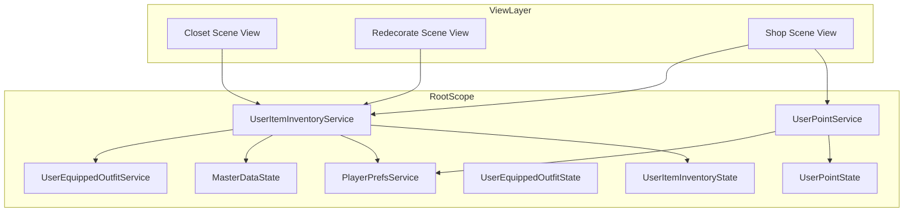
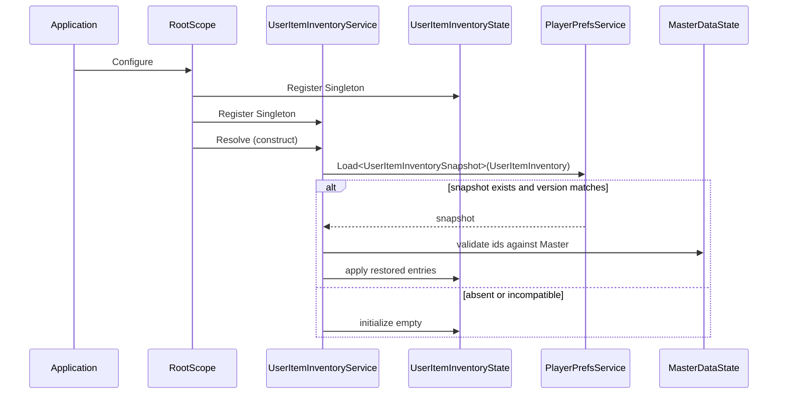
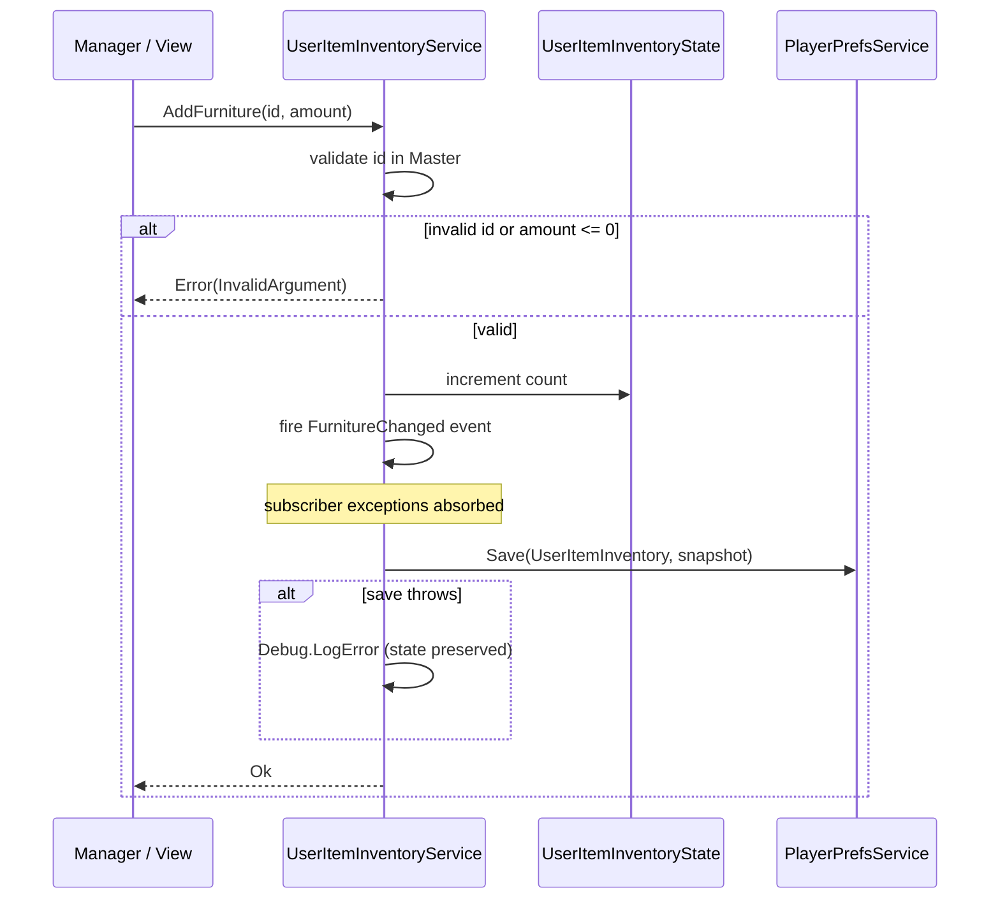
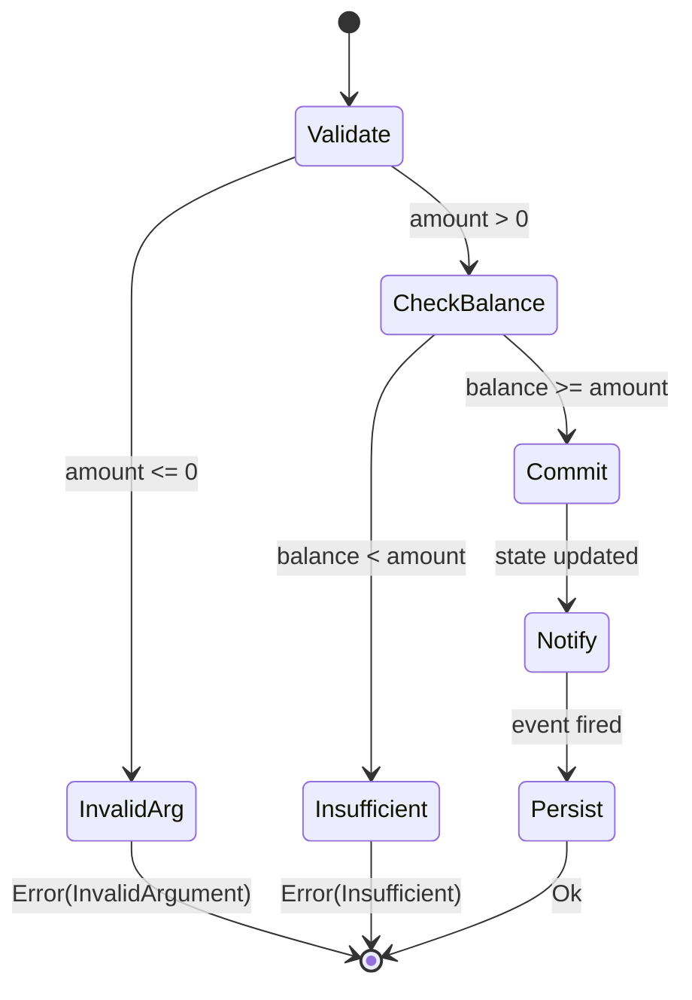

# Technical Design: user-inventory-management

## Overview

本機能は、プレイヤーが所持する「家具」「着せ替え」「毛糸 (ポイント系通貨)」をローカル (インメモリ + PlayerPrefs) で管理する正式版 Service と State を `RootScope` に追加する。所持コレクション (家具・着せ替え) とスカラー通貨 (毛糸) は性質が異なるため、`IUserItemInventoryService` と `IUserPointService` の 2 系統に分割して提供する。

**Purpose**: View 層 (Closet / Redecorate / Shop 等) に対して、所持アイテムとポイント残高を読み取り・更新・購読する統一インターフェースを提供する。

**Users**: 各シーンの View および Manager 層が RootScope の Singleton として両 Service を利用する。

**Impact**: 既存モック (`UserState.UserOutfits` / `UserState.UserFurnitures` / `ShopState.YarnBalance`) はそのまま残し、新 Service が独立したキーで並走する。既存参照元 (`RedecorateScrollerService` / `IsoGridLoadService` / `ShopService`) は本スペック対象外。

### Goals
- `IUserItemInventoryService` と `IUserPointService` をインターフェースとして定義し、RootScope Singleton 実装を整備する。
- PlayerPrefs 永続化をバージョン番号付きで実装し、非互換時は空状態で初期化する。
- `event Action<T>` ベースの変更通知を公開し、購読者例外を安全に吸収する。
- `#nullable enable`, `[Inject]`, UniTask + `CancellationToken` 規約に準拠する。

### Non-Goals
- 既存モック (`UserState.UserOutfits` 等) の置き換え — 別タスクで実施。
- サーバ連携 (同期・API 経由の保存) — 将来のサーバ接続タスクで追加。
- 家具の個体識別 (インスタンス ID 採番) — 数量ベースで開始し、必要に応じて別タスクで拡張。
- 着せ替えの減算 API (R3-6 に関連) — 本スペックは付与のみを対象とする。
- 旧バージョン PlayerPrefs データからのマイグレーション — 必要性が生じた時点で別タスク。

## Architecture

### Existing Architecture Analysis

- **VContainer DI パターン**: `RootScope` が Singleton として全シーン共通サービスを登録。新 Service/State もこの方針を踏襲する。
- **永続化パターン**: `UserEquippedOutfitService` が `PlayerPrefsService` (`JsonUtility` ベース) と組み合わせた Load/Save 実装を提供。新 Service もこのフローを踏襲する。
- **層依存**: `View → Service → State` を厳格に維持。Service は State を排他的に所有し、View は Service 経由のみで State を参照する。
- **技術的制約**: `JsonUtility` は `Dictionary<,>` を直接シリアライズできないため、DTO では配列で表現する。

### Architecture Pattern & Boundary Map

**Selected Pattern**: Service + State 分離パターン (既存 `UserEquippedOutfit` と同形)。2 系統を独立した Service に分割。



**Architecture Integration**:
- **Selected pattern**: 2 系統の独立 Service (Item と Point) を Singleton 登録。クロスカテゴリ操作 (例: 毛糸で家具購入) は呼び出し元 Manager が両 Service を協調させる。
- **Domain boundaries**:
  - `IUserItemInventoryService` はコレクション型 (家具・着せ替え)。
  - `IUserPointService` はスカラー通貨。
  - 装備整合性は `UserEquippedOutfitService` 経由のみ参照し、`UserEquippedOutfitState` を直接書き換えない (R8-6)。
- **Existing patterns preserved**: VContainer Singleton 登録, `JsonUtility` 永続化, `event Action<T>` 通知, RootScope での層構造。
- **New components rationale**:
  - 新 State/Service は既存モックと異なるキー (`UserItemInventory`, `UserPoint`) で保存する。
  - 装備との整合確保のため Item Service は Equipped Service を参照するが、逆依存は発生しない。
- **Steering compliance**: `View → Service → State` の層依存, `#nullable enable`, `[Inject]`, UniTask + `CancellationToken`。

### Technology Stack & Alignment

| Layer | Choice / Version | Role in Feature | Notes |
|-------|------------------|-----------------|-------|
| Runtime | Unity 6 (.NET Standard 2.1) | 実行基盤 | 既存と同一 |
| DI | VContainer 1.17.0 | Singleton 登録 | `RootScope.Configure` に 4 登録追加 |
| Async | UniTask | `InitializeAsync` / `SaveAsync` の将来拡張用 | 現状は `UniTask.CompletedTask` |
| Serialization | UnityEngine `JsonUtility` | PlayerPrefs 永続化 | Dictionary 不可 → 配列 DTO |
| Storage | Unity `PlayerPrefs` | ローカル保存 | `PlayerPrefsService` 経由でアクセス |
| Events | `event Action<T>` | 変更通知 | 既存パターン踏襲 |

深い背景・代替比較は `research.md` を参照。

## System Flows

### 起動時の初期化と復元



### 家具の加算と永続化



### 毛糸の減算 (残高不足分岐)



## Requirements Traceability

| Requirement | Summary | Components | Interfaces | Flows |
|-------------|---------|------------|------------|-------|
| 1.1 | RootScope 登録 | UserItemInventoryState, UserItemInventoryService | RootScope.Configure | Init flow |
| 1.2 | 保存済み復元 | UserItemInventoryService | `InitializeAsync`, `Load` | Init flow |
| 1.3 | 非互換/未保存時の空初期化 | UserItemInventoryService | `Load` | Init flow |
| 1.4 | Master ID 検証 | UserItemInventoryService | `Load` | Init flow |
| 2.1 | 家具所持数取得 | UserItemInventoryService/State | `GetFurnitureCount` | - |
| 2.2 | 家具加算 + State 反映 | UserItemInventoryService/State | `AddFurniture` | Add flow |
| 2.3 | 家具変更通知 | UserItemInventoryService | `FurnitureChanged` event | Add flow |
| 2.4 | 存在しない ID のエラー | UserItemInventoryService | `AddFurniture` | Add flow |
| 2.5 | 所持数 0 未満の拒否 | UserItemInventoryService | (減算は非対象 — 加算のみ / 0 未満を弾く) | - |
| 2.6 | 所持家具一覧 API | UserItemInventoryService/State | `GetAllFurnitureCounts` | - |
| 3.1 | 着せ替え所持判定 | UserItemInventoryService/State | `HasOutfit` | - |
| 3.2 | 着せ替え付与 | UserItemInventoryService/State | `GrantOutfit` | - |
| 3.3 | 着せ替え変更通知 | UserItemInventoryService | `OutfitChanged` event | - |
| 3.4 | 冪等付与 | UserItemInventoryService | `GrantOutfit` | - |
| 3.5 | 存在しない ID のエラー | UserItemInventoryService | `GrantOutfit` | - |
| 3.6 | 装備との整合 | UserItemInventoryService | `GrantOutfit` (装備参照) | - |
| 3.7 | 所持着せ替え一覧 | UserItemInventoryService/State | `GetAllOwnedOutfitIds` | - |
| 4.1 | RootScope 登録 | UserPointState, UserPointService | RootScope.Configure | Init flow |
| 4.2 | 残高復元 | UserPointService | `InitializeAsync`, `Load` | Init flow |
| 4.3 | 残高 0 初期化 | UserPointService | `Load` | Init flow |
| 5.1 | 残高取得 | UserPointService/State | `GetYarnBalance` | - |
| 5.2 | 毛糸加算 | UserPointService/State | `AddYarn` | - |
| 5.3 | 毛糸減算 (正常) | UserPointService/State | `SpendYarn` | Spend flow |
| 5.4 | 残高不足エラー | UserPointService | `SpendYarn` | Spend flow |
| 5.5 | 負数・0 の拒否 | UserPointService | `AddYarn`, `SpendYarn` | Spend flow |
| 5.6 | 残高変更通知 | UserPointService | `YarnBalanceChanged` event | - |
| 5.7 | 桁あふれ処理 | UserPointService | `AddYarn` (Overflow エラー) | - |
| 6.1 | 家具・着せ替え変更通知 | UserItemInventoryService | `FurnitureChanged`, `OutfitChanged` | - |
| 6.2 | 残高変更通知 | UserPointService | `YarnBalanceChanged` | - |
| 6.3 | 購読者例外の隔離 | 両 Service | 内部 `try-catch` | - |
| 7.1 | 家具・着せ替え自動保存 | UserItemInventoryService | `Save` | Add flow |
| 7.2 | 残高自動保存 | UserPointService | `Save` | - |
| 7.3 | 保存例外時のログ出力 | 両 Service | `Save` (try-catch) | Add flow |
| 7.4 | Item DTO バージョン | UserItemInventorySnapshot | `Version` field | - |
| 7.5 | Point DTO バージョン | UserPointSnapshot | `Version` field | - |
| 8.1 | Item Service Singleton | RootScope | `Register<UserItemInventoryService>(Lifetime.Singleton)` | - |
| 8.2 | Point Service Singleton | RootScope | `Register<UserPointService>(Lifetime.Singleton)` | - |
| 8.3 | Item インターフェース公開 | `IUserItemInventoryService` | `As<IUserItemInventoryService>()` | - |
| 8.4 | Point インターフェース公開 | `IUserPointService` | `As<IUserPointService>()` | - |
| 8.5 | 層構造遵守 | 全コンポーネント | (設計全体) | - |
| 8.6 | 装備参照は Equipped Service 経由 | UserItemInventoryService | コンストラクタで `UserEquippedOutfitService` を注入 | - |
| 8.7 | `#nullable enable` | 全ファイル | - | - |
| 8.8 | UniTask + CancellationToken | 両 Service | `InitializeAsync(CancellationToken)`, `SaveAsync(CancellationToken)` | - |
| 8.9 | `[Inject]` 属性 | 両 Service | コンストラクタ | - |

## Components and Interfaces

| Component | Domain/Layer | Intent | Req Coverage | Key Dependencies (P0/P1) | Contracts |
|-----------|--------------|--------|--------------|--------------------------|-----------|
| `IUserItemInventoryService` | Root/Service | 家具・着せ替え所持の読み書き・通知 | 1.*, 2.*, 3.*, 6.1, 6.3, 7.1, 7.3, 7.4, 8.* | `UserItemInventoryState` (P0), `PlayerPrefsService` (P0), `MasterDataState` (P0), `UserEquippedOutfitService` (P1) | Service, Event, State |
| `UserItemInventoryState` | Root/State | 家具数量と着せ替え所持集合の状態保持 | 1.1, 2.*, 3.* | なし | State |
| `IUserPointService` | Root/Service | 毛糸残高の読み書き・通知 | 4.*, 5.*, 6.2, 6.3, 7.2, 7.3, 7.5, 8.* | `UserPointState` (P0), `PlayerPrefsService` (P0) | Service, Event, State |
| `UserPointState` | Root/State | 毛糸残高の状態保持 | 4.1, 5.* | なし | State |
| `PlayerPrefsKey` (拡張) | Root/Service | 保存キー enum への 2 値追加 | 7.1, 7.2 | なし | - |
| `RootScope` (拡張) | Root/Scope | 新 State/Service の Singleton 登録 | 8.1–8.4 | VContainer | - |

### Root/Service

#### IUserItemInventoryService

| Field | Detail |
|-------|--------|
| Intent | 家具・着せ替えの所持情報を読み書き・通知・永続化するコントラクト |
| Requirements | 1.1, 1.2, 1.3, 1.4, 2.1, 2.2, 2.3, 2.4, 2.5, 2.6, 3.1, 3.2, 3.3, 3.4, 3.5, 3.6, 3.7, 6.1, 6.3, 7.1, 7.3, 7.4, 8.1, 8.3, 8.5, 8.6, 8.7, 8.8, 8.9 |

**Responsibilities & Constraints**
- 家具 ID → 所持数、着せ替え ID 所持集合を排他的に所有。
- 付与 API 成功時に変更イベントを発火し、その後 PlayerPrefs に永続化する。
- 永続化失敗時はインメモリ状態を保持し、エラーログのみ出力。
- 装備整合は `UserEquippedOutfitService` 経由でのみ参照し、装備 State を書き換えない。

**Dependencies**
- Inbound: シーン層 Manager / View — 所持情報参照と付与 (P0)
- Outbound: `UserItemInventoryState` — 状態保持 (P0)
- Outbound: `PlayerPrefsService` — 永続化 (P0)
- Outbound: `MasterDataState` — ID 妥当性検証 (P0)
- Outbound: `UserEquippedOutfitService` — 装備 ID の参照 (P1)

**Contracts**: Service [x] / API [ ] / Event [x] / Batch [ ] / State [x]

##### Service Interface
```csharp
public interface IUserItemInventoryService
{
    /// 家具の所持数を取得する (未所持は 0)
    int GetFurnitureCount(uint furnitureId);

    /// 全所持家具の (ID, 数量) ペアを列挙する
    IReadOnlyDictionary<uint, int> GetAllFurnitureCounts();

    /// 家具を amount 個追加する (amount > 0)
    ItemInventoryResult AddFurniture(uint furnitureId, int amount);

    /// 着せ替えの所持判定
    bool HasOutfit(uint outfitId);

    /// 所持する全着せ替え ID を列挙する
    IReadOnlyCollection<uint> GetAllOwnedOutfitIds();

    /// 着せ替えを付与する (既所持の場合は冪等成功)
    ItemInventoryResult GrantOutfit(uint outfitId);

    /// 家具変更通知 (変更後の所持数)
    event Action<FurnitureChange> FurnitureChanged;

    /// 着せ替え変更通知 (追加された outfitId)
    event Action<uint> OutfitChanged;

    /// 初期化 (RootScope 構築直後に呼ばれる想定、コンストラクタでも内部呼び出し可)
    UniTask InitializeAsync(CancellationToken cancellationToken);

    /// 明示的な保存要求 (通常は内部で自動実行)
    UniTask SaveAsync(CancellationToken cancellationToken);
}

public readonly struct FurnitureChange
{
    public uint FurnitureId { get; }
    public int NewCount { get; }
    public FurnitureChange(uint furnitureId, int newCount) { FurnitureId = furnitureId; NewCount = newCount; }
}

public enum ItemInventoryErrorCode
{
    InvalidArgument,  // amount <= 0, 未存在 ID, etc.
    UnknownId,        // MasterData に存在しない ID
    BelowZero         // 減算で 0 未満になる (将来減算 API 追加時)
}

public readonly struct ItemInventoryResult
{
    public bool IsSuccess { get; }
    public ItemInventoryErrorCode? Error { get; }
    public string? Message { get; }
    public static ItemInventoryResult Ok();
    public static ItemInventoryResult Fail(ItemInventoryErrorCode code, string message);
}
```
- **Preconditions**:
  - `AddFurniture`: `amount > 0`。`furnitureId` が `MasterDataState.Furnitures` に存在する。
  - `GrantOutfit`: `outfitId` が `MasterDataState.Outfits` に存在する。
- **Postconditions**:
  - 成功時: State が更新され、対応イベントが発火し、PlayerPrefs に保存される。
  - 失敗時: State は不変。
- **Invariants**: `GetFurnitureCount(id) >= 0`。`HasOutfit(equippedId) == true` を装備中 ID について満たす (3.6)。

##### Event Contract
- Published:
  - `FurnitureChanged(FurnitureChange)`: 家具所持数が変化した直後。
  - `OutfitChanged(uint outfitId)`: 着せ替えが追加された直後 (冪等成功時は非発火)。
- Ordering: 呼び出しスレッドで同期発行。Save より前に発火する。
- Delivery: 登録順に通知。購読者例外は `try-catch` で吸収し、他の購読者に継続通知 (6.3)。

##### State Management
- State model: `UserItemInventoryState` が `Dictionary<uint, int>` (家具) と `HashSet<uint>` (着せ替え) を保持。
- Persistence: 成功した書き込み操作の後に `PlayerPrefsKey.UserItemInventory` へ `UserItemInventorySnapshot` を保存。
- Concurrency: Unity メインスレッド前提で排他制御なし。

**Implementation Notes**
- Integration: コンストラクタで `Load()` を呼び、Master ID 検証で未知 ID を破棄。
- Validation: `AddFurniture` は `amount > 0` と ID 存在チェック。`GrantOutfit` は ID 存在チェック + 既所持なら保存スキップで冪等 Ok。
- Risks: 装備中 ID が付与されていない旧データを読み込んだ場合 → Load 後に `UserEquippedOutfitService.GetAllEquippedOutfitIds()` を参照して未保有なら所持集合へ補完する。

#### IUserPointService

| Field | Detail |
|-------|--------|
| Intent | 毛糸残高の読み書き・通知・永続化コントラクト |
| Requirements | 4.1, 4.2, 4.3, 5.1, 5.2, 5.3, 5.4, 5.5, 5.6, 5.7, 6.2, 6.3, 7.2, 7.3, 7.5, 8.2, 8.4, 8.5, 8.7, 8.8, 8.9 |

**Responsibilities & Constraints**
- 毛糸残高 (`int`) を排他的に所有し、加減算の原子性を保証する。
- 成功時に変更イベント発火後、PlayerPrefs へ保存する。
- 桁あふれ (`int.MaxValue` 超過) は `Overflow` エラーで拒否。

**Dependencies**
- Inbound: シーン層 Manager / View — 残高参照と加減算 (P0)
- Outbound: `UserPointState` — 残高保持 (P0)
- Outbound: `PlayerPrefsService` — 永続化 (P0)

**Contracts**: Service [x] / API [ ] / Event [x] / Batch [ ] / State [x]

##### Service Interface
```csharp
public interface IUserPointService
{
    /// 現在の毛糸残高を取得する
    int GetYarnBalance();

    /// 毛糸を加算する (amount > 0、overflow 時は Overflow エラー)
    PointOperationResult AddYarn(int amount);

    /// 毛糸を減算する (amount > 0、残高不足時は Insufficient エラー)
    PointOperationResult SpendYarn(int amount);

    /// 残高変更通知 (変更後の残高)
    event Action<int> YarnBalanceChanged;

    /// 初期化
    UniTask InitializeAsync(CancellationToken cancellationToken);

    /// 明示的な保存要求
    UniTask SaveAsync(CancellationToken cancellationToken);
}

public enum PointOperationErrorCode
{
    InvalidArgument, // amount <= 0
    Insufficient,    // SpendYarn で残高不足
    Overflow         // AddYarn で int.MaxValue 超過
}

public readonly struct PointOperationResult
{
    public bool IsSuccess { get; }
    public PointOperationErrorCode? Error { get; }
    public int Balance { get; }
    public static PointOperationResult Ok(int balance);
    public static PointOperationResult Fail(PointOperationErrorCode code, int balance);
}
```
- **Preconditions**: `amount > 0`。
- **Postconditions**: 成功時は残高変更 + イベント発火 + 保存。失敗時は不変。
- **Invariants**: `GetYarnBalance() >= 0`, `GetYarnBalance() <= int.MaxValue`。

##### Event Contract
- Published: `YarnBalanceChanged(int newBalance)` — 残高変更直後に同期発行。
- Delivery: 購読者例外は try-catch で吸収 (6.3)。

##### State Management
- State model: `UserPointState` が `int YarnBalance` を保持。
- Persistence: 変更後に `PlayerPrefsKey.UserPoint` へ `UserPointSnapshot` を保存。
- Concurrency: メインスレッド前提で排他制御なし。

**Implementation Notes**
- Integration: コンストラクタで `Load()` を呼び、保存データがあれば `YarnBalance` を復元、なければ 0 初期化。
- Validation: `AddYarn` は `amount > 0` と `(long)_balance + amount <= int.MaxValue` をチェック。`SpendYarn` は `amount > 0` と `_balance >= amount` をチェック。
- Risks: 保存失敗時は `Debug.LogError` で記録しインメモリ状態を保持する (7.3)。

### Root/State

#### UserItemInventoryState

**Responsibilities & Constraints**
- 家具所持数 (`Dictionary<uint, int>`) と着せ替え所持集合 (`HashSet<uint>`) を保持。
- 読み取り API (`IReadOnlyDictionary`, `IReadOnlyCollection`) のみ外部公開。書き込みは Service 経由のみ。

**Contracts**: State [x]

```csharp
public class UserItemInventoryState
{
    public int GetFurnitureCount(uint furnitureId);
    public IReadOnlyDictionary<uint, int> GetAllFurnitureCounts();
    public bool HasOutfit(uint outfitId);
    public IReadOnlyCollection<uint> GetAllOwnedOutfitIds();

    // Service からのみ呼ばれる内部 API (internal 推奨)
    internal void SetFurnitureCount(uint furnitureId, int count);
    internal void AddOwnedOutfit(uint outfitId);
    internal void Clear();
}
```

#### UserPointState

```csharp
public class UserPointState
{
    public int YarnBalance { get; private set; }

    internal void SetYarnBalance(int balance);
}
```

### Root/Service (拡張)

#### PlayerPrefsKey enum 拡張

```csharp
public enum PlayerPrefsKey
{
    Outfit,
    UserEquippedOutfit,
    IsoGrid,
    UserItemInventory,  // 追加
    UserPoint,          // 追加
}
```

### Root/Scope (拡張)

#### RootScope 登録追加

```csharp
builder.Register<UserItemInventoryState>(Lifetime.Singleton);
builder.Register<UserItemInventoryService>(Lifetime.Singleton)
       .As<IUserItemInventoryService>().AsSelf();
builder.Register<UserPointState>(Lifetime.Singleton);
builder.Register<UserPointService>(Lifetime.Singleton)
       .As<IUserPointService>().AsSelf();
```

## Data Models

### Domain Model

- **UserItemInventory** (aggregate): 家具所持数 (`Furnitures: Map<FurnitureId, Count>`) と着せ替え所持集合 (`Outfits: Set<OutfitId>`) を束ねる。
  - Invariant: `Count > 0` (0 個はエントリ削除)。
  - Invariant: `EquippedOutfit ∈ Outfits`。
- **UserPoint** (aggregate): `YarnBalance: int` を保持するスカラー集約。
  - Invariant: `0 <= YarnBalance <= int.MaxValue`。

### Logical Data Model

- `UserItemInventoryState`:
  - `Dictionary<uint, int>` で家具を保持 (key = Furniture.Id, value = count)。
  - `HashSet<uint>` で着せ替えを保持 (Outfit.Id)。
- `UserPointState`:
  - `int YarnBalance` (private setter)。

### Physical Data Model (PlayerPrefs DTO)

`JsonUtility` の制約 (Dictionary 不可) により配列で表現する。

```csharp
[Serializable]
public class UserItemInventorySnapshot
{
    public int Version; // 現行: 1
    public FurnitureHoldingEntry[] Furnitures;
    public uint[] OwnedOutfitIds;
}

[Serializable]
public class FurnitureHoldingEntry
{
    public uint FurnitureId;
    public int Count;
}

[Serializable]
public class UserPointSnapshot
{
    public int Version;    // 現行: 1
    public int YarnBalance;
}
```

- **Key 設計**: `PlayerPrefsKey.UserItemInventory`, `PlayerPrefsKey.UserPoint` を使用。
- **Version**: 復元時に `Version != 現行` なら破棄して空/0 初期化。
- **非所持家具は保存しない**: `Count == 0` エントリは除外してサイズを抑制。

### Data Contracts & Integration

- 本スペック内完結。外部 API (サーバ送受信) なし。
- 将来のサーバ連携時は `InitializeAsync` / `SaveAsync` を拡張するか別インターフェース (Remote Service) を追加することで対応可能。

## Error Handling

### Error Strategy

すべての書き込み API は結果型 (`ItemInventoryResult` / `PointOperationResult`) を返し、例外に頼らない。永続化例外のみ `try-catch` + `Debug.LogError` で吸収する。

### Error Categories and Responses

- **User/呼び出し元エラー (InvalidArgument)**: `amount <= 0` や `null`/未知 ID → Result で拒否、State 不変。呼び出し元で入力バリデーション。
- **ビジネスロジックエラー (Insufficient / Overflow / BelowZero)**: 残高不足は `PointOperationErrorCode.Insufficient`、桁あふれは `Overflow`。UI 側で残高表示更新や通知処理を実装。
- **システムエラー (PlayerPrefs 保存失敗)**: `Debug.LogError($"[{ClassName}] {e.Message}\n{e.StackTrace}")`。インメモリ状態は保持され、次回操作で再保存が試行される (7.3)。
- **購読者例外 (6.3)**: Service のイベント発火ループで `try-catch` し、`Debug.LogError` で記録、他の購読者への通知は継続。

### Monitoring

Unity エディタのコンソールログで `[UserItemInventoryService]` / `[UserPointService]` プレフィックス付きエラーを確認する。本機能はサーバ送信なし。

## Testing Strategy

### Unit Tests (Editor Test)
1. `UserItemInventoryService.AddFurniture` — 有効 ID/amount で State 更新・イベント発火・保存が呼ばれる。
2. `UserItemInventoryService.AddFurniture` — `amount <= 0` または未知 ID で Result が Fail かつ State 不変。
3. `UserItemInventoryService.GrantOutfit` — 既所持 ID で冪等 Ok かつイベント非発火。
4. `UserPointService.SpendYarn` — 残高不足で `Insufficient` エラー、State 不変。
5. `UserPointService.AddYarn` — `int.MaxValue` 超過で `Overflow` エラー、State 不変。
6. `UserItemInventoryService` — 初期化時に PlayerPrefs 非互換バージョン → 空状態、ログ出力あり。
7. `UserPointService` — 購読者が例外をスローしても他の購読者に通知継続。

### Integration Tests
1. RootScope 構築で両 Service が `Lifetime.Singleton` で resolve できる (8.1–8.4)。
2. 保存 → アプリ再起動 (State 再構築) → 保存内容が正しく復元される (7.1, 7.2)。
3. 装備中着せ替え (`UserEquippedOutfitService`) が所持集合に含まれる整合検証 (3.6)。

## Optional Sections

### Performance & Scalability

- 家具所持種は現実的に数千件以下を想定。`Dictionary<uint, int>` と配列 DTO のコピーは `O(N)` でゲームループ外 (変更時のみ) に発生するため問題なし。
- PlayerPrefs の容量は Unity の制限 (1MB 目安) 内に十分収まる (1 万件でも数十 KB 程度)。

### Migration Strategy

本スペックではモックとの置き換え・マイグレーションは行わない。別タスクで以下を検討する:
- 既存 `UserState.UserFurnitures[]` (instance-based) → 新 `UserItemInventoryState` (count-based) への集計変換。
- 既存 `ShopState.YarnBalance` → 新 `UserPointState.YarnBalance` への初期移行。
- 既存参照元 (`RedecorateScrollerService` / `IsoGridLoadService` / `ShopService`) を新 Service 参照に切り替え。

## Supporting References
- `research.md` — Discovery 結果・設計判断の詳細。
- `gap-analysis.md` — 既存コードベースとのギャップ分析。
- `Assets/Scripts/Root/Service/UserEpuippedOutfitService.cs` — 参照実装。
- `Assets/Scripts/Root/Service/PlayerPrefsService.cs` — 永続化基盤。
